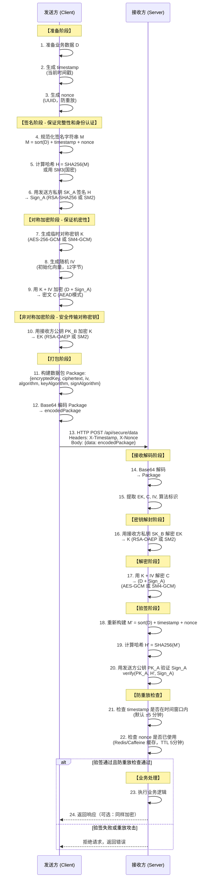

# Simple-Common 企业级开发框架


> **开源协议**：本项目采用 Apache License 2.0 开源协议，可自由使用、修改和分发。
>
> **项目性质**：这是一个完全开源的通用技术框架，适用于各类 Java 项目开发。

## 项目简介

**Simple-Common** 是一个基于 **Spring Boot 3.3 + Java 17** 构建的模块化企业级开发框架，提供认证授权、分布式缓存、消息队列、事件总线、实时通信等完整的企业级能力。

### 核心特性

#### 安全与认证
- **统一加密工具 CryptoUtil** - 枚举切换AES/SM4/RSA/SM2等国密算法，自动安全提示，BCrypt密码哈希
- **OAuth2认证授权** - 完整的OAuth2协议实现，支持JWT Token、角色权限、白名单机制
- **灵活缓存策略** - Auth模块Redis/Local一键切换，零代码修改适配不同部署环境

#### 缓存与性能
- **两级缓存架构** - Caffeine(本地) + Redis(分布式)，智能读写策略优化
- **分布式锁服务** - Redisson实现可重入锁/公平锁/闭锁/信号量，支持锁续期
- **线程池管理** - 异步执行、定时任务、延迟调度，统一线程资源管理

#### 消息与事件
- **消息队列防重消费** - RabbitMQ + Redisson分布式锁，支持锁续期、僵尸锁恢复、完成校验
- **事件总线双模式** - 同步(立即执行) / 异步(RabbitMQ分发)，支持跨系统事件、延迟事件
- **责任链模式实践** - Auth/RabbitMQ/SMS/Logs多模块采用，轻松扩展自定义逻辑

#### 通信与集成
- **WebSocket实时通信** - 静态工具类WebSocketUtils，支持点对点/广播消息推送
- **日志中心** - TCP + Protobuf高性能传输，client/proto/server三模块架构，Fire-and-Forget模式，追求极致的性能
- **短信服务** - 阿里云SMS集成，多层防刷机制(IP限流+频次控制+黑名单)

#### 数据与文档
- **Excel处理** - EasyExcel + Apache POI双引擎，支持大数据量导出、模板填充
- **Word文档生成** - poi-tl引擎，支持动态模板替换、表格生成
- **附件管理** - MinIO/AWS S3对象存储，S3协议兼容
- **API文档** - SpringDoc OpenAPI 3.0，自动生成Swagger UI

#### 运维与监控
- **定时任务** - XXL-JOB集成，支持分布式任务调度、失败重试
- **AI集成** - Spring AI Alibaba，支持通义千问等大模型接入
- **MyBatis-Plus增强** - 通用CRUD、分页插件、自动填充

### 技术栈

| 类别 | 技术选型 |
|------|----------|
| 基础框架 | Spring Boot 3.3 + Java 17 |
| ORM框架 | MyBatis-Plus 3.5.7 |
| 缓存 | Redis (Redisson 3.27.0) + Caffeine |
| 消息队列 | RabbitMQ (Spring AMQP 3.1.6) |
| 实时通信 | WebSocket (Spring WebSocket) |
| 认证授权 | OAuth2 + JWT |
| 日志中心 | Netty + Protobuf (TCP协议) |
| 文档生成 | SpringDoc OpenAPI 2.5.0 |
| Excel处理 | EasyExcel 3.3.4 + Apache POI 5.2.5 |
| Word生成 | poi-tl 1.12.2 |
| 对象存储 | MinIO / AWS S3 |
| 定时任务 | XXL-JOB 2.4.1 |
| AI集成 | Spring AI Alibaba 1.0.0.2 |
| 工具类库 | Hutool 5.8.27 |

### 设计理念

- **模块化设计** - 各功能模块独立封装，按需引入，减少依赖冗余
- **高度可扩展** - 继承/接口/责任链轻松扩展，默认实现前缀`Default`
- **无侵入集成** - 现有项目直接引入使用，无需修改原有代码
- **统一规范** - 命名/service/manager/Process后缀标准化，异常/响应统一封装
- **性能优化** - 本地缓存/线程池/异步处理/防重消费等多维度优化

### 适用场景

- **新项目快速启动** - 直接使用框架提供的功能模块，快速搭建项目
- **旧项目功能增强** - 按需引入特定模块，无侵入式增强项目功能
- **微服务架构** - 模块化设计支持微服务拆分，单体应用可平滑过渡到微服务
- **政府/国企项目** - 完整国密算法支持(SM2/SM3/SM4)，符合安全合规要求

---

## 命名规范说明

框架遵循统一的命名规范，便于理解和使用：

- **service后缀**：表示为本模块对外提供的核心功能接口。默认实现前缀加 `Default`。
    - 示例：`LoginService` → `DefaultLoginService`、`SmsService` → `AliSmsService`

- **manager后缀**：表示为本模块内部提供支撑的接口。默认实现前缀加 `Default`。
    - 示例：`TokenManager` → `DefaultTokenManager`、`WhiteManager` → `DefaultWhiteManager`

- **Process后缀**：责任链处理接口，配合枚举使用。
    - 示例：`AuthProcess`、`LoginErrorProcess`、`CheckSmsProcess`

- **Abs前缀**：抽象基类，提供通用实现逻辑。
    - 示例：`AbsLoginManager`、`AbsSmsService`、`AbsLogsSaveManager`

---

## 目录

- [1. simple-common-core](#1-simple-common-core)
- [2. simple-common-auth](#2-simple-common-auth)
    - [2.1 simple-common-auth-client](#21-simple-common-auth-client客户端模块)
    - [2.2 simple-common-auth-server](#22-simple-common-auth-server服务端模块)
- [3. simple-common-cache](#3-simple-common-cache)
- [4. simple-common-redis](#4-simple-common-redis)
- [5. simple-common-mp](#5-simple-common-mp)
- [6. simple-common-rabbitmq](#6-simple-common-rabbitmq)
- [7. simple-common-eventbus](#7-simple-common-eventbus)
- [8. simple-common-websocket](#8-simple-common-websocket)
- [9. simple-common-excel](#9-simple-common-excel)
- [10. simple-common-sms](#10-simple-common-sms)
- [11. simple-common-doc](#11-simple-common-doc)
- [12. simple-common-xxljob](#12-simple-common-xxljob)
- [13. simple-common-logs](#13-simple-common-logs)

---

## 1. simple-common-core

### 模块介绍

核心工具模块，提供通用工具类、异常处理、响应封装等基础功能。

### 核心功能

| 功能分类 | 类/接口 | 说明 |
|---------|--------|------|
| 断言工具 | `AssertUtils` | 参数校验和异常抛出 |
| HTTP工具 | `HttpServletUtils` | HttpServletRequest 获取 |
| 加密工具 | `CryptoUtil` | 通过枚举自动切换加密方式（AES/SM4/RSA/SM2/国密） |
| Base64工具 | `Base64Utils` | Base64编码解码 |
| IP工具 | `IPUtils` | IP地址获取和处理 |
| JSON工具 | `JsonUtils` | JSON序列化/反序列化 |
| 响应封装 | `R<T>` | 统一响应格式 |
| 异常定义 | `DefaultException` | 默认业务异常 |
| 线程池工具 | `ThreadUtils` | 异步任务执行、延迟调度、定时任务 |
| 循环调度服务 | `CycleService` | 基于事件的循环任务调度（均匀/累加延迟） |

### 集成方式

**步骤1：添加依赖**

```xml
<dependency>
    <groupId>com.simple.common</groupId>
    <artifactId>simple-common-core</artifactId>
    <version>${version}</version>
</dependency>
```

**重要说明：**
- core模块是所有其他模块的基础依赖，会自动引入
- 提供统一的异常处理、响应封装、工具类等基础功能
- CryptoUtil支持AES/SM4/RSA/SM2等国密算法，通过枚举切换

### 使用示例

**1. 断言工具**

```java
@Service
public class UserService {
    
    public User findById(String id) {
        // 参数校验
        AssertUtils.notBlank(id, "用户ID不能为空");
        
        User user = userMapper.selectById(id);
        AssertUtils.notNull(user, "用户不存在");
        
        return user;
    }
}
```

**2. 加密工具（通过枚举自动切换加密方式）**

CryptoUtil支持通过枚举参数自动切换加密算法，包括对称加密、非对称加密和哈希算法。

**支持的加密算法枚举：**

| 枚举类型 | 枚举值 | 说明 | 安全性 |
|---------|--------|------|--------|
| **对称加密** | `AES_GCM` | AES-GCM模式（推荐） | ✅ 安全 |
| | `SM4_GCM` | SM4-GCM模式（国密推荐） | ✅ 安全 |
| | `AES_CBC` | AES-CBC模式（旧系统兼容） | ⚠️ 不安全 |
| | `SM4_CBC` | SM4-CBC模式（旧系统兼容） | ⚠️ 不安全 |
| | `DES_CBC` | DES-CBC模式（旧系统兼容） | ⚠️ 不安全 |
| **非对称加密** | `RSA_OAEP` | RSA-OAEP模式（推荐） | ✅ 安全 |
| | `SM2` | SM2国密算法 | ✅ 安全 |
| | `RSA_PKCS1` | RSA-PKCS1模式（旧系统兼容） | ⚠️ 不安全 |
| **哈希算法** | `SHA256` | SHA-256哈希 | ✅ 安全 |
| | `SM3` | SM3国密哈希 | ✅ 安全 |
| | `MD5` | MD5哈希（旧系统兼容） | ⚠️ 不安全 |

**使用示例：**

```java
@Service
public class CryptoService {
    
    /**
     * 对称加密示例（通过枚举切换算法）
     */
    public String symmetricEncryptExample() {
        // 1. 使用AES-GCM（推荐）
        SymmetricAlgorithmType algo1 = SymmetricAlgorithmType.AES_GCM;
        String key1 = CryptoUtil.generateSymmetricKeyStr(algo1);
        String encrypted1 = CryptoUtil.encryptStr(algo1, key1, "敏感数据");
        String decrypted1 = CryptoUtil.decryptStr(algo1, key1, encrypted1);
        
        // 2. 使用SM4-GCM（国密标准）
        SymmetricAlgorithmType algo2 = SymmetricAlgorithmType.SM4_GCM;
        String key2 = CryptoUtil.generateSymmetricKeyStr(algo2);
        String encrypted2 = CryptoUtil.encryptStr(algo2, key2, "敏感数据");
        String decrypted2 = CryptoUtil.decryptStr(algo2, key2, encrypted2);
        
        return decrypted1; // "敏感数据"
    }
    
    /**
     * 非对称加密示例（通过枚举切换算法）
     */
    public String asymmetricEncryptExample() {
        // 1. 使用RSA-OAEP（推荐）
        AsymmetricAlgorithmType algo1 = AsymmetricAlgorithmType.RSA_OAEP;
        KeyPair keyPair1 = CryptoUtil.generateKeyPair(algo1);
        String publicKey1 = CryptoUtil.getPublicKeyPem(keyPair1.getPublic());
        String privateKey1 = CryptoUtil.getPrivateKeyPem(keyPair1.getPrivate());
        
        String encrypted1 = CryptoUtil.encryptStr(algo1, publicKey1, "机密信息");
        String decrypted1 = CryptoUtil.decryptStr(algo1, privateKey1, encrypted1);
        
        // 2. 使用SM2（国密标准）
        AsymmetricAlgorithmType algo2 = AsymmetricAlgorithmType.SM2;
        KeyPair keyPair2 = CryptoUtil.generateKeyPair(algo2);
        String publicKey2 = CryptoUtil.getPublicKeyPem(keyPair2.getPublic());
        String privateKey2 = CryptoUtil.getPrivateKeyPem(keyPair2.getPrivate());
        
        String encrypted2 = CryptoUtil.encryptStr(algo2, publicKey2, "机密信息");
        String decrypted2 = CryptoUtil.decryptStr(algo2, privateKey2, encrypted2);
        
        return decrypted1; // "机密信息"
    }
    
    /**
     * 哈希算法示例（通过枚举切换算法）
     */
    public String hashExample() {
        String data = "需要哈希的数据";
        
        // 1. 使用SHA256（推荐）
        String hash1 = CryptoUtil.hashStr(HashAlgorithmType.SHA256, data);
        
        // 2. 使用SM3（国密标准）
        String hash2 = CryptoUtil.hashStr(HashAlgorithmType.SM3, data);
        
        // 3. 使用MD5（不推荐，仅用于旧系统兼容）
        String hash3 = CryptoUtil.hashStr(HashAlgorithmType.MD5, data);
        
        return hash1;
    }
    
    /**
     * 密码哈希示例（推荐使用BCrypt）
     */
    public void passwordHashExample() {
        String password = "user_password_123";
        
        // 哈希密码（自动生成盐值）
        String hashedPassword = CryptoUtil.hashPassword(password);
        
        // 验证密码
        boolean isMatch = CryptoUtil.checkPassword(password, hashedPassword);
        
        log.info("密码验证结果: {}", isMatch); // true
    }
}
```

**重要说明：**
- **推荐使用**：`AES_GCM`、`SM4_GCM`（对称加密），`RSA_OAEP`、`SM2`（非对称加密），`SHA256`、`SM3`（哈希）
- **旧系统兼容**：`AES_CBC`、`DES_CBC`、`SM4_CBC`、`RSA_PKCS1`、`MD5`会打印警告日志，建议尽快迁移
- **自动切换**：只需更改枚举参数即可切换加密算法，无需修改其他代码
- **密钥管理**：对称加密密钥建议使用Base64编码存储，非对称加密密钥建议使用PEM格式

**3. 统一响应格式**

```java
@RestController
@RequestMapping("/api")
public class ApiController {
    
    @GetMapping("/data")
    public R<List<Data>> getData() {
        List<Data> data = dataService.list();
        return R.ok(data);
    }
    
    @PostMapping("/create")
    public R<Void> create(@RequestBody CreateRequest request) {
        dataService.create(request);
        return R.ok();
    }
    
    @GetMapping("/error")
    public R<Void> error() {
        return R.error("操作失败");
    }
}
```

**4. 线程池工具（异步任务）**

```java
@Service
public class AsyncService {
    
    /**
     * 异步执行有返回值的任务
     */
    public CompletableFuture<String> asyncTask() {
        return ThreadUtils.supplyAsync(() -> {
            // 模拟耗时操作
            try {
                Thread.sleep(1000);
            } catch (InterruptedException e) {
                Thread.currentThread().interrupt();
            }
            return "异步任务完成";
        });
    }
    
    /**
     * 异步执行无返回值的任务
     */
    public void asyncRun() {
        ThreadUtils.runAsync(() -> {
            // 异步执行，不阻塞主线程
            log.info("异步任务执行中...");
            doSomething();
        });
    }
    
    /**
     * 延迟执行任务
     */
    public void scheduleTask() {
        ThreadUtils.schedule(() -> {
            log.info("延迟5秒后执行");
        }, 5, TimeUnit.SECONDS);
    }
    
    /**
     * 定时执行任务（固定频率）
     */
    public void scheduleAtFixedRate() {
        ThreadUtils.scheduleAtFixedRate(() -> {
            log.info("每10秒执行一次");
        }, 0, 10, TimeUnit.SECONDS);
    }
    
    /**
     * 等待异步任务完成
     */
    public String waitForResult() throws Exception {
        CompletableFuture<String> future = asyncTask();
        // join()：阻塞等待，异常以CompletionException抛出
        return future.join();
        
        // 或者使用get()：阻塞等待，声明式抛出checked异常
        // return future.get();
    }
}
```

**5. 循环调度服务（均匀延迟）**

```java
@Service
public class OrderQueryService extends AbsCycleService<OrderQuery> {
    
    @Autowired
    private OrderMapper orderMapper;
    
    @Override
    public Class<OrderQuery> getEventClass() {
        return OrderQuery.class;
    }
    
    @Override
    protected boolean execute(OrderQuery query, int num, Map<String, Object> parameters) {
        log.info("第{}次查询订单: {}", num, query.getOrderId());
        
        Order order = orderMapper.selectById(query.getOrderId());
        if (order != null && order.getStatus() == 1) {
            log.info("订单已支付，停止轮询");
            return true; // 返回true表示任务完成，停止轮询
        }
        
        return false; // 返回false表示继续轮询
    }
}

// 使用示例
@Service
public class OrderService {
    
    @Autowired
    private OrderQueryService orderQueryService;
    
    public void checkOrderPayment(String orderId) {
        OrderQuery query = new OrderQuery();
        query.setOrderId(orderId);
        
        // 最多查询10次，每次间隔5秒（均匀延迟）
        // 第1次：立即执行
        // 第2次：5秒后
        // 第3次：10秒后
        // ...
        orderQueryService.runUniform(query, 10, 5);
    }
}
```

**6. 循环调度服务（累加延迟）**

```java
@Service
public class RetryService extends AbsCycleService<RetryTask> {
    
    @Override
    public Class<RetryTask> getEventClass() {
        return RetryTask.class;
    }
    
    @Override
    protected boolean execute(RetryTask task, int num, Map<String, Object> parameters) {
        log.info("第{}次重试任务: {}", num, task.getTaskId());
        
        try {
            // 执行任务
            executeTask(task);
            log.info("任务执行成功");
            return true;
        } catch (Exception e) {
            log.warn("第{}次重试失败: {}", num, e.getMessage());
            return false;
        }
    }
}

// 使用示例
@Service
public class TaskService {
    
    @Autowired
    private RetryService retryService;
    
    public void executeWithRetry(String taskId) {
        RetryTask task = new RetryTask();
        task.setTaskId(taskId);
        
        // 最多重试5次，基础间隔10秒，累加延迟
        // 第1次：立即执行
        // 第2次：10秒后（10×1）
        // 第3次：30秒后（10×2 + 10×1）
        // 第4次：60秒后（10×3 + 10×2 + 10×1）
        // 第5次：100秒后（10×4 + 10×3 + 10×2 + 10×1）
        retryService.runAccumulate(task, 5, 10);
    }
}
```

---

## 2. simple-common-auth

认证授权模块，分为客户端和服务端两个子模块。

### 2.1 simple-common-auth-client（客户端模块）

#### 模块介绍

客户端认证模块，用于资源服务端的认证拦截和权限校验。提供Token解析、白名单管理、签名校验等功能。

#### 核心功能

| 功能分类 | 接口/组件 | 说明 |
|---------|----------|------|
| Token管理 | `TokenManager` | Token解析、验证、创建 |
| 白名单管理 | `WhiteManager` | URL白名单配置 |
| 登录信息管理 | `LoginInfoManager` | 获取当前登录用户信息 |
| 签名校验 | `SignManager` | 接口签名校验 |
| 签名密钥管理 | `SignSecretManager` | 签名密钥统一管理，支持动态更新 |
| 缓存管理 | `CacheManager` | 认证相关缓存管理 |
| CSRF防御 | `CsrfService` | CSRF Token生成和验证 |
| 责任链处理 | `AuthProcess` | 认证拦截责任链处理接口 |

#### 集成方式

**步骤1：添加依赖**

```xml
<dependency>
    <groupId>com.simple.common</groupId>
    <artifactId>simple-common-auth-client</artifactId>
    <version>${version}</version>
</dependency>
```

**步骤2：继承配置类**

```java
@Configuration
public class MyClientAuthConfig extends AbsClientAuthConfig {
    
    @Override
    protected void configure(ClientAuthInfo clientAuthInfo) {
        // 开启全局登录校验
        clientAuthInfo.openLogin();
        
        // 放行公开接口
        clientAuthInfo.antMatchers("/api/public/**").permitAll();
        
        // IP白名单限制
        clientAuthInfo.antMatchers("/api/internal/**")
                      .onlyIp("192.168.1.100");
        
        // 角色限制
        clientAuthInfo.antMatchers("/api/admin/**")
                      .onlyRole("admin");
    }
}
```

#### 扩展示例

**1. 自定义认证处理器**

实现 `AuthProcess` 接口，添加自定义认证逻辑：

```java
@Component
public class CustomAuthProcess implements AuthProcess {
    
    @Override
    public DefaultKindProcess getProcess() {
        return AuthInterceptorKindProcess.CHECK_TOKEN;
    }
    
    @Override
    public void execute(HttpServletRequest request, HttpServletResponse response, 
                       String token, String path, String ipAddr) {
        // 自定义认证逻辑
        log.info("自定义认证检查: {}", path);
    }
}
```

**2. 自定义白名单配置**

继承 `AbsClientAuthConfig`，在 `configure()` 方法中配置白名单和权限规则：

```java
@Configuration
public class MyAuthConfig extends AbsClientAuthConfig {
    
    @Override
    protected void configure(ClientAuthInfo clientAuthInfo) {
        // 开启全局登录校验
        clientAuthInfo.openLogin();
        
        // 放行公开接口（白名单）
        clientAuthInfo.antMatchers("/api/public/**").permitAll();
        clientAuthInfo.antMatchers("/api/login").permitAll();
        
        // IP白名单限制
        clientAuthInfo.antMatchers("/api/internal/**")
                      .onlyIp("192.168.1.100");
        
        // 角色限制
        clientAuthInfo.antMatchers("/api/admin/**")
                      .onlyRole("admin");
        
        // URL权限映射
        clientAuthInfo.addUrlOperation("/api/user/**", "user:read");
        clientAuthInfo.addUrlOperation("/api/order/**", "order:manage");
    }
}
```

#### 使用示例

**1. 获取当前登录用户信息**

```java
@RestController
@RequestMapping("/user")
public class UserController {
    
    @GetMapping("/info")
    public R<UserInfo> getCurrentUser() {
        UserTemporary user = LoginUserUtils.getUserTemporary();
        
        UserInfo info = new UserInfo();
        info.setUserId(user.getUserId());
        info.setUsername(user.getUsername());
        info.setRoles(user.getRoles());
        
        return R.ok(info);
    }
}
```

**2. 接口签名校验（使用@Sign注解）**

auth-client模块提供了`@Sign`注解，自动进行签名校验：

```java
@RestController
@RequestMapping("/api")
public class ApiController {
    
    /**
     * 启用签名校验（默认开启）
     */
    @PostMapping("/data")
    @Sign
    public R<Void> submitData(@RequestBody DataRequest request) {
        // 框架自动校验签名，无需手动处理
        // 业务逻辑
        return R.ok();
    }
    
    /**
     * 排除敏感字段不参与签名计算
     */
    @PostMapping("/payment")
    @Sign(excludeFields = {"password", "cvv"})
    public R<Void> payment(@RequestBody PaymentRequest request) {
        // password和cvv字段不参与签名计算
        return R.ok();
    }
    
    /**
     * 关闭时间戳校验（不限制请求时效性）
     */
    @PostMapping("/webhook")
    @Sign(checkTimestamp = false)
    public R<Void> webhook(@RequestBody WebhookRequest request) {
        // 不校验时间戳，适用于第三方回调
        return R.ok();
    }
    
    /**
     * 关闭nonce校验（不防重放）
     */
    @PostMapping("/notification")
    @Sign(checkNonce = false)
    public R<Void> notification(@RequestBody NotificationRequest request) {
        // 不校验nonce，允许重复请求
        return R.ok();
    }
}
```

**@Sign注解参数说明：**

| 参数 | 类型 | 默认值 | 说明 |
|------|------|--------|------|
| `enabled` | boolean | true | 是否启用签名校验 |
| `excludeFields` | String[] | {} | 排除参与签名的字段名 |
| `checkTimestamp` | boolean | true | 是否校验时间戳（时效性） |
| `checkNonce` | boolean | true | 是否校验nonce（防重放） |

**客户端调用示例：**

```java
@Service
public class ApiClient {
    
    @Autowired
    private SignSecretManager signSecretManager;
    
    public void callApi() {
        DataRequest request = new DataRequest();
        request.setData("test");
        
        // 生成签名
        long timestamp = System.currentTimeMillis();
        String nonce = UUID.randomUUID().toString();
        String sign = signSecretManager.generateSign(request, timestamp, nonce);
        
        // 发送请求
        HttpHeaders headers = new HttpHeaders();
        headers.set("X-Timestamp", String.valueOf(timestamp));
        headers.set("X-Nonce", nonce);
        headers.set("X-Sign", sign);
        
        restTemplate.exchange("/api/data", HttpMethod.POST, 
            new HttpEntity<>(request, headers), Void.class);
    }
}
```

**前端签名构建流程（JavaScript）：**

前端需要按照以下步骤构建签名，确保与服务端验签逻辑一致：

```javascript
class ApiClient {
    constructor(baseUrl, secretKey) {
        this.baseUrl = baseUrl;
        this.secretKey = secretKey;  // 从服务端获取的签名密钥
    }
    
    /**
     * 发送带签名的 POST 请求
     */
    async postWithSign(path, data, excludeFields = []) {
        // 1. 生成时间戳和随机数
        const timestamp = Date.now().toString();
        const nonce = crypto.randomUUID().replace(/-/g, '');
        
        // 2. 构建业务参数字符串（排除敏感字段）
        const businessStr = this.buildBusinessString(data, excludeFields);
        
        // 3. 构建完整的待签名字符串
        // 格式: field1=value1&field2=value2&X-TIMESTAMP=timestamp&X-NONCE=nonce
        const message = `${businessStr}&X-TIMESTAMP=${timestamp}&X-NONCE=${nonce}`;
        
        // 4. 生成 HMAC-SHA256 签名（Base64编码）
        const signature = await this.generateSignature(message, this.secretKey);
        
        // 5. 发送请求
        const response = await fetch(`${this.baseUrl}${path}`, {
            method: 'POST',
            headers: {
                'Content-Type': 'application/json',
                'X-SIGN': signature,
                'X-TIMESTAMP': timestamp,
                'X-NONCE': nonce,
                'Authorization': 'Bearer ' + this.getAccessToken()
            },
            body: JSON.stringify(data)
        });
        
        return response.json();
    }
    
    /**
     * 构建业务参数字符串
     * - 按字段名 ASCII 码升序排序
     * - 对 value 进行 URL 编码（RFC 3986 标准）
     * - 排除指定字段
     */
    buildBusinessString(params, excludeFields = []) {
        // 过滤掉需要排除的字段和空值
        const filtered = Object.keys(params)
            .filter(key => !excludeFields.includes(key))
            .reduce((obj, key) => {
                obj[key] = params[key] != null ? params[key].toString() : '';
                return obj;
            }, {});
        
        // 按字段名 ASCII 排序
        const sortedKeys = Object.keys(filtered).sort();
        
        // 拼接成 field=value&field=value 格式
        return sortedKeys
            .map(key => `${key}=${this.urlEncode(filtered[key])}`)
            .join('&');
    }
    
    /**
     * URL 编码（RFC 3986 标准）
     * 与服务端 SignUtils.urlEncode 保持一致
     */
    urlEncode(value) {
        return encodeURIComponent(value)
            .replace(/\+/g, '%20')      // 空格编码为 %20
            .replace(/%21/g, '!')       // ! 不编码
            .replace(/%27/g, "'")       // ' 不编码
            .replace(/%28/g, '(')       // ( 不编码
            .replace(/%29/g, ')')       // ) 不编码
            .replace(/%7E/g, '~');      // ~ 不编码
    }
    
    /**
     * 生成 HMAC-SHA256 签名
     */
    async generateSignature(message, secretKey) {
        const encoder = new TextEncoder();
        const keyData = encoder.encode(secretKey);
        const messageData = encoder.encode(message);
        
        // 导入密钥
        const key = await crypto.subtle.importKey(
            'raw',
            keyData,
            { name: 'HMAC', hash: 'SHA-256' },
            false,
            ['sign']
        );
        
        // 生成签名
        const signature = await crypto.subtle.sign('HMAC', key, messageData);
        
        // 转换为 Base64
        return btoa(String.fromCharCode(...new Uint8Array(signature)));
    }
    
    getAccessToken() {
        return localStorage.getItem('accessToken');
    }
}

// 使用示例
const apiClient = new ApiClient('https://api.example.com', 'a1b2c3d4e5f6g7h8i9j0k1l2m3n4o5p6');

// 创建用户（排除 password 字段不参与签名）
const result = await apiClient.postWithSign('/api/user/create', {
    username: '张三',
    email: 'zhangsan@example.com',
    phone: '13800138000',
    password: '123456'  // 这个字段不会参与签名
}, ['password']);

console.log(result);
```

**重要注意事项：**

1. **字段排序**：必须按字段名 ASCII 码升序排序
2. **URL 编码**：必须使用 RFC 3986 标准（与服务端一致）
3. **排除字段**：敏感字段（如 password）不参与签名
4. **时间戳格式**：必须是毫秒级时间戳字符串
5. **Nonce 唯一性**：每次请求必须生成新的 UUID
6. **签名算法**：HMAC-SHA256，结果 Base64 编码
7. **请求头名称**：必须与服务端配置一致（X-SIGN、X-TIMESTAMP、X-NONCE）

---

#### 金融级安全通信方案（混合加密 + 数字签名）

对于高安全性要求的场景（如金融支付、敏感数据传输），采用**混合加密 + 数字签名**方案。

##### 核心流程说明

1. **先计算签名**：用发送方的私钥对规范化后的原文（或数据的哈希）签名，得到签名值 S
2. **对称加密**：生成一个临时的对称密钥 K（如 AES-256），对「原始数据 + 签名值 S」进行加密，得到密文 C
3. **非对称加密对称密钥**：用接收方的公钥对 K 进行加密，得到加密后的密钥 EK
4. **打包并 Base64 编码**：将 EK 和 C 打包（JSON 结构），然后进行 Base64 编码，便于传输
5. **接收方解码并解密**：Base64 解码 → 用自己的私钥解密 EK 得到 K → 用 K 解密密文 C 得到「原始数据 + 签名 S」
6. **验证签名**：用发送方的公钥验证签名 S 是否匹配原始数据

##### 完整流程图



##### Java 实现示例

**发送方（客户端）：**

```java
@Service
public class SecureApiClient {
    
    @Autowired
    private CryptoUtil cryptoUtil;
    
    /**
     * 发送金融级安全请求
     */
    public String sendSecureRequest(String apiUrl, Object businessData, 
                                     PrivateKey senderPrivateKey,
                                     PublicKey receiverPublicKey) throws Exception {
        
        // 1. 准备数据
        String timestamp = String.valueOf(System.currentTimeMillis());
        String nonce = IdUtils.getFastSimpleUUID();
        String jsonData = JsonUtils.toJsonStr(businessData);
        
        // 2. 构建待签名字符串
        String message = jsonData + "&" + timestamp + "&" + nonce;
        
        // 3. 数字签名（使用发送方私钥）
        byte[] messageBytes = message.getBytes(StandardCharsets.UTF_8);
        byte[] signature = CryptoUtil.sign(
            CryptoUtil.AsymmetricAlgorithmType.RSA_OAEP, 
            senderPrivateKey, 
            messageBytes
        );
        String signBase64 = Base64.getEncoder().encodeToString(signature);
        
        // 4. 生成临时对称密钥（AES-256）
        String symmetricKey = CryptoUtil.generateSymmetricKeyStr(
            CryptoUtil.SymmetricAlgorithmType.AES_GCM
        );
        
        // 5. 加密数据 + 签名
        String plaintext = jsonData + "|" + signBase64;  // 用 | 分隔
        String ciphertext = CryptoUtil.encryptStr(
            CryptoUtil.SymmetricAlgorithmType.AES_GCM,
            symmetricKey,
            plaintext
        );
        
        // 6. 提取 IV（AES-GCM 的 IV 在密文前 12 字节）
        byte[] cipherBytes = Base64.getDecoder().decode(ciphertext);
        byte[] iv = Arrays.copyOfRange(cipherBytes, 0, 12);
        String ivBase64 = Base64.getEncoder().encodeToString(iv);
        
        // 7. 用接收方公钥加密对称密钥
        byte[] keyBytes = symmetricKey.getBytes(StandardCharsets.UTF_8);
        byte[] encryptedKey = CryptoUtil.encrypt(
            CryptoUtil.AsymmetricAlgorithmType.RSA_OAEP,
            receiverPublicKey,
            keyBytes
        );
        String encryptedKeyBase64 = Base64.getEncoder().encodeToString(encryptedKey);
        
        // 8. 构建数据包
        Map<String, String> package = new HashMap<>();
        package.put("encryptedKey", encryptedKeyBase64);
        package.put("ciphertext", ciphertext);
        package.put("iv", ivBase64);
        package.put("algorithm", "AES-GCM");
        package.put("keyAlgorithm", "RSA-OAEP");
        package.put("signAlgorithm", "RSA-SHA256");
        
        String packageJson = JsonUtils.toJsonStr(package);
        String encodedPackage = Base64.getEncoder().encodeToString(
            packageJson.getBytes(StandardCharsets.UTF_8)
        );
        
        // 9. 发送 HTTP 请求
        HttpHeaders headers = new HttpHeaders();
        headers.setContentType(MediaType.APPLICATION_JSON);
        headers.set("X-Timestamp", timestamp);
        headers.set("X-Nonce", nonce);
        
        Map<String, String> requestBody = new HashMap<>();
        requestBody.put("data", encodedPackage);
        
        HttpEntity<Map<String, String>> entity = new HttpEntity<>(requestBody, headers);
        ResponseEntity<String> response = restTemplate.postForEntity(apiUrl, entity, String.class);
        
        return response.getBody();
    }
}
```

**接收方（服务端）：**

```java
@Service
public class SecureApiService {
    
    @Autowired
    private CacheManager cacheManager;  // 用于 nonce 防重放
    
    @Autowired
    private SignProperties signProperties;
    
    /**
     * 处理金融级安全请求
     */
    public Object processSecureRequest(String encodedPackage, 
                                        String timestamp, 
                                        String nonce,
                                        PrivateKey receiverPrivateKey,
                                        PublicKey senderPublicKey) throws Exception {
        
        // 1. Base64 解码
        byte[] packageBytes = Base64.getDecoder().decode(encodedPackage);
        String packageJson = new String(packageBytes, StandardCharsets.UTF_8);
        Map<String, String> package = JsonUtils.toJsonObj(packageJson, Map.class);
        
        // 2. 提取参数
        String encryptedKeyBase64 = package.get("encryptedKey");
        String ciphertext = package.get("ciphertext");
        String ivBase64 = package.get("iv");
        
        // 3. 解密密钥（使用接收方私钥）
        byte[] encryptedKeyBytes = Base64.getDecoder().decode(encryptedKeyBase64);
        byte[] keyBytes = CryptoUtil.decrypt(
            CryptoUtil.AsymmetricAlgorithmType.RSA_OAEP,
            receiverPrivateKey,
            encryptedKeyBytes
        );
        String symmetricKey = new String(keyBytes, StandardCharsets.UTF_8);
        
        // 4. 解密数据（使用对称密钥）
        String plaintext = CryptoUtil.decryptStr(
            CryptoUtil.SymmetricAlgorithmType.AES_GCM,
            symmetricKey,
            ciphertext
        );
        
        // 5. 分离数据和签名
        String[] parts = plaintext.split("\\|");
        String jsonData = parts[0];
        String signBase64 = parts[1];
        
        // 6. 验证签名（使用发送方公钥）
        String message = jsonData + "&" + timestamp + "&" + nonce;
        byte[] messageBytes = message.getBytes(StandardCharsets.UTF_8);
        byte[] signature = Base64.getDecoder().decode(signBase64);
        
        boolean isValid = CryptoUtil.verify(
            CryptoUtil.AsymmetricAlgorithmType.RSA_OAEP,
            senderPublicKey,
            messageBytes,
            signature
        );
        
        if (!isValid) {
            throw new SecurityException("签名验证失败");
        }
        
        // 7. 防重放检查 - 时间戳
        long ts = Long.parseLong(timestamp);
        long now = System.currentTimeMillis();
        long diff = Math.abs(now - ts);
        if (diff > signProperties.getDefaultTimeWindowMs()) {
            throw new SecurityException("请求已过期");
        }
        
        // 8. 防重放检查 - nonce
        String existingNonce = cacheManager.get("nonce:" + nonce);
        if (existingNonce != null) {
            throw new SecurityException("重复请求");
        }
        cacheManager.set("nonce:" + nonce, "1", 300);  // TTL 5分钟
        
        // 9. 解析业务数据
        Object businessData = JsonUtils.toJsonObj(jsonData, Object.class);
        
        // 10. 执行业务逻辑
        return handleBusinessLogic(businessData);
    }
    
    private Object handleBusinessLogic(Object data) {
        // 实际业务处理
        return data;
    }
}
```

##### 金融级安全要素

**1. 签名原文规范化**

按字段名 ASCII 码升序排序，排除敏感字段，对 value 进行 URL 编码（RFC 3986），追加 `&X-TIMESTAMP={timestamp}&X-NONCE={nonce}`。

示例：`amount=100&from=ACC01&nonce=abc123&timestamp=1700000000&to=ACC02`

**2. 签名算法**

先对规范化后的原文计算哈希（SHA-256 或 SM3），再对哈希值签名。常用算法：RSA-SHA256、SM2withSM3。

**3. 对称加密模式**

使用 AEAD 模式（AES-GCM 或 SM4-GCM），同时提供加密和完整性校验。必须使用随机 IV（12字节），禁止复用。

**4. 密钥层级管理**

| 密钥类型 | 生命周期 | 存储位置 |
|---------|---------|----------|
| 发送方私钥 SK_A | 1年轮换 | HSM/密钥管理系统 |
| 接收方公钥 PK_B | - | 证书/公开分发 |
| 临时对称密钥 K | 每次请求生成 | 内存（用完即弃） |
| 初始化向量 IV | 每次请求生成 | 随密文传输 |

**关键原则：**对称密钥 K 一次一密，接收方私钥存储在 HSM 中。

**5. 传输格式标准**

推荐使用 JWE + JWS 嵌套或 PKCS#7/CMS 标准。本方案采用自定义 JSON 结构简化实现。

##### 密钥管理

| 密钥类型 | 存储位置 | 轮换周期 |
|---------|---------|----------|
| 发送方私钥 SK_A | HSM/密钥管理系统 | 1年 |
| 接收方公钥 PK_B | 证书/公开分发 | - |
| 临时对称密钥 K | 内存（单次请求） | 每次请求 |
| 初始化向量 IV | 随密文传输 | 每次请求 |

**3. 缓存类型切换**

```yaml
# application.yaml
simple:
  auth:
    # Redis缓存（分布式环境推荐）
    cache-type: REDIS
    
    # 或本地缓存（单机环境推荐）
    # cache-type: LOCAL
```

---

### 2.2 simple-common-auth-server（服务端模块）

#### 模块介绍

认证服务器模块，负责用户认证、Token颁发、OAuth2授权。提供登录服务、Token管理、客户端管理等功能。

#### 核心功能

| 功能分类 | 接口/组件 | 说明 |
|---------|----------|------|
| 登录服务 | `LoginService` | 用户登录、登出、Token刷新 |
| Token管理 | `TokenManager` | Token创建、验证、解析 |
| 客户端管理 | `ClientManager` | OAuth2客户端信息管理 |
| 登录错误处理 | `LoginErrorProcess` | 登录失败次数限制与锁定 |
| 登录成功处理 | `LoginSucProcess` | 登录成功后置处理 |
| JWT密钥管理 | `SecretKeyManager` | JWT签名密钥生成和管理，支持自定义实现（如从数据库加载） |
| 签名密钥管理 | `SignSecretManager` | API签名密钥生成和管理，支持自定义实现（如从数据库加载） |
| 权限管理 | `PermissionManageService` | 角色权限管理，支持事件驱动实时同步 |

#### 集成方式

**步骤1：添加依赖**

```xml
<dependency>
    <groupId>com.simple.common</groupId>
    <artifactId>simple-common-auth-server</artifactId>
    <version>${version}</version>
</dependency>
```

**步骤2：实现客户端详情服务（必须）**

继承 `AbsClientDetailsService`，定义OAuth2客户端信息获取逻辑：

```java
@Service
public class MyClientDetailsService extends AbsClientDetailsService {
    
    @Autowired
    private ClientRepository clientRepository;
    
    @Override
    public ClientDetails checkClientDetails(String clientId, String clientSecret) {
        SysClient entity = clientRepository.findByClientId(clientId);
        AssertUtils.notNull(entity, "客户端不存在");
        AssertUtils.isTrue(entity.getClientSecret().equals(clientSecret), "客户端密钥错误");
        
        ClientDetails details = new ClientDetails();
        details.setClientId(entity.getClientId());
        details.setScopes(entity.getScopes());
        details.setAccessTokenValidity(entity.getAccessTokenValidity());
        details.setRefreshTokenValidity(entity.getRefreshTokenValidity());
        
        return details;
    }
}
```

**步骤3：实现登录管理器（必须，至少一种）**

为每种登录方式实现 `LoginManager` 接口：

```java
@Component
public class PasswordLoginManager implements LoginManager {
    
    @Autowired
    private UserService userService;
    
    @Override
    public AbsUserDetails login(ClientDetails clientDetails, Object adapter) {
        PwdLoginRequest request = (PwdLoginRequest) adapter;
        
        // 查询用户
        User user = userService.getByUsername(request.getUsername());
        AssertUtils.notNull(user, "用户名或密码错误");
        
        // 校验密码
        boolean matches = passwordEncoder.matches(request.getPassword(), user.getPassword());
        AssertUtils.isTrue(matches, "用户名或密码错误");
        
        // 构建用户详情
        AbsUserDetails details = new AbsUserDetails();
        details.setUserId(user.getId());
        details.setUsername(user.getUsername());
        details.setLoginRole(user.getRoles());
        details.setIsEnabled(user.getStatus());
        details.setIsAccountNonExpired(1);
        details.setIsAccountNonLocked(1);
        details.setIsCredentialsNonExpired(1);
        
        return details;
    }
    
    @Override
    public boolean support(Object adapter) {
        return adapter instanceof PwdLoginRequest;
    }
    
    @Override
    public LoginTypeAdapter getLoginType() {
        return LoginTypeAdapter.PASSWORD;
    }
}
```

**步骤4：使用权限管理服务（直接使用）**

`PermissionManageService` 由框架提供默认实现，直接注入使用即可管理角色权限：

```java
@Service
public class RoleManagementService {
    
    @Autowired
    private PermissionManageService permissionManageService;
    
    /**
     * 更新角色权限
     */
    public void updateAdminPermissions() {
        Map<String, String> permissions = new HashMap<>();
        permissions.put("user:create", "创建用户");
        permissions.put("user:delete", "删除用户");
        permissions.put("user:update", "更新用户");
        permissions.put("role:manage", "角色管理");
        
        // 更新admin角色的权限，自动发布事件通知所有客户端刷新缓存
        permissionManageService.updateRolePermission("admin", permissions);
    }
    
    /**
     * 批量刷新多个角色的权限
     */
    public void batchRefreshRoles() {
        List<String> roleKeys = List.of("admin", "editor", "viewer");
        
        // 批量刷新，只发布一次事件
        permissionManageService.batchRefreshPermissions(roleKeys);
    }
    
    /**
     * 删除角色的某个权限
     */
    public void removePermission() {
        // 删除admin角色的"user:delete"权限
        permissionManageService.deletePermission("admin", "user:delete");
    }
    
    /**
     * 查询角色权限
     */
    public Map<Object, Object> queryRolePermissions(String roleKey) {
        return permissionManageService.getRolePermission(roleKey);
    }
}
```

**重要说明：**
- `PermissionManageService` 由框架提供默认实现，无需自定义
- 调用 `updateRolePermission()` 等方法后，会自动发布事件通知所有客户端刷新缓存
- 客户端通过事件监听器自动接收权限变更并更新本地缓存

#### 扩展示例

**1. 扩展新的登录方式（短信登录）**

步骤1：定义登录请求对象

```java
@Data
public class SmsLoginRequest {
    private String phone;
    private String code;
}
```

步骤2：创建登录管理器

```java
@Component
public class SmsLoginManager implements LoginManager {
    
    @Autowired
    private UserService userService;
    
    @Autowired
    private SmsService smsService;
    
    @Override
    public AbsUserDetails login(ClientDetails clientDetails, Object adapter) {
        SmsLoginRequest request = (SmsLoginRequest) adapter;
        
        // 校验短信验证码
        boolean valid = smsService.verifyCode(request.getPhone(), request.getCode());
        AssertUtils.isTrue(valid, "验证码错误或已过期");
        
        // 查询或创建用户
        User user = userService.getByPhone(request.getPhone());
        if (user == null) {
            user = userService.createByPhone(request.getPhone());
        }
        
        // 构建用户详情
        AbsUserDetails details = new AbsUserDetails();
        details.setUserId(user.getId());
        details.setUsername(user.getPhone());
        details.setLoginRole(user.getRoles());
        details.setIsEnabled(1);
        details.setIsAccountNonExpired(1);
        details.setIsAccountNonLocked(1);
        details.setIsCredentialsNonExpired(1);
        
        return details;
    }
    
    @Override
    public boolean support(Object adapter) {
        return adapter instanceof SmsLoginRequest;
    }
    
    @Override
    public LoginTypeAdapter getLoginType() {
        return LoginTypeAdapter.SMS;
    }
}
```

步骤3：在枚举中添加登录类型

```java
public enum LoginTypeAdapter {
    PASSWORD("密码登录"),
    SMS("短信登录");  // 新增
    
    private final String desc;
}
```

步骤4：调用登录接口

```java
@RestController
@RequestMapping("/auth")
public class AuthController {
    
    @Autowired
    private LoginService loginService;
    
    @PostMapping("/sms/login")
    public R<Map<String, String>> smsLogin(@RequestBody SmsLoginRequest request) {
        Map<String, String> tokens = loginService.login(request, LoginTypeAdapter.SMS);
        return R.ok(tokens);
    }
}
```

**2. 自定义登录成功处理**

实现 `LoginSucProcess` 接口，添加登录成功后的处理逻辑：

```java
@Component
public class NotificationLoginSucProcess implements LoginSucProcess {
    
    @Autowired
    private NotificationService notificationService;
    
    @Override
    public DefaultKindProcess getProcess() {
        return LoginSucKindProcess.NOTIFICATION;
    }
    
    @Override
    public void execute(TokenData tokenData) {
        // 发送登录通知
        notificationService.sendLoginNotification(
            tokenData.getUserId(),
            tokenData.getUsername(),
            LocalDateTime.now()
        );
    }
}
```

在枚举中注册：

```java
public enum LoginSucKindProcess implements DefaultKindProcess {
    SAVE_INFO("保存用户信息", true, 1),
    LOGIN_LOG("登陆日志", true, 2),
    NOTIFICATION("登录通知", true, 3);  // 新增
    
    private final String label;
    private final boolean execute;
    private final int order;
}
```

**3. 自定义登录失败处理**

继承 `AbsLoginErrorProcess`，添加自定义失败计数逻辑：

```java
@Component
public class DeviceLoginErrorProcess extends AbsLoginErrorProcess {
    
    @Override
    public LoginErrorKindProcess getProcess() {
        return LoginErrorKindProcess.DEVICE_ERROR;
    }
    
    @Override
    protected String getLoginKey(ClientDetails clientDetails, Object adapter, String ip) {
        LoginRequest request = (LoginRequest) adapter;
        // 使用设备指纹作为标识
        return request.getDeviceFingerprint();
    }
    
    @Override
    protected String getKeyPrefix() {
        return "login:error:device:";
    }
}
```

#### 使用示例

**1. 密码登录**

```java
@RestController
@RequestMapping("/auth")
public class AuthController {
    
    @Autowired
    private LoginService loginService;
    
    @PostMapping("/login")
    public R<Map<String, String>> login(@RequestBody PwdLoginRequest request) {
        Map<String, String> tokens = loginService.login(request, LoginTypeAdapter.PASSWORD);
        return R.ok(tokens);
    }
}
```

返回数据：

```json
{
  "code": 200,
  "data": {
    "bearer": "Bearer",
    "accessToken": "eyJhbGciOiJIUzI1NiJ9...",
    "refreshToken": "eyJhbGciOiJIUzI1NiJ9...",
    "exp": 1234567890,
    "scopes": "user:read,user:write"
  }
}
```

**2. Token刷新**

```java
@PostMapping("/refresh")
public R<Map<String, String>> refresh(@RequestParam String refreshToken) {
    Map<String, String> tokens = loginService.refresh(refreshToken);
    return R.ok(tokens);
}
```

**3. 退出登录**

```java
@PostMapping("/logout")
public R<Void> logout() {
    loginService.logout();
    return R.ok();
}
```

**4. 权限管理**

```java
@Service
public class RolePermissionService {
    
    @Autowired
    private PermissionManageService permissionManageService;
    
    /**
     * 更新角色权限
     */
    public void updateAdminPermissions() {
        Map<String, String> permissions = new HashMap<>();
        permissions.put("user:create", "创建用户");
        permissions.put("user:delete", "删除用户");
        permissions.put("user:update", "更新用户");
        
        // 自动发布事件，所有客户端实时同步
        permissionManageService.updateRolePermission("admin", permissions);
    }
    
    /**
     * 删除权限
     */
    public void removePermission() {
        permissionManageService.deletePermission("admin", "user:delete");
    }
    
    /**
     * 批量刷新
     */
    public void batchRefresh() {
        List<String> roles = List.of("admin", "editor", "viewer");
        permissionManageService.batchRefreshPermissions(roles);
    }
}
```

**5. 密钥管理架构说明**

simple-common-auth 采用 **Server端集中管理密钥** 的架构设计，通过 EventBus 事件同步到所有 Client 端。

#### 5.1 JWT签名密钥管理

**架构流程图：**

```
Server端                          EventBus                    Client端
┌──────────────┐                                          ┌──────────────┐
│              │                                          │              │
│ SecretKey    │  1. 生成/加载密钥                         │              │
│  Manager     │         ↓                                │              │
│              │  2. TokenManager.addSecret()             │              │
│              │         ↓                                │              │
│              │  3. 广播 SecretEvent                     │  4. 监听事件  │
│              │ ─────────────────────────────────────►  │  5. 缓存密钥  │
│              │                                          │              │
└──────────────┘                                          └──────────────┘
```

**默认实现：**

框架提供 `SecretKeyManager` 接口和 `DefaultSecretKeyManager` 默认实现，应用启动时自动生成64位随机密钥并广播到所有客户端。

**自定义实现（从数据库加载）：**

```java
@Component
public class DatabaseSecretKeyManager implements SecretKeyManager {
    
    @Autowired
    private SecretKeyMapper secretKeyMapper;
    
    @Override
    public String generate() {
        // 从数据库查询当前有效的密钥
        SecretKeyEntity entity = secretKeyMapper.selectCurrentKey();
        if (entity == null) {
            // 如果不存在，生成新密钥并保存
            entity = new SecretKeyEntity();
            entity.setSecretValue(RandomStringUtils.randomAlphanumeric(64));
            entity.setCreateTime(LocalDateTime.now());
            entity.setStatus(1); // 启用
            secretKeyMapper.insert(entity);
        }
        return entity.getSecretValue();
    }
}
```

**密钥轮换定时任务：**

```java
@Component
@Slf4j
public class JwtSecretRotationTask {
    
    @Autowired
    private TokenManager tokenManager;
    
    @Autowired
    private SecretKeyManager secretKeyManager;
    
    /**
     * 每月1号零点执行密钥轮换
     */
    @Scheduled(cron = "0 0 0 1 * ?")
    public void rotateJwtSecret() {
        // 生成新密钥（可以从数据库加载）
        String newSecret = secretKeyManager.generate();
        
        // 添加新密钥并广播到所有客户端
        tokenManager.addSecret(newSecret);
        
        log.info("JWT密钥已轮换");
    }
}
```

#### 5.2 API签名密钥管理

签名密钥管理与 JWT 密钥管理采用相同的架构设计：

**自定义实现（从配置中心加载）：**

```java
@Component
public class ConfigCenterSignSecretManager implements SignSecretManager {
    
    @Autowired
    private ConfigClient configClient; // Nacos/Apollo等配置中心客户端
    
    @Override
    public String generate() {
        // 从配置中心读取密钥
        String secret = configClient.getProperty("api.sign.secret.key");
        if (secret == null || secret.isEmpty()) {
            // 如果配置不存在，生成新密钥并写入配置中心
            secret = RandomStringUtils.randomAlphanumeric(32);
            configClient.setProperty("api.sign.secret.key", secret);
        }
        return secret;
    }
}
```

**重要说明：**

- ✅ **SecretKeyManager 和 SignSecretManager 仅在 Server 端配置**
- ✅ Client 端不生成密钥，只负责接收和缓存
- ✅ 密钥由 Server 端统一管理，通过 EventBus 自动同步
- ✅ 集成方在 Server 端自定义实现，支持数据库、配置中心等多种来源

---

## 3. simple-common-cache

### 模块介绍

两级缓存模块，提供本地缓存（Caffeine）和分布式缓存（Redis + DB）的统一管理，支持缓存穿透保护和防雪崩。

### 核心功能

| 功能分类 | 接口/组件 | 说明 |
|---------|----------|------|
| 缓存工具类 | `CacheUtils` | 统一缓存访问入口 |
| 本地缓存工厂 | `LocalCacheFactory` | Caffeine缓存实例管理 |
| 分布式缓存获取 | `GetRedisFunction` | Redis缓存读取和回写逻辑 |
| 数据库查询 | `GetDBFunction` | 数据库查询逻辑 |
| 缓存配置 | `CacheConfig` | 缓存自动配置 |

### 集成方式

**步骤1：添加依赖**

```xml
<dependency>
    <groupId>com.simple.common</groupId>
    <artifactId>simple-common-cache</artifactId>
    <version>${version}</version>
</dependency>
```

**注意：** cache模块依赖simple-common-redis，需要确保Redis已正确配置。

### 使用示例

**1. 分布式缓存（Redis + DB，防穿透）**

```java
@Service
public class UserService {
    
    @Autowired
    private UserMapper userMapper;
    
    /**
     * 获取用户信息（带缓存）
     */
    public User getUserById(String userId) {
        return CacheUtils.get(
            userId,  // 请求参数
            "user:" + userId,  // 锁key（必须与缓存key一致）
            // Redis获取和回写逻辑
            (request) -> {
                String key = "user:" + request;
                String json = redisTemplate.opsForValue().get(key);
                if (json != null) {
                    return JsonUtils.parse(json, User.class);
                }
                return null;
            },
            (request) -> {
                // Redis中不存在，从数据库查询
                User user = userMapper.selectById(request);
                // 回写到Redis（包含空值处理，防止穿透）
                if (user != null) {
                    String key = "user:" + request;
                    int expireTime = CacheUtils.getCacheTime(3600, 600); // 1小时+随机0-10分钟
                    redisTemplate.opsForValue().set(key, JsonUtils.toJsonStr(user), expireTime, TimeUnit.SECONDS);
                }
                return user;
            }
        );
    }
    
    /**
     * 更新用户信息（删除缓存）
     */
    public void updateUser(User user) {
        userMapper.updateById(user);
        
        // 主动删除缓存
        CacheUtils.evict(
            user.getId(),
            "user:" + user.getId(),
            (key) -> redisTemplate.delete(key)
        );
    }
}
```

**2. 本地缓存（Caffeine）**

```java
@Service
public class DictService {
    
    private Cache<String, Dict> dictCache;
    
    @PostConstruct
    public void init() {
        // 创建本地缓存
        dictCache = CacheUtils.createLocalCache("dictCache", spec -> {
            spec.maximumSize(1000)  // 最大容量
                 .expireAfterWrite(1, TimeUnit.HOURS);  // 写入后1小时过期
        });
    }
    
    public Dict getDict(String code) {
        // 先从本地缓存获取
        Dict dict = dictCache.getIfPresent(code);
        if (dict != null) {
            return dict;
        }
        
        // 从数据库查询
        dict = dictMapper.selectByCode(code);
        if (dict != null) {
            dictCache.put(code, dict);
        }
        
        return dict;
    }
}
```

**3. 自动加载缓存（LoadingCache）**

```java
@Service
public class ConfigService {
    
    private LoadingCache<String, Config> configCache;
    
    @PostConstruct
    public void init() {
        // 创建自动加载缓存
        configCache = CacheUtils.createLocalLoadingCache(
            "configCache",
            // 缓存加载器
            new CacheLoader<String, Config>() {
                @Override
                public Config load(String key) throws Exception {
                    // 缓存未命中时自动调用
                    return configMapper.selectByCode(key);
                }
            },
            spec -> {
                spec.maximumSize(500)
                     .expireAfterWrite(30, TimeUnit.MINUTES);
            }
        );
    }
    
    public Config getConfig(String code) {
        // 自动加载，无需手动判断
        return configCache.get(code);
    }
}
```

**重要说明：**
- 分布式缓存使用双重检查锁 + 分布式锁防止缓存击穿
- 建议设置随机过期时间防止缓存雪崩（使用`CacheUtils.getCacheTime()`）
- 本地缓存适合存储不常变化的小数据（如字典、配置）
- 分布式缓存适合存储业务数据（如用户、订单）

---

## 4. simple-common-redis

### 模块介绍

Redis封装模块，提供分布式锁、限流、缓存等功能。

### 核心功能

| 功能分类 | 接口/组件 | 说明 |
|---------|----------|------|
| 分布式锁服务 | `RedissonLockService` | 可重入锁、公平锁、闭锁、信号量 |
| 限流注解 | `@CurrentLimiting` | 方法级限流，支持URL/用户/IP三种维度 |
| 缓存注解 | `@RedisCache` | 方法级缓存，防雪崩、防击穿 |
| 限流管理 | `CurrentLimitingManager` | 基于令牌桶的限流实现 |
| 缓存Key生成 | `RedisCacheAspectManager` | 缓存Key生成策略 |

### 集成方式

**步骤1：添加依赖**

```xml
<dependency>
    <groupId>com.simple.common</groupId>
    <artifactId>simple-common-redis</artifactId>
    <version>${version}</version>
</dependency>
```

**步骤2：配置Redis连接（必须）**

```yaml
spring:
  data:
    redis:
      host: localhost
      port: 6379
      password: your_password
      database: 0
```

**步骤3：启用Redisson（可选）**

```yaml
redisson:
  open: true  # 默认开启，用于分布式锁等功能
```

**重要说明：**
- Redisson默认开启，提供分布式锁、限流、缓存等功能
- 如果不需要分布式锁功能，可以关闭Redisson以节省资源
- 限流和缓存注解需要Redisson支持

### 使用示例

**1. 可重入锁（无返回值）**

```java
@Service
public class OrderService {
    
    @Autowired
    private RedissonLockService lockService;
    
    public void createOrder(Order order) {
        String lockKey = "order:create:" + order.getUserId();
        
        lockService.lock(lockKey, () -> {
            // 业务逻辑，自动加锁/解锁
            // 锁会自动续期，每30秒刷新一次
            orderMapper.insert(order);
        });
    }
}
```

**2. 可重入锁（有返回值）**

```java
@Service
public class ProductService {
    
    @Autowired
    private RedissonLockService lockService;
    
    public Product getProduct(String productId) {
        String lockKey = "product:query:" + productId;
        
        return (Product) lockService.lockHaveValue(lockKey, () -> {
            // 查询数据库
            return productMapper.selectById(productId);
        });
    }
}
```

**3. 公平锁**

```java
@Service
public class ResourceService {
    
    @Autowired
    private RedissonLockService lockService;
    
    public void accessResource(String resourceId) {
        String lockKey = "resource:access:" + resourceId;
        
        // 按请求顺序获取锁，先来的先执行
        lockService.fairLock(lockKey, () -> {
            // 业务逻辑
            processResource(resourceId);
        });
    }
}
```

**4. 闭锁（CountDownLatch）**

```java
@Service
public class BatchTaskService {
    
    @Autowired
    private RedissonLockService lockService;
    
    /**
     * 等待多个子任务完成
     */
    public void executeBatchTask(String taskId, int taskCount) {
        String lockKey = "task:batch:" + taskId;
        
        // 启动主线程等待
        new Thread(() -> {
            lockService.countDownLatch(lockKey, taskCount);
            log.info("所有子任务完成，继续执行");
            // 后续处理
        }).start();
        
        // 启动子任务
        for (int i = 0; i < taskCount; i++) {
            int finalI = i;
            new Thread(() -> {
                // 执行子任务
                executeSubTask(taskId, finalI);
                
                // 完成任务，计数器减1
                lockService.decreaseCountDownLatch(lockKey);
            }).start();
        }
    }
}
```

**5. 信号量（Semaphore）**

```java
@Service
public class ParkingLotService {
    
    @Autowired
    private RedissonLockService lockService;
    
    private static final String SEMAPHORE_KEY = "parking:lot:A";
    
    /**
     * 初始化停车场（3个车位）
     */
    @PostConstruct
    public void init() {
        lockService.semaphoreLock(SEMAPHORE_KEY, 3);
    }
    
    /**
     * 车辆进入
     */
    public boolean enterParking(String vehicleId) {
        try {
            // 获取许可（阻塞等待）
            lockService.decreaseSemaphoreLock(SEMAPHORE_KEY, 1);
            log.info("车辆 {} 进入停车场", vehicleId);
            return true;
        } catch (Exception e) {
            log.warn("停车场已满");
            return false;
        }
    }
    
    /**
     * 车辆离开
     */
    public void leaveParking(String vehicleId) {
        // 释放许可
        lockService.increaseSemaphoreLock(SEMAPHORE_KEY, 1);
        log.info("车辆 {} 离开停车场", vehicleId);
    }
}
```

**6. 限流注解（@CurrentLimiting）**

```java
@RestController
@RequestMapping("/api")
public class ApiController {
    
    /**
     * 按URL限流：10秒内最多2次请求
     */
    @GetMapping("/data")
    @CurrentLimiting(time = 10, sum = 2)
    public R getData() {
        return R.ok(dataService.getData());
    }
    
    /**
     * 按用户ID限流：60秒内最多10次请求
     */
    @PostMapping("/submit")
    @CurrentLimiting(
        key = CurrentLimitingRulesEnum.USER_ID,
        time = 60,
        sum = 10
    )
    public R submit(@RequestBody Request request) {
        return R.ok();
    }
    
    /**
     * 按IP限流：带自定义错误信息
     */
    @GetMapping("/search")
    @CurrentLimiting(
        key = CurrentLimitingRulesEnum.IP,
        time = 1,
        sum = 5,
        waitingTimeErrorStr = "搜索太频繁，请稍后再试"
    )
    public R search(@RequestParam String keyword) {
        return R.ok(searchService.search(keyword));
    }
}
```

**限流规则枚举：**

| 枚举值 | 说明 |
|--------|------|
| `URL` | 按请求URL限流 |
| `USER_ID` | 按当前登录用户ID限流 |
| `IP` | 按客户端IP限流 |

**注意**：使用 `USER_ID` 限流时，需要从上下文中获取用户ID，确保已集成auth模块。

**7. 缓存注解（@RedisCache）**

```java
@RestController
@RequestMapping("/api")
public class DataController {
    
    /**
     * 基本缓存：缓存10秒，追加0-5秒随机时长（防雪崩）
     */
    @GetMapping("/user/{id}")
    @RedisCache(cacheTime = 10, appendRandomDuration = 5)
    public R getUser(@PathVariable String id) {
        // 首次请求：查数据库并缓存
        // 后续请求：直接返回缓存
        User user = userService.findById(id);
        return R.ok(user);
    }
    
    /**
     * 自定义缓存Key前缀
     */
    @GetMapping("/config")
    @RedisCache(head = "config:global", cacheTime = 3600)
    public R getConfig() {
        Config config = configService.getGlobalConfig();
        return R.ok(config);
    }
}
```

**缓存机制：**

```
首次请求
   ↓
查询Redis缓存
   ↓
未命中 → 获取分布式锁
   ↓
查询数据库
   ↓
存入Redis（cacheTime + 随机偏移）
   ↓
释放锁，返回结果

后续请求
   ↓
查询Redis缓存
   ↓
命中 → 直接返回

并发请求
   ↓
第一个请求获取锁，查库并缓存
   ↓
其他请求等待锁释放
   ↓
从缓存读取
```

**防雪崩机制：**
- ✅ **随机过期时间**：`appendRandomDuration` 在基础过期时间上增加0-N秒随机偏移
- ✅ **分布式锁**：防止缓存击穿，同一时刻只有一个请求查库
- ✅ **并发控制**：其他请求等待缓存更新完成

**缓存Key生成规则：**
- 默认：`请求URI + & + 参数哈希值`
- 自定义：`head参数 + & + 参数哈希值`
- 无参数：`请求URI + & + noParametersKey配置值`

---

## 5. simple-common-mp

### 模块介绍

MyBatis-Plus封装模块，提供分页、通用Mapper等功能。

### 核心功能

| 功能分类 | 接口/组件 | 说明 |
|---------|----------|------|
| 分页基类 | `PageBase` | 分页参数基类，支持动态排序 |
| 通用Mapper | `BaseMapper` | MyBatis-Plus通用Mapper |

### 集成方式

**步骤1：添加依赖**

```xml
<dependency>
    <groupId>com.simple.common</groupId>
    <artifactId>simple-common-mp</artifactId>
    <version>${version}</version>
</dependency>
```

**步骤2：配置数据库连接（必须）**

```yaml
spring:
  datasource:
    driver-class-name: org.postgresql.Driver  # 或 com.mysql.cj.jdbc.Driver
    url: jdbc:postgresql://localhost:5432/your_database
    username: your_username
    password: your_password
```

**步骤3：配置Mapper扫描路径（必须）**

在启动类或配置类上添加`@MapperScan`注解：

```java
@SpringBootApplication
@MapperScan("com.yourpackage.mapper")  // 替换为你的Mapper包路径
public class Application {
    public static void main(String[] args) {
        SpringApplication.run(Application.class, args);
    }
}
```

**重要说明：**
- mp模块已自动配置分页插件（默认PostgreSQL），如需切换为MySQL，需自定义`MybatisPlusInterceptor`
- 自动填充功能已启用（createTime、updateTime字段）
- PageBase支持动态排序，格式：`字段名-true/false`（驼峰命名）

### 使用示例

**1. 分页查询**

查询对象继承 `PageBase`：

```java
@Data
public class UserQuery extends PageBase {
    private String username;
    private Integer status;
}
```

Service中使用：

```java
@Service
public class UserService {
    
    @Autowired
    private UserMapper userMapper;
    
    public IPage<User> pageQuery(UserQuery query) {
        Page<User> page = query.getPage(User.class);
        LambdaQueryWrapper<User> wrapper = new LambdaQueryWrapper<>();
        
        if (StrUtil.isNotBlank(query.getUsername())) {
            wrapper.like(User::getUsername, query.getUsername());
        }
        if (query.getStatus() != null) {
            wrapper.eq(User::getStatus, query.getStatus());
        }
        
        return userMapper.selectPage(page, wrapper);
    }
}
```

---

## 6. simple-common-rabbitmq

### 模块介绍

RabbitMQ消息队列模块，提供防重消费、自动重试、锁续期、责任链处理等企业级特性。

### 核心功能

| 功能分类 | 接口/组件 | 说明 |
|---------|----------|------|
| 消费注解 | `@RabbitMqConsumption` | 声明式消息消费，支持防重、重试、锁续期 |
| 消费切面 | `RabbitMqProcessAspect` | AOP实现消息消费的完整流程 |
| 责任链处理 | `RabbitMqProcess` | 消息处理责任链接口 |
| 消费锁管理 | `ConsumptionLockManager` | 防止重复消费的分布式锁 |
| 重试管理 | `RetryMessageManager` | 消息重试控制 |
| ACK管理 | `AckRMQManager` | 消息确认管理 |
| 重试计数 | `RetryCountManager` | 原子递增重试次数 |
| 失败持久化 | `SendFailurePersistenceManager` | 发送失败消息持久化 |
| 完成校验策略 | `CompletionVerificationStrategyManager` | 业务完成校验策略 |
| 校验策略路由 | `CompletionVerificationRouterManager` | 根据队列名路由校验策略 |

### 集成方式

**步骤1：添加依赖**

```xml
<dependency>
    <groupId>com.simple.common</groupId>
    <artifactId>simple-common-rabbitmq</artifactId>
    <version>${version}</version>
</dependency>
```

**步骤2：配置RabbitMQ连接（必须）**

```yaml
spring:
  rabbitmq:
    host: localhost
    port: 5672
    username: guest
    password: guest
    listener:
      simple:
        acknowledge-mode: manual  # 必须设置为手动ACK
```

**步骤3：实现失败消息持久化管理器（推荐）**

继承 `SendFailurePersistenceManager`，定义发送失败消息的持久化逻辑：

```java
@Primary
@Component
public class DefaultSendFailurePersistenceManager implements SendFailurePersistenceManager {
    
    @Autowired
    private FailedMessageMapper failedMessageMapper;
    
    @Override
    public void saveConfirmFailure(String correlationId, String cause, 
                                   String exchange, String routingKey,
                                   DefaultMessage defaultMessage, byte[] messageBody) {
        FailedMessage record = new FailedMessage();
        record.setCorrelationId(correlationId);
        record.setCause(cause);
        record.setExchange(exchange);
        record.setRoutingKey(routingKey);
        record.setMessageBody(messageBody);
        record.setStatus("PENDING_RETRY");
        record.setCreateTime(LocalDateTime.now());
        
        failedMessageMapper.insert(record);
        
        log.error("消息发送失败，已持久化: correlationId={}", correlationId);
    }
    
    @Override
    public void saveReturnFailure(Message message, int replyCode, 
                                  String replyText, String exchange, String routingKey) {
        // 类似实现...
    }
}
```

**步骤4：实现业务完成校验策略（可选，按队列配置）**

为需要二次确认的队列实现 `CompletionVerificationStrategyManager`：

```java
@Component
public class OrderCompletionVerificationStrategy implements CompletionVerificationStrategyManager {
    
    @Autowired
    private OrderMapper orderMapper;
    
    @Override
    public boolean isCompleted(String businessId, DefaultMessage defaultMessage, Message message) {
        // 查询订单状态，确认订单已创建
        Order order = orderMapper.selectById(businessId);
        return order != null && order.getStatus() == OrderStatus.CREATED;
    }
    
    @Override
    public String getQueueName() {
        return "order.create.queue";
    }
}
```

**说明：**
- 如果不实现任何校验策略，框架默认信任Redis中的锁状态
- 每个队列可以配置不同的校验策略
- 校验策略用于防止“假成功”情况（业务方法返回但实际未成功）

### 使用示例

**1. 基本消息消费（防重+重试+锁续期）**

```java
@Component
public class OrderConsumer {
    
    /**
     * 订单创建消息消费
     * 注意：必须设置手动ACK模式
     */
    @RabbitListener(queues = "order.create.queue", ackMode = "MANUAL")
    @RabbitMqConsumption(
        businessTime = 30,      // 预估业务执行30秒
        effectiveTime = 3600,   // 消息1小时内有效
        retryCount = 5          // 最多重试5次
    )
    public String handleOrderCreate(Message message, Channel channel) throws Exception {
        // 1. 解析消息
        DefaultMessage defaultMessage = SerializeUtils.deserialize(
            message.getBody(), DefaultMessage.class
        );
        
        // 2. 执行业务逻辑
        Order order = JsonUtils.parse(defaultMessage.getData(), Order.class);
        orderService.create(order);
        
        // 3. 返回业务ID（用于完成校验）
        // 如果返回void或null，则使用correlationId作为业务ID
        return order.getId();
    }
    
    /**
     * 订单支付消息消费（无返回值）
     */
    @RabbitListener(queues = "order.pay.queue", ackMode = "MANUAL")
    @RabbitMqConsumption(businessTime = 10, retryCount = 3)
    public void handleOrderPay(Message message, Channel channel) throws Exception {
        DefaultMessage defaultMessage = SerializeUtils.deserialize(
            message.getBody(), DefaultMessage.class
        );
        
        Order order = JsonUtils.parse(defaultMessage.getData(), Order.class);
        orderService.pay(order.getId());
        
        // 返回void，框架会使用correlationId作为业务ID
    }
}
```

**重要说明：**
1. **必须设置手动ACK**：`ackMode = "MANUAL"`
2. **方法签名固定**：`(Message message, Channel channel)`
3. **返回值可选**：
    - 返回String：作为业务ID，用于完成校验
    - 返回void/null：使用correlationId作为业务ID

**2. 自定义前置处理器（责任链）**

通过实现 `RabbitMqProcess` 接口，在业务执行前进行预处理：

```java
@Component
public class LogRMQProcess implements RabbitMqProcess {
    
    @Override
    public RMQKindProcess getProcess() {
        // 需在枚举中定义 LOG_PROCESS
        return RMQKindProcess.LOG_PROCESS;
    }
    
    @Override
    public void execution(Message message, Channel channel, RabbitMqConsumption annotation) {
        // 记录消息消费日志
        String correlationId = message.getMessageProperties().getCorrelationId();
        log.info("开始消费消息: {}", correlationId);
    }
}
```

在枚举中注册：

```java
public enum RMQKindProcess implements DefaultKindProcess {
    TEST("测试步骤", false, 1),
    LOG_PROCESS("日志记录", true, 2);  // 新增
}
```

**3. 消息重试机制**

框架内部自动处理，无需手动调用：

```java
// 业务异常 → 释放锁 → NACK（不放回）→ 触发重试
try {
    // 执行业务逻辑
} catch (Exception e) {
    // 框架自动处理：
    // 1. 释放锁
    // 2. NACK消息（不放回队列）
    // 3. 处理重试
    retryMessageManager.handleBusinessFailureRetry(
        retryKey,       // 重试key
        message,        // 原始消息
        channel,        // MQ通道
        maxRetryCount,  // 最大重试次数
        e,              // 异常对象
        defaultMessage  // 解析后的消息体
    );
}
```

**重试策略：**
- 重试次数 < 最大次数：消息重新入队（专用的延迟队列）
- 重试次数 >= 最大次数：消息持久化到失败表，等待人工处理

**4. 锁续期机制**

当业务执行时间超过预估的 `businessTime` 时，分布式锁可能提前过期。锁续期机制会每隔 `businessTime / 3` 的时间刷新锁的TTL。

```java
// 框架自动启动续期任务，无需手动调用
ScheduledFuture<?> renewalFuture = startLockRenewal(
    queue,           // 队列名称
    correlationId,   // 消息ID
    businessTime,    // 业务时长
    timeUnit,        // 时间单位
    businessThread   // 业务线程
);

// 续期任务：每 businessTime/3 执行一次
lockManager.renewLock(queue, correlationId, businessTime, timeUnit);

// 连续失败3次 → 中断业务线程
if (failureCount >= 3) {
    businessThread.interrupt();
}

// 业务完成后取消续期
renewalFuture.cancel(false);
```

**僵尸锁恢复：**

检测到锁的TTL异常长（可能是之前的消费者崩溃导致），框架会：
1. 记录警告日志
2. 尝试重新竞争锁
3. 成功 → 继续消费
4. 失败 → 放回队列，让其他消费者处理

**5. RabbitMqProcessAspect的核心Manager支持**

RabbitMQ模块提供了7个核心Manager，协同工作实现完整的消息消费流程：

**(1) ConsumptionLockManager - 消费防重锁管理器**

防止同一条消息被重复消费，支持5种锁状态：

```java
public interface ConsumptionLockManager {
    // 尝试获取消费锁（原子操作）
    boolean tryAcquire(String queue, String correlationId, int businessTime, TimeUnit timeUnit);
    
    // 续期锁的过期时间（用于长时间运行的业务）
    boolean renewLock(String queue, String correlationId, int businessTime, TimeUnit timeUnit);
    
    // 检查已存在的锁状态，返回处理建议
    LockStatus checkLockStatus(String queue, String correlationId, DefaultMessage defaultMessage, Message message);
    
    // 删除锁
    void release(String queue, String correlationId);
    
    // 将锁标记为已完成
    void markAsDone(String queue, String correlationId, String businessId, long effectiveSeconds, TimeUnit timeUnit);
    
    // 重置锁为处理中状态（用于校验失败时重新进入处理状态）
    void resetToProcessing(String queue, String correlationId, int businessTime, TimeUnit timeUnit);
}

// 锁状态枚举
enum LockStatus {
    NOT_EXISTS,                          // 锁不存在
    PROCESSING,                          // 处理中
    COMPLETED_AND_VERIFIED,              // 已完成且校验通过
    COMPLETED_BUT_VERIFICATION_FAILED,   // 已完成但校验未通过
    PROCESSING_WITH_RECOVERED_TTL        // 处理中但TTL异常长，已自动缩短
}
```

**(2) RetryMessageManager - 消息重试管理器**

管理业务失败和校验失败两种重试场景：

```java
public interface RetryMessageManager {
    // 处理业务失败重试（数据库超时、第三方API失败等）
    void handleBusinessFailureRetry(
        String retryKey,      // 重试计数Key
        Message message,      // 原始消息
        Channel channel,      // MQ通道
        int maxRetryCount,    // 最大重试次数
        Exception cause,      // 失败原因
        DefaultMessage defaultMessage  // 解析后的消息体
    );
    
    // 处理校验失败重试（数据一致性校验未通过）
    void handleVerificationFailureRetry(
        String verifyRetryKey,  // 校验重试Key（与业务重试隔离）
        Message message,
        Channel channel,
        int maxRetryCount,
        Exception cause,
        DefaultMessage defaultMessage
    );
}
```

**重试策略：**
- 重试次数 < 最大次数：消息重新入队（专用的延迟队列）
- 重试次数 >= 最大次数：调用 `SendFailurePersistenceManager` 持久化失败消息

**(3) AckRMQManager - 消息确认管理器**

封装RabbitMQ的ACK/NACK操作：

```java
public interface AckRMQManager {
    // 确认消息已成功消费
    void basicAck(Channel channel, Long deliveryTag);
    
    // 拒绝消息（可选择是否重新入队）
    void basicNack(Channel channel, Long deliveryTag, boolean requeue);
}
```

**(4) RetryCountManager - 重试次数管理器**

使用Redis原子递增控制重试次数：

```java
public interface RetryCountManager {
    // 原子递增计数，并设置过期时间（若首次创建）
    long incrementAndGet(String retryKey);
    
    // 删除计数（消费成功后清理）
    void delete(String retryKey);
    
    // 构建业务失败重试 Key: "queue:correlationId"
    String buildRetryKey(String queue, String correlationId);
    
    // 构建校验失败重试 Key（独立计数）: "queue:verify:correlationId"
    String buildVerifyRetryKey(String queue, String correlationId);
}
```

**(5) SendFailurePersistenceManager - 发送失败持久化管理器**

集成方需实现此接口，持久化失败消息并提供补偿机制。

**接口定义：**

```java
public interface SendFailurePersistenceManager {
    // 保存到交换机失败的消息（ConfirmCallback ack=false）
    void saveConfirmFailure(
        String correlationId,     // 消息唯一ID
        String cause,             // 失败原因
        String receivedExchange,  // 目标交换机
        String receivedRoutingKey,// 路由键
        DefaultMessage defaultMessage, // 消息体对象
        byte[] messageBody        // 原始消息字节数组（兜底）
    );
    
    // 保存路由失败的消息（ReturnCallback触发）
    void saveReturnFailure(
        Message message,    // 原始消息
        int replyCode,      // 回复码
        String replyText,   // 回复文本
        String exchange,    // 交换机
        String routingKey   // 路由键
    );
}
```

**实现示例请参考“集成方式”步骤3。**

**(6) CompletionVerificationStrategyManager - 业务完成校验策略**

每个队列可配置不同的校验实现，验证业务是否真正完成。

**接口定义：**

```java
public interface CompletionVerificationStrategyManager {
    /**
     * 判断指定业务ID对应的业务是否已完成
     *
     * @param businessId 业务方法返回的唯一标识
     * @param defaultMessage 消息体对象
     * @param message 原始消息对象
     * @return true-已完成，可安全丢弃消息；false-未完成，应重新消费
     */
    boolean isCompleted(String businessId, DefaultMessage defaultMessage, Message message);
    
    // 返回该策略支持的队列名称
    String getQueueName();
}
```

**实现示例请参考“集成方式”步骤4。**

**(7) CompletionVerificationRouterManager - 校验策略路由器**

根据队列名自动路由到对应的校验策略：

```java
public interface CompletionVerificationRouterManager {
    /**
     * 根据队列名获取校验策略，若未找到则返回null
     *
     * @param queueName 队列名称
     * @return 对应的策略，或null表示无需校验（默认信任Redis）
     */
    CompletionVerificationStrategyManager getStrategy(String queueName);
}
```

**工作流程：**

```
消息到达
   ↓
ConsumptionLockManager.tryAcquire()  // 尝试获取锁
   ↓
├─ 成功 → 执行消费逻辑
│         ↓
│      业务成功 → markAsDone() 标记完成
│         ↓
│      ACK消息
│
└─ 失败 → checkLockStatus() 检查锁状态
          ├─ PROCESSING → NACK（不放回）
          ├─ COMPLETED_AND_VERIFIED → ACK
          ├─ COMPLETED_BUT_VERIFICATION_FAILED → 重置锁 + 重试
          └─ PROCESSING_WITH_RECOVERED_TTL → 重新竞争锁
               
消费过程中：
- RetryCountManager.incrementAndGet()  // 原子递增重试次数
- RenewalScheduler.renewLock()         // 每businessTime/3续期一次
- AckRMQManager.basicAck/Nack()        // 确认/拒绝消息

超过最大重试次数：
- SendFailurePersistenceManager.saveConfirmFailure()  // 持久化失败消息
```

---

## 7. simple-common-eventbus

### 模块介绍

事件总线模块，提供同步/异步事件处理、延迟事件、跨系统事件分发等功能。
**支持在其他项目中集成**，基于RabbitMQ实现跨服务事件通信。

### 核心功能

| 功能分类 | 接口/组件 | 说明 |
|---------|----------|------|
| 事件服务 | `EventBusService` | 事件发布接口 |
| 同步事件服务 | `SyncEventBusService` | 同步执行事件处理器 |
| 异步事件服务 | `MqEventBusService` | 基于RabbitMQ的异步事件 |
| 事件处理器管理 | `EventHandlerManager` | 事件处理器注册和管理 |
| 事件注解 | `@Event` | 标记事件类，支持targets配置 |
| 事件监听注解 | `@EventHandler` | 标记事件处理方法 |
| MQ名称工具 | `MqNameUtil` | 自动生成交换机/队列名称 |
| 循环调度事件 | `CycleEvent` | 基于事件的循环任务调度（均匀/累加延迟） |
| 循环调度服务 | `AbsEventCycleService` | 继承实现自定义循环任务逻辑 |

### 集成方式

**步骤1：添加依赖**

```xml
<dependency>
    <groupId>com.simple.common</groupId>
    <artifactId>simple-common-eventbus</artifactId>
    <version>${version}</version>
</dependency>
```

**步骤2：配置事件总线模式（必须）**

```yaml
simple:
  event:
    # 事件类型：sync（同步）或 mq（异步，基于RabbitMQ）
    type: mq  # 推荐mq，支持跨服务通信
```

**步骤3：配置RabbitMQ连接（仅mq模式需要）**

```yaml
spring:
  rabbitmq:
    host: localhost
    port: 5672
    username: guest
    password: guest
```

**重要说明：**
- **sync模式**：事件在同一个线程中立即执行，适合单体应用
- **mq模式**：事件通过RabbitMQ异步分发，支持跨服务通信、延迟事件、全局广播

---

### 跨项目集成指南

EventBus支持在其他项目中集成，实现跨服务事件通信。

**集成步骤：**

**1. 多个项目都引入eventbus依赖**

每个微服务项目都需要添加simple-common-eventbus依赖。

**2. 配置相同的RabbitMQ连接**

所有项目连接到同一个RabbitMQ集群，确保消息可以互通。

**3. 在@Event注解中指定targets**

```java
@Event(
    value = "order.created",
    targets = {"inventory-service", "notification-service"}  // 目标服务名
)
public class OrderCreatedEvent {
    private String orderId;
}
```

**4. 框架自动创建Exchange和Queue**

- Exchange名称：`event.order.created`
- Queue名称：`event.order.created.inventory-service`、`event.order.created.notification-service`
- RoutingKey：`event.order.created`

**5. 在各服务中监听事件**

库存服务和通知服务分别实现自己的事件处理器。

**示例架构：**

```
订单服务 (order-service)
   ↓ 发布 OrderCreatedEvent
   ↓
RabbitMQ Exchange: event.order.created
   ↓
   ├─→ Queue: event.order.created.inventory-service
   │         ↓
   │      库存服务 (inventory-service)
   │         ↓ 扣减库存
   │
   └─→ Queue: event.order.created.notification-service
             ↓
          通知服务 (notification-service)
             ↓ 发送通知
```

### 使用示例

**1. 定义事件**

```java
@Getter
@Event("user.created")
public class UserCreatedEvent {
    private final String userId;
    private final String username;
    
    public UserCreatedEvent(String userId, String username) {
        this.userId = userId;
        this.username = username;
    }
}
```

**2. 发布事件**

```java
@Service
public class UserService {
    
    @Autowired
    private EventBusService eventBusService;
    
    public void createUser(User user) {
        // 保存用户
        userMapper.insert(user);
        
        // 发布事件
        eventBusService.push(new UserCreatedEvent(user.getId(), user.getUsername()));
    }
}
```

**3. 监听事件**

```java
@Component
public class UserEventListener {
    
    @EventHandler
    public void handleUserCreated(UserCreatedEvent event) {
        log.info("用户创建成功: {}, {}", event.getUserId(), event.getUsername());
        
        // 发送欢迎邮件
        emailService.sendWelcomeEmail(event.getUserId());
    }
}
```

**4. 跨项目事件分发（基于MQ）**

订单服务发布事件，库存服务和通知服务监听：

**订单服务（order-service）：**

```java
@Event(
    value = "order.created",
    targets = {"inventory-service", "notification-service"}  // 指定目标服务
)
public class OrderCreatedEvent {
    private String orderId;
    private BigDecimal amount;
}

@Service
public class OrderService {
    
    @Autowired
    private EventBusService eventBusService;
    
    public void createOrder(Order order) {
        orderMapper.insert(order);
        
        // 发布事件，自动发送到 inventory-service 和 notification-service
        eventBusService.push(new OrderCreatedEvent(order.getId(), order.getAmount()));
    }
}
```

**库存服务（inventory-service）：**

```java
@Component
public class InventoryEventListener {
    
    @EventHandler(applicationName = "inventory-service")  // 只接收发给本服务的事件
    public void handleOrderCreated(OrderCreatedEvent event) {
        // 扣减库存
        inventoryService.deductStock(event.getOrderId());
    }
}
```

**通知服务（notification-service）：**

```java
@Component
public class NotificationEventListener {
    
    @EventHandler(applicationName = "notification-service")
    public void handleOrderCreated(OrderCreatedEvent event) {
        // 发送订单通知
        notificationService.sendOrderNotification(event.getOrderId());
    }
}
```

**5. 全局广播事件（event.all）**

使用 `EventConstant.TARGET_ALL_X` 广播到所有服务：

```java
@Event(
    value = "system.config.changed",
    targets = {EventConstant.TARGET_ALL_X}  // 广播到所有服务
)
public class ConfigChangedEvent {
    private String configKey;
    private String configValue;
}

// 发布事件
eventBusService.push(new ConfigChangedEvent("max.connections", "100"));

// 所有服务都会收到该事件
@Component
public class ConfigRefreshListener {
    
    @EventHandler
    public void handleConfigChanged(ConfigChangedEvent event) {
        // 刷新本地缓存
        cacheManager.refresh(event.getConfigKey());
    }
}
```

**6. 延迟事件（支持跨服务）**

```java
@Service
public class OrderService {
    
    @Autowired
    private EventBusService eventBusService;
    
    /**
     * 创建订单，30分钟后自动取消未支付订单
     */
    public void createOrder(Order order) {
        orderMapper.insert(order);
        
        // 发布延迟事件：30分钟后检查订单状态
        eventBusService.push(
            new OrderTimeoutEvent().setOrderId(order.getId()),
            30,
            TimeUnit.MINUTES
        );
    }
}

// 监听延迟事件
@Component
public class OrderTimeoutListener {
    
    @EventHandler
    public void handleOrderTimeout(OrderTimeoutEvent event) {
        // 检查订单是否已支付
        Order order = orderMapper.selectById(event.getOrderId());
        if (order.getStatus() == OrderStatus.UNPAID) {
            // 取消订单
            orderService.cancelOrder(order.getId());
        }
    }
}
```

**延迟事件实现原理：**
- **MQ模式**：使用RabbitMQ延迟交换机（delay exchange）
- **同步模式**：使用调度线程池（ThreadUtils.schedule）

**7. 事件目标优化机制**

框架会自动优化事件目标列表：

```java
// 示例1：包含广播目标时，忽略其他单播目标
@Event(targets = {"service-a", EventConstant.TARGET_ALL_X, "service-b"})
// 实际只会发送到 TARGET_ALL_X（因为广播已覆盖所有服务）

// 示例2：THIS_MACHINE 自动替换为当前服务名
@Event(targets = {EventConstant.THIS_MACHINE})
// 如果当前服务名为 "order-service"，则实际发送到 "order-service"
```

**8. MQ名称自动生成规则**

框架根据服务名和环境自动生成交换机/队列名称：

```java
// 服务名：order-service，环境：dev
MqNameUtil.exchangeName("order-service")       // order-service-dev.event.ex
MqNameUtil.delayExchangeName("order-service")  // order-service-dev.event.delay.ex
MqNameUtil.queueName("order-service")          // order-service-dev.event.queue
MqNameUtil.keyName("order-service")            // order-service-dev.event.key

// 服务名：inventory-service，环境：prod
MqNameUtil.exchangeName("inventory-service")   // inventory-service-prod.event.ex
```

**9. 同步 vs 异步模式对比**

| 特性 | 同步模式（sync） | 异步模式（mq） |
|------|----------------|---------------|
| 执行方式 | 当前线程立即执行 | RabbitMQ异步分发 |
| 跨服务通信 | ❌ 不支持 | ✅ 支持 |
| 延迟事件 | ✅ 线程池调度 | ✅ 延迟交换机 |
| 性能 | 阻塞调用方 | 非阻塞，高性能 |
| 可靠性 | 依赖调用方 | RabbitMQ保证 |
| 适用场景 | 单机、轻量级 | 分布式、微服务 |

**配置切换：**

```yaml
# 开发环境：使用同步模式，快速调试
simple:
  event:
    type: sync

# 生产环境：使用MQ模式，支持跨服务通信
simple:
  event:
    type: mq
```

**10. 基于事件的循环调度任务**

EventBus提供了基于事件的循环调度功能，适用于订单轮询、重试机制等场景。

**步骤1：继承AbsEventCycleService实现任务逻辑**

```java
@Component("orderQueryCycleService")  // Bean名称必须指定
public class OrderQueryCycleService extends AbsEventCycleService<OrderQuery> {
    
    @Autowired
    private OrderMapper orderMapper;
    
    @Override
    public Class<OrderQuery> getEventClass() {
        return OrderQuery.class;
    }
    
    @Override
    protected boolean execute(OrderQuery query, int num, Map<String, Object> parameters) {
        log.info("第{}次查询订单状态: {}", num, query.getOrderId());
        
        Order order = orderMapper.selectById(query.getOrderId());
        if (order != null && order.getStatus() == 1) {
            log.info("订单已支付，停止轮询");
            return true; // 返回true表示任务完成，停止轮询
        }
        
        if (num >= query.getMaxRetry()) {
            log.warn("达到最大重试次数，停止轮询");
            return true; // 达到最大次数也停止
        }
        
        return false; // 返回false表示继续轮询
    }
}
```

**步骤2：发布循环调度事件**

```java
@Service
public class OrderService {
    
    @Autowired
    private EventBusService eventBusService;
    
    /**
     * 启动订单支付状态轮询
     */
    public void startPaymentPolling(String orderId) {
        CycleEvent cycleEvent = new CycleEvent();
        cycleEvent.setBeanName("orderQueryCycleService");  // 指定Bean名称
        
        OrderQuery query = new OrderQuery();
        query.setOrderId(orderId);
        query.setMaxRetry(10);  // 最多重试10次
        
        cycleEvent.setRunBody(query);
        cycleEvent.setSum(10);           // 总执行次数
        cycleEvent.setTimeInterval(5);   // 每次间隔5秒
        cycleEvent.setIsAccumulate(false); // 均匀延迟（非累加）
        
        // 发布循环事件
        eventBusService.push(cycleEvent);
    }
}
```

**循环调度模式说明：**

- **均匀延迟（isAccumulate=false）**：每次执行间隔固定
  - 第1次：立即执行
  - 第2次：5秒后
  - 第3次：10秒后
  - ...

- **累加延迟（isAccumulate=true）**：延迟时间累加
  - 第1次：立即执行
  - 第2次：5秒后（5×1）
  - 第3次：15秒后（5×2 + 5×1）
  - 第4次：30秒后（5×3 + 5×2 + 5×1）
  - ...

**重要说明：**
- `beanName` 必须与Spring容器中的Bean名称一致
- `execute()` 方法返回 `true` 表示任务完成，停止轮询
- `execute()` 方法返回 `false` 表示继续轮询
- 循环事件通过EventBus发布，支持同步/异步两种模式

---

## 8. simple-common-websocket

### 模块介绍

WebSocket实时通讯模块，提供消息监听、通道管理、身份认证等企业级功能。

### 核心功能

| 功能分类 | 接口/组件 | 说明 |
|---------|----------|------|
| 消息监听注解 | `@WebSocketListening` | 标记消息处理方法 |
| 通道管理 | `ChannelMap<K, V, T>` | 线程安全的通道存储 |
| 消息监听管理 | `WebSocketListeningManager` | 注册和调用消息处理器 |
| 连接认证 | `WebSocketAuthHandler` | WebSocket握手认证 |
| 消息处理 | `WebSocketServerHandler` | WebSocket消息分发 |
| **消息发送工具** | `WebSocketUtils` | **静态工具类，提供发送消息的辅助方法** |

### 集成方式

**步骤1：添加依赖**

```xml
<dependency>
    <groupId>com.simple.common</groupId>
    <artifactId>simple-common-websocket</artifactId>
    <version>${version}</version>
</dependency>
```

**步骤2：配置WebSocket（必须）**

```yaml
simple:
  websocket:
    # WebSocket服务端口
    port: 8081
    # 路径
    path: /ws
```

**步骤3：实现认证处理器（必须）**

继承 `WebSocketAuthHandler`，定义WebSocket连接认证逻辑：

```java
@Component
public class CustomWebSocketAuthHandler extends WebSocketAuthHandler {
    
    @Override
    protected boolean authenticate(ChannelHandlerContext ctx, FullHttpRequest request) {
        // 从请求头获取token
        String token = request.headers().get("Authorization");
        
        if (StrUtil.isBlank(token)) {
            log.warn("WebSocket连接缺少token");
            return false;
        }
        
        // 验证token
        try {
            Map<String, Object> payload = jwtUtil.verify(token);
            String userId = payload.get("userId").toString();
            
            // 将用户ID存入上下文
            ctx.channel().attr(AttributeKey.valueOf("userId")).set(userId);
            
            log.info("WebSocket认证成功: userId={}", userId);
            return true;
        } catch (Exception e) {
            log.error("WebSocket认证失败", e);
            return false;
        }
    }
}
```

### 使用示例

**1. 定义消息监听器**

```java
@Component
public class ChatMessageListener {
    
    /**
     * 监听聊天消息
     * type: 消息类型标识
     * cliKey: 客户端标识，默认为"default"
     */
    @WebSocketListening(type = "chat", cliKey = "web")
    public String handleChatMessage(WebSocketRequest request) {
        // 解析消息数据
        String messageData = request.getData();
        ChatMessage message = JsonUtils.parse(messageData, ChatMessage.class);
        
        log.info("收到聊天消息: {}", message.getContent());
        
        // 广播给所有在线用户
        broadcastToAll(message);
        
        return "消息已发送";
    }
    
    /**
     * 监听私聊消息
     */
    @WebSocketListening(type = "private_chat")
    public String handlePrivateMessage(WebSocketRequest request) {
        PrivateMessage message = JsonUtils.parse(request.getData(), PrivateMessage.class);
        
        // 发送给指定用户
        sendToUser(message.getToUserId(), message);
        
        return "私聊消息已发送";
    }
}
```

**2. 发送消息（使用WebSocketUtils工具类）**

`WebSocketUtils`是静态工具类，提供便捷的消息发送方法：

```java
@Service
public class NotificationService {
    
    /**
     * 向指定类型的所有客户端广播消息
     */
    public void broadcastToAll(String type, String message) {
        // 向所有 "chat" 类型的客户端发送消息
        WebSocketUtils.sendMsg("chat", message);
    }
    
    /**
     * 向指定客户端发送消息
     */
    public void sendToUser(String type, String userId, String message) {
        // 向指定用户发送消息
        boolean success = WebSocketUtils.sendMsg(type, userId, message);
        
        if (!success) {
            log.warn("用户不在线: {}", userId);
        }
    }
    
    /**
     * 检查用户是否在线
     */
    public boolean isUserOnline(String type, String userId) {
        return WebSocketUtils.isOnline(type, userId);
    }
    
    /**
     * 获取当前连接总数
     */
    public int getConnectionCount() {
        return WebSocketUtils.getConnectionCount();
    }
}
```

**WebSocketUtils常用方法：**

| 方法 | 说明 | 返回值 |
|------|------|--------|
| `sendMsg(type, msg)` | 向指定类型的所有客户端广播 | void |
| `sendMsg(type, cliKey, msg)` | 向指定客户端发送消息 | boolean |
| `isOnline(type, cliKey)` | 检查客户端是否在线 | boolean |
| `getConnectionCount()` | 获取当前连接总数 | int |
| `cleanInactiveChannels()` | 清理无效通道 | int |
| `clearAll()` | 清空所有通道 | void |

**3. 通道管理**

```java
// 添加通道（用户登录后）
String userId = "user123";
String deviceId = "device_web_001";
Channel channel = ctx.channel();

channelMap.add(userId, deviceId, channel);

// 获取用户的通道
List<Channel> userChannels = channelMap.get(userId);

// 获取指定设备的通道
Channel deviceChannel = channelMap.get(userId, deviceId);

// 删除通道（用户登出时）
channelMap.del(userId, deviceId);

// 删除用户的所有通道
channelMap.del(userId);
```

**4. 多端支持**

通过 `cliKey` 区分不同客户端：

```java
@Component
public class MultiClientListener {
    
    /**
     * Web端消息处理
     */
    @WebSocketListening(type = "notification", cliKey = "web")
    public String handleWebNotification(WebSocketRequest request) {
        // Web端特殊处理
        return "Web端通知";
    }
    
    /**
     * App端消息处理
     */
    @WebSocketListening(type = "notification", cliKey = "app")
    public String handleAppNotification(WebSocketRequest request) {
        // App端特殊处理（如推送）
        pushService.sendPush(request.getData());
        return "App端通知";
    }
    
    /**
     * 小程序端消息处理
     */
    @WebSocketListening(type = "notification", cliKey = "miniprogram")
    public String handleMiniProgramNotification(WebSocketRequest request) {
        return "小程序通知";
    }
}
```

**通道存储结构：**

```
ChannelMap<userId, deviceId, Channel>

userId: "user123"
  ├─ deviceId: "web_001" → Channel(web连接)
  ├─ deviceId: "app_001" → Channel(app连接)
  └─ deviceId: "mp_001"  → Channel(小程序连接)

userId: "user456"
  ├─ deviceId: "web_002" → Channel(web连接)
  └─ deviceId: "app_002" → Channel(app连接)
```

**重要说明：**

1. **type参数**：用于区分不同类型的消息通道，同一type在同一端只能有一个数据通道
2. **cliKey参数**：用于区分相同type下不同客户端的消息处理
3. **方法签名**：监听方法必须接收 `WebSocketRequest` 参数，返回值会发送回客户端
4. **线程安全**：ChannelMap使用读写锁保证复合操作的原子性

---

## 9. simple-common-excel

### 模块介绍

Excel导入导出模块，基于EasyExcel和Apache POI双引擎，支持大数据量导入导出、模板填充等功能。

### 核心功能

| 功能分类 | 接口/组件 | 说明 |
|---------|----------|------|
| **Excel读取服务** | `EasyExcelReadService` | **从文件/流/MultipartFile读取Excel，支持监听器逐行处理** |
| **Excel写入服务** | `EasyExcelWriteService` | **将数据写入输出流/HTTP响应，支持浏览器下载** |
| POI读取服务 | `PoiReadService` | 基于POI的Excel读取（适合复杂样式） |
| POI写入服务 | `PoiWriteService` | 基于POI的Excel写入（适合复杂样式） |

### 集成方式

**步骤1：添加依赖**

```xml
<dependency>
    <groupId>com.simple.common</groupId>
    <artifactId>simple-common-excel</artifactId>
    <version>${version}</version>
</dependency>
```

**重要说明：**
- excel模块已自动排除EasyExcel自带的旧版POI，统一使用项目中的POI版本
- 推荐使用EasyExcel引擎（内存占用低，适合大数据量）
- POI引擎适合需要复杂样式的场景
- EasyExcel读取采用监听器模式，逐行处理，不会OOM

### 使用示例

**1. 导入Excel（从MultipartFile读取）**

```java
@RestController
@RequestMapping("/excel")
public class ExcelController {
    
    @Autowired
    private EasyExcelReadService readService;
    
    @Autowired
    private UserService userService;
    
    /**
     * 导入用户数据
     */
    @PostMapping("/import")
    public R<String> importUsers(@RequestParam("file") MultipartFile file) {
        List<UserDTO> userList = new ArrayList<>();
        
        // 使用监听器逐行处理
        readService.read(file, 1, UserDTO.class, new ReadListener<UserDTO>() {
            @Override
            public void invoke(UserDTO data, AnalysisContext context) {
                // 处理每一行数据
                userList.add(data);
            }
            
            @Override
            public void doAfterAllAnalysed(AnalysisContext context) {
                // 所有数据解析完成后，批量保存
                userService.saveBatch(userList);
                log.info("导入成功，共{}条数据", userList.size());
            }
        });
        
        return R.ok("导入成功，共" + userList.size() + "条数据");
    }
}
```

**2. 导出Excel（浏览器下载）**

```java
@RestController
@RequestMapping("/excel")
public class ExcelController {
    
    @Autowired
    private EasyExcelWriteService writeService;
    
    @Autowired
    private UserService userService;
    
    /**
     * 导出用户列表
     */
    @GetMapping("/export")
    public void exportUsers(HttpServletResponse response) {
        // 查询数据
        List<UserDTO> userList = userService.list();
        
        // 直接写入HTTP响应，触发浏览器下载
        writeService.writeResponse(UserDTO.class, userList, "用户列表");
    }
}
```

**3. 导出Excel到输出流**

```java
@Service
public class ReportService {
    
    @Autowired
    private EasyExcelWriteService writeService;
    
    /**
     * 生成报表并上传到OSS
     */
    public void generateReportAndUpload() {
        List<OrderDTO> orders = orderService.findAll();
        
        // 写入输出流
        ByteArrayOutputStream outputStream = writeService.writeOutputStream(
            OrderDTO.class, orders
        );
        
        // 上传到OSS
        ossClient.putObject("reports/orders.xlsx", outputStream.toByteArray());
    }
}
```

**4. 从文件路径读取Excel**

```java
@Service
public class DataImportService {
    
    @Autowired
    private EasyExcelReadService readService;
    
    /**
     * 从服务器本地文件导入
     */
    public void importFromLocalFile() {
        List<ProductDTO> productList = new ArrayList<>();
        
        readService.read("/data/import/products.xlsx", 1, ProductDTO.class, 
            new ReadListener<ProductDTO>() {
                @Override
                public void invoke(ProductDTO data, AnalysisContext context) {
                    productList.add(data);
                }
                
                @Override
                public void doAfterAllAnalysed(AnalysisContext context) {
                    productService.saveBatch(productList);
                }
            });
    }
}
```

**5. 实体类定义（使用@ExcelProperty注解）**

```java
@Data
public class UserDTO {
    
    @ExcelProperty(value = "用户ID", index = 0)
    private String userId;
    
    @ExcelProperty(value = "用户名", index = 1)
    private String username;
    
    @ExcelProperty(value = "邮箱", index = 2)
    private String email;
    
    @ExcelProperty(value = "手机号", index = 3)
    private String phone;
    
    @ExcelProperty(value = "创建时间", index = 4)
    private LocalDateTime createTime;
}
```

**EasyExcelReadService常用方法：**

| 方法 | 说明 |
|------|------|
| `read(filePath, headRowNumber, clazz, listener)` | 从文件路径读取 |
| `read(inputStream, headRowNumber, clazz, listener)` | 从输入流读取 |
| `read(multipartFile, headRowNumber, clazz, listener)` | 从MultipartFile读取（便捷方法） |

**EasyExcelWriteService常用方法：**

| 方法 | 说明 | 返回值 |
|------|------|--------|
| `writeResponse(clazz, data, writeName)` | 写入HTTP响应（浏览器下载） | void |
| `writeOutputStream(clazz, data)` | 写入输出流 | ByteArrayOutputStream |
| `writeInputStream(clazz, data)` | 写入输入流 | ByteArrayInputStream |

---

## 10. simple-common-sms

### 模块介绍

短信服务模块，阿里云SMS集成，多层防刷机制(IP限流+频次控制+黑名单)。

### 核心功能

| 功能分类 | 接口/组件 | 说明 |
|---------|----------|------|
| 短信服务 | `SmsService` | 短信发送接口 |
| 防刷管理 | `SmsAntiFraudManager` | IP限流、频次控制、黑名单 |

### 集成方式

**步骤1：添加依赖**

```xml
<dependency>
    <groupId>com.simple.common</groupId>
    <artifactId>simple-common-sms</artifactId>
    <version>${version}</version>
</dependency>
```

**步骤2：配置阿里云短信（必须）**

```yaml
simple:
  alibaba:
    # 阿里云AccessKey ID（必须配置）
    access-key-id: your_access_key_id
    # 阿里云AccessKey Secret（必须配置）
    access-key-secret: your_access_key_secret
  
  ali:
    sms:
      # 一天内IP发送短信最大次数（默认20）
      ip-send-max: 20
      # 一天内相同手机号发送短信最大次数（默认5）
      phone-send-max: 5
      # 发送最低时间间隔，单位秒（默认60）
      time-inter: 60
      # 验证码超时时间，单位秒（默认300）
      out-time: 300
      # 每次短信验证码允许的错误验证次数（默认3）
      error-sum: 3
      # 服务地址（默认dysmsapi.aliyuncs.com）
      endpoint: dysmsapi.aliyuncs.com
```

**重要说明：**
- `access-key-id` 和 `access-key-secret` 必须在阿里云控制台获取
- 建议将密钥配置在环境变量或配置中心，不要硬编码在代码中
- 防刷机制默认开启，可根据业务需求调整参数

### 使用示例

**1. 发送短信验证码**

```java
@Service
public class SmsService {
    
    @Autowired
    private com.simple.common.sms.service.SmsService smsService;
    
    public void sendVerifyCode(String phone) {
        String code = RandomUtil.randomNumbers(6);
        
        // 发送短信
        smsService.send(phone, "SMS_123456", Map.of("code", code));
        
        // 缓存验证码
        cacheManager.set("sms:" + phone, code, 300);
    }
}
```

---

## 11. simple-common-doc

### 模块介绍

Word文档处理模块，提供模板替换、动态生成合同/证书/报表等功能。

### 核心功能

| 功能分类 | 接口/组件 | 说明 |
|---------|----------|------|
| **文档构建器** | `Docs` | **真正的入口，提供Builder模式构建文档数据** |
| 文档替换服务 | `DocReplaceService` | Word模板参数替换 |
| 模板管理器 | `DocTemplateReplaceManager` | 模板解析和替换引擎 |
| HTTP响应封装 | `replaceResponse` | 直接生成文档并下载 |
| 流转换工具 | `replaceAndGetInputStream` | 返回输入流便于进一步处理 |

### 集成方式

**步骤1：添加依赖**

```xml
<dependency>
    <groupId>com.simple.common</groupId>
    <artifactId>simple-common-doc</artifactId>
    <version>${version}</version>
</dependency>
```

**重要说明：**
- doc模块基于**poi-tl**引擎（官网：https://deepoove.com/poi-tl/）
- **推荐使用`Docs.builder()`作为入口，提供链式调用构建文档数据**
- 模板占位符格式根据类型不同：
  - `${var}` 或 `{{var}}` - 普通文本
  - `{{@var}}` - 图片
  - `{{#var}}` - 表格
  - `{{*var}}` - 列表
- poi-tl天然支持Word的所有特性，包括样式、颜色、表格、图表等

### 使用示例

**1. 使用Docs构建器（推荐）**

`Docs`提供Builder模式构建各种类型的文档数据：

```java
@Service
public class ContractService {
    
    @Autowired
    private DocReplaceService docReplaceService;
    
    /**
     * 生成合同文档
     */
    public void generateContract(String orderId, OutputStream outputStream) {
        // 查询订单数据
        Order order = orderService.findById(orderId);
        
        // 使用Docs构建器构建文档数据
        Map<String, Object> data = Docs.builder()
            // 添加普通文本
            .addStr("orderNo", order.getOrderNo())
            .addStr("customerName", order.getCustomerName())
            .addStr("amount", order.getAmount().toString())
            
            // 添加带颜色的文本
            .addStrColor("status", "已付款", "00AA00")  // 绿色
            
            // 添加带链接的文本
            .addStrLink("contractUrl", "查看合同详情", 
                "http://example.com/contract/" + orderId)
            
            // 添加本地图片（公司Logo）
            .addImgLocal("companyLogo", "/images/logo.png", 100, 50)
            
            // 添加网络图片
            .addImgInputUrl("qrCode", 
                "http://example.com/qr/" + orderId, 80, 80)
            
            // 添加表格
            .addTable("orderItems", "90%", 
                new String[]{"产品名称", "数量", "单价", "小计"},
                order.getItems(),
                item -> new String[]{
                    item.getProductName(),
                    item.getQuantity().toString(),
                    item.getPrice().toString(),
                    item.getSubtotal().toString()
                })
            
            // 添加列表
            .addList("terms", List.of(
                "本合同一式两份",
                "双方签字盖章后生效",
                "有效期一年"
            ))
            
            .create();  // 获取最终的Map
        
        // 加载模板并替换
        try (InputStream templateStream = getClass()
                .getResourceAsStream("/templates/contract.docx")) {
            docReplaceService.replace(templateStream, outputStream, data);
        }
    }
}
```

**Docs.Builder常用方法：**

| 方法 | 模板标记 | 说明 |
|------|---------|------|
| `addStr(key, value)` | `{{key}}` | 添加普通文本 |
| `addStrColor(key, value, color)` | `{{key}}` | 添加带颜色的文本 |
| `addStrLink(key, value, link)` | `{{key}}` | 添加带超链接的文本 |
| `addImgLocal(key, url, w, h)` | `{{@key}}` | 添加本地图片 |
| `addImgInputStream(key, stream, w, h)` | `{{@key}}` | 添加图片流 |
| `addImgInputUrl(key, url, w, h)` | `{{@key}}` | 添加网络图片 |
| `addTable(key, width, head, list, func)` | `{{#key}}` | 添加表格 |
| `addList(key, list)` | `{{*key}}` | 添加无序列表 |
| `addList(key, format, list)` | `{{*key}}` | 添加有序列表 |

**2. 基础模板替换（不使用Docs）**

如果只需要简单的文本替换，可以直接使用Map：

```java
@Service
public class SimpleContractService {
    
    @Autowired
    private DocReplaceService docReplaceService;
    
    public void generateSimpleContract(OutputStream outputStream) {
        // 直接使用Map（适合简单场景）
        Map<String, Object> data = new HashMap<>();
        data.put("orderNo", "ORD2024001");
        data.put("customerName", "张三");
        data.put("amount", "10000");
        
        try (InputStream templateStream = getClass()
                .getResourceAsStream("/templates/simple_contract.docx")) {
            docReplaceService.replace(templateStream, outputStream, data);
        }
    }
}
```

**3. 直接下载文档（推荐）**

```java
@RestController
@RequestMapping("/contract")
public class ContractController {
    
    @Autowired
    private DocReplaceService docReplaceService;
    
    /**
     * 下载合同文档
     */
    @GetMapping("/download/{orderId}")
    public void downloadContract(@PathVariable String orderId) {
        Order order = orderService.findById(orderId);
        
        Map<String, Object> data = new HashMap<>();
        data.put("orderNo", order.getOrderNo());
        data.put("customerName", order.getCustomerName());
        data.put("amount", order.getAmount());
        
        // 一行代码完成：加载模板 → 替换数据 → 设置响应头 → 浏览器下载
        docReplaceService.replaceResponse(
            "合同_" + order.getOrderNo(),
            "/templates/contract.docx",
            data
        );
    }
}
```

**4. 批量生成证书**

```java
@Service
public class CertificateService {
    
    @Autowired
    private DocReplaceService docReplaceService;
    
    /**
     * 批量生成结业证书
     */
    public List<ByteArrayOutputStream> batchGenerateCertificates(List<User> users) {
        List<ByteArrayOutputStream> documents = new ArrayList<>();
        
        for (User user : users) {
            Map<String, Object> data = new HashMap<>();
            data.put("userName", user.getName());
            data.put("courseName", "Java高级编程");
            data.put("completeDate", LocalDate.now().format(
                DateTimeFormatter.ofPattern("yyyy年MM月dd日")
            ));
            
            // 生成证书文档
            ByteArrayOutputStream outputStream = docReplaceService.replaceAndGetOutputStream(
                "/templates/certificate.docx",
                data
            );
            
            documents.add(outputStream);
        }
        
        return documents;
    }
}
```

**5. 上传到OSS**

```java
@Service
public class ReportService {
    
    @Autowired
    private DocReplaceService docReplaceService;
    
    @Autowired
    private OssService ossService;
    
    /**
     * 生成月度报告并上传到OSS
     */
    public String generateAndUploadReport(String month) {
        // 准备报告数据
        Map<String, Object> data = buildReportData(month);
        
        // 生成文档并获取输入流
        ByteArrayInputStream inputStream = docReplaceService.replaceAndGetInputStream(
            "/templates/monthly_report.docx",
            data
        );
        
        // 上传到OSS
        String objectKey = "reports/" + month + ".docx";
        ossService.upload(objectKey, inputStream);
        
        return objectKey;
    }
}
```

**6. 自定义文档服务**

```java
@Service
public class CustomDocService implements DocReplaceService {
    
    @Autowired
    private DocTemplateReplaceManager templateManager;
    
    @Override
    public void replace(InputStream inputStream, OutputStream outputStream, Map<String, Object> values) {
        // 添加业务逻辑：数据校验
        validateData(values);
        
        // 添加业务逻辑：权限检查
        checkPermission();
        
        // 调用模板管理器进行替换
        templateManager.replace(inputStream, outputStream, values);
    }
    
    private void validateData(Map<String, Object> values) {
        if (!values.containsKey("orderNo")) {
            throw new IllegalArgumentException("订单号不能为空");
        }
    }
    
    private void checkPermission() {
        // 权限校验逻辑
    }
}
```

**模板占位符格式：**

在Word模板中使用 `${变量名}` 作为占位符：

```
合同编号：${orderNo}
客户名称：${customerName}
合同金额：${amount}元
签订日期：${signDate}
```

**高级功能示例：**

**1. 动态表格**

在Word模板中插入表格，第一行作为表头，使用 `{{var}}` 标记循环数据：

```java
// 准备表格数据
List<Map<String, Object>> orderItems = new ArrayList<>();
orderItems.add(Map.of("productName", "产品A", "quantity", 10, "price", 100));
orderItems.add(Map.of("productName", "产品B", "quantity", 5, "price", 200));

Map<String, Object> data = new HashMap<>();
data.put("orderItems", orderItems);  // 对应模板中的 {{orderItems}}

docReplaceService.replaceResponse("订单详情", "/templates/order.docx", data);
```

**模板设计：**

| 产品名称 | 数量 | 单价 |
|---------|------|------|
| {{orderItems.productName}} | {{orderItems.quantity}} | {{orderItems.price}} |

poi-tl会自动根据数据行数复制表格行。

**2. 图片插入**

```java
import com.deepoove.poi.data.Pictures;

// 从文件路径加载图片
PictureRenderData picture = Pictures.ofLocal("/path/to/logo.png")
    .size(100, 100)  // 设置尺寸
    .create();

Map<String, Object> data = new HashMap<>();
data.put("companyLogo", picture);  // 对应模板中的 ${companyLogo}

docReplaceService.replaceResponse("公司文档", "/templates/company.docx", data);
```

**3. 富文本（带样式）**

```java
import com.deepoove.poi.data.Texts;

// 创建带样式的文本
TextRenderData styledText = Texts.of("重要提示")
    .color("FF0000")  // 红色
    .bold()           // 加粗
    .fontSize(14)     // 字号
    .create();

Map<String, Object> data = new HashMap<>();
data.put("notice", styledText);  // 对应模板中的 ${notice}

docReplaceService.replaceResponse("通知文档", "/templates/notice.docx", data);
```

**4. 条件显示**

在模板中使用 `?var` 实现条件判断：

```
${?hasDiscount}折扣信息：${discountAmount}元${/hasDiscount}
```

```java
Map<String, Object> data = new HashMap<>();
data.put("hasDiscount", true);   // 控制是否显示
data.put("discountAmount", 50);

docReplaceService.replaceResponse("订单", "/templates/order.docx", data);
```

**5. 嵌套对象**

```java
// 嵌套对象
Map<String, Object> customer = new HashMap<>();
customer.put("name", "张三");
customer.put("phone", "13800138000");

Map<String, Object> address = new HashMap<>();
address.put("province", "广东省");
address.put("city", "深圳市");
customer.put("address", address);

Map<String, Object> data = new HashMap<>();
data.put("customer", customer);

// 模板中使用：${customer.name}、${customer.address.city}
docReplaceService.replaceResponse("客户信息", "/templates/customer.docx", data);
```

**6. 循环列表（非表格）**

```java
// 准备列表数据
List<String> tags = List.of("Java", "Spring Boot", "MyBatis");

Map<String, Object> data = new HashMap<>();
data.put("tags", tags);  // 对应模板中的 {{tags}}

// 模板中使用：{{tags}} 会生成多行文本
docReplaceService.replaceResponse("技能清单", "/templates/skills.docx", data);
```

**适用场景：**
- 合同生成：根据订单数据动态生成合同文档
- 证书打印：批量生成培训证书、荣誉证书
- 报表导出：将业务数据填充到Word模板中
- 发票生成：自动生成电子发票

---

## 12. simple-common-xxljob

### 模块介绍

XXL-JOB定时任务模块封装，支持分布式任务调度、失败重试。

### 核心功能

| 功能分类 | 接口/组件 | 说明 |
|---------|----------|------|
| 任务调度 | `XxlJobSpringExecutor` | XXL-JOB执行器 |
| 任务注解 | `@XxlJob` | 定时任务注解 |
| 配置类 | `XxlJobConfig` | XXL-JOB配置管理 |

### 集成方式

**步骤1：添加依赖**

```xml
<dependency>
    <groupId>com.simple.common</groupId>
    <artifactId>simple-common-xxljob</artifactId>
    <version>${version}</version>
</dependency>
```

**步骤2：配置XXL-JOB（必须）**

```yaml
xxl:
  job:
    # 是否开启XXL-JOB（默认true）
    open: true
    # XXL-JOB Admin地址
    admin-addresses: http://127.0.0.1:8080/xxl-job-admin
    # AccessToken（与Admin配置一致）
    access-token: default_token
    executor:
      # 执行器AppName
      appname: xxl-job-executor-sample
      # 执行器端口（默认9999）
      port: 9999
      # 日志路径
      log-path: /data/applogs/xxl-job/jobhandler
      # 日志保留天数（默认30）
      log-retention-days: 30
```

**重要说明：**
- 需要先在XXL-JOB Admin后台创建执行器和任务
- `appname` 必须与Admin后台配置的执衎器名称一致
- `access-token` 必须与Admin后台配置一致
- 任务方法必须使用 `@XxlJob` 注解标注

### 使用示例

**1. 定义定时任务**

```java
@Component
public class SampleTask {
    
    /**
     * 简单任务
     */
    @XxlJob("demoJobHandler")
    public void demoJobHandler() throws Exception {
        log.info("定时任务执行");
        
        // 业务逻辑
        doSomething();
    }
    
    /**
     * 分片广播任务
     */
    @XxlJob("shardingJobHandler")
    public void shardingJobHandler() throws Exception {
        // 分片参数
        int shardIndex = XxlJobHelper.getShardIndex();
        int shardTotal = XxlJobHelper.getShardTotal();
        
        log.info("分片参数：当前分片={}, 总分片={}", shardIndex, shardTotal);
        
        // 根据分片参数处理数据
        List<Data> dataList = getDataByShard(shardIndex, shardTotal);
        for (Data data : dataList) {
            processData(data);
        }
    }
    
    /**
     * 带参数的任务
     */
    @XxlJob("paramJobHandler")
    public void paramJobHandler() throws Exception {
        // 获取任务参数
        String param = XxlJobHelper.getJobParam();
        log.info("任务参数: {}", param);
        
        // 解析参数并执行业务
        Map<String, Object> params = JsonUtils.parse(param, Map.class);
        executeBusiness(params);
    }
}
```

**2. 任务日志**

```java
@XxlJob("logJobHandler")
public void logJobHandler() throws Exception {
    // 记录任务日志
    XxlJobHelper.log("任务开始执行");
    
    try {
        // 业务逻辑
        doSomething();
        
        XxlJobHelper.log("任务执行成功");
        XxlJobHelper.handleSuccess();
    } catch (Exception e) {
        XxlJobHelper.log("任务执行失败: {}", e.getMessage());
        XxlJobHelper.handleFail(e.getMessage());
    }
}
```

**3. 任务阻塞策略**

在XXL-JOB管理后台配置：
- **单机串行**：调度请求进入单机执行队列后，串行执行
- **丢弃后续调度**：调度请求进入单机执行队列后，发现之前的调度还未执行完，则丢弃本次调度
- **覆盖之前调度**：调度请求进入单机执行队列后，发现之前的调度还未执行完，则终止之前的调度并执行本次调度

---

## 13. simple-common-logs

### 模块介绍

高性能日志采集与传输模块，采用TCP + Protobuf协议，client/proto/server三模块架构。客户端通过拦截器自动采集HTTP请求日志，异步批量发送到服务端，服务端通过WAL机制保证日志不丢失。

**架构特点：**
- **Fire-and-Forget模式**：客户端发送后不等待响应，提升吞吐量
- **异步批量处理**：减少网络IO次数，提高传输效率
- **WAL预写日志**：服务端故障恢复，保证日志不丢失
- **Protobuf序列化**：二进制协议，体积小、解析快

---

### 子模块

| 子模块 | 说明 |
|--------|------|
| simple-common-logs-client | 日志客户端，负责采集HTTP请求日志并异步发送 |
| simple-common-logs-proto | Protobuf协议定义（LogDataEvent） |
| simple-common-logs-server | 日志服务端，负责接收、缓冲、持久化日志 |

---

### 核心功能

| 功能分类 | 接口/组件 | 说明 |
|---------|----------|------|
| **日志拦截器** | `LogInterceptor` | **自动拦截HTTP请求，采集日志数据** |
| **日志过滤器** | `LogFilter` | **包装HttpServletRequest，缓存请求体** |
| **日志服务** | `LogService` | **日志发送接口** |
| **缓冲管理器** | `BufferedLogManager` | **异步批量发送日志到服务端** |
| **用户信息管理** | `LogUserManager` | **获取当前登录用户信息** |
| **日志保存管理器** | `AbsLogsSaveManager` | **服务端抽象类，实现日志持久化** |
| **WAL机制** | 预写日志 | **保证日志不丢失，支持故障恢复** |

---

### 集成方式（客户端）

#### 步骤1：添加依赖

```xml
<dependency>
    <groupId>com.simple.common</groupId>
    <artifactId>simple-common-logs-client</artifactId>
    <version>${version}</version>
</dependency>
```

#### 步骤2：配置日志服务器地址（必须）

```yaml
simple:
  logs:
    client:
      # ========== 基本配置 ==========
      # 日志服务器地址（必填）
      host: 127.0.0.1
      # 日志服务器端口（必填）
      port: 9999
      
      # ========== 性能关键配置 ==========
      # TCP连接池大小（默认10）
      # ⚠️ 重要：影响并发发送能力，高并发场景建议调大至50-100
      pool-size: 10
      
      # 缓冲队列容量（默认1000）
      # ⚠️ 重要：内存占用 = 队列容量 × 平均日志大小
      # 如果设置过大可能导致OOM，过小会导致日志丢弃
      buffer-capacity: 1000
      
      # 批量发送间隔，单位毫秒（默认500）
      # ⚠️ 重要：越小实时性越好，但网络IO次数增加
      # 推荐值：500-2000ms
      send-interval: 500
      
      # 降级文件目录（默认./logs/fallback）
      # 当服务端不可用时，日志会写入本地文件
      fallback-dir: ./logs/fallback
```

**性能调优建议：**

| 场景 | pool-size | buffer-capacity | send-interval | 说明 |
|------|-----------|-----------------|---------------|------|
| 低并发（<100 QPS） | 10 | 1000 | 1000 | 默认配置即可 |
| 中并发（100-1000 QPS） | 30 | 5000 | 500 | 适当增加连接池和队列 |
| 高并发（>1000 QPS） | 50-100 | 10000 | 200-500 | 需要较大的连接池和队列 |

**⚠️ 注意事项：**
- `buffer-capacity` 过大会占用大量内存（每条日志约1-5KB）
- `send-interval` 过小会增加网络IO次数，影响性能
- `pool-size` 应该根据并发量调整，避免连接不足导致阻塞

#### 步骤3：实现用户信息管理器（可选，推荐）

继承 `DefaultLogUserManager`，定义如何获取当前登录用户信息：

```java
@Component
public class CustomLogUserManager extends DefaultLogUserManager {
    
    @Override
    public String loginNickName() {
        // 从登录上下文获取用户昵称
        LoginUser user = SecurityUtils.getLoginUser();
        return user != null ? user.getNickName() : "匿名用户";
    }
    
    @Override
    public String loginUserId() {
        // 从登录上下文获取用户ID
        LoginUser user = SecurityUtils.getLoginUser();
        return user != null ? user.getUserId() : null;
    }
}
```

**重要说明：**
- 如果不实现，日志中的用户信息将显示为null和“-”，或者显示测试用户
- 框架通过`LogInterceptor`自动拦截Controller方法，无需手动调用
- `LogFilter`会自动包装HttpServletRequest，缓存请求体以便读取JSON参数

---

### 集成方式（服务端）

#### 步骤1：添加依赖

```xml
<dependency>
    <groupId>com.simple.common</groupId>
    <artifactId>simple-common-logs-server</artifactId>
    <version>${version}</version>
</dependency>
```

#### 步骤2：配置日志服务器（必须）

```yaml
simple:
  logs:
    server:
      # ========== 基本配置 ==========
      # TCP监听端口（默认9999）
      port: 9999
      
      # ========== 性能关键配置 ==========
      # 队列容量（默认10000）
      # ⚠️ 重要：决定服务端能缓冲多少条日志
      # 内存占用 = 队列容量 × 平均日志大小（约1-5KB/条）
      # 10000条约占用10-50MB内存
      queue-capacity: 10000
      
      # 批量处理大小（默认500）
      # ⚠️ 重要：每次持久化的日志数量
      # 越大吞吐量越高，但延迟增加
      # 推荐值：200-1000
      batch-size: 500
      
      # 批量处理间隔，单位毫秒（默认1000）
      # ⚠️ 重要：即使未达到batch-size，也会定时触发持久化
      # 越小实时性越好，但数据库压力增大
      # 推荐值：500-2000ms
      batch-interval: 1000
      
      # ========== WAL配置 ==========
      # 是否启用WAL预写日志（默认true）
      # ⚠️ 重要：禁用后性能提升，但服务端崩溃时会丢失未持久化的日志
      wal-enabled: true
      
      # WAL文件目录（默认./logs/wal）
      wal-dir: ./logs/wal
      
      # WAL文件大小限制（默认10MB）
      # ⚠️ 重要：单个WAL文件达到此大小后会滚动创建新文件
      wal-file-size-limit: 10485760
```

**性能调优建议：**

| 场景 | queue-capacity | batch-size | batch-interval | wal-enabled | 说明 |
|------|----------------|------------|----------------|-------------|------|
| 低并发（<100 QPS） | 5000 | 200 | 1000 | true | 默认配置即可 |
| 中并发（100-1000 QPS） | 10000 | 500 | 500 | true | 适当增加批处理大小 |
| 高并发（>1000 QPS） | 20000-50000 | 1000 | 200-500 | false | 可考虑禁用WAL提升性能 |
| 极致性能 | 50000+ | 2000 | 100-200 | false | 牺牲可靠性换取性能 |

**⚠️ 性能影响因素：**

1. **queue-capacity**：
   - 过小：日志可能丢失（队列满时新日志会被丢弃）
   - 过大：占用大量内存，GC压力增大

2. **batch-size**：
   - 过小：频繁调用持久化方法，数据库压力大
   - 过大：延迟增加，内存占用增多

3. **batch-interval**：
   - 过小：频繁触发持久化，CPU和IO压力大
   - 过大：日志实时性差

4. **wal-enabled**：
   - true：保证日志不丢失，但每次写入都要刷盘，性能下降30%-50%
   - false：性能最佳，但服务端崩溃时会丢失未持久化的日志

**推荐配置：**
- 生产环境：`wal-enabled=true`，保证数据可靠性
- 测试环境：`wal-enabled=false`，追求性能
- 高吞吐场景：增大`batch-size`和`queue-capacity`，减小`batch-interval`

#### 步骤3：实现日志持久化逻辑（必须）

继承 `AbsLogsSaveManager`，定义日志的持久化存储逻辑：

```java
@Component
public class MyLogsSaveManager extends AbsLogsSaveManager {
    
    @Autowired
    private LogTcpServerProperties properties;
    
    @Autowired
    private ElasticsearchRestTemplate esTemplate;
    
    @Override
    protected LogTcpServerProperties getProperties() {
        return properties;
    }
    
    @Override
    protected void persistence(List<LogDataEvent> logsToSave) {
        // 将日志批量保存到Elasticsearch
        List<IndexQuery> queries = new ArrayList<>();
        
        for (LogDataEvent event : logsToSave) {
            IndexQuery query = new IndexQueryBuilder()
                .withId(event.getTraceId())
                .withObject(event)
                .build();
            queries.add(query);
        }
        
        // 批量索引
        esTemplate.bulkIndex(queries, IndexCoordinates.of("app-logs"));
        
        log.info("批量保存日志到ES，数量: {}", logsToSave.size());
    }
}
```

**重要说明：**
- `persistence()` 方法必须保证幂等性（WAL恢复可能重放已成功的日志）
- 建议使用批量操作提升性能（如ES的bulkIndex、数据库的batchInsert）
- 如果持久化失败，框架会自动写入WAL文件，后续会重试

### 使用示例

**1. 客户端自动日志收集**

框架通过`LogInterceptor`自动拦截所有HTTP请求，无需手动调用：

```java
// 开发者无需编写任何代码，框架自动处理
// LogInterceptor.preHandle() - 记录开始时间、生成TraceId
// LogInterceptor.afterCompletion() - 采集日志并发送
```

**工作流程：**

1. **LogFilter** 包装HttpServletRequest，缓存请求体
2. **LogInterceptor.preHandle()** 生成TraceId，记录开始时间
3. **执行业务逻辑**
4. **LogInterceptor.afterCompletion()** 调用`LogService.send()`采集日志
5. **DefaultLogService** 构建LogDataEvent对象
6. **BufferedLogManager** 异步入队，批量发送到服务端

**2. 日志数据结构**

`LogDataEvent`包含以下字段：

| 字段 | 类型 | 说明 |
|------|------|------|
| traceId | String | 全局唯一追踪ID |
| userId | String | 操作用户ID |
| nickname | String | 用户昵称 |
| operUrl | String | 请求URL |
| method | String | HTTP方法 |
| operIp | String | 客户端IP |
| operParam | String | 请求参数（JSON格式） |
| title | String | 接口描述（从@Operation注解获取） |
| status | int | HTTP状态码 |
| errorMsg | String | 错误消息 |
| errorData | String | 异常堆栈 |
| requestTime | long | 请求耗时（毫秒） |
| createTimestamp | long | 创建时间戳 |

**3. 服务端日志持久化**

服务端接收客户端发送的日志后，通过`AbsLogsSaveManager`进行持久化：

```java
@Component
public class DatabaseLogsSaveManager extends AbsLogsSaveManager {
    
    @Autowired
    private LogTcpServerProperties properties;
    
    @Autowired
    private SysOperLogMapper operLogMapper;
    
    @Override
    protected LogTcpServerProperties getProperties() {
        return properties;
    }
    
    @Override
    protected void persistence(List<LogDataEvent> logsToSave) {
        // 转换为数据库实体
        List<SysOperLog> operLogs = logsToSave.stream()
            .map(this::convertToEntity)
            .collect(Collectors.toList());
        
        // 批量插入数据库
        operLogMapper.insertBatch(operLogs);
        
        log.info("批量保存日志到数据库，数量: {}", operLogs.size());
    }
    
    private SysOperLog convertToEntity(LogDataEvent event) {
        SysOperLog log = new SysOperLog();
        log.setTraceId(event.getTraceId());
        log.setUserId(event.getUserId());
        log.setNickname(event.getNickname());
        log.setOperUrl(event.getOperUrl());
        log.setMethod(event.getMethod());
        log.setOperIp(event.getOperIp());
        log.setOperParam(event.getOperParam());
        log.setTitle(event.getTitle());
        log.setStatus(event.getStatus());
        log.setErrorMsg(event.getErrorMsg());
        log.setErrorData(event.getErrorData());
        log.setRequestTime(event.getRequestTime());
        log.setCreateTime(new Date(event.getCreateTimestamp() * 1000));
        return log;
    }
}
```

**4. WAL机制说明**

WAL（Write-Ahead Logging）预写日志机制保证日志不丢失：

- **正常流程**：日志入队 → 批量取出 → 持久化成功
- **队列满**：日志直接写入WAL文件 → 定时任务恢复
- **持久化失败**：失败的批次写入WAL文件 → 定时任务重试
- **进程崩溃**：重启后自动扫描WAL目录 → 恢复未持久化的日志

**WAL文件特点：**
- 每行一个JSON格式的LogDataEvent
- 批量flush（每100条或1秒）
- 持久化成功后自动删除WAL文件
- 支持多文件轮转

---

## 14. simple-common-annex

### 模块介绍

附件管理模块，基于S3协议的对象存储封装，**支持通过配置在MinIO和阿里云OSS之间无缝切换**。使用统一的S3Manager接口，底层自动适配不同的存储服务。

**核心功能：**
- **存储服务切换**：通过配置项`simple.annex.type`在MINIO和OSS之间切换
- 文件上传（支持MultipartFile和InputStream）
- 文件下载（直接写入响应或返回输入流）
- 文件删除
- 文件校验（MD5摘要算法）
- 公开/私有访问控制
- 预签名URL生成（临时访问链接）
- 自动创建Bucket（根据应用名称和访问类型）

**架构特点：**
- **统一接口**：S3Manager接口屏蔽底层存储差异
- **自动初始化**：根据配置自动初始化AmazonS3、MinioClient、OSSClient
- **智能路由**：DefaultS3Handler根据AnnexType枚举自动选择对应的客户端
- **路径风格**：MinIO使用Path Style，OSS使用Virtual Hosted Style

---

### 集成方式

#### 步骤1：添加依赖

```xml
<dependency>
    <groupId>com.simple.common</groupId>
    <artifactId>simple-common-annex</artifactId>
    <version>${version}</version>
</dependency>
```

#### 步骤2：配置存储服务（必须）

**方案一：使用MinIO（默认）**

```yaml
simple:
  annex:
    # ========== 存储服务类型 ==========
    # 可选值：MINIO（默认）、OSS
    # ⚠️ 重要：通过此配置在MinIO和阿里云OSS之间切换
    type: MINIO
    
    # ========== MinIO配置 ==========
    # MinIO服务端点
    server-url: http://localhost:9000
    # AccessKey
    access-key: minioadmin
    # SecretKey
    access-secret: minioadmin
    # 区域（MinIO默认us-east-1）
    region: us-east-1
    
    # ========== 通用配置 ==========
    # 预签名URL过期时间，单位分钟（默认30）
    expire-time: 30
    # 摘要算法类型（MD5或NONE，默认MD5）
    algorithm: MD5
```

**方案二：使用阿里云OSS**

```yaml
simple:
  annex:
    # ========== 存储服务类型 ==========
    # 切换到阿里云OSS
    type: OSS
    
    # ========== 阿里云OSS配置 ==========
    # OSS Endpoint（如：https://oss-cn-hangzhou.aliyuncs.com）
    server-url: https://oss-cn-hangzhou.aliyuncs.com
    # AccessKey ID
    access-key: your_access_key_id
    # AccessKey Secret
    access-secret: your_access_key_secret
    # 区域（如：cn-hangzhou）
    region: cn-hangzhou
    
    # ========== 通用配置 ==========
    expire-time: 30
    algorithm: MD5
```

**配置说明：**

| 配置项 | 类型 | 必填 | 默认值 | 说明 |
|--------|------|------|--------|------|
| type | AnnexType | 是 | MINIO | 存储服务类型：MINIO或OSS |
| server-url | String | 是 | - | 服务端点地址 |
| access-key | String | 是 | - | AccessKey ID |
| access-secret | String | 是 | - | AccessKey Secret |
| region | String | 否 | us-east-1 | 区域标识 |
| expire-time | Integer | 否 | 30 | 预签名URL过期时间（分钟） |
| algorithm | Algorithm | 否 | MD5 | 文件摘要算法 |

**⚠️ 重要注意事项：**

1. **type配置决定底层客户端**：
   - `type: MINIO` → 使用MinioClient + AmazonS3（Path Style）
   - `type: OSS` → 使用OSSClient + AmazonS3（Virtual Hosted Style）

2. **endpoint格式差异**：
   - MinIO：`http://localhost:9000`
   - OSS：`https://oss-cn-hangzhou.aliyuncs.com`

3. **region配置**：
   - MinIO：默认`us-east-1`
   - OSS：根据实际区域填写，如`cn-hangzhou`、`cn-beijing`

4. **Bucket命名规则**：
   - 自动生成：`{applicationName}-{shareType}`（小写）
   - 例如：`user-service-public`、`order-service-private`

5. **安全建议**：
   - 建议将`access-key`和`access-secret`配置在环境变量或配置中心
   - 不要硬编码在代码中

---

### 使用示例

**1. 文件上传**

```java
@RestController
@RequestMapping("/annex")
public class AnnexController {
    
    @Autowired
    private AnnexService annexService;
    
    /**
     * 上传文件
     */
    @PostMapping("/upload")
    public R<UploadResponse> upload(@RequestParam("file") MultipartFile file) {
        UploadResponse response = annexService.upload(
            file,
            "user-service",      // 应用名称（用于生成Bucket）
            "avatars",           // 包名（可选，用于组织文件目录）
            ShareType.PUBLIC     // 访问类型：PUBLIC或PRIVATE
        );
        return R.ok(response);
    }
}
```

**上传后的文件路径示例：**
- MinIO：`http://localhost:9000/user-service-public/avatars/jpg/uuid.jpg`
- OSS：`https://user-service-public.oss-cn-hangzhou.aliyuncs.com/avatars/jpg/uuid.jpg`

**2. 获取文件访问URL**

```java
/**
 * 获取预签名URL（适用于私有文件）
 */
@GetMapping("/url")
public R<String> getUrl(@RequestParam String objectUrl) {
    // 生成有效期为30分钟的临时访问链接
    String url = annexService.generateUrl(objectUrl);
    return R.ok(url);
}
```

**预签名URL示例：**
```
https://user-service-private.oss-cn-hangzhou.aliyuncs.com/avatars/jpg/uuid.jpg?
X-Amz-Algorithm=AWS4-HMAC-SHA256&
X-Amz-Credential=...&
X-Amz-Date=...&
X-Amz-Expires=1800&
X-Amz-SignedHeaders=...&
X-Amz-Signature=...
```

**3. 文件下载（直接写入响应）**

```java
/**
 * 下载文件（直接返回给浏览器）
 */
@GetMapping("/download")
public void download(@RequestParam String objectUrl, HttpServletResponse response) {
    // 框架自动设置Content-Disposition和文件名
    annexService.writeGetObjectResponse(objectUrl);
}
```

**4. 文件下载（返回输入流）**

```java
/**
 * 下载文件并处理（适用于需要二次处理的场景）
 */
@GetMapping("/download/stream")
public void downloadStream(@RequestParam String objectUrl) throws IOException {
    try (InputStream inputStream = ((S3Manager) annexService).download(objectUrl)) {
        // 读取文件内容
        byte[] data = inputStream.readAllBytes();
        
        // 进行业务处理，如：图片压缩、水印添加等
        // ...
    }
}
```

**5. 删除文件**

```java
/**
 * 删除文件
 */
@DeleteMapping("/delete")
public R<Void> delete(@RequestParam String objectUrl) {
    annexService.delete(objectUrl);
    return R.ok();
}
```

**6. UploadResponse返回字段**

| 字段 | 类型 | 说明 |
|------|------|------|
| name | String | 原始文件名 |
| totalSize | long | 文件大小（字节） |
| algorithmValue | String | MD5摘要值（用于验证文件完整性） |
| algorithmType | Algorithm | 摘要算法类型 |
| suffix | String | 文件扩展名（不带点） |
| saveUrl | String | 文件完整URL |
| shareType | ShareType | 访问类型（PUBLIC/PRIVATE） |
| applicationName | String | 应用名称 |
| isTrue | Boolean | 文件是否已存在（配合UploadFunction使用） |

---

### 高级特性

#### 1. 存储服务切换原理

框架在`DefaultS3Handler.afterPropertiesSet()`中根据配置初始化三个客户端：

```java
@Override
public void afterPropertiesSet() {
    // 1. 初始化AmazonS3（通用客户端）
    amazonS3 = AmazonS3ClientBuilder.standard()
        .withCredentials(credential)
        .withEndpointConfiguration(endpointConfiguration)
        .withPathStyleAccessEnabled(annexProperties.getType() == AnnexType.MINIO) // MinIO使用Path Style
        .build();

    // 2. 初始化MinioClient（仅MinIO需要，用于创建公共桶）
    minioClient = MinioClient.builder()
        .endpoint(annexProperties.getServerUrl())
        .credentials(annexProperties.getAccessKey(), annexProperties.getAccessSecret())
        .build();

    // 3. 初始化OSSClient（仅OSS需要）
    ossClient = new OSSClientBuilder().build(
        annexProperties.getServerUrl(), 
        annexProperties.getAccessKey(), 
        annexProperties.getAccessSecret()
    );
}
```

**上传时的自动路由：**

```java
@Override
public String upload(...) {
    var bucketName = buildBucketName(applicationName, shareType);
    
    // 根据type配置选择创建Bucket的方式
    if (annexProperties.getType() == AnnexType.MINIO) {
        createMinioBucket(bucketName, shareType);  // 使用MinioClient
    } else {
        createOssBucket(bucketName, shareType);    // 使用OSSClient
    }
    
    // 统一使用AmazonS3上传文件
    uploadToS3(bucketName, inputStream, key, fileName, acl);
    return annexProperties.getServerUrl() + "/" + bucketName + "/" + key;
}
```

#### 2. Bucket自动管理

框架会根据应用名称和访问类型自动创建Bucket：

- **Bucket命名规则**：`{applicationName}-{shareType}`（小写）
- **自动创建**：首次上传时自动检查并创建Bucket
- **权限设置**：
  - PUBLIC：设置公共读策略
  - PRIVATE：保持私有

**MinIO公共桶策略：**
```json
{
  "Version": "2012-10-17",
  "Statement": [
    {
      "Effect": "Allow",
      "Principal": {"AWS": ["*"]},
      "Action": ["s3:ListBucket", "s3:GetBucketLocation"],
      "Resource": ["arn:aws:s3:::user-service-public"]
    },
    {
      "Effect": "Allow",
      "Principal": {"AWS": ["*"]},
      "Action": ["s3:GetObject"],
      "Resource": ["arn:aws:s3:::user-service-public/*"]
    }
  ]
}
```

#### 3. 文件路径组织

上传的文件会按照以下规则组织路径：

```
{bucketName}/{packageName}/{suffix}/{uuid}.{suffix}
```

**示例：**
- 上传头像：`user-service-public/avatars/jpg/abc123.jpg`
- 上传文档：`order-service-private/documents/pdf/def456.pdf`

如果不指定`packageName`，则直接使用：`{bucketName}/{suffix}/{uuid}.{suffix}`

#### 4. 文件去重机制

通过`UploadFunction`可以在上传前检查文件是否已存在：

```java
@Service
public class FileUploadService {
    
    @Autowired
    private AnnexService annexService;
    
    public UploadResponse uploadWithCheck(MultipartFile file, String md5) {
        return annexService.upload(
            file.getOriginalFilename(),
            "user-service",
            "avatars",
            ShareType.PUBLIC,
            file.getInputStream(),
            // 自定义校验逻辑
            (response) -> {
                // 检查数据库中是否已有相同MD5的文件
                boolean exists = fileRepository.existsByMd5(md5);
                if (exists) {
                    response.setIsTrue(true);  // 标记文件已存在
                    response.setExtension("跳过上传");
                    return true;  // 返回true表示跳过上传
                }
                return false;  // 返回false表示继续上传
            }
        );
    }
}
```

---

## 附录

### A. 配置项说明

### B. 常见问题

### C. 版本历史

---

## 开源协议

本项目采用 [Apache License 2.0](LICENSE) 开源协议。

您可以自由使用、修改和分发本项目，但需要：
- 保留原始版权声明和许可证文件
- 在修改的文件中说明修改内容
- 衍生作品必须继续使用 Apache License 2.0 协议

---

## 贡献指南

我们欢迎社区贡献！如果您想为 Simple-Common 做出贡献，请：

1. **Fork** 本仓库
2. 创建您的特性分支 (`git checkout -b feature/AmazingFeature`)
3. 提交您的更改 (`git commit -m 'Add some AmazingFeature'`)
4. 推送到分支 (`git push origin feature/AmazingFeature`)
5. 开启一个 **Pull Request**

**开发规范：**
- 遵循阿里巴巴 Java 开发手册
- 代码必须通过编译检查
- 新增功能需要编写单元测试
- 保持代码风格一致

---

## 联系方式

- **项目主页**: [GitHub Repository](https://github.com/your-repo/simple-common)
- **问题反馈**: [Issues](https://github.com/your-repo/simple-common/issues)
- **邮箱**: your-email@example.com

---

## 致谢

Simple-Common 框架的发展离不开以下优秀开源项目的支持：

### 核心框架

- **[Spring Boot](https://spring.io/projects/spring-boot)** - 应用开发框架
  - Copyright (c) Pivotal Software, Inc.
  - Licensed under Apache License 2.0

- **[Spring Cloud](https://spring.io/projects/spring-cloud)** - 微服务框架
  - Copyright (c) Pivotal Software, Inc.
  - Licensed under Apache License 2.0

- **[MyBatis-Plus](https://baomidou.com/)** - MyBatis 增强工具
  - Copyright (c) baomidou
  - Licensed under Apache License 2.0

### 数据存储

- **[Redis](https://redis.io/)** - 内存数据库
  - Copyright (c) Redis Ltd.
  - Licensed under BSD 3-Clause

- **[Redisson](https://redisson.org/)** - Redis Java 客户端
  - Copyright (c) Nikita Koksharov
  - Licensed under Apache License 2.0

- **[PostgreSQL](https://www.postgresql.org/)** / **[MySQL](https://www.mysql.com/)** - 关系型数据库
  - PostgreSQL: Copyright (c) The PostgreSQL Global Development Group
  - MySQL: Copyright (c) Oracle Corporation

### 消息队列

- **[RabbitMQ](https://www.rabbitmq.com/)** - 消息代理
  - Copyright (c) VMware, Inc. or its affiliates
  - Licensed under Mozilla Public License 2.0

- **[Spring AMQP](https://spring.io/projects/spring-amqp)** - AMQP 支持
  - Copyright (c) Pivotal Software, Inc.
  - Licensed under Apache License 2.0

### 文档与 API

- **[Swagger/OpenAPI](https://swagger.io/)** - API 文档生成
  - Copyright (c) SmartBear Software
  - Licensed under Apache License 2.0

- **[SpringDoc](https://springdoc.org/)** - OpenAPI 3 集成
  - Copyright (c) springdoc
  - Licensed under Apache License 2.0

### 数据处理

- **[EasyExcel](https://easyexcel.opensource.alibaba.com/)** - Excel 处理
  - Copyright (c) Alibaba Group
  - Licensed under Apache License 2.0

- **[Apache POI](https://poi.apache.org/)** - Office 文档处理
  - Copyright (c) The Apache Software Foundation
  - Licensed under Apache License 2.0

- **[Hutool](https://hutool.cn/)** - Java 工具类库
  - Copyright (c) looly
  - Licensed under MIT License

### 对象存储

- **[MinIO](https://min.io/)** - 高性能对象存储
  - Copyright (c) MinIO, Inc.
  - Licensed under GNU AGPL v3

- **[AWS SDK for Java](https://aws.amazon.com/sdk-for-java/)** - AWS S3 SDK
  - Copyright (c) Amazon.com, Inc. or its affiliates
  - Licensed under Apache License 2.0

### 日志与监控

- **[Protobuf](https://developers.google.com/protocol-buffers)** - 数据序列化
  - Copyright (c) Google LLC
  - Licensed under BSD 3-Clause

- **[Elasticsearch](https://www.elastic.co/elasticsearch)** - 搜索引擎（可选）
  - Copyright (c) Elasticsearch BV
  - Licensed under Elastic License 2.0 / SSPL

### AI 与大模型

- **[Spring AI Alibaba](https://sca.aliyun.com/ai/)** - AI 应用开发框架
  - Copyright (c) Alibaba Group
  - Licensed under Apache License 2.0

- **[通义千问](https://tongyi.aliyun.com/qianwen/)** - 大语言模型
  - Copyright (c) Alibaba Group

### 其他依赖

- **[Lombok](https://projectlombok.org/)** - 代码简化工具
  - Copyright (c) The Project Lombok Authors
  - Licensed under MIT License

- **[Jackson](https://github.com/FasterXML/jackson)** - JSON 处理
  - Copyright (c) FasterXML
  - Licensed under Apache License 2.0

- **[Netty](https://netty.io/)** - 网络应用框架
  - Copyright (c) The Netty Project
  - Licensed under Apache License 2.0

- **[Caffeine](https://github.com/ben-manes/caffeine)** - 高性能缓存库
  - Copyright (c) Ben Manes
  - Licensed under Apache License 2.0

感谢以上所有开源项目的作者和贡献者，正是你们的辛勤工作让 Simple-Common 成为可能！

---

## Star History

如果这个项目对您有帮助，请给我们一个 ⭐ Star！

[](https://star-history.com/#your-repo/simple-common&Date)

---

**Made with ❤️ by Simple-Common Team**
