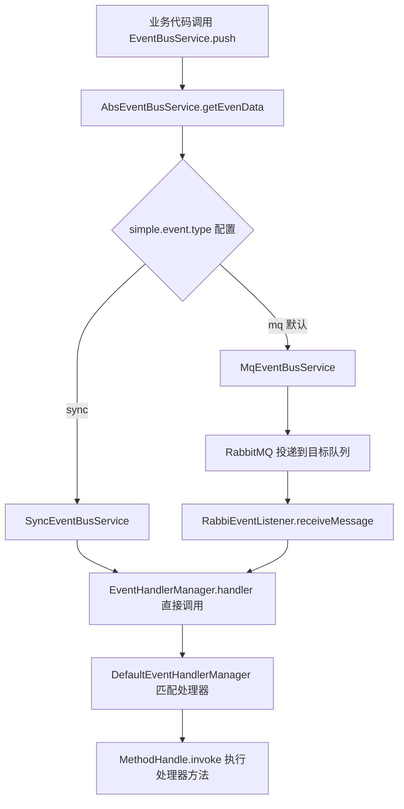
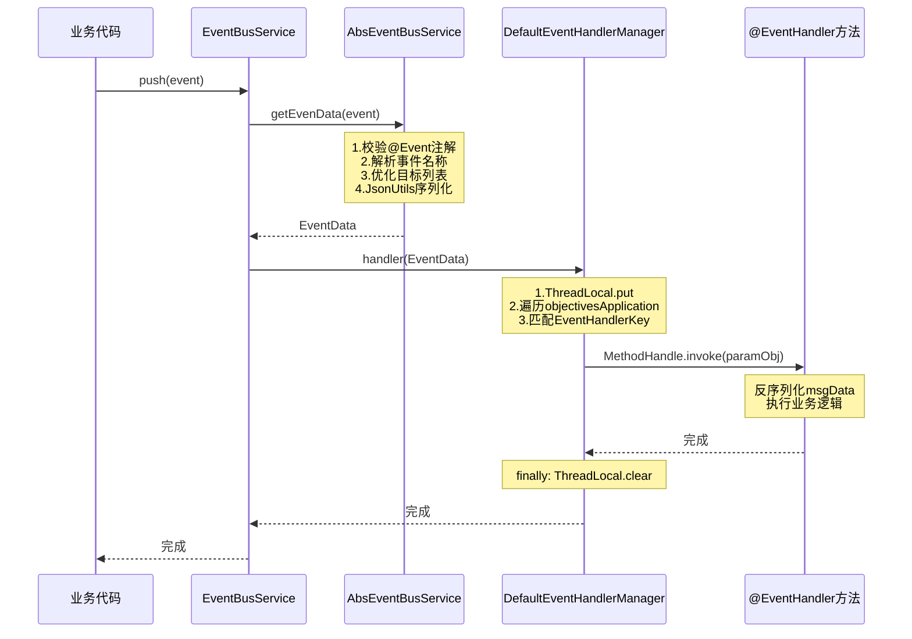
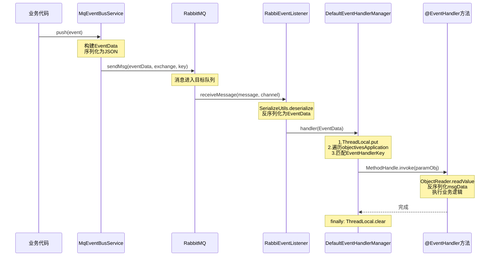
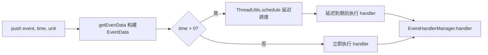
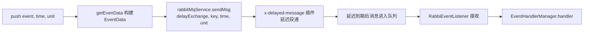
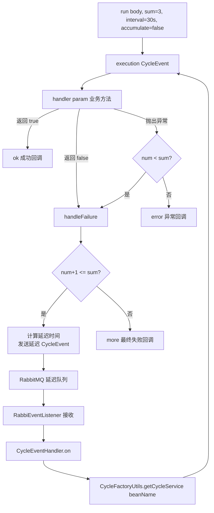

# simple-common-eventbus 事件驱动架构模块

> @author qty
> 版本：1.0.1

## 1. 模块介绍

`simple-common-eventbus` 是 simple-common 框架的事件驱动架构模块，提供基于注解的轻量级事件总线，支持**同步发布**、**异步MQ发布**和**延迟发布**三种模式，适用于服务内解耦和跨服务事件通信。

该模块提供以下核心能力：

- **`@Event` 事件定义注解**：标记事件类，声明事件名称和目标系统
- **`@EventHandler` 事件处理器注解**：标记处理方法，声明接收哪些系统的事件
- **`EventBusService` 事件发布接口**：统一发布入口，4 个重载方法覆盖自动识别/指定类型 × 立即/延迟
- **`SyncEventBusService` 同步实现**：同一线程内直接调用处理器，延迟通过 `ThreadUtils.schedule()` 调度
- **`MqEventBusService` 异步MQ实现**：基于 RabbitMQ 跨服务投递，延迟通过 `x-delayed-message` 插件
- **`AbsEventCycleService` 循环重试框架**：基于事件总线的自动重试/循环任务机制
- **`MethodHandle` 高效调用**：Java 17 优化，注册时创建 MethodHandle，调用性能接近原生方法

### 架构总览



## 2. Maven 依赖

```xml
<dependency>
    <groupId>com.simple.common</groupId>
    <artifactId>simple-common-eventbus</artifactId>
    <version>1.0.1</version>
</dependency>
```

该模块传递引入以下依赖：

- `simple-common-core`：核心基础（`JsonUtils`、`BeanUtils`、`AssertUtils`、`ThreadUtils`、`SerializeUtils`、`ApplicationProperties` 等）
- `simple-common-rabbitmq`：MQ 模式必备（`RabbitMqService`、`DefaultMessage`、`@RabbitMqConsumption`），sync 模式也需 jar 存在

## 3. 核心功能

| 类名 | 功能描述 | 关键特性 |
|------|---------|---------|
| [`@Event`](simple-common-eventbus/src/main/java/com/simple/common/eventbus/common/annotation/Event.java:18) | 事件定义注解 | 标记事件类，声明事件名称和目标系统 |
| [`@EventHandler`](simple-common-eventbus/src/main/java/com/simple/common/eventbus/common/annotation/EventHandler.java:18) | 事件处理器注解 | 标记处理方法，声明接收哪些系统的事件 |
| [`EventBusService`](simple-common-eventbus/src/main/java/com/simple/common/eventbus/common/service/EventBusService.java:22) | 事件发布接口 | 4 个重载方法：自动识别/指定类型 × 立即/延迟 |
| [`AbsEventBusService`](simple-common-eventbus/src/main/java/com/simple/common/eventbus/service/AbsEventBusService.java:25) | 事件发布抽象类 | 构建 EventData、注解缓存、目标优化、双重检查锁 |
| [`SyncEventBusService`](simple-common-eventbus/src/main/java/com/simple/common/eventbus/service/SyncEventBusService.java:22) | 同步事件实现 | 同线程直接调用，延迟用 `ThreadUtils.schedule()` |
| [`MqEventBusService`](simple-common-eventbus/src/main/java/com/simple/common/eventbus/service/MqEventBusService.java:21) | 异步MQ事件实现 | 基于 RabbitMQ 跨服务投递，延迟用 `x-delayed-message` 插件 |
| [`EventHandlerManager`](simple-common-eventbus/src/main/java/com/simple/common/eventbus/common/manager/EventHandlerManager.java:15) | 事件处理器管理器接口 | 注册/注销/分发事件处理器 |
| [`DefaultEventHandlerManager`](simple-common-eventbus/src/main/java/com/simple/common/eventbus/manager/DefaultEventHandlerManager.java:41) | 处理器管理器默认实现 | ConcurrentHashMap 映射、MethodHandle 调用、ObjectReader 缓存 |
| [`EventHandlerInit`](simple-common-eventbus/src/main/java/com/simple/common/eventbus/init/EventHandlerInit.java:25) | 处理器初始化器 | ApplicationReadyEvent 时扫描所有 @EventHandler 方法并注册 |
| [`RabbiEventListener`](simple-common-eventbus/src/main/java/com/simple/common/eventbus/listener/RabbiEventListener.java:22) | MQ 消息监听器 | 接收 RabbitMQ 消息，反序列化后分发到处理器 |
| [`RabbiEventConfig`](simple-common-eventbus/src/main/java/com/simple/common/eventbus/common/config/RabbiEventConfig.java:24) | MQ 拓扑配置 | 自动创建队列、交换机、绑定关系 |
| [`EventData`](simple-common-eventbus/src/main/java/com/simple/common/eventbus/common/entity/EventData.java:23) | 事件消息体 | 继承 DefaultMessage，携带事件名称、来源系统、目标系统、JSON 数据 |
| [`EventHandlerKey`](simple-common-eventbus/src/main/java/com/simple/common/eventbus/common/entity/EventHandlerKey.java:19) | 处理器映射键 | applicationName + eventName 组合键 |
| [`EventHandlerValue`](simple-common-eventbus/src/main/java/com/simple/common/eventbus/common/entity/EventHandlerValue.java:20) | 处理器映射值 | 参数类型、MethodHandle、Bean 实例、原始 Method |
| [`AbsEventCycleService`](simple-common-eventbus/src/main/java/com/simple/common/eventbus/common/service/AbsEventCycleService.java:24) | 循环重试抽象类 | 基于事件总线的自动重试/循环任务，BeanNameAware 获取 Bean 名 |
| [`CycleEvent`](simple-common-eventbus/src/main/java/com/simple/common/eventbus/common/event/CycleEvent.java:20) | 循环任务事件 | 携带 beanName、参数、次数、间隔、是否累加 |
| [`CycleEventHandler`](simple-common-eventbus/src/main/java/com/simple/common/eventbus/event/CycleEventHandler.java:19) | 循环任务处理器 | 接收 CycleEvent，通过 CycleFactoryUtils 查找服务并执行 |
| [`CycleFactoryUtils`](simple-common-eventbus/src/main/java/com/simple/common/eventbus/util/CycleFactoryUtils.java:16) | 循环任务工厂 | DCL 缓存所有 AbsEventCycleService Bean |
| [`EventThreadLocalUtils`](simple-common-eventbus/src/main/java/com/simple/common/eventbus/util/EventThreadLocalUtils.java:10) | 事件上下文工具 | ThreadLocal 存取事件元数据，处理器内可获取来源系统等 |
| [`MqNameUtil`](simple-common-eventbus/src/main/java/com/simple/common/eventbus/util/MqNameUtil.java:12) | MQ 命名工具 | 生成队列/交换机/routingKey 名称，格式 `{服务名}-{环境}.event.{后缀}` |
| [`EventProperties`](simple-common-eventbus/src/main/java/com/simple/common/eventbus/common/properties/EventProperties.java:18) | 事件配置类 | `simple.event.type`（mq/sync）、`simple.event.concurrency` |
| [`EventConstant`](simple-common-eventbus/src/main/java/com/simple/common/eventbus/common/constants/EventConstant.java:9) | 事件常量 | `TARGET_ALL_X`（广播）、`THIS_MACHINE`（本系统） |

## 4. 配置说明

### 4.1 事件总线配置（`simple.event`）

配置类：[`EventProperties`](simple-common-eventbus/src/main/java/com/simple/common/eventbus/common/properties/EventProperties.java:18)

| 属性 | 配置键 | 类型 | 默认值 | 说明 |
|------|--------|------|--------|------|
| `type` | `simple.event.type` | `String` | `mq` | `mq`=RabbitMQ 异步投递，`sync`=同一线程直接调用 |
| `concurrency` | `simple.event.concurrency` | `String` | `1` | MQ 模式下 `@RabbitListener` 的并发消费者数量 |

**配置示例**：

```yaml
simple:
  event:
    type: mq           # mq（默认，RabbitMQ异步）| sync（同步）
    concurrency: 1     # MQ消费者并发数，默认1
```

> **注意**：`sync` 模式不需要 RabbitMQ 运行，但 jar 仍依赖 `simple-common-rabbitmq`。sync 模式下延迟事件通过 `ThreadUtils.schedule()` 调度线程池执行。

### 4.2 自动配置

模块通过 `META-INF/spring/org.springframework.boot.autoconfigure.AutoConfiguration.imports` 自动注册 [`RabbiEventConfig`](simple-common-eventbus/src/main/java/com/simple/common/eventbus/common/config/RabbiEventConfig.java:24)，提供以下功能：

- `@ComponentScan(basePackages = {"com.simple.common.eventbus"})`：自动扫描 eventbus 模块组件
- 自动创建 RabbitMQ 队列、交换机、绑定关系（详见第 7 章）

### 4.3 条件装配

| 实现类 | 条件注解 | 生效条件 |
|--------|---------|---------|
| [`SyncEventBusService`](simple-common-eventbus/src/main/java/com/simple/common/eventbus/service/SyncEventBusService.java:21) | `@ConditionalOnProperty(prefix = "simple.event", name = "type", havingValue = "sync")` | `simple.event.type=sync` |
| [`MqEventBusService`](simple-common-eventbus/src/main/java/com/simple/common/eventbus/service/MqEventBusService.java:20) | `@ConditionalOnProperty(prefix = "simple.event", name = "type", havingValue = "mq", matchIfMissing = true)` | `simple.event.type=mq` 或未配置（默认） |

## 5. 核心注解与接口详细说明

### 5.1 @Event 事件定义注解

**类路径**：`com.simple.common.eventbus.common.annotation.Event`

**作用**：标记一个类为事件对象，声明事件名称和目标系统。

| 属性 | 类型 | 默认值 | 说明 |
|------|------|--------|------|
| `value()` | `String` | `""` | 事件名称，不指定时取事件类的短类名（`getSimpleName()`） |
| `targets()` | `String[]` | `EventConstant.THIS_MACHINE` | 要接收该事件的全部目标系统名称，在 MQ 实现中使用，同步事件无效 |

**targets 取值说明**：

| 取值 | 含义 | MQ 行为 |
|------|------|---------|
| `"event.this"`（默认） | 仅本系统 | 发送到 Direct Exchange `{本服务名}-{env}.event.ex` |
| 具体服务名如 `"inventory-service"` | 指定目标系统 | 向每个目标发送到 `{目标名}-{env}.event.ex` |
| `"event.all"` | 广播到所有系统 | 发送到 Fanout Exchange `event.all-{env}.event.ex` |
| 混合如 `{"event.this", "event.all"}` | 含广播时自动优化 | **仅保留广播**（因为广播已覆盖所有服务，避免本机重复消费） |

**使用示例**：

```java
// 基本用法：事件名称默认取短类名 "UserCreatedEvent"
@Event
public class UserCreatedEvent {
    private String userId;
    private String username;
    // getter/setter...
}

// 指定事件名称和目标系统
@Event(value = "orderPaid", targets = {"event.this", "inventory-service"})
public class OrderPaidEvent {
    private String orderId;
    private BigDecimal amount;
    // getter/setter...
}

// 广播到所有系统
@Event(value = "configRefresh", targets = "event.all")
public class ConfigRefreshEvent {
    private String configKey;
    // getter/setter...
}
```

### 5.2 @EventHandler 事件处理器注解

**类路径**：`com.simple.common.eventbus.common.annotation.EventHandler`

**作用**：标记一个方法为事件处理器，声明要处理的事件名称和接收哪些系统的事件。

| 属性 | 类型 | 默认值 | 说明 |
|------|------|--------|------|
| `value()` | `String` | `""` | 要处理的事件名称，不指定时取参数类型的短类名 |
| `applicationName()` | `String[]` | `EventConstant.THIS_MACHINE` | 接收哪些系统的事件，`"event.this"` 启动时自动替换为当前应用名 |

**约束**：

- `@EventHandler` 标记的方法**必须且只能有一个参数**，该参数类型的类应标注 `@Event`
- 一个事件可以有多个处理器，全部会被执行
- `applicationName` 为 `"event.this"` 时，启动时自动替换为 `applicationProperties.getName()`（当前应用名）

**匹配规则**：[`DefaultEventHandlerManager`](simple-common-eventbus/src/main/java/com/simple/common/eventbus/manager/DefaultEventHandlerManager.java:41) 用 `EventHandlerKey(applicationName, eventName)` 精确匹配。事件分发时遍历 `EventData.objectivesApplication` 列表，对每个 target 查 `listenersMap` 获取匹配的处理器列表。

**使用示例**：

```java
@Component
public class UserEventHandler {

    // 基本用法：接收本系统的 UserCreatedEvent
    @EventHandler
    public void handleUserCreated(UserCreatedEvent event) {
        emailService.sendWelcome(event.getUserId());
    }

    // 指定事件名称
    @EventHandler(value = "orderPaid")
    public void handleOrderPaid(OrderPaidEvent event) {
        inventoryService.deduct(event.getOrderId());
    }

    // 接收来自指定系统的事件
    @EventHandler(value = "orderPaid", applicationName = {"event.this", "inventory-service"})
    public void handleOrderPaidFromInventory(OrderPaidEvent event) {
        log.info("收到库存服务的订单支付事件: {}", event.getOrderId());
    }

    // 接收广播事件
    @EventHandler(value = "configRefresh", applicationName = "event.all")
    public void handleConfigRefresh(ConfigRefreshEvent event) {
        configService.reload(event.getConfigKey());
    }
}
```

### 5.3 EventBusService 事件发布接口

**类路径**：`com.simple.common.eventbus.common.service.EventBusService`

| 方法签名 | 返回值 | 说明 |
|---------|--------|------|
| `push(Object event)` | `void` | 发布事件（自动识别事件类型） |
| `push(Object obj, Class<?> eventClass)` | `void` | 发布事件（指定事件类型，通过 `BeanUtils.copyProperties` 转换） |
| `push(Object event, int time, TimeUnit timeUnit)` | `void` | 发布延迟事件（自动识别事件类型） |
| `push(Object obj, Class<?> eventClass, int time, TimeUnit timeUnit)` | `void` | 发布延迟事件（指定事件类型） |

**实现类对比**：

| 实现类 | 模式 | 延迟实现 | 条件 |
|--------|------|---------|------|
| [`SyncEventBusService`](simple-common-eventbus/src/main/java/com/simple/common/eventbus/service/SyncEventBusService.java:22) | 同步 | `ThreadUtils.schedule()` 调度线程池 | `simple.event.type=sync` |
| [`MqEventBusService`](simple-common-eventbus/src/main/java/com/simple/common/eventbus/service/MqEventBusService.java:21) | 异步(MQ) | `x-delayed-message` 插件 | `simple.event.type=mq`（默认） |

> **`push(obj, eventClass)` 类型转换**：通过 `BeanUtils.copyProperties(obj, eventClass)` 将 Map 或任意对象转换为目标事件类，**不是** JSON 反序列化。适合将 Map 参数包装为强类型事件对象。

### 5.4 AbsEventBusService 事件发布抽象类

**类路径**：`com.simple.common.eventbus.service.AbsEventBusService`

**核心方法**：

| 方法签名 | 返回值 | 说明 |
|---------|--------|------|
| `handler(EventData eventData)` | `void` | 抽象方法，子类实现普通事件发送 |
| `handler(EventData eventData, int time, TimeUnit timeUnit)` | `void` | 抽象方法，子类实现延迟事件发送 |
| `getEvenData(Object event)` | `EventData` | 构建事件消息体，含注解缓存、目标优化 |

**getEvenData 构建流程**：

1. `AssertUtils.notNull(event)` 校验事件对象非空
2. 从 `eventAnnotationCache`（`ConcurrentHashMap`）获取 `@Event` 注解，缓存避免重复反射
3. `AssertUtils.notEmpty(annotation)` 校验必须带 `@Event` 注解
4. 解析事件名称：注解 `value()` 为空则取 `aClass.getSimpleName()`
5. 双重检查锁获取 `cachedApplicationName`（`volatile` + `synchronized`）
6. `optimizeTargets()` 优化目标列表：将 `THIS_MACHINE` 替换为实际应用名，含广播时仅保留广播
7. `JsonUtils.toJsonStr(event)` 序列化为 JSON 存入 `EventData.msgData`

### 5.5 SyncEventBusService 同步事件实现

**类路径**：`com.simple.common.eventbus.service.SyncEventBusService`

**特性**：

- `@ConditionalOnProperty(prefix = "simple.event", name = "type", havingValue = "sync")` 条件装配
- 普通事件：直接调用 `eventHandlerManager.handler(eventData)`，在同一线程内执行
- 延迟事件：`time > 0` 时通过 `ThreadUtils.schedule()` 调度线程池延迟执行；`time <= 0` 时立即执行

### 5.6 MqEventBusService 异步MQ事件实现

**类路径**：`com.simple.common.eventbus.service.MqEventBusService`

**特性**：

- `@ConditionalOnProperty(prefix = "simple.event", name = "type", havingValue = "mq", matchIfMissing = true)` 条件装配（默认）
- 普通事件：遍历 `objectivesApplication`，对每个 target 调用 `rabbitMqService.sendMsg(eventData, exchangeName, keyName)`
- 延迟事件：遍历 `objectivesApplication`，对每个 target 调用 `rabbitMqService.sendMsg(eventData, delayExchangeName, keyName, time, timeUnit)`
- 单个 target 发送失败时捕获异常、记录日志，**继续发送下一个 target**

### 5.7 EventHandlerManager 处理器管理器接口

**类路径**：`com.simple.common.eventbus.common.manager.EventHandlerManager`

| 方法签名 | 返回值 | 说明 |
|---------|--------|------|
| `register(Method method)` | `void` | 注册事件（已废弃，通过 Class 查找 Bean 可能存在歧义） |
| `register(String beanName, Method method)` | `void` | 注册事件处理器方法（推荐，精确指定 beanName） |
| `unregister(Method method)` | `void` | 取消注册事件处理器方法 |
| `handler(Object event)` | `void` | 分发并执行事件处理器（参数必须为 EventData 类型） |

### 5.8 DefaultEventHandlerManager 处理器管理器默认实现

**类路径**：`com.simple.common.eventbus.manager.DefaultEventHandlerManager`

**核心数据结构**：

```java
// 事件处理器映射表：EventHandlerKey(applicationName, eventName) → List<EventHandlerValue>
ConcurrentHashMap<EventHandlerKey, List<EventHandlerValue>> listenersMap

// Jackson ObjectReader 缓存：参数类型 → ObjectReader，提升反序列化性能
Map<Class<?>, ObjectReader> readerCache
```

**handler 分发流程**：

1. 校验参数为 `EventData` 类型
2. `EventThreadLocalUtils.put(eventData.getClass().getName(), eventData)` 存入上下文
3. 获取 `objectivesApplication` 目标列表，为空则默认本系统
4. 遍历每个 target：
   - `TARGET_ALL_X`：查 `EventHandlerKey(TARGET_ALL_X, eventName)` 的处理器列表
   - 其他：查 `EventHandlerKey(targetApp, eventName)` 的处理器列表
5. 对匹配的处理器列表调用 `handlerForTarget()`
6. `finally` 块中 `EventThreadLocalUtils.clear()` 清理 ThreadLocal

**handlerForTarget 执行流程**：

1. 遍历处理器列表
2. 从 `readerCache` 获取或创建 `ObjectReader`（`SerializeUtils::readerFor`）
3. `reader.readValue(eventData.getMsgData())` 反序列化为参数对象
4. `evenHandler.getMethodHandle().invoke(paramObj)` 高效调用
5. 单个处理器失败时捕获 `Throwable`，记录日志，**继续执行其他处理器**

**MethodHandle 创建流程**（`createMethodHandle`）：

1. `method.setAccessible(true)` 确保方法可访问
2. 尝试 `MethodHandles.privateLookupIn()` 获取私有访问权限（模块化环境）
3. 失败则降级为 `MethodHandles.lookup()`（非模块化环境）
4. `lookup.unreflect(method)` 将反射 Method 转为 MethodHandle
5. `handle.bindTo(bean)` 绑定 Bean 实例（相当于 this）
6. `boundHandle.asType(MethodType.methodType(void.class, Object.class))` 调整方法类型为 `(Object) -> void`
7. 全部失败时降级为 `createReflectionOnlyMethodHandle()`（纯反射包装）

### 5.9 EventHandlerInit 处理器初始化器

**类路径**：`com.simple.common.eventbus.init.EventHandlerInit`

**触发时机**：监听 `ApplicationReadyEvent`（`SimpleOrder.Event` 顺序），此时所有 Bean 已就绪。

**扫描流程**：

1. 遍历所有 `BeanDefinitionNames`
2. 对每个 Bean 通过 `AopUtils.getTargetClass(bean)` 获取真实类（穿透 JDK 动态代理）
3. `ReflectionUtils.doWithMethods(targetClass, ..., ReflectionUtils.USER_DECLARED_METHODS)` 遍历类及接口的所有方法
4. 方法带有 `@EventHandler` 注解时调用 `eventHandlerManager.register(beanName, method)`

### 5.10 RabbiEventListener MQ 消息监听器

**类路径**：`com.simple.common.eventbus.listener.RabbiEventListener`

**监听配置**：

```java
@RabbitListener(
    queues = "#{T(com.simple.common.eventbus.util.MqNameUtil).queueName(applicationProperties.getName())}",
    concurrency = "#{eventProperties.getConcurrency()}"
)
@RabbitMqConsumption
public void receiveMessage(Message message, Channel channel) throws Exception
```

**处理流程**：

1. `SerializeUtils.deserialize(message.getBody(), EventData.class)` 反序列化消息体
2. 校验 `eventData` 非空、`msgData` 非空
3. `eventHandlerManager.handler(eventData)` 分发到处理器（ThreadLocal 由 Manager 内部统一管理）

### 5.11 EventData 事件消息体

**类路径**：`com.simple.common.eventbus.common.entity.EventData`（继承 `DefaultMessage`）

| 字段 | 类型 | 说明 |
|------|------|------|
| `applicationName` | `String` | 发送事件的系统名称 |
| `eventName` | `String` | 发送的事件名称 |
| `objectivesApplication` | `List<String>` | 事件的目标服务列表 |
| `msgData` | `String` | 事件 JSON 数据（继承自 DefaultMessage） |

### 5.12 EventHandlerKey / EventHandlerValue

**EventHandlerKey**（映射键）：

| 字段 | 类型 | 说明 |
|------|------|------|
| `applicationName` | `String` | 系统名称 |
| `eventName` | `String` | 事件名称 |

> `@EqualsAndHashCode(of = {"applicationName", "eventName"})` 重写 equals 和 hashCode，用于对比 key 是否相等。

**EventHandlerValue**（映射值）：

| 字段 | 类型 | 说明 |
|------|------|------|
| `aClass` | `Class<?>` | 事件参数类型 |
| `methodHandle` | `MethodHandle` | 高效方法调用句柄（Java 17 优化，替代反射 Method.invoke） |
| `bean` | `Object` | Bean 实例 |
| `methodForDebug` | `Method` | 保留原始反射 Method 对象，用于调试、日志输出或注销时匹配 |

### 5.13 EventThreadLocalUtils 事件上下文工具

**类路径**：`com.simple.common.eventbus.util.EventThreadLocalUtils`

| 方法签名 | 返回值 | 说明 |
|---------|--------|------|
| `put(String key, Object value)` | `void` | 存入上下文（key 不能为 null） |
| `get(String key)` | `T` | 读取上下文值 |
| `remove(String key)` | `void` | 移除指定值 |
| `clear()` | `void` | 清空并移除 ThreadLocal |

**生命周期**：[`DefaultEventHandlerManager.handler()`](simple-common-eventbus/src/main/java/com/simple/common/eventbus/manager/DefaultEventHandlerManager.java:122) 在入口 `put(eventData)`，在 `finally` 块中 `clear()`，确保无内存泄漏。同步和 MQ 两种路径统一由此管理。

**处理器内获取事件元数据**：

```java
@EventHandler
public void handle(UserCreatedEvent event) {
    EventData eventData = EventThreadLocalUtils.get(EventData.class.getName());
    String sourceApp = eventData.getApplicationName(); // 来源系统
}
```

### 5.14 MqNameUtil MQ 命名工具

**类路径**：`com.simple.common.eventbus.util.MqNameUtil`

| 方法签名 | 返回值 | 说明 |
|---------|--------|------|
| `exchangeName(String serviceName)` | `String` | 交换机名称：`{svc}-{env}.event.ex` |
| `delayExchangeName(String serviceName)` | `String` | 延时交换机名称：`{svc}-{env}.event.delay.ex` |
| `queueName(String serviceName)` | `String` | 队列名称：`{svc}-{env}.event.queue` |
| `keyName(String serviceName)` | `String` | routingKey 名称：`{svc}-{env}.event.key` |
| `getEnvironment(String name)` | `String` | 获取名称前缀：`{服务名}-{环境标识}` |

**环境标识规则**：取 `SpringUtil.getActiveProfiles()` 的第一个有效 profile，未设置时使用 `"default"`。

## 6. 事件完整生命周期

### 6.1 同步模式生命周期



### 6.2 异步MQ模式生命周期



### 6.3 延迟事件生命周期

**同步模式延迟**：



**MQ模式延迟**：



### 6.4 事件序列化机制

事件**不是**以对象引用传递，而是 JSON 序列化后传输：

```
push(event) → JsonUtils.toJsonStr(event) → EventData.msgData
                                          ↓
                            [MQ路径] → RabbitMQ 消息体
                            [Sync路径] → 内存传递
                                          ↓
                          DefaultEventHandlerManager.handlerForTarget()
                            → ObjectReader.readValue(msgData) → 参数对象
                            → MethodHandle.invoke(参数对象)
```

- **序列化**：[`AbsEventBusService.getEvenData()`](simple-common-eventbus/src/main/java/com/simple/common/eventbus/service/AbsEventBusService.java:113) 中通过 `JsonUtils.toJsonStr(event)` 转为 JSON 字符串，存入 `EventData.msgData`
- **反序列化**：[`DefaultEventHandlerManager.handlerForTarget()`](simple-common-eventbus/src/main/java/com/simple/common/eventbus/manager/DefaultEventHandlerManager.java:172) 中使用 Jackson `ObjectReader`（从缓存 `ConcurrentHashMap<Class, ObjectReader>` 获取）将 `msgData` 反序列化为处理器方法参数类型
- **含义**：事件对象需要有可序列化字段（getter/setter），传递的是**值拷贝**而非引用

## 7. MQ 拓扑结构

当 `simple.event.type=mq` 时，[`RabbiEventConfig`](simple-common-eventbus/src/main/java/com/simple/common/eventbus/common/config/RabbiEventConfig.java:24) 自动创建以下 RabbitMQ 组件。

### 7.1 命名规范

队列和交换机命名遵循 `{serviceName}-{profile}.event.{后缀}` 格式（由 [`MqNameUtil`](simple-common-eventbus/src/main/java/com/simple/common/eventbus/util/MqNameUtil.java:12) 生成）：

| 组件 | Bean 名称 | 名称格式 | 类型 | 用途 |
|------|----------|---------|------|------|
| Queue | `simpleEventQueue` | `{svc}-{env}.event.queue` | Durable | 本服务接收所有事件的队列 |
| Direct Exchange | `simpleEventExchange` | `{svc}-{env}.event.ex` | Direct | 单播正常事件 |
| Custom Exchange | `simpleEventDelayExchange` | `{svc}-{env}.event.delay.ex` | x-delayed-message(direct) | 单播延迟事件 |
| Fanout Exchange | `simpleEventAllExchange` | `event.all-{env}.event.ex` | Fanout | 广播正常事件 |
| Custom Exchange | `simpleEventAllDelayExchange` | `event.all-{env}.event.delay.ex` | x-delayed-message(fanout) | 广播延迟事件 |

### 7.2 绑定关系

| 绑定 Bean 名称 | 队列 | 交换机 | routingKey |
|---------------|------|--------|-----------|
| `bindingSimpleEventExchange` | `simpleEventQueue` | `simpleEventExchange` | `{svc}-{env}.event.key` |
| `bindingDelaySimpleEventExchange` | `simpleEventQueue` | `simpleEventDelayExchange` | `{svc}-{env}.event.key` |
| `bindingSimpleEventAllExchange` | `simpleEventQueue` | `simpleEventAllExchange` | 无（Fanout） |
| `bindingDelaySimpleEventAllExchange` | `simpleEventQueue` | `simpleEventAllDelayExchange` | 无（Fanout） |
| `bindingSimpleDelayedRetryExchange` | `simpleEventQueue` | `simpleDelayedRetryExchange` | `{svc}-{env}.event.key` |

> **调试提示**：所有事件消息最终都进入同一个队列 `{svc}-{env}.event.queue`，通过 `EventData.eventName` 区分事件类型。可以在 RabbitMQ 管理界面查看该队列的消息。

## 8. 循环重试框架（AbsEventCycleService）

基于事件总线的自动重试/循环任务机制，适用于需要失败重试的异步场景。

### 8.1 核心类说明

**AbsEventCycleService\<T\>**

**类路径**：`com.simple.common.eventbus.common.service.AbsEventCycleService`（继承 `AbsCycleService<T>`，实现 `BeanNameAware`）

| 方法签名 | 返回值 | 说明 |
|---------|--------|------|
| `run(T runBody, Integer sum, Integer timeInterval, Boolean isAccumulate, Map<String, Object> parameters)` | `void` | 启动循环任务（完整参数） |
| `execution(CycleEvent event)` | `void` | 执行单次任务调度 |

**需实现的抽象方法**（继承自 `AbsCycleService`）：

| 方法签名 | 返回值 | 说明 |
|---------|--------|------|
| `getEventClass()` | `Class<T>` | 返回任务数据类型 Class |
| `handler(T runBody, Map<String, Object> parameters)` | `Boolean` | 执行业务逻辑，返回 true=成功 false=失败需重试 |
| `ok(T runBody, Map<String, Object> parameters)` | `void` | 任务成功回调 |
| `more(T runBody, Map<String, Object> parameters)` | `void` | 超过最大次数仍未成功回调 |
| `error(T runBody, Map<String, Object> parameters)` | `void` | 参数转换失败回调 |

**可选覆盖方法**：

| 方法签名 | 返回值 | 说明 |
|---------|--------|------|
| `addCounter(T runBody, Map<String, Object> parameters, int count)` | `void` | 增加计数器（默认空实现，可记录当前重试次数） |

### 8.2 CycleEvent 循环任务事件

**类路径**：`com.simple.common.eventbus.common.event.CycleEvent`（标注 `@Event`）

| 字段 | 类型 | 说明 |
|------|------|------|
| `beanName` | `String` | 执行的 Bean 名称 |
| `runBody` | `Object` | 参数对象 |
| `sum` | `Integer` | 总执行次数 |
| `num` | `Integer` | 当前次数 |
| `timeInterval` | `Integer` | 周期的单位时间间隔 |
| `isAccumulate` | `Boolean` | 是否累加延迟 |
| `reserve` | `Map<String, Object>` | 扩展参数 |

### 8.3 执行流程



### 8.4 内部机制

- **BeanNameAware**：通过 `setBeanName()` 自动获取当前 Bean 在 Spring 容器中的真实名称，延迟消息中携带 `beanName`
- **CycleFactoryUtils**：DCL（双重检查锁）缓存所有 `AbsEventCycleService` Bean，`volatile` 保证多线程可见性
- **延迟消息发送失败重试**：最多重试 3 次（每次间隔递增 100ms、200ms、300ms），全部失败触发 `more()` 回调
- **AOP 代理处理**：`getCurrentBeanName()` 优先使用 BeanNameAware 注入的名称，降级时通过 `AopUtils.getTargetClass()` 和 `AopProxyUtils.getSingletonTarget()` 正确处理 AOP 代理对象
- **依赖 MQ 模式**：延迟消息需要 `x-delayed-message` 插件

### 8.5 CycleFactoryUtils 循环任务工厂

**类路径**：`com.simple.common.eventbus.util.CycleFactoryUtils`

| 方法签名 | 返回值 | 说明 |
|---------|--------|------|
| `getCycleService(String name)` | `AbsEventCycleService` | 获取执行 Bean（DCL 缓存，可能为 null） |
| `refreshServiceCache()` | `void` | 刷新服务缓存，用于动态注册场景 |

## 9. 使用示例

### 9.1 完整三步使用流程

> 示例来源：[`EventTestRequest`](simple-common-test/src/main/java/com/simple/common/test/common/event/EventTestRequest.java:20)、[`EvenTestHandler`](simple-common-test/src/main/java/com/simple/common/test/eventtest/EvenTestHandler.java:16)、[`DefaultEvenService`](simple-common-test/src/main/java/com/simple/common/test/service/DefaultEvenService.java:17)、[`EventController`](simple-common-test/src/main/java/com/simple/common/test/controller/EventController.java:27)

**步骤一：定义事件类**

```java
// 来自 EventTestRequest
@Data
@Event                                      // 事件名称默认取短类名 "EventTestRequest"
@JsonIgnoreProperties(ignoreUnknown = true)
@Accessors(chain = true)
public class EventTestRequest {

    @XssSafe
    @NotEmpty(message = "姓名不能为空")
    @Schema(description = "名称")
    private String name;

    @NotEmpty(message = "性别不能为空")
    @Schema(description = "性别")
    private String sex;
}
```

**步骤二：定义处理器**

```java
// 来自 EvenTestHandler
@Slf4j
@Component
public class EvenTestHandler {

    // 员工A-发邮件
    @EventHandler
    public void test1(EventTestRequest event) {
        log.debug("test1开始执行内容：[{}]", JsonUtils.toJsonStr(event));
    }

    // 员工B-发短信
    @EventHandler
    public void test11(EventTestRequest event) {
        log.debug("test11开始执行内容：[{}]", JsonUtils.toJsonStr(event));
    }
}
```

**步骤三：发布事件**

```java
// 来自 DefaultEvenService
@Service
public class DefaultEvenService implements EvenService {

    @Autowired
    private EventBusService eventBusService;

    @Override
    public void testSend(EventTestRequest request) {
        // 指定事件类型发布
        eventBusService.push(request, EventTestRequest.class);
    }

    @Override
    public void testSend(EventTestRequest request, int time, TimeUnit timeUnit) {
        // 指定事件类型 + 延迟发布
        eventBusService.push(request, EventTestRequest.class, time, timeUnit);
    }
}
```

**Controller 触发**

```java
// 来自 EventController
@Slf4j
@RequestMapping("event")
@Tag(name = "事件")
@RestController
public class EventController {

    @Autowired
    private EvenService evenService;

    @Operation(summary = "触发事件")
    @PostMapping("handler")
    public R<Object> handler(@RequestBody @Validated EventTestRequest request) {
        evenService.testSend(request);
        return R.ok();
    }

    @Operation(summary = "触发延迟事件")
    @PostMapping("delayHandler")
    public R<Object> delayHandler(@RequestBody @Validated EventTestRequest request) {
        evenService.testSend(request, 5, TimeUnit.SECONDS);
        return R.ok();
    }
}
```

### 9.2 同步模式发布

```java
@Autowired
private EventBusService eventBusService;

// 自动识别事件类型
eventBusService.push(new UserCreatedEvent().setUserId("123").setUsername("张三"));

// 延迟发布（30分钟后执行）
eventBusService.push(new OrderTimeoutEvent().setOrderId("ORDER123"), 30, TimeUnit.MINUTES);

// 指定事件类型发布（将 Map 转为事件对象）
Map<String, Object> data = new HashMap<>();
data.put("userId", "123");
eventBusService.push(data, UserCreatedEvent.class);

// 指定类型 + 延迟
eventBusService.push(data, UserActiveReminderEvent.class, 24, TimeUnit.HOURS);
```

### 9.3 跨服务事件通信

```java
// 订单服务：发布事件到库存服务
@Event(value = "orderPaid", targets = {"event.this", "inventory-service"})
public class OrderPaidEvent {
    private String orderId;
    private BigDecimal amount;
}

// 库存服务：接收来自订单服务的事件
@EventHandler(value = "orderPaid", applicationName = "order-service")
public void handleOrderPaid(OrderPaidEvent event) {
    inventoryService.deduct(event.getOrderId(), event.getAmount());
}
```

### 9.4 广播事件

```java
// 发布方：广播配置刷新事件到所有系统
@Event(value = "configRefresh", targets = "event.all")
public class ConfigRefreshEvent {
    private String configKey;
}

// 接收方：各系统接收广播
@EventHandler(value = "configRefresh", applicationName = "event.all")
public void handleConfigRefresh(ConfigRefreshEvent event) {
    configService.reload(event.getConfigKey());
}
```

### 9.5 循环重试任务

> 示例来源：[`DefaultCycleService`](simple-common-test/src/main/java/com/simple/common/test/service/DefaultCycleService.java:17) 和 [`CycleController`](simple-common-test/src/main/java/com/simple/common/test/controller/CycleController.java:23)

```java
// 1. 定义循环任务服务（继承 AbsEventCycleService）
@Slf4j
@Component
public class DefaultCycleService extends AbsEventCycleService<DataDemo> {

    @Override
    public Class<DataDemo> getEventClass() {
        return DataDemo.class;
    }

    @Override
    protected Boolean handler(DataDemo runBody, Map<String, Object> parameters) {
        // 模拟 http 查单请求
        log.debug("查询中。。。。");
        return false; // 返回 false 触发下次重试
    }

    @Override
    protected void ok(DataDemo runBody, Map<String, Object> parameters) {
        log.debug("正在执行查询成功逻辑");
    }

    @Override
    protected void more(DataDemo runBody, Map<String, Object> parameters) {
        log.debug("查询已达最大次数");
    }

    @Override
    protected void error(DataDemo runBody, Map<String, Object> parameters) {
        log.debug("业务异常，查询失败");
    }
}

// 2. 调用循环任务（来自 CycleController）
@PostMapping("select")
public R<Object> select() {
    DataDemo dataDemo = new DataDemo().setDemoName2("测试数据1").setDemoName2("测试数据2");
    // 累加延迟：最多5次，基础间隔1秒
    // 第1次：立即，第2次：1秒后，第3次：2秒后，第4次：3秒后，第5次：4秒后
    defaultCycleService.runAccumulate(dataDemo, 5, 1);
    return R.ok();
}
```

## 10. 扩展点与自定义方式

### 10.1 自定义 EventBusService 实现

实现 `EventBusService` 接口（或继承 `AbsEventBusService`），配合 `@ConditionalOnProperty` 条件装配：

```java
@Slf4j
@Service
@ConditionalOnProperty(prefix = "simple.event", name = "type", havingValue = "kafka")
public class KafkaEventBusService extends AbsEventBusService {

    @Autowired
    private KafkaTemplate<String, String> kafkaTemplate;

    @Override
    protected void handler(EventData eventData) {
        for (String target : eventData.getObjectivesApplication()) {
            kafkaTemplate.send(target + ".event", JsonUtils.toJsonStr(eventData));
        }
    }

    @Override
    protected void handler(EventData eventData, int time, TimeUnit timeUnit) {
        // 自定义延迟实现
    }
}
```

### 10.2 自定义 EventHandlerManager 实现

实现 `EventHandlerManager` 接口，覆盖默认的处理器注册和分发逻辑：

```java
@Component
public class CustomEventHandlerManager implements EventHandlerManager {

    @Override
    public void register(String beanName, Method method) {
        // 自定义注册逻辑
    }

    @Override
    public void unregister(Method method) {
        // 自定义注销逻辑
    }

    @Override
    public void handler(Object event) {
        // 自定义分发逻辑
    }
}
```

### 10.3 动态注册/注销处理器

运行时动态注册或注销事件处理器：

```java
@Autowired
private EventHandlerManager eventHandlerManager;

// 动态注册
Method method = MyHandler.class.getMethod("handle", MyEvent.class);
eventHandlerManager.register("myHandler", method);

// 动态注销
eventHandlerManager.unregister(method);
```

## 11. 错误处理与注意事项

### 11.1 错误处理语义

| 场景 | 行为 |
|------|------|
| MQ 发送到单个 target 失败 | 捕获异常，记录日志，**继续发送下一个 target** |
| 单个 handler 执行失败 | 捕获 `Throwable`，记录日志，**继续执行其他 handler** |
| `push(event)` 时 event 为 null | `AssertUtils.notNull` 抛异常 |
| `push(event)` 时缺少 `@Event` 注解 | `AssertUtils.notEmpty` 抛异常 |
| `push(event, 0, TimeUnit)` （同步模式） | `time <= 0` 视为立即执行 |
| 延迟消息发送失败（循环任务） | 最多重试 3 次，间隔递增（100ms, 200ms, 300ms） |
| 延迟消息发送彻底失败（循环任务） | 触发 `more()` 回调告知任务终止 |
| `@EventHandler` 方法参数个数不为 1 | `AssertUtils.isTrue` 抛异常 |
| `EventData` 反序列化失败 | 记录错误日志，抛出异常触发 MQ 重试 |

### 11.2 线程安全

- **`listenersMap`**：使用 `ConcurrentHashMap` + `CopyOnWriteArrayList`，线程安全
- **`eventAnnotationCache`**：`ConcurrentHashMap`，`computeIfAbsent` 原子操作
- **`readerCache`**：`ConcurrentHashMap`，`computeIfAbsent` 原子操作
- **`cachedApplicationName`**：`volatile` + 双重检查锁，线程安全
- **`CycleFactoryUtils.SERVICE_CACHE`**：`ConcurrentHashMap` + `volatile initialized` + DCL，线程安全
- **`EventThreadLocalUtils`**：`ThreadLocal<ConcurrentHashMap>`，每线程独立，`finally` 块统一清理

### 11.3 性能建议

- **MethodHandle 优化**：注册时创建 `MethodHandle`（`bindTo(bean).asType((Object)void)`），调用性能接近原生方法调用；失败时自动降级为纯反射
- **ObjectReader 缓存**：反序列化时从 `ConcurrentHashMap<Class, ObjectReader>` 获取缓存的 `ObjectReader`，避免每次创建
- **注解缓存**：`@Event` 注解通过 `ConcurrentHashMap` 缓存，避免重复反射
- **应用名称缓存**：`cachedApplicationName` 使用 `volatile` + 双重检查锁，避免重复获取
- **MQ 并发消费**：通过 `simple.event.concurrency` 配置并发消费者数量，提升吞吐

### 11.4 常见问题

1. **事件处理器不执行**：检查 `@EventHandler` 方法是否只有 1 个参数，参数类型的类是否标注了 `@Event`，事件名称是否匹配（不指定时取短类名）。

2. **MQ 模式下跨服务事件收不到**：检查发送方 `@Event.targets()` 是否包含目标服务名，接收方 `@EventHandler.applicationName()` 是否包含发送方服务名或 `"event.all"`。

3. **延迟事件不生效（MQ模式）**：确认 RabbitMQ 已安装 `rabbitmq_delayed_message_exchange` 插件。

4. **循环任务不执行**：检查 `handler` 方法返回值，返回 `false` 触发重试，返回 `true` 才会调用 `ok` 回调并停止循环。确认 `simple.event.type=mq`（循环任务依赖 MQ 延迟消息）。

5. **`BeanUtils.copyProperties` 空值覆盖**：`push(obj, eventClass)` 通过 `BeanUtils.copyProperties` 转换，源对象的 null 值会覆盖目标对象的非空值。

6. **多 Profile 环境命名**：`MqNameUtil.getEnvironment()` 取第一个 active profile，若需精确区分建议通过配置项显式指定服务名。

7. **广播 + 单播混合**：`@Event.targets` 同时包含 `"event.all"` 和具体服务名时，`optimizeTargets()` 会自动仅保留广播目标，避免本机重复消费。
