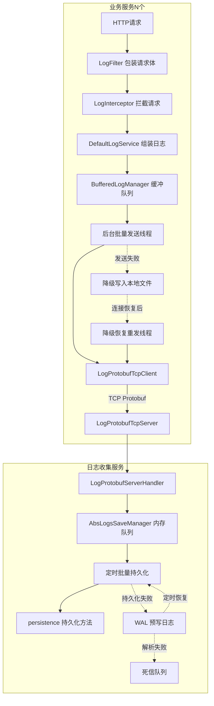
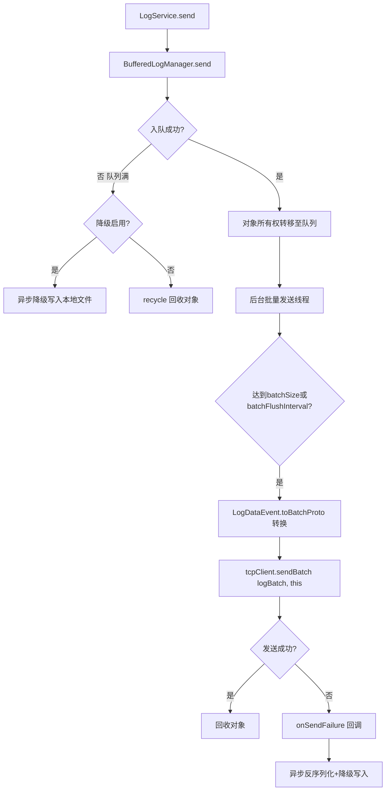
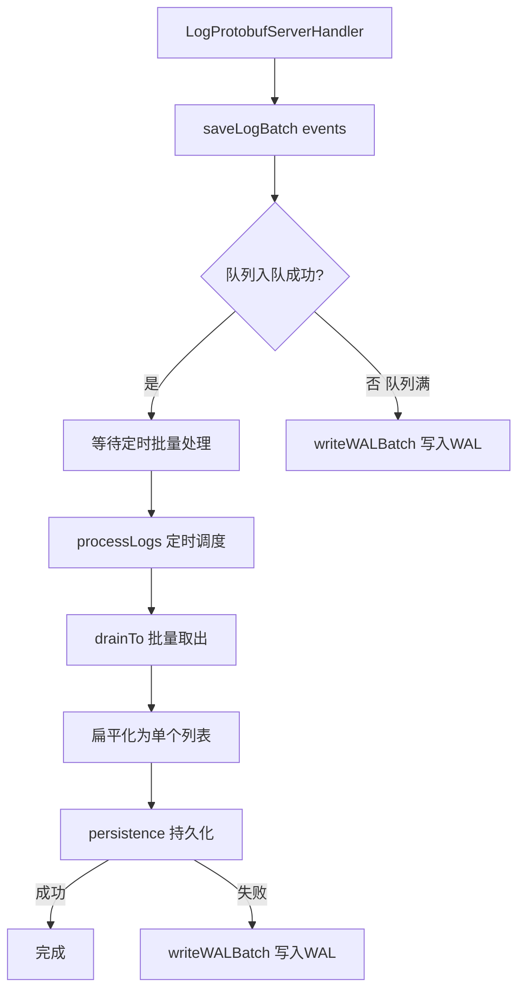
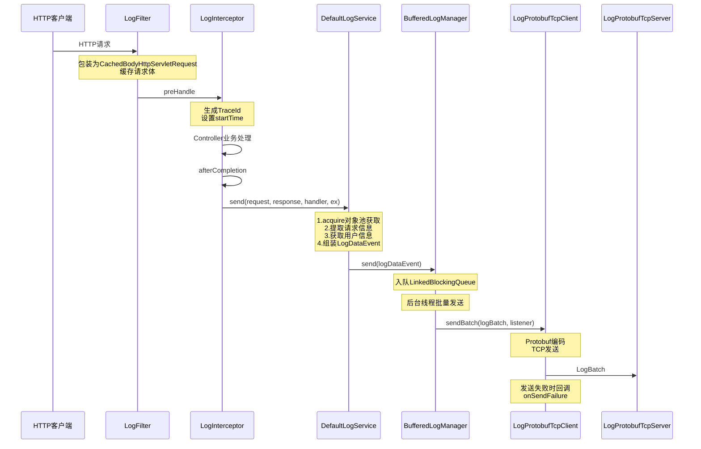
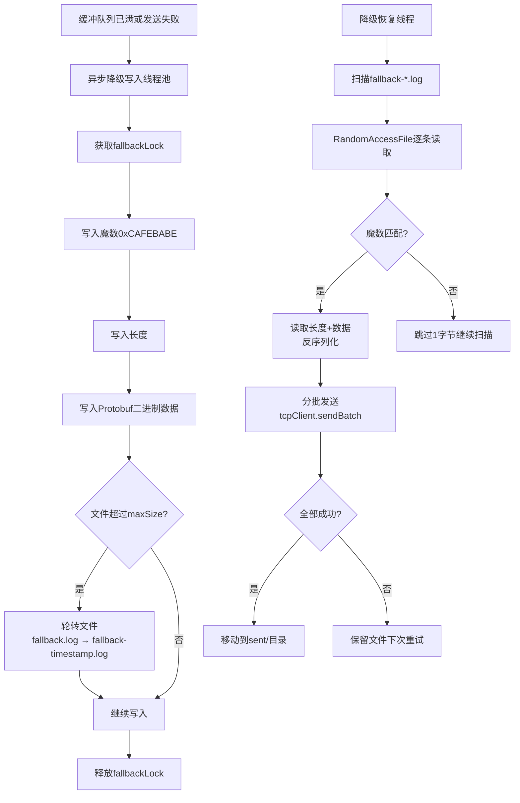
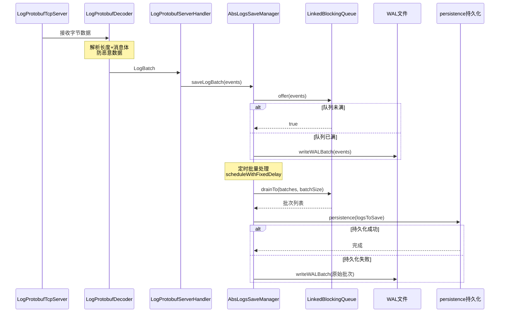
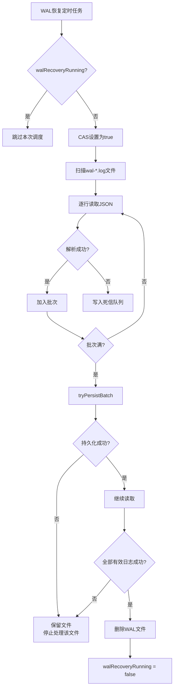

# simple-common-logs TCP+Protobuf 高性能日志收集模块

> @author qty
> 版本：1.0.1

## 1. 模块介绍

`simple-common-logs` 是 simple-common 框架的高性能日志收集模块，基于 **TCP + Protobuf** 协议实现操作日志的自动采集、批量传输和持久化存储。采用 **Fire-and-Forget**（发后即忘）模式，客户端不等待服务端响应，追求极致吞吐性能。

该模块由三个子模块组成：

| 子模块 | artifactId | 职责 |
|--------|-----------|------|
| `logs-proto` | `simple-common-logs-proto` | Protobuf 协议定义，日志数据结构与时间戳缓存 |
| `logs-client` | `simple-common-logs-client` | 客户端：自动拦截 Controller 请求、缓冲队列批量发送、失败降级本地文件、优雅停机 |
| `logs-server` | `simple-common-logs-server` | 服务端：Netty TCP 服务器接收日志、内存队列批量处理、WAL 预写日志兜底、死信队列 |

### 核心能力

- **自动拦截**：引入 `logs-client` 后自动通过 Filter + Interceptor 拦截所有 Controller 请求，无需手动编码
- **缓冲队列批量发送**：`LinkedBlockingQueue` 内存缓冲，后台线程按批次（定量/定时）通过 TCP 发送，减少网络和编解码开销
- **失败降级本地文件**：发送失败时自动写入本地降级文件（Protobuf 二进制 + 魔数校验），连接恢复后自动补发
- **魔数扫描恢复**：降级文件采用 `0xCAFEBABE` 魔数校验，损坏记录逐字节跳过恢复，最大化数据保全
- **优雅停机**：应用关闭时刷新缓冲区、等待发送完成、关闭连接，确保数据不丢
- **服务端 WAL 兜底**：内存队列满或持久化失败时写入 WAL 预写日志，定时扫描恢复重试
- **死信队列**：WAL 恢复时解析失败的日志写入死信队列，不阻塞正常恢复流程
- **时间戳缓存**：`TimeStampProvider` 每秒更新缓存时间戳，`DateTimeCache` 秒级 DateTime 缓存，避免高频日志场景重复创建对象
- **对象池复用**：`LogDataEvent.acquire()` 从对象池获取实例，发送后 `recycle()` 回收，减少 GC 压力

### 架构总览



## 2. Maven 依赖

### 2.1 客户端（业务服务引入）

```xml
<dependency>
    <groupId>com.simple.common</groupId>
    <artifactId>simple-common-logs-client</artifactId>
    <version>1.0.1</version>
</dependency>
```

客户端传递引入以下依赖：

- `simple-common-logs-proto`：Protobuf 协议定义（`LogDataEvent`、`LogBatch`、`TimeStampProvider`、`DateTimeCache`）
- `simple-common-core`：核心基础（`IPUtils`、`IdUtils`、`ThreadUtils`、`SerializeUtils`）
- `netty-all`：Netty 网络框架
- `protobuf-java` / `protobuf-java-util`：Protobuf 序列化

### 2.2 服务端（日志收集服务引入）

```xml
<dependency>
    <groupId>com.simple.common</groupId>
    <artifactId>simple-common-logs-server</artifactId>
    <version>1.0.1</version>
</dependency>
```

服务端传递引入以下依赖：

- `simple-common-logs-proto`：Protobuf 协议定义
- `simple-common-core`：核心基础（`ThreadUtils`、`JsonUtils`）
- `netty-all`：Netty 网络框架

### 2.3 仅协议定义（特殊场景）

```xml
<dependency>
    <groupId>com.simple.common</groupId>
    <artifactId>simple-common-logs-proto</artifactId>
    <version>1.0.1</version>
</dependency>
```

## 3. 核心功能

### 3.1 proto 子模块

| 类名 | 功能描述 | 关键特性 |
|------|---------|---------|
| [`logs.proto`](simple-common-logs/simple-common-logs-proto/src/main/proto/logs.proto:1) | Protobuf 协议定义文件 | 定义 `LogData`（15字段）和 `LogBatch`（批量容器）消息 |
| [`LogDataEvent`](simple-common-logs/simple-common-logs-proto/src/main/java/com/simple/common/logs/proto/common/event/LogDataEvent.java:1) | 日志数据事件 | Protobuf 生成类，含对象池（`acquire`/`recycle`）、批量转换（`toBatchProto`/`fromBatchProto`） |
| [`TimeStampProvider`](simple-common-logs/simple-common-logs-proto/src/main/java/com/simple/common/logs/proto/common/time/TimeStampProvider.java:24) | 时间戳提供器 | `@Component`，`AtomicLong` 缓存时间戳，每秒更新，避免高频调用 `System.currentTimeMillis()` |
| [`DateTimeCache`](simple-common-logs/simple-common-logs-proto/src/main/java/com/simple/common/logs/proto/common/time/DateTimeCache.java:18) | DateTime 秒级缓存 | `ConcurrentHashMap` 按秒缓存 DateTime，最大 300 秒，CAS 清理过期条目 |
| [`LogsProtoConfig`](simple-common-logs/simple-common-logs-proto/src/main/java/com/simple/common/logs/proto/common/config/LogsProtoConfig.java:11) | proto 模块配置 | `@ComponentScan(basePackages = "com.simple.common.logs.proto")` |

### 3.2 client 子模块

| 类名 | 功能描述 | 关键特性 |
|------|---------|---------|
| [`LogService`](simple-common-logs/simple-common-logs-client/src/main/java/com/simple/common/logs/client/common/service/LogService.java:41) | 日志服务接口 | `send`/`start`/`stop` 三个方法 |
| [`DefaultLogService`](simple-common-logs/simple-common-logs-client/src/main/java/com/simple/common/logs/client/service/DefaultLogService.java:38) | 日志服务默认实现 | 从 HTTP 请求提取信息、组装 `LogDataEvent`、通过 `BufferedLogManager` 异步发送 |
| [`LogManager`](simple-common-logs/simple-common-logs-client/src/main/java/com/simple/common/logs/client/common/manager/LogManager.java:22) | 日志发送管理器接口 | `send`/`start`/`stop` |
| [`BufferedLogManager`](simple-common-logs/simple-common-logs-client/src/main/java/com/simple/common/logs/client/manager/BufferedLogManager.java:49) | 缓冲日志管理器 | `LinkedBlockingQueue` 缓冲、批量发送、失败降级本地文件、魔数恢复、优雅停机 |
| [`LogUserManager`](simple-common-logs/simple-common-logs-client/src/main/java/com/simple/common/logs/client/common/manager/LogUserManager.java:13) | 日志用户信息接口 | `loginNickName()`/`loginUserId()`，需自行实现 |
| [`DefaultLogUserManager`](simple-common-logs/simple-common-logs-client/src/main/java/com/simple/common/logs/client/manager/DefaultLogUserManager.java:30) | 用户信息默认实现 | 返回测试值并打印 warn 日志，提示需实现 |
| [`LogProtobufTcpClient`](simple-common-logs/simple-common-logs-client/src/main/java/com/simple/common/logs/client/common/tcp/LogProtobufTcpClient.java:35) | TCP 日志客户端 | Netty NioSocketChannel、Fire-and-Forget、自动重连、发送失败回调 |
| [`LogFilter`](simple-common-logs/simple-common-logs-client/src/main/java/com/simple/common/logs/client/common/filter/LogFilter.java:26) | 日志过滤器 | 包装 `HttpServletRequest` 为 `CachedBodyHttpServletRequest`，最高优先级 |
| [`LogInterceptor`](simple-common-logs/simple-common-logs-client/src/main/java/com/simple/common/logs/client/common/interceptor/LogInterceptor.java:20) | 日志拦截器 | `preHandle` 设置 TraceId + 开始时间，`afterCompletion` 调用 `logService.send` |
| [`CachedBodyHttpServletRequest`](simple-common-logs/simple-common-logs-client/src/main/java/com/simple/common/logs/client/common/httpservletrequest/CachedBodyHttpServletRequest.java:32) | 请求体缓存包装器 | 支持 JSON/XML/text/form 类型请求体多次读取，限制缓存大小 |
| [`LogProtobufEncoder`](simple-common-logs/simple-common-logs-client/src/main/java/com/simple/common/logs/client/common/tcp/LogProtobufEncoder.java:15) | Protobuf 编码器 | `MessageToByteEncoder<LogBatch>`，写入 `[长度(4字节)] + [消息体]` |
| [`LogProtobufClientHandler`](simple-common-logs/simple-common-logs-client/src/main/java/com/simple/common/logs/client/common/tcp/LogProtobufClientHandler.java:19) | 客户端业务处理器 | Fire-and-Forget 模式，忽略所有入站数据，仅处理异常和心跳 |
| [`LogTcpClientProperties`](simple-common-logs/simple-common-logs-client/src/main/java/com/simple/common/logs/client/common/properties/LogTcpClientProperties.java:27) | 客户端配置属性 | `simple.logs.client` 前缀，含连接/缓冲/降级等配置 |
| [`LogClientConfig`](simple-common-logs/simple-common-logs-client/src/main/java/com/simple/common/logs/client/common/config/LogClientConfig.java:17) | 客户端配置类 | 注册 `LogFilter`，`@ComponentScan` |
| [`LogClientMvcConfig`](simple-common-logs/simple-common-logs-client/src/main/java/com/simple/common/logs/client/common/config/LogClientMvcConfig.java:16) | MVC 拦截器配置 | 注册 `LogInterceptor`，order=4 |
| [`LogConstant`](simple-common-logs/simple-common-logs-client/src/main/java/com/simple/common/logs/client/common/constant/LogConstant.java:8) | 日志常量 | `TRACE_ID_HEADER`="X-Trace-Id"、`START_TIME`="startTime" |

### 3.3 server 子模块

| 类名 | 功能描述 | 关键特性 |
|------|---------|---------|
| [`LogProtobufTcpServer`](simple-common-logs/simple-common-logs-server/src/main/java/com/simple/common/logs/server/common/tcp/LogProtobufTcpServer.java:32) | TCP 日志服务端 | Netty ServerBootstrap、自动重绑、Fire-and-Forget |
| [`LogProtobufDecoder`](simple-common-logs/simple-common-logs-server/src/main/java/com/simple/common/logs/server/common/tcp/LogProtobufDecoder.java:19) | Protobuf 解码器 | `ByteToMessageDecoder`，解析 `[长度(4字节)] + [消息体]`，防恶意数据（max 10MB） |
| [`LogProtobufServerHandler`](simple-common-logs/simple-common-logs-server/src/main/java/com/simple/common/logs/server/common/tcp/LogProtobufServerHandler.java:22) | 服务端业务处理器 | `SimpleChannelInboundHandler<LogBatch>`，转交 `LogsSaveManager` 处理 |
| [`LogsSaveManager`](simple-common-logs/simple-common-logs-server/src/main/java/com/simple/common/logs/server/common/manager/LogsSaveManager.java:17) | 日志保存管理器接口 | `saveLog`/`saveLogBatch`/`processLogs`/`getQueueSize` |
| [`AbsLogsSaveManager`](simple-common-logs/simple-common-logs-server/src/main/java/com/simple/common/logs/server/manager/AbsLogsSaveManager.java:45) | 抽象日志保存管理器 | 内存队列 + 批量处理 + WAL 兜底 + 死信队列 + 优雅停机 |
| [`LogTcpServerProperties`](simple-common-logs/simple-common-logs-server/src/main/java/com/simple/common/logs/server/common/properties/LogTcpServerProperties.java:28) | 服务端配置属性 | `simple.logs.server` 前缀，含线程/队列/WAL/死信配置 |
| [`LogServerConfig`](simple-common-logs/simple-common-logs-server/src/main/java/com/simple/common/logs/server/common/config/LogServerConfig.java:11) | 服务端配置类 | `@ComponentScan(basePackages = "com.simple.common.logs.server")` |

## 4. 配置说明

### 4.1 客户端配置（`simple.logs.client`）

配置类：[`LogTcpClientProperties`](simple-common-logs/simple-common-logs-client/src/main/java/com/simple/common/logs/client/common/properties/LogTcpClientProperties.java:27)

#### 连接配置

| 属性 | 配置键 | 类型 | 默认值 | 说明 |
|------|--------|------|--------|------|
| `host` | `simple.logs.client.host` | `String` | `127.0.0.1` | 日志服务端主机地址 |
| `port` | `simple.logs.client.port` | `int` | `9999` | 日志服务端端口（1024-65535） |
| `connectTimeout` | `simple.logs.client.connect-timeout` | `int` | `5000` | 连接超时时间（毫秒） |
| `reconnectInterval` | `simple.logs.client.reconnect-interval` | `int` | `5000` | 重连间隔时间（毫秒） |
| `maxReconnectAttempts` | `simple.logs.client.max-reconnect-attempts` | `int` | `-1` | 最大重连次数，-1表示无限重连 |
| `workerThreads` | `simple.logs.client.worker-threads` | `int` | `max(2, CPU核心数)` | Netty EventLoopGroup 线程数 |

#### 缓冲与批量配置

| 属性 | 配置键 | 类型 | 默认值 | 说明 |
|------|--------|------|--------|------|
| `bufferCapacity` | `simple.logs.client.buffer-capacity` | `int` | `10000` | 缓冲队列容量（100-100000） |
| `batchSize` | `simple.logs.client.batch-size` | `int` | `100` | 批量发送大小（10-10000） |
| `batchFlushInterval` | `simple.logs.client.batch-flush-interval` | `int` | `500` | 批量发送最大等待时间（毫秒，50-5000） |

#### 降级配置

| 属性 | 配置键 | 类型 | 默认值 | 说明 |
|------|--------|------|--------|------|
| `fallbackEnabled` | `simple.logs.client.fallback-enabled` | `boolean` | `true` | 是否启用本地文件降级存储 |
| `fallbackDir` | `simple.logs.client.fallback-dir` | `String` | `./logs_fallback` | 降级存储目录 |
| `fallbackFileMaxSize` | `simple.logs.client.fallback-file-max-size` | `long` | `10485760`（10MB） | 降级文件最大大小（字节），超过则轮转 |
| `fallbackResendEnabled` | `simple.logs.client.fallback-resend-enabled` | `boolean` | `true` | 恢复后是否自动重发降级日志 |
| `fallbackResendMaxFilesPerRound` | `simple.logs.client.fallback-resend-max-files-per-round` | `int` | `5` | 每次扫描最多处理文件数，-1不限制 |
| `fallbackFileRetentionDays` | `simple.logs.client.fallback-file-retention-days` | `int` | `7` | 降级文件保留天数，-1永不过期 |

#### 请求体缓存配置

| 属性 | 配置键 | 类型 | 默认值 | 说明 |
|------|--------|------|--------|------|
| `maxBodyCacheSize` | `simple.logs.client.max-body-cache-size` | `long` | `1048576`（1MB） | 请求体缓存最大大小（字节），超过不缓存 |

**配置示例**：

```yaml
simple:
  logs:
    client:
      host: 192.168.1.100                  # 日志服务端主机地址 [必填]，默认 127.0.0.1
      port: 9999                            # 日志服务端端口，默认 9999（1024-65535）
      connect-timeout: 5000                 # 连接超时时间（毫秒），默认 5000
      reconnect-interval: 5000              # 重连间隔时间（毫秒），默认 5000
      max-reconnect-attempts: -1            # 最大重连次数，默认 -1 表示无限重连
      worker-threads: 4                     # Netty EventLoopGroup 线程数，默认 max(2, CPU核心数)
      buffer-capacity: 20000                # 缓冲队列容量，默认 10000（100-100000）
      batch-size: 200                       # 批量发送大小，默认 100（10-10000）
      batch-flush-interval: 500             # 批量发送最大等待时间（毫秒），默认 500（50-5000）
      fallback-enabled: true                # 是否启用本地文件降级存储，默认 true
      fallback-dir: ./logs_fallback         # 降级存储目录，默认 ./logs_fallback
      fallback-file-max-size: 10485760      # 降级文件最大大小（字节），默认 10MB，超过则轮转
      fallback-resend-enabled: true         # 恢复后是否自动重发降级日志，默认 true
      fallback-resend-max-files-per-round: 5 # 每次扫描最多处理文件数，默认 5，-1不限制
      fallback-file-retention-days: 7       # 降级文件保留天数，默认 7，-1永不过期
      max-body-cache-size: 1048576          # 请求体缓存最大大小（字节），默认 1MB，超过不缓存
```

### 4.2 服务端配置（`simple.logs.server`）

配置类：[`LogTcpServerProperties`](simple-common-logs/simple-common-logs-server/src/main/java/com/simple/common/logs/server/common/properties/LogTcpServerProperties.java:28)

#### TCP 服务配置

| 属性 | 配置键 | 类型 | 默认值 | 说明 |
|------|--------|------|--------|------|
| `port` | `simple.logs.server.port` | `int` | `9999` | 服务端监听端口（1024-65535） |
| `bossThreads` | `simple.logs.server.boss-threads` | `int` | `1` | Boss线程数（处理连接接入） |
| `workerThreads` | `simple.logs.server.worker-threads` | `int` | `CPU核心数×2` | Worker线程数（处理IO读写） |
| `connectTimeout` | `simple.logs.server.connect-timeout` | `int` | `30000` | 连接超时时间（毫秒） |
| `maxConnections` | `simple.logs.server.max-connections` | `int` | `1000` | 最大连接数 |
| `readerIdleTime` | `simple.logs.server.reader-idle-time` | `int` | `10` | 读空闲超时时间（秒） |

#### 队列与批量配置

| 属性 | 配置键 | 类型 | 默认值 | 说明 |
|------|--------|------|--------|------|
| `batchInterval` | `simple.logs.server.batch-interval` | `int` | `1000` | 日志批量处理间隔（毫秒） |
| `batchSize` | `simple.logs.server.batch-size` | `int` | `1000` | 日志批量处理大小 |
| `queueCapacity` | `simple.logs.server.queue-capacity` | `int` | `50000` | 内存队列容量（1000-500000） |

#### WAL 预写日志配置

| 属性 | 配置键 | 类型 | 默认值 | 说明 |
|------|--------|------|--------|------|
| `walEnabled` | `simple.logs.server.wal-enabled` | `boolean` | `true` | 是否启用 WAL 预写日志 |
| `walDir` | `simple.logs.server.wal-dir` | `String` | `./logs_wal` | WAL 存储目录 |
| `walFileMaxSize` | `simple.logs.server.wal-file-max-size` | `long` | `52428800`（50MB） | WAL 文件最大大小（字节） |
| `walRecoveryEnabled` | `simple.logs.server.wal-recovery-enabled` | `boolean` | `true` | 是否启用 WAL 自动恢复 |
| `walRecoveryInterval` | `simple.logs.server.wal-recovery-interval` | `int` | `60000` | WAL 恢复扫描间隔（毫秒） |

#### 死信队列配置

| 属性 | 配置键 | 类型 | 默认值 | 说明 |
|------|--------|------|--------|------|
| `deadLetterEnabled` | `simple.logs.server.dead-letter-enabled` | `boolean` | `true` | 是否启用死信队列 |
| `deadLetterDir` | `simple.logs.server.dead-letter-dir` | `String` | `./logs_deadletter` | 死信队列存储目录 |

**配置示例**：

```yaml
simple:
  logs:
    server:
      port: 9999                            # 服务端监听端口 [必填]，默认 9999（1024-65535）
      boss-threads: 1                       # Boss线程数（处理连接接入），默认 1
      worker-threads: 8                     # Worker线程数（处理IO读写），默认 CPU核心数×2
      connect-timeout: 30000                # 连接超时时间（毫秒），默认 30000
      max-connections: 1000                 # 最大连接数，默认 1000
      reader-idle-time: 10                  # 读空闲超时时间（秒），默认 10
      batch-interval: 1000                  # 日志批量处理间隔（毫秒），默认 1000
      batch-size: 1000                      # 日志批量处理大小，默认 1000
      queue-capacity: 50000                 # 内存队列容量，默认 50000（1000-500000）
      wal-enabled: true                     # 是否启用 WAL 预写日志，默认 true
      wal-dir: ./logs_wal                   # WAL 存储目录，默认 ./logs_wal
      wal-file-max-size: 52428800           # WAL 文件最大大小（字节），默认 50MB，超过则轮转
      wal-recovery-enabled: true            # 是否启用 WAL 自动恢复，默认 true
      wal-recovery-interval: 60000          # WAL 恢复扫描间隔（毫秒），默认 60000
      dead-letter-enabled: true             # 是否启用死信队列，默认 true
      dead-letter-dir: ./logs_deadletter    # 死信队列存储目录，默认 ./logs_deadletter
```

### 4.3 自动配置

三个子模块均通过 `META-INF/spring/org.springframework.boot.autoconfigure.AutoConfiguration.imports` 自动注册配置类：

| 子模块 | 配置类 | 扫描包 |
|--------|--------|--------|
| `logs-proto` | [`LogsProtoConfig`](simple-common-logs/simple-common-logs-proto/src/main/java/com/simple/common/logs/proto/common/config/LogsProtoConfig.java:11) | `com.simple.common.logs.proto` |
| `logs-client` | [`LogClientConfig`](simple-common-logs/simple-common-logs-client/src/main/java/com/simple/common/logs/client/common/config/LogClientConfig.java:17) | `com.simple.common.logs.client` |
| `logs-server` | [`LogServerConfig`](simple-common-logs/simple-common-logs-server/src/main/java/com/simple/common/logs/server/common/config/LogServerConfig.java:11) | `com.simple.common.logs.server` |

## 5. 核心接口与类详细说明

### 5.1 Protobuf 协议定义（logs.proto）

**文件路径**：[`simple-common-logs-proto/src/main/proto/logs.proto`](simple-common-logs/simple-common-logs-proto/src/main/proto/logs.proto:1)

#### LogData 消息（单条日志）

| 字段序号 | 字段名 | Protobuf类型 | Java类型 | 说明 |
|---------|--------|-------------|---------|------|
| 1 | `traceId` | `string` | `String` | 追踪ID |
| 2 | `title` | `string` | `String` | 方法名称/操作标题（取自 `@Operation.summary`） |
| 3 | `method` | `string` | `String` | 请求方式（GET/POST等） |
| 4 | `operUrl` | `string` | `String` | 请求URL |
| 5 | `operIp` | `string` | `String` | 主机地址（客户端IP） |
| 6 | `operLocation` | `string` | `String` | 操作地点 |
| 7 | `userId` | `string` | `String` | 操作人员ID |
| 8 | `nickname` | `string` | `String` | 用户名/昵称 |
| 9 | `operName` | `string` | `String` | 操作名称 |
| 10 | `operParam` | `string` | `String` | 请求参数（JSON） |
| 11 | `status` | `int32` | `int` | 操作状态（200=成功，500=失败） |
| 12 | `errorMsg` | `string` | `String` | 错误消息 |
| 13 | `errorData` | `string` | `String` | 异常堆栈信息 |
| 14 | `requestTime` | `int64` | `long` | 接口耗时（毫秒） |
| 15 | `createTime` | `int64` | `long` | 创建时间（毫秒时间戳） |

#### LogBatch 消息（批量容器）

```protobuf
message LogBatch {
  repeated LogData logs = 1;
}
```

> **Fire-and-Forget 设计**：协议已移除响应消息，客户端不等待也不处理服务端响应，减少网络往返开销和编解码消耗。

### 5.2 LogDataEvent 日志数据事件

**类路径**：`com.simple.common.logs.proto.common.event.LogDataEvent`（Protobuf 生成类）

该类由 `protobuf-maven-plugin` 从 `logs.proto` 自动生成，除标准 Protobuf 方法外，还提供以下增强方法：

| 方法签名 | 返回值 | 说明 |
|---------|--------|------|
| `acquire()` | `LogDataEvent` | 从对象池获取实例，避免频繁创建对象 |
| `recycle()` | `void` | 回收对象到对象池 |
| `toBatchProto(List<LogDataEvent>)` | `LogBatch` | 将日志列表转换为 Protobuf 批量消息 |
| `fromBatchProto(LogBatch)` | `List<LogDataEvent>` | 将 Protobuf 批量消息转换为日志列表 |

### 5.3 TimeStampProvider 时间戳提供器

**类路径**：[`com.simple.common.logs.proto.common.time.TimeStampProvider`](simple-common-logs/simple-common-logs-proto/src/main/java/com/simple/common/logs/proto/common/time/TimeStampProvider.java:24)

| 方法签名 | 返回值 | 说明 |
|---------|--------|------|
| `getCurrentTimestamp()` | `long` | 获取当前缓存的时间戳（毫秒，秒级精度） |
| `start()` | `void` | 启动后台定时任务（`@PostConstruct` 自动调用） |
| `stop()` | `void` | 停止定时任务（`@PreDestroy` 自动调用） |

**工作机制**：

- `AtomicLong currentTimestamp` 缓存当前时间戳
- `ThreadUtils.scheduleWithFixedDelayFuture` 每秒更新一次
- 日志记录时调用 `getCurrentTimestamp()` 获取缓存值，避免每条日志都调用 `System.currentTimeMillis()`

### 5.4 DateTimeCache DateTime 秒级缓存

**类路径**：[`com.simple.common.logs.proto.common.time.DateTimeCache`](simple-common-logs/simple-common-logs-proto/src/main/java/com/simple/common/logs/proto/common/time/DateTimeCache.java:18)

| 方法签名 | 返回值 | 说明 |
|---------|--------|------|
| `get(long timestampMs)` | `DateTime` | 根据毫秒时间戳获取缓存的 DateTime 对象 |

**工作机制**：

- `ConcurrentHashMap<Long, DateTime>` 按秒级时间戳缓存
- 同一秒内的日志共享同一个 DateTime 实例
- 最大缓存 300 秒，超过自动清理
- `AtomicLong lastCleanupTime` + CAS 确保每秒最多清理一次

### 5.5 LogService 日志服务接口

**类路径**：[`com.simple.common.logs.client.common.service.LogService`](simple-common-logs/simple-common-logs-client/src/main/java/com/simple/common/logs/client/common/service/LogService.java:41)

| 方法签名 | 返回值 | 说明 |
|---------|--------|------|
| `send(HttpServletRequest, HttpServletResponse, Object handler, Exception ex)` | `void` | 发送日志数据到日志服务器 |
| `start()` | `void` | 启动日志客户端 |
| `stop()` | `void` | 停止日志客户端 |

**默认实现**：[`DefaultLogService`](simple-common-logs/simple-common-logs-client/src/main/java/com/simple/common/logs/client/service/DefaultLogService.java:38)

`send` 方法内部流程：

1. `LogDataEvent.acquire()` 从对象池获取实例
2. 从请求属性获取 `startTime`，计算接口耗时
3. 从请求属性获取 `traceId`（由 `LogInterceptor.preHandle` 设置）
4. 调用 `getAllParameters(request)` 获取请求参数（支持 JSON/XML/text/form 多种 Content-Type）
5. 设置 method、operUrl、operIp（通过 `IPUtils.getIpAddr`）
6. 通过 `LogUserManager` 获取用户 ID 和昵称
7. 从 `HandlerMethod` 获取 `@Operation.summary` 作为操作标题
8. 根据 `response.getStatus()` 设置状态码和错误信息
9. 使用 `TimeStampProvider.getCurrentTimestamp()` 设置创建时间
10. 调用 `bufferedLogManager.send(logDataEvent)` 异步入队
11. 异常情况下 `logDataEvent.recycle()` 回收对象

### 5.6 LogManager 日志发送管理器接口

**类路径**：[`com.simple.common.logs.client.common.manager.LogManager`](simple-common-logs/simple-common-logs-client/src/main/java/com/simple/common/logs/client/common/manager/LogManager.java:22)

| 方法签名 | 返回值 | 说明 |
|---------|--------|------|
| `send(LogDataEvent logData)` | `boolean` | 将日志加入发送队列，true=入队成功，false=队列满 |
| `start()` | `void` | 启动日志发送器 |
| `stop()` | `void` | 停止日志发送器，刷新缓冲区 |

### 5.7 BufferedLogManager 缓冲日志管理器

**类路径**：[`com.simple.common.logs.client.manager.BufferedLogManager`](simple-common-logs/simple-common-logs-client/src/main/java/com/simple/common/logs/client/manager/BufferedLogManager.java:49)

实现 `LogManager` 接口和 `LogProtobufTcpClient.SendFailureListener` 接口。

#### 核心数据结构

| 字段 | 类型 | 说明 |
|------|------|------|
| `bufferQueue` | `LinkedBlockingQueue<LogDataEvent>` | 内存缓冲队列，容量由 `bufferCapacity` 配置 |
| `fallbackExecutor` | `ExecutorService` | 异步降级写入线程池（单线程守护线程，保证顺序） |
| `fallbackOutputStream` | `volatile DataOutputStream` | 降级文件输出流（二进制流） |
| `fallbackLock` | `ReentrantLock` | 降级文件写入锁 |
| `FALLBACK_MAGIC` | `int` (`0xCAFEBABE`) | 降级文件记录魔数 |

#### 缓冲队列批量发送机制



#### 降级文件格式

每条降级记录格式：`4字节魔数(0xCAFEBABE) + 4字节长度 + Protobuf二进制数据`

#### 降级恢复机制

- **降级恢复线程**：`fallbackResendThread`（守护线程），定时扫描降级目录
- **文件轮转**：降级文件超过 `fallbackFileMaxSize` 时轮转为 `fallback-{timestamp}.log`
- **魔数扫描恢复**：使用 `RandomAccessFile` 逐条读取，魔数不匹配时逐字节跳过继续寻找下一个魔数
- **成功后移动**：恢复发送完成的文件移动至 `sent/` 子目录
- **限流控制**：每轮最多处理 `fallbackResendMaxFilesPerRound` 个文件
- **保留期清理**：超过 `fallbackFileRetentionDays` 天的未发送文件直接删除

#### 优雅停机

`stop()` 方法执行以下步骤：

1. `running.set(false)` 停止后台线程
2. 刷新缓冲区剩余日志（等待最多 5 秒）
3. 等待降级恢复线程结束（`join(5000)`）
4. 关闭异步降级线程池（`awaitTermination(5, SECONDS)`）
5. 关闭降级文件输出流

### 5.8 LogUserManager 日志用户信息接口

**类路径**：[`com.simple.common.logs.client.common.manager.LogUserManager`](simple-common-logs/simple-common-logs-client/src/main/java/com/simple/common/logs/client/common/manager/LogUserManager.java:13)

| 方法签名 | 返回值 | 说明 |
|---------|--------|------|
| `loginNickName()` | `String` | 获取当前操作用户昵称 |
| `loginUserId()` | `String` | 获取当前操作用户ID |

**默认实现**：[`DefaultLogUserManager`](simple-common-logs/simple-common-logs-client/src/main/java/com/simple/common/logs/client/manager/DefaultLogUserManager.java:30) 返回测试值并打印 warn 日志。

> **重要**：生产环境必须继承 `DefaultLogUserManager` 并重写方法，从登录上下文获取真实用户信息。

### 5.9 LogProtobufTcpClient TCP 日志客户端

**类路径**：[`com.simple.common.logs.client.common.tcp.LogProtobufTcpClient`](simple-common-logs/simple-common-logs-client/src/main/java/com/simple/common/logs/client/common/tcp/LogProtobufTcpClient.java:35)

| 方法签名 | 返回值 | 说明 |
|---------|--------|------|
| `sendBatch(LogBatch logBatch, SendFailureListener listener)` | `boolean` | 发送批量日志，支持失败回调 |
| `sendBatch(LogBatch logBatch)` | `boolean` | 发送批量日志（已废弃，建议使用带回调方法） |
| `isActive()` | `boolean` | 判断连接是否活跃 |
| `start()` | `void` | 启动客户端（`@PostConstruct` 自动调用） |
| `shutdown()` | `void` | 关闭客户端（`@PreDestroy` 自动调用） |

**SendFailureListener 接口**：

```java
@FunctionalInterface
public interface SendFailureListener {
    void onSendFailure(LogBatch batch);
}
```

**Netty Pipeline 配置**：

| 处理器 | 类型 | 说明 |
|--------|------|------|
| `IdleStateHandler` | 心跳检测 | 30秒写空闲检测 |
| `LogProtobufEncoder` | 编码器 | `LogBatch` → `[长度(4字节)] + [字节数组]` |
| `LogProtobufClientHandler` | 业务处理器 | Fire-and-Forget，忽略所有入站数据 |

**自动重连机制**：

- 连接断开时自动触发 `scheduleReconnect()`
- `reconnecting` AtomicBoolean 防止重复调度
- `reconnectAttempts` 计数，达到 `maxReconnectAttempts` 停止（-1 为无限）
- 写缓冲区高低水位（64KB/32KB）防止 OOM

### 5.10 LogFilter 与 LogInterceptor

#### LogFilter 请求体缓存过滤器

**类路径**：[`LogFilter`](simple-common-logs/simple-common-logs-client/src/main/java/com/simple/common/logs/client/common/filter/LogFilter.java:26)

- `@Order(Ordered.HIGHEST_PRECEDENCE + 10)` 最高优先级 + 10
- 拦截所有 URL（`/**`）
- 将 `HttpServletRequest` 包装为 `CachedBodyHttpServletRequest`
- 支持缓存的 Content-Type：`application/json`、`application/xml`、`text/xml`、`text/plain`、`application/x-www-form-urlencoded`
- 超过 `maxBodyCacheSize` 的请求体不缓存

#### LogInterceptor 日志拦截器

**类路径**：[`LogInterceptor`](simple-common-logs/simple-common-logs-client/src/main/java/com/simple/common/logs/client/common/interceptor/LogInterceptor.java:20)

- `order(4)` 拦截器顺序
- `preHandle`：OPTIONS 预检请求跳过；生成或沿用 `X-Trace-Id` 请求头；设置 `startTime` 到请求属性；TraceId 写入响应头
- `afterCompletion`：非 OPTIONS 请求调用 `logService.send(request, response, handler, ex)`

### 5.11 LogProtobufTcpServer TCP 日志服务端

**类路径**：[`LogProtobufTcpServer`](simple-common-logs/simple-common-logs-server/src/main/java/com/simple/common/logs/server/common/tcp/LogProtobufTcpServer.java:32)

| 方法签名 | 返回值 | 说明 |
|---------|--------|------|
| `start()` | `void` | 启动服务端（`@PostConstruct` 自动调用） |
| `shutdown()` | `void` | 关闭服务端（`@PreDestroy` 自动调用） |

**Netty Pipeline 配置**：

| 处理器 | 类型 | 说明 |
|--------|------|------|
| `IdleStateHandler` | 心跳检测 | `readerIdleTime` 秒读空闲超时 |
| `LogProtobufDecoder` | 解码器 | `[长度(4字节)] + [消息体]` → `LogBatch`，防恶意数据（max 10MB） |
| `LogProtobufServerHandler` | 业务处理器 | 转交 `LogsSaveManager.saveLogBatch` |

**异常恢复能力**：

- 绑定失败：延迟 10 秒后重试 `doBind()`
- 通道关闭：延迟 5 秒后重新绑定
- `running` AtomicBoolean 控制是否继续重试

### 5.12 LogProtobufDecoder 解码器

**类路径**：[`LogProtobufDecoder`](simple-common-logs/simple-common-logs-server/src/main/java/com/simple/common/logs/server/common/tcp/LogProtobufDecoder.java:19)

解码格式：`[长度(4字节)] + [消息体]`

**安全防护**：

- 可读字节不足 4 时等待更多数据
- 消息长度 ≤ 0 或 > 10MB 时关闭连接（防恶意数据）
- 可读字节不足消息长度时重置读取位置等待更多数据

### 5.13 LogsSaveManager 日志保存管理器接口

**类路径**：[`LogsSaveManager`](simple-common-logs/simple-common-logs-server/src/main/java/com/simple/common/logs/server/common/manager/LogsSaveManager.java:17)

| 方法签名 | 返回值 | 说明 |
|---------|--------|------|
| `saveLog(LogDataEvent)` | `void` | 保存单条日志（内部包装为批次） |
| `saveLogBatch(List<LogDataEvent>)` | `void` | 批量保存日志（优先使用） |
| `processLogs()` | `void` | 处理队列中的日志 |
| `getQueueSize()` | `int` | 获取队列大小 |

### 5.14 AbsLogsSaveManager 抽象日志保存管理器

**类路径**：[`AbsLogsSaveManager`](simple-common-logs/simple-common-logs-server/src/main/java/com/simple/common/logs/server/manager/AbsLogsSaveManager.java:45)

实现 `LogsSaveManager`、`InitializingBean`、`DisposableBean`。

#### 需实现的方法

| 方法签名 | 返回值 | 说明 |
|---------|--------|------|
| `getProperties()` | `LogTcpServerProperties` | 返回服务端配置 |
| `persistence(List<LogDataEvent>)` | `void` | **抽象方法**，子类实现具体持久化逻辑（如写入 ES、数据库等） |

> **幂等性要求**：由于 WAL 恢复机制可能重放已成功持久化的日志，`persistence` 方法**必须保证幂等性**。

#### 核心数据结构

| 字段 | 类型 | 说明 |
|------|------|------|
| `logQueue` | `volatile LinkedBlockingQueue<List<LogDataEvent>>` | 日志队列，元素为批次列表（延迟初始化，双重检查锁） |
| `walWriter` | `BufferedWriter` | WAL 文件写入器 |
| `walLock` | `ReentrantLock` | WAL 写入锁 |
| `walRecoveryRunning` | `AtomicBoolean` | WAL 恢复任务并发控制 |

#### 内存队列 + 批量处理



#### WAL 预写日志机制

- **触发时机**：内存队列满或 `persistence` 持久化失败时
- **写入格式**：JSON 逐行写入（`JSONUtil.toJsonStr(event)`）
- **批量 flush**：累积 100 条或超过 1 秒时统一 flush
- **文件轮转**：超过 `walFileMaxSize` 时轮转为 `wal-{timestamp}.log`
- **自动恢复**：定时扫描 `wal-*.log` 文件，逐行解析并重试持久化
- **恢复成功**：文件内所有有效日志成功持久化后删除文件
- **部分失败**：保留文件，下次恢复重试（依赖幂等性）

#### 死信队列

- **触发时机**：WAL 恢复时 JSON 解析失败的行
- **存储格式**：`deadletter-{yyyyMMdd}.log`，每行包含时间戳、来源文件、行号、原始数据
- **不阻塞恢复**：解析失败的行移入死信队列后继续处理后续行

#### 优雅停机

`destroy()` 方法执行以下步骤：

1. `running.set(false)` 停止后台任务
2. 取消定时任务（`processLogsFuture`、`walRecoveryFuture`）
3. 处理队列剩余日志（最多 5 秒窗口）
4. 关闭 WAL 写入器（强制 flush）

## 6. 日志收集完整生命周期

### 6.1 客户端日志采集与发送



### 6.2 客户端降级与恢复



### 6.3 服务端接收与持久化



### 6.4 服务端 WAL 恢复



## 7. 使用示例

### 7.1 客户端使用（业务服务）

**步骤一：添加 Maven 依赖**

```xml
<dependency>
    <groupId>com.simple.common</groupId>
    <artifactId>simple-common-logs-client</artifactId>
    <version>1.0.1</version>
</dependency>
```

**步骤二：配置 application.yaml**

```yaml
simple:
  logs:
    client:
      host: 192.168.1.100    # 日志服务端地址
      port: 9999             # 日志服务端端口
      buffer-capacity: 10000 # 缓冲队列容量
      batch-size: 100        # 批量发送大小
      fallback-enabled: true # 启用降级
```

**步骤三：实现 LogUserManager（必须）**

```java
import com.simple.common.logs.client.manager.DefaultLogUserManager;
import com.simple.common.auth.client.util.LoginUserUtils;
import org.springframework.stereotype.Component;

/**
 * 日志用户信息管理器实现
 *
 * @author qty
 */
@Component
public class CustomLogUserManager extends DefaultLogUserManager {

    @Override
    public String loginNickName() {
        // 从登录上下文获取用户昵称
        var user = LoginUserUtils.getUserTemporary();
        return user != null ? user.getNickname() : "anonymous";
    }

    @Override
    public String loginUserId() {
        // 从登录上下文获取用户ID
        var user = LoginUserUtils.getUserTemporary();
        return user != null ? user.getUserId() : "unknown";
    }
}
```

> 完成以上三步后，框架自动拦截所有 Controller 请求并记录操作日志，无需任何手动编码。

### 7.2 服务端使用（日志收集服务）

**步骤一：添加 Maven 依赖**

```xml
<dependency>
    <groupId>com.simple.common</groupId>
    <artifactId>simple-common-logs-server</artifactId>
    <version>1.0.1</version>
</dependency>
```

**步骤二：配置 application.yaml**

```yaml
simple:
  logs:
    server:
      port: 9999              # 监听端口
      boss-threads: 1         # Boss线程数
      worker-threads: 8       # Worker线程数
      batch-interval: 1000    # 批量处理间隔
      batch-size: 1000        # 批量处理大小
      queue-capacity: 50000   # 内存队列容量
      wal-enabled: true       # 启用WAL
      wal-dir: ./logs_wal     # WAL目录
```

**步骤三：实现 AbsLogsSaveManager（必须）**

```java
import com.simple.common.logs.proto.common.event.LogDataEvent;
import com.simple.common.logs.server.common.properties.LogTcpServerProperties;
import com.simple.common.logs.server.manager.AbsLogsSaveManager;
import org.springframework.stereotype.Component;

import java.util.List;

/**
 * 日志持久化管理器实现
 * <p>
 * 将日志写入 Elasticsearch 或数据库等存储
 * </p>
 *
 * @author qty
 */
@Component
public class EsLogsSaveManager extends AbsLogsSaveManager {

    @Autowired
    private LogTcpServerProperties properties;

    @Autowired
    private LogRepository logRepository;

    @Override
    protected LogTcpServerProperties getProperties() {
        return properties;
    }

    /**
     * 持久化日志到存储
     * <p>
     * 注意：此方法必须保证幂等性，WAL恢复机制可能重复调用
     * </p>
     *
     * @param logsToSave 待持久化的日志事件列表
     */
    @Override
    protected void persistence(List<LogDataEvent> logsToSave) {
        // 转换为实体并批量保存
        List<LogEntity> entities = logsToSave.stream()
                .map(this::convertToEntity)
                .toList();
        logRepository.saveBatch(entities);
    }

    private LogEntity convertToEntity(LogDataEvent event) {
        LogEntity entity = new LogEntity();
        entity.setTraceId(event.getTraceId());
        entity.setTitle(event.getTitle());
        entity.setMethod(event.getMethod());
        entity.setOperUrl(event.getOperUrl());
        entity.setOperIp(event.getOperIp());
        entity.setUserId(event.getUserId());
        entity.setNickname(event.getNickname());
        entity.setOperParam(event.getOperParam());
        entity.setStatus(event.getStatus());
        entity.setErrorMsg(event.getErrorMsg());
        entity.setErrorData(event.getErrorData());
        entity.setRequestTime(event.getRequestTime());
        entity.setCreateTime(new Date(event.getCreateTime()));
        return entity;
    }
}
```

### 7.3 手动发送日志（非自动拦截场景）

```java
import com.simple.common.logs.client.common.manager.LogManager;
import com.simple.common.logs.proto.common.event.LogDataEvent;
import org.springframework.beans.factory.annotation.Autowired;

/**
 * 手动发送日志示例
 *
 * @author qty
 */
public class ManualLogExample {

    @Autowired
    private LogManager logManager;

    public void doSomething() {
        // 从对象池获取实例
        LogDataEvent logData = LogDataEvent.acquire();

        // 设置日志字段
        logData.setTraceId("trace-123");
        logData.setTitle("手动操作");
        logData.setMethod("GET");
        logData.setOperUrl("/api/manual");
        logData.setOperIp("192.168.1.1");
        logData.setUserId("user-001");
        logData.setNickname("张三");
        logData.setOperParam("{\"key\":\"value\"}");
        logData.setStatus(200);
        logData.setErrorMsg("请求成功");
        logData.setRequestTime(50L);
        logData.setCreateTime(System.currentTimeMillis());

        // 发送日志（异步入队）
        boolean success = logManager.send(logData);
        if (!success) {
            // 队列满，日志已自动降级写入本地文件（如果启用）
        }
    }
}
```

### 7.4 查看 TraceId

`LogInterceptor` 自动在请求头和响应头中设置 `X-Trace-Id`：

```http
# 请求头（可选，不传则自动生成）
X-Trace-Id: my-trace-id

# 响应头（始终返回）
X-Trace-Id: my-trace-id
```

## 8. 扩展点与注意事项

### 8.1 扩展点

#### 自定义 LogManager 实现

实现 `LogManager` 接口，替换默认的 `BufferedLogManager`：

```java
/**
 * 自定义日志管理器（如使用 Kafka 替代 TCP）
 *
 * @author qty
 */
@Component
public class KafkaLogManager implements LogManager {

    @Autowired
    private KafkaTemplate<String, byte[]> kafkaTemplate;

    @Override
    public boolean send(LogDataEvent logData) {
        try {
            byte[] data = LogDataEvent.toBatchProto(List.of(logData)).toByteArray();
            kafkaTemplate.send("logs-topic", data);
            return true;
        } catch (Exception e) {
            return false;
        }
    }

    @Override
    public void start() {
        // 初始化资源
    }

    @Override
    public void stop() {
        // 释放资源
    }
}
```

#### 自定义 LogsSaveManager 实现

继承 `AbsLogsSaveManager`，实现 `persistence` 方法，可选择不同的存储后端：

```java
/**
 * 写入文件存储的日志管理器
 *
 * @author qty
 */
@Component
public class FileLogsSaveManager extends AbsLogsSaveManager {

    @Autowired
    private LogTcpServerProperties properties;

    @Override
    protected LogTcpServerProperties getProperties() {
        return properties;
    }

    @Override
    protected void persistence(List<LogDataEvent> logsToSave) {
        // 写入文件、Elasticsearch、向量数据库等
        for (LogDataEvent event : logsToSave) {
            // 持久化逻辑（必须保证幂等性）
        }
    }
}
```

### 8.2 线程安全

| 组件 | 线程安全机制 |
|------|-------------|
| `TimeStampProvider.currentTimestamp` | `AtomicLong`，原子读写 |
| `DateTimeCache.CACHE` | `ConcurrentHashMap`，CAS 清理 |
| `BufferedLogManager.bufferQueue` | `LinkedBlockingQueue`，线程安全 |
| `BufferedLogManager.fallbackOutputStream` | `volatile` + `ReentrantLock` |
| `BufferedLogManager.reconnecting` | `AtomicBoolean` CAS 防重复调度 |
| `LogProtobufTcpClient.channel` | `volatile` 保证可见性 |
| `LogProtobufTcpClient.connected/running/reconnecting` | `AtomicBoolean` |
| `AbsLogsSaveManager.logQueue` | `volatile` + `synchronized` 双重检查锁延迟初始化 |
| `AbsLogsSaveManager.walLock` | `ReentrantLock` 保证 WAL 写入线程安全 |
| `AbsLogsSaveManager.walRecoveryRunning` | `AtomicBoolean` CAS 防并发恢复 |

### 8.3 性能优化

| 优化点 | 说明 |
|--------|------|
| **Fire-and-Forget 模式** | 客户端不等待服务端响应，减少网络往返和编解码开销 |
| **批量发送** | `LogBatch` 将多条日志合并为一个消息，减少网络包数量 |
| **对象池复用** | `LogDataEvent.acquire()`/`recycle()` 减少对象创建和 GC 压力 |
| **时间戳缓存** | `TimeStampProvider` 每秒更新，避免高频调用 `System.currentTimeMillis()` |
| **DateTime 缓存** | `DateTimeCache` 秒级缓存，同一秒内共享 DateTime 实例 |
| **异步降级写入** | 降级写入提交到独立线程池，不阻塞业务线程和 Netty I/O 线程 |
| **WAL 批量 flush** | WAL 累积 100 条或 1 秒后统一 flush，减少磁盘 I/O |
| **队列批次元素** | 服务端队列元素为 `List<LogDataEvent>` 批次，减少队列操作次数和锁竞争 |
| **写缓冲区水位** | 客户端设置 `WRITE_BUFFER_HIGH_WATER_MARK`(64KB)/`LOW_WATER_MARK`(32KB) 防止 OOM |

### 8.4 错误处理语义

| 场景 | 行为 |
|------|------|
| 客户端连接失败 | 自动重连，达到 `maxReconnectAttempts` 停止（-1 无限） |
| 客户端缓冲队列满 | 异步降级写入本地文件（如果启用），否则回收对象 |
| 客户端 TCP 发送失败 | `SendFailureListener.onSendFailure` 回调，异步降级写入 |
| 客户端降级文件写入失败 | 关闭输出流，下次写入时重新初始化 |
| 客户端降级文件损坏 | 魔数扫描恢复，逐字节跳过损坏记录 |
| 服务端端口绑定失败 | 延迟 10 秒后重试 |
| 服务端通道关闭 | 延迟 5 秒后重新绑定 |
| 服务端内存队列满 | 写入 WAL 预写日志 |
| 服务端持久化失败 | 写入 WAL 预写日志，定时恢复重试 |
| 服务端 WAL 解析失败 | 写入死信队列，不阻塞恢复 |
| 服务端 WAL 部分恢复失败 | 保留文件，下次恢复重试（依赖幂等性） |
| 服务端停机时队列未处理完 | 给予 5 秒窗口处理，超时丢弃并告警 |

### 8.5 常见问题

1. **日志不发送**：检查 `simple.logs.client.host` 和 `port` 配置是否正确，日志服务端是否已启动。

2. **用户信息为测试值**：未实现 `LogUserManager`，`DefaultLogUserManager` 会返回 "测试用户名"/"测试用户ID" 并打印 warn 日志。需继承 `DefaultLogUserManager` 并重写方法。

3. **JSON 请求体未记录**：检查 `LogFilter` 是否正确注册（最高优先级 + 10），请求体是否超过 `maxBodyCacheSize` 限制。

4. **降级文件持续增长**：检查日志服务端是否可用，`fallbackResendEnabled` 是否为 true，降级恢复线程是否正常运行。

5. **服务端启动报错 "未找到 LogsSaveManager 实现"**：未提供 `AbsLogsSaveManager` 的子类 Bean，需实现 `persistence` 方法。

6. **WAL 恢复重复数据**：`persistence` 方法未保证幂等性，WAL 恢复机制可能重放已成功持久化的日志。

7. **TraceId 丢失**：`LogInterceptor.preHandle` 中生成 TraceId 并存入请求属性，确保拦截器顺序（order=4）在其他拦截器之前执行。

8. **OPTIONS 请求记录日志**：`LogInterceptor` 已跳过 OPTIONS 预检请求，不会记录日志。
