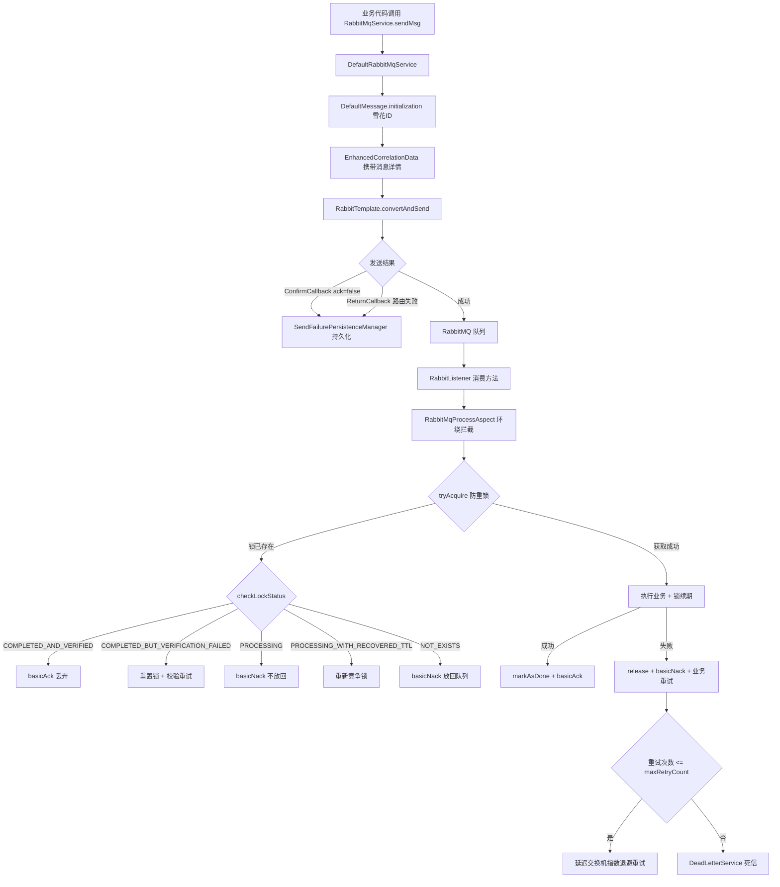
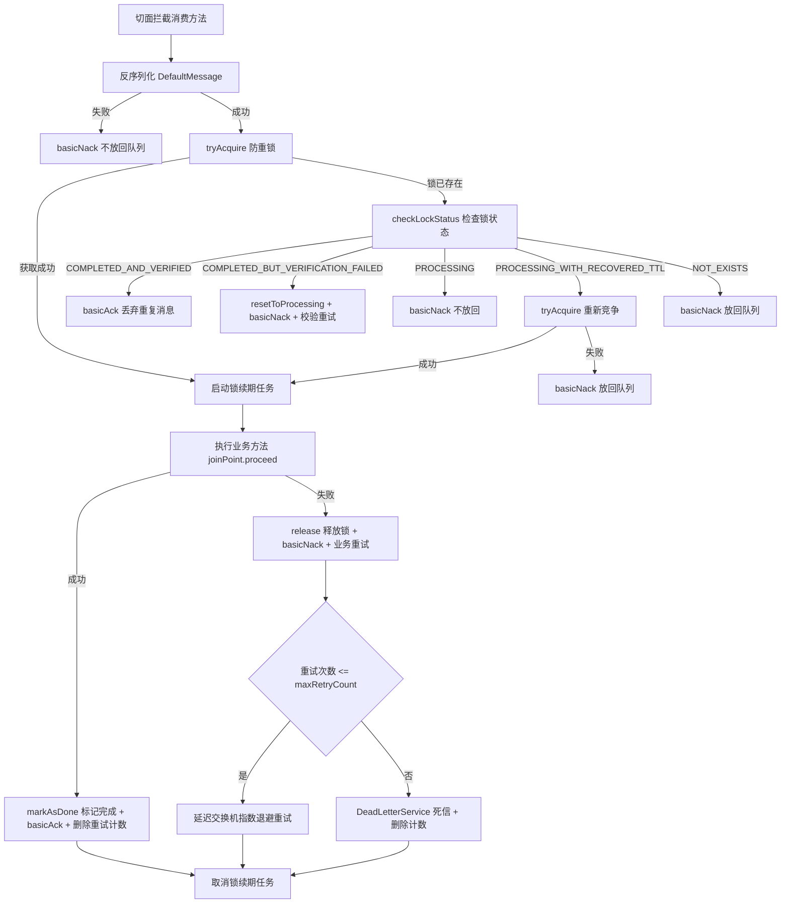

# simple-common-rabbitmq 消息队列模块

> @author qty
> 版本：1.0.1

## 1. 模块介绍

`simple-common-rabbitmq` 是 simple-common 框架的 RabbitMQ 消息队列模块，提供消息发送（即时/延迟）、防重复消费、消费失败重试（指数退避）、死信队列、发送失败持久化等完整机制，适用于异步解耦、流量削峰、延迟任务等场景。

该模块提供以下核心能力：

- **`RabbitMqService` 消息发送接口**：支持即时消息和延迟消息两种发送模式，自动初始化雪花 ID，携带 `EnhancedCorrelationData` 供确认回调使用
- **`@RabbitMqConsumption` 防重复消费注解**：声明式配置业务时长、有效时长、重试次数，由 AOP 切面自动处理防重/重试/死信
- **`RabbitMqProcessAspect` 消费切面**：环绕拦截消费方法，实现 Redis 分布式锁防重、锁续期、僵尸锁恢复、指数退避重试、完成校验等完整机制
- **`ConsumptionLockManager` 防重锁管理器**：基于 Redis SET NX EX 原子操作 + Lua 脚本续期，支持锁状态检查与僵尸锁自动恢复
- **`RetryMessageManager` 重试管理器**：业务失败重试与校验失败重试独立计数，指数退避延迟投递，超限进入死信
- **`SendFailurePersistenceManager` 发送失败持久化管理器**：ConfirmCallback 确认失败 + ReturnCallback 路由失败双重保障
- **`DeadLetterService` 死信服务接口**：重试超限后由集成方实现持久化存储

### 架构总览



## 2. Maven 依赖

```xml
<dependency>
    <groupId>com.simple.common</groupId>
    <artifactId>simple-common-rabbitmq</artifactId>
    <version>1.0.1</version>
</dependency>
```

该模块传递引入以下依赖：

- `simple-common-core`：核心基础（`JsonUtils`、`SerializeUtils`、`IdUtils` 等）
- `simple-common-redis`：Redis 支持（防重锁、重试计数器基于 Redis 实现）
- `spring-boot-starter-amqp`：Spring AMQP + RabbitMQ 客户端

## 3. 核心功能

| 类名 | 功能描述 | 关键特性 |
|------|---------|---------|
| [`RabbitMqService`](simple-common-rabbitmq/src/main/java/com/simple/common/rabbitmq/common/service/RabbitMqService.java:28) | 消息发送接口 | 即时消息 + 延迟消息，`toMilliseconds` 时间转换 |
| [`DefaultRabbitMqService`](simple-common-rabbitmq/src/main/java/com/simple/common/rabbitmq/service/DefaultRabbitMqService.java:22) | 消息发送默认实现 | 雪花 ID 初始化、`EnhancedCorrelationData` 携带详情、性能日志 |
| [`@RabbitMqConsumption`](simple-common-rabbitmq/src/main/java/com/simple/common/rabbitmq/annotation/RabbitMqConsumption.java:15) | 防重复消费注解 | 业务时长/有效时长/重试次数/时间单位 |
| [`RabbitMqProcessAspect`](simple-common-rabbitmq/src/main/java/com/simple/common/rabbitmq/aspeck/RabbitMqProcessAspect.java:38) | 消费切面 | 环绕拦截、防重锁、锁续期、僵尸锁恢复、重试/死信 |
| [`DefaultMessage`](simple-common-rabbitmq/src/main/java/com/simple/common/rabbitmq/common/entity/DefaultMessage.java:23) | 消息载体 | `msgData`/`sendTime`/`id`，`initialization` 自动雪花 ID |
| [`EnhancedCorrelationData`](simple-common-rabbitmq/src/main/java/com/simple/common/rabbitmq/common/entity/EnhancedCorrelationData.java:15) | 增强确认数据 | 携带消息体/交换机/路由键/字节数组，供 ConfirmCallback 使用 |
| [`RabbitMqConfig`](simple-common-rabbitmq/src/main/java/com/simple/common/rabbitmq/common/config/RabbitMqConfig.java:32) | RabbitMQ 配置 | RabbitTemplate 配置、ConfirmCallback、ReturnCallback、延迟交换机 |
| [`RabbitMqProperties`](simple-common-rabbitmq/src/main/java/com/simple/common/rabbitmq/common/properties/RabbitMqProperties.java:24) | 配置属性类 | Redis 命名空间、锁状态值、重试延迟参数、TTL 阈值 |
| [`ConsumptionLockManager`](simple-common-rabbitmq/src/main/java/com/simple/common/rabbitmq/common/manager/ConsumptionLockManager.java:13) | 防重锁管理器接口 | 获取/续期/检查/释放/标记完成/重置 |
| [`DefaultConsumptionLockManager`](simple-common-rabbitmq/src/main/java/com/simple/common/rabbitmq/manager/DefaultConsumptionLockManager.java:26) | 防重锁默认实现 | Redis SET NX EX、Lua 脚本续期、僵尸锁恢复、完成校验 |
| [`RetryCountManager`](simple-common-rabbitmq/src/main/java/com/simple/common/rabbitmq/common/manager/RetryCountManager.java:13) | 重试计数管理器接口 | 原子递增、删除、构建业务/校验重试 Key |
| [`DefaultRetryCountManager`](simple-common-rabbitmq/src/main/java/com/simple/common/rabbitmq/manager/DefaultRetryCountManager.java:19) | 重试计数默认实现 | Redis Lua 脚本 INCR + EXPIRE 原子操作 |
| [`RetryMessageManager`](simple-common-rabbitmq/src/main/java/com/simple/common/rabbitmq/common/manager/RetryMessageManager.java:24) | 重试管理器接口 | 业务失败重试 + 校验失败重试 |
| [`DefaultRetryMessageManager`](simple-common-rabbitmq/src/main/java/com/simple/common/rabbitmq/manager/DefaultRetryMessageManager.java:27) | 重试默认实现 | 指数退避延迟投递、超限死信、计数清理 |
| [`AckRMQManager`](simple-common-rabbitmq/src/main/java/com/simple/common/rabbitmq/common/manager/AckRMQManager.java:15) | 消息确认管理器接口 | `basicAck` / `basicNack` |
| [`DefaultAckRMQManager`](simple-common-rabbitmq/src/main/java/com/simple/common/rabbitmq/manager/DefaultAckRMQManager.java:14) | 确认默认实现 | 非批量确认/拒绝 |
| [`DeadLetterService`](simple-common-rabbitmq/src/main/java/com/simple/common/rabbitmq/common/service/DeadLetterService.java:18) | 死信服务接口 | 保存失败消息（交换机/路由键/队列/内容/异常） |
| [`DefaultDeadLetterService`](simple-common-rabbitmq/src/main/java/com/simple/common/rabbitmq/service/DefaultDeadLetterService.java:14) | 死信默认实现 | 仅打印错误日志，集成方需替换 |
| [`SendFailurePersistenceManager`](simple-common-rabbitmq/src/main/java/com/simple/common/rabbitmq/common/manager/SendFailurePersistenceManager.java:14) | 发送失败持久化接口 | ConfirmCallback 失败 + ReturnCallback 路由失败 |
| [`DefaultSendFailurePersistenceManager`](simple-common-rabbitmq/src/main/java/com/simple/common/rabbitmq/manager/DefaultSendFailurePersistenceManager.java:18) | 发送失败默认实现 | 仅打印错误日志，集成方需替换 |
| [`CompletionVerificationStrategyManager`](simple-common-rabbitmq/src/main/java/com/simple/common/rabbitmq/common/manager/CompletionVerificationStrategyManager.java:11) | 完成校验策略接口 | 按队列判断业务是否真正完成 |
| [`CompletionVerificationRouterManager`](simple-common-rabbitmq/src/main/java/com/simple/common/rabbitmq/common/manager/CompletionVerificationRouterManager.java:8) | 校验策略路由器接口 | 按队列名获取对应校验策略 |
| [`DefaultCompletionVerificationRouterManager`](simple-common-rabbitmq/src/main/java/com/simple/common/rabbitmq/manager/DefaultCompletionVerificationRouterManager.java:22) | 路由器默认实现 | 自动收集所有策略 Bean，按 `getQueueName` 建立映射 |
| [`RabbitMqProcess`](simple-common-rabbitmq/src/main/java/com/simple/common/rabbitmq/common/service/process/RabbitMqProcess.java:83) | 消息处理接口 | 责任链节点，继承 `BasProcessService` |
| [`DefaultRMQProcess`](simple-common-rabbitmq/src/main/java/com/simple/common/rabbitmq/service/process/DefaultRMQProcess.java:18) | 默认处理节点 | 空实现，可扩展自定义前置处理 |
| [`RMQKindProcess`](simple-common-rabbitmq/src/main/java/com/simple/common/rabbitmq/common/enums/RMQKindProcess.java:14) | 处理节点枚举 | 实现 `DefaultKindProcess`，定义处理顺序 |

## 4. 配置说明

### 4.1 RabbitMQ 基础配置

模块依赖 Spring Boot AMQP 自动配置，需在 `application.yaml` 中配置 RabbitMQ 连接信息：

```yaml
spring:
  rabbitmq:
    host: 127.0.0.1
    port: 5672
    username: guest
    password: guest
    virtual-host: /
    # 手动 ACK 模式（@RabbitMqConsumption 必须使用手动 ACK）
    listener:
      simple:
        acknowledge-mode: manual
        prefetch: 10
    # 发布确认（发送失败持久化依赖此配置）
    publisher-confirm-type: correlated
    publisher-returns: true
```

> **关键前提**：`acknowledge-mode` 必须设置为 `manual`，否则 `@RabbitMqConsumption` 注解的防重/重试机制无法正常工作。`publisher-confirm-type: correlated` 和 `publisher-returns: true` 是发送失败持久化（ConfirmCallback / ReturnCallback）的前提。

### 4.2 模块配置（`simple.mq.rabbitmq`）

配置类：[`RabbitMqProperties`](simple-common-rabbitmq/src/main/java/com/simple/common/rabbitmq/common/properties/RabbitMqProperties.java:24)

| 属性 | 配置键 | 类型 | 默认值 | 说明 |
|------|--------|------|--------|------|
| `mqPackage` | `simple.mq.rabbitmq.mq-package` | `String` | `rabbitmq:` | Redis Key 命名空间前缀，隔离不同业务/环境 |
| `delayedExchange` | `simple.mq.rabbitmq.delayed-exchange` | `String` | `simple.delayed.retry.exchange` | 延迟重试交换机名称 |
| `retryCountTtlSeconds` | `simple.mq.rabbitmq.retry-count-ttl-seconds` | `long` | `3600` | 重试计数 Redis Key 过期时间（秒） |
| `lockStatusProcessing` | `simple.mq.rabbitmq.lock-status-processing` | `String` | `PROCESSING` | 防重锁"处理中"状态值 |
| `lockStatusDonePrefix` | `simple.mq.rabbitmq.lock-status-done-prefix` | `String` | `DONE:` | 防重锁"已完成"状态值前缀 |
| `lockTtlRecoveryThresholdSeconds` | `simple.mq.rabbitmq.lock-ttl-recovery-threshold-seconds` | `long` | `5` | 僵尸锁恢复阈值（秒），剩余 TTL 超过此值时缩短 |
| `retryDelayBaseMs` | `simple.mq.rabbitmq.retry-delay-base-ms` | `long` | `5000` | 重试延迟基数（毫秒），首次重试延迟 |
| `retryDelayMaxMs` | `simple.mq.rabbitmq.retry-delay-max-ms` | `long` | `60000` | 最大重试延迟（毫秒），指数退避上限 |

**动态 Key 前缀**（由 `mqPackage` 拼接，无需直接配置）：

| 方法 | 返回值 | 用途 |
|------|--------|------|
| `getWhetherToConsume()` | `mqPackage + "whether_to_consume"` | 防重锁 Key 前缀 |
| `getCalculation()` | `mqPackage + "calculation"` | 重试计数 Key 前缀 |

**配置示例**：

```yaml
simple:
  mq:
    rabbitmq:
      mq-package: "myapp:rabbitmq:"
      delayed-exchange: "myapp.delayed.retry.exchange"
      retry-count-ttl-seconds: 7200
      retry-delay-base-ms: 3000
      retry-delay-max-ms: 120000
      lock-ttl-recovery-threshold-seconds: 10
```

### 4.3 属性校验

[`RabbitMqProperties.validate()`](simple-common-rabbitmq/src/main/java/com/simple/common/rabbitmq/common/properties/RabbitMqProperties.java:146) 在 `@PostConstruct` 时自动执行，对非法值进行修正并打印警告日志：

| 校验项 | 修正值 | 说明 |
|--------|--------|------|
| `lockTtlRecoveryThresholdSeconds <= 0` | `5` | 恢复阈值必须为正数 |
| `retryCountTtlSeconds <= 0` | `3600` | 计数 TTL 必须为正数 |
| `retryDelayBaseMs <= 0` | `5000` | 延迟基数必须为正数 |
| `retryDelayMaxMs < retryDelayBaseMs` | `retryDelayBaseMs * 10` | 最大延迟不能小于基数 |

### 4.4 自动配置

模块通过 `META-INF/spring/org.springframework.boot.autoconfigure.AutoConfiguration.imports` 自动注册 [`RabbitMqConfig`](simple-common-rabbitmq/src/main/java/com/simple/common/rabbitmq/common/config/RabbitMqConfig.java:32)，提供以下功能：

- `@EnableRabbit`：启用 RabbitMQ 注解驱动
- `@ComponentScan(basePackages = {"com.simple.common.rabbitmq"})`：自动扫描模块组件
- `RabbitTemplate` Bean：配置 Jackson JSON 转换器、ConfirmCallback、ReturnCallback
- `simpleDelayedRetryExchange` Bean：延迟重试交换机（`x-delayed-message` 类型，底层 `direct` 路由）

## 5. 消息发送

### 5.1 RabbitMqService 接口

**类路径**：`com.simple.common.rabbitmq.common.service.RabbitMqService`

| 方法签名 | 返回值 | 说明 |
|---------|--------|------|
| `sendMsg(DefaultMessage, String exchangeName, String routingKey)` | `void` | 发送即时消息 |
| `sendMsg(DefaultMessage, String exchangeName, String routingKey, int time, TimeUnit timeUnit)` | `void` | 发送延迟消息（需 `x-delayed-message` 插件） |
| `toMilliseconds(int time, TimeUnit timeUnit)` | `Long` | 时间转毫秒（default 方法） |

### 5.2 DefaultRabbitMqService 实现

**类路径**：`com.simple.common.rabbitmq.service.DefaultRabbitMqService`

**即时消息发送流程**：

1. `defaultMessage.initialization()`：自动生成雪花 ID（若为空）和发送时间
2. 构建 [`EnhancedCorrelationData.of()`](simple-common-rabbitmq/src/main/java/com/simple/common/rabbitmq/common/entity/EnhancedCorrelationData.java:51)：携带消息 ID、消息体、交换机、路由键
3. `rabbitTemplate.convertAndSend()`：设置 `correlationId`、`contentType=application/json`，保存消息体字节数组到 `EnhancedCorrelationData`
4. 成功时 debug 日志记录耗时，失败时 error 日志并抛出 `AmqpException`

**延迟消息发送流程**：

与即时消息类似，额外设置 `message.getMessageProperties().setDelayLong(toMilliseconds(time, timeUnit))`，依赖 RabbitMQ `rabbitmq_delayed_message_exchange` 插件。

### 5.3 DefaultMessage 消息载体

**类路径**：`com.simple.common.rabbitmq.common.entity.DefaultMessage`

| 字段 | 类型 | 说明 |
|------|------|------|
| `msgData` | `String` | 业务数据 JSON 字符串 |
| `sendTime` | `String` | 发送时间（`initialization()` 时自动生成） |
| `id` | `String` | 消息唯一 ID（`initialization()` 时自动生成雪花 ID） |

**`initialization()` 方法**：

```java
public void initialization() {
    if (StrUtil.isEmpty(id)) {
        this.id = IdUtil.getSnowflakeNextIdStr();
    }
    this.sendTime = DateUtil.date().toString();
}
```

> **注意**：`DefaultMessage` 使用 `@Accessors(chain = true)` 支持链式调用。`DefaultRabbitMqService` 在发送前会自动调用 `initialization()`，无需手动调用。

### 5.4 EnhancedCorrelationData 增强确认数据

**类路径**：`com.simple.common.rabbitmq.common.entity.EnhancedCorrelationData`（继承 `CorrelationData`）

| 字段 | 类型 | 说明 |
|------|------|------|
| `defaultMessage` | `DefaultMessage` | 消息体对象 |
| `exchange` | `String` | 交换机名称 |
| `routingKey` | `String` | 路由键 |
| `messageBody` | `byte[]` | 原始消息字节数组（兜底） |

**静态工厂方法**：

```java
EnhancedCorrelationData.of(String id, DefaultMessage defaultMessage,
                           String exchange, String routingKey, byte[] messageBody)
```

> **作用**：在 `ConfirmCallback` 中，当 `ack=false` 时，可从 `EnhancedCorrelationData` 提取完整的消息信息（交换机、路由键、消息体），传递给 `SendFailurePersistenceManager` 进行持久化。

### 5.5 发送使用示例

```java
@Autowired
private RabbitMqService rabbitMqService;

// 发送即时消息
DefaultMessage message = new DefaultMessage();
message.setMsgData(JsonUtils.toJsonStr(orderInfo));
rabbitMqService.sendMsg(message, "order.exchange", "order.created");

// 发送延迟消息（30分钟后取消未支付订单）
DefaultMessage delayMessage = new DefaultMessage();
delayMessage.setMsgData(JsonUtils.toJsonStr(orderId));
rabbitMqService.sendMsg(delayMessage, "order.delayed.exchange",
                        "order.timeout", 30, TimeUnit.MINUTES);
```

## 6. @RabbitMqConsumption 防重复消费注解

### 6.1 注解属性

**类路径**：`com.simple.common.rabbitmq.annotation.RabbitMqConsumption`

| 属性 | 类型 | 默认值 | 说明 |
|------|------|--------|------|
| `businessTime()` | `int` | `10` | 业务执行预估时长。此时间内重复消息被防重锁拦截；超过此时间锁自动释放。正常消费成功后锁更新为有效时长 |
| `effectiveTime()` | `int` | `1800`（30分钟） | 消息有效时长，用于判断重复消费的最大时间窗口。消费成功后锁标记为"已完成"并以此时长过期 |
| `timeUnit()` | `TimeUnit` | `SECONDS` | `businessTime` 和 `effectiveTime` 的时间单位 |
| `retryCount()` | `int` | `3` | 消费失败后最大重试次数，超过后进入死信 |

### 6.2 使用前提

1. **手动 ACK 模式**：`spring.rabbitmq.listener.simple.acknowledge-mode=manual`
2. **消费方法签名**：方法必须有两个参数 `(Message message, Channel channel)`，且标注 `@RabbitListener` 和 `@RabbitMqConsumption`
3. **延迟重试交换机绑定**：业务队列必须绑定到 `simple.delayed.retry.exchange`（延迟交换机），路由键与原队列一致，否则重试消息无法投递

### 6.3 使用示例

```java
@Component
@Slf4j
public class OrderConsumer {

    @RabbitListener(queues = "order.queue", concurrency = "5", ackMode = "MANUAL")
    @RabbitMqConsumption(businessTime = 30, effectiveTime = 1800, retryCount = 3)
    public void handleOrder(Message message, Channel channel) {
        DefaultMessage msg = SerializeUtils.deserialize(message.getBody(), DefaultMessage.class);
        OrderInfo order = JsonUtils.parseObject(msg.getMsgData(), OrderInfo.class);

        // 执行业务逻辑
        orderService.process(order);

        // 方法正常返回即视为消费成功，切面自动 basicAck
        // 抛出异常即视为消费失败，切面自动触发重试/死信
    }
}
```

> **返回值说明**：消费方法可以返回 `String` 作为业务 ID，用于完成校验策略判断。返回 `void` 或 `null` 时，使用消息的 `correlationId` 作为兜底业务 ID。

## 7. 消费切面与防重机制

### 7.1 RabbitMqProcessAspect 切面核心流程

**类路径**：`com.simple.common.rabbitmq.aspeck.RabbitMqProcessAspect`

切面通过 `@Around("@annotation(RabbitMqConsumption)")` 环绕拦截所有标注 `@RabbitMqConsumption` 的方法，完整流程如下：



### 7.2 防重锁机制（ConsumptionLockManager）

**类路径**：`com.simple.common.rabbitmq.common.manager.ConsumptionLockManager`

**默认实现**：[`DefaultConsumptionLockManager`](simple-common-rabbitmq/src/main/java/com/simple/common/rabbitmq/manager/DefaultConsumptionLockManager.java:26)（基于 Redis）

| 方法签名 | 返回值 | 说明 |
|---------|--------|------|
| `tryAcquire(queue, correlationId, businessTime, timeUnit)` | `boolean` | 原子获取锁（Redis SET NX EX），true=获取成功 |
| `renewLock(queue, correlationId, businessTime, timeUnit)` | `boolean` | 续期锁（Lua 脚本，仅当值为 PROCESSING 时成功） |
| `checkLockStatus(queue, correlationId, defaultMessage, message)` | `LockStatus` | 检查锁状态并返回处理建议 |
| `release(queue, correlationId)` | `void` | 删除锁 |
| `markAsDone(queue, correlationId, businessId, effectiveSeconds, timeUnit)` | `void` | 标记为已完成（值为 `DONE:{businessId}`） |
| `resetToProcessing(queue, correlationId, businessTime, timeUnit)` | `void` | 重置为处理中状态 |
| `buildLockKey(queue, correlationId)` | `String` | 构建 Redis Key |

**锁 Key 格式**：`{mqPackage}whether_to_consume:{queue}:{correlationId}`

**锁状态枚举** `LockStatus`：

| 状态 | 含义 | 切面处理 |
|------|------|---------|
| `NOT_EXISTS` | 锁不存在 | basicNack 放回队列（异常情况） |
| `PROCESSING` | 处理中 | basicNack 不放回（已有消费者处理） |
| `COMPLETED_AND_VERIFIED` | 已完成且校验通过 | basicAck 丢弃（幂等） |
| `COMPLETED_BUT_VERIFICATION_FAILED` | 已完成但校验未通过 | resetToProcessing + 校验重试 |
| `PROCESSING_WITH_RECOVERED_TTL` | 处理中但 TTL 异常长，已缩短 | 重新竞争锁 |

**锁续期机制**：

切面通过 `ScheduledExecutorService`（守护线程 `rmq-lock-renewal`）定期续期锁：

- 续期间隔：`businessTime / 3`（至少 1000ms）
- 续期方式：Lua 脚本 `EXPIRE_IF_VALUE_EQUALS`，仅当锁值仍为 `PROCESSING` 时刷新过期时间
- 连续失败阈值：3 次，超过后中断业务线程（防止锁丢失后继续执行导致并发问题）
- Redis 异常不计入连续失败次数

**僵尸锁恢复**：

当消费者宕机重启后，检测到旧锁的剩余 TTL 大于 `lockTtlRecoveryThresholdSeconds`（默认 5 秒）时，通过 Lua 脚本将 TTL 缩短至该阈值，使新消费者能尽快接管。缩短成功返回 `PROCESSING_WITH_RECOVERED_TTL`，切面尝试重新竞争锁。

**checkLockStatus 循环检查**：

为避免锁状态在检查过程中变化导致误判，`checkLockStatusWithLoop` 最多重试 2 次。多次尝试后仍不稳定时，保守返回 `PROCESSING`。

### 7.3 完成校验策略

**接口**：[`CompletionVerificationStrategyManager`](simple-common-rabbitmq/src/main/java/com/simple/common/rabbitmq/common/manager/CompletionVerificationStrategyManager.java:11)

| 方法签名 | 返回值 | 说明 |
|---------|--------|------|
| `isCompleted(String businessId, DefaultMessage defaultMessage, Message message)` | `boolean` | 判断业务是否真正完成，true=可安全丢弃 |
| `getQueueName()` | `String` | 返回该策略支持的队列名称 |

**路由器**：[`DefaultCompletionVerificationRouterManager`](simple-common-rabbitmq/src/main/java/com/simple/common/rabbitmq/manager/DefaultCompletionVerificationRouterManager.java:22)

- `@PostConstruct` 时自动收集所有 `CompletionVerificationStrategyManager` Bean
- 按 `getQueueName()` 建立 `ConcurrentHashMap` 映射
- 重复队列名时打印警告并覆盖
- `getStrategy(queueName)` 返回对应策略，未找到返回 `null`（表示无需校验，默认信任 Redis）

**使用场景**：当业务方法执行成功（未抛异常）但实际业务效果未生效时（如数据库写入延迟），通过校验策略进行二次确认。校验失败时触发独立的校验重试计数。

### 7.4 消息确认管理器（AckRMQManager）

**类路径**：`com.simple.common.rabbitmq.common.manager.AckRMQManager`

| 方法签名 | 返回值 | 说明 |
|---------|--------|------|
| `basicAck(Channel channel, Long deliveryTag)` | `void` | 确认消息（非批量） |
| `basicNack(Channel channel, Long deliveryTag, boolean requeue)` | `void` | 拒绝消息（非批量），`requeue`=true 放回队列 |

**默认实现** [`DefaultAckRMQManager`](simple-common-rabbitmq/src/main/java/com/simple/common/rabbitmq/manager/DefaultAckRMQManager.java:14) 使用 `@SneakyThrows` 简化异常处理，`multiple` 参数固定为 `false`（非批量）。

## 8. 消费失败重试与死信

### 8.1 重试计数管理器（RetryCountManager）

**类路径**：`com.simple.common.rabbitmq.common.manager.RetryCountManager`

**默认实现**：[`DefaultRetryCountManager`](simple-common-rabbitmq/src/main/java/com/simple/common/rabbitmq/manager/DefaultRetryCountManager.java:19)（基于 Redis）

| 方法签名 | 返回值 | 说明 |
|---------|--------|------|
| `incrementAndGet(String retryKey)` | `long` | 原子递增并刷新 TTL（Lua 脚本 INCR + EXPIRE） |
| `delete(String retryKey)` | `void` | 删除计数 |
| `buildRetryKey(String queue, String correlationId)` | `String` | 构建业务失败重试 Key |
| `buildVerifyRetryKey(String queue, String correlationId)` | `String` | 构建校验失败重试 Key（独立计数） |

**Key 格式**：

- 业务重试 Key：`{mqPackage}calculation:{queue}:{correlationId}`
- 校验重试 Key：`{mqPackage}calculation:{queue}:{correlationId}:verify`

**Lua 脚本**（INCR + EXPIRE 原子操作）：

```lua
local current = redis.call('INCR', KEYS[1])
redis.call('EXPIRE', KEYS[1], ARGV[1])
return current
```

> 每次递增都会刷新 TTL（`retryCountTtlSeconds`，默认 3600 秒），确保计数 Key 在整个重试窗口内有效。

### 8.2 重试消息管理器（RetryMessageManager）

**类路径**：`com.simple.common.rabbitmq.common.manager.RetryMessageManager`

**默认实现**：[`DefaultRetryMessageManager`](simple-common-rabbitmq/src/main/java/com/simple/common/rabbitmq/manager/DefaultRetryMessageManager.java:27)

| 方法签名 | 返回值 | 说明 |
|---------|--------|------|
| `handleBusinessFailureRetry(retryKey, message, channel, maxRetryCount, cause, defaultMessage)` | `void` | 处理业务失败重试 |
| `handleVerificationFailureRetry(verifyRetryKey, message, channel, maxRetryCount, cause, defaultMessage)` | `void` | 处理校验失败重试（独立计数） |

**重试核心逻辑**（`doRetry` 方法）：

1. `retryCountManager.incrementAndGet(retryKey)` 原子递增计数
2. 判断 `currentCount <= maxRetryCount`：
   - **是**：计算指数退避延迟 `delayMs = min(retryDelayBaseMs * 2^(currentCount-1), retryDelayMaxMs)`
   - 通过 `rabbitMqService.sendMsg()` 发送到延迟交换机，延迟 `delaySeconds` 秒后重新投递
   - 发送失败时进入死信并删除计数
   - **否**：进入死信并删除计数

**指数退避计算**：

| 重试次数 | 延迟计算 | 延迟（默认参数） |
|---------|---------|----------------|
| 第 1 次 | `5000 * 2^0 = 5000` | 5 秒 |
| 第 2 次 | `5000 * 2^1 = 10000` | 10 秒 |
| 第 3 次 | `5000 * 2^2 = 20000` | 20 秒 |
| 第 4 次 | `5000 * 2^3 = 40000` | 40 秒 |
| 第 5 次 | `min(5000 * 2^4, 60000) = 60000` | 60 秒（上限） |

> **路由键兜底**：若消息无路由键，使用队列名作为重试路由键。延迟交换机需正确绑定到业务队列。

### 8.3 死信服务（DeadLetterService）

**类路径**：`com.simple.common.rabbitmq.common.service.DeadLetterService`

| 方法签名 | 返回值 | 说明 |
|---------|--------|------|
| `save(String exchange, String key, String queue, String body, Exception e)` | `void` | 保存失败消息完整信息 |
| `save(Message message, Exception e)` | `void` | default 方法，从 Message 提取信息后调用 `save` |

**默认实现** [`DefaultDeadLetterService`](simple-common-rabbitmq/src/main/java/com/simple/common/rabbitmq/service/DefaultDeadLetterService.java:14) 仅打印错误日志。**集成方必须实现此接口**，将死信消息持久化到数据库或文件，并提供补偿重试机制。

### 8.4 发送失败持久化（SendFailurePersistenceManager）

**类路径**：`com.simple.common.rabbitmq.common.manager.SendFailurePersistenceManager`

| 方法签名 | 返回值 | 说明 |
|---------|--------|------|
| `saveConfirmFailure(correlationId, cause, exchange, routingKey, defaultMessage, messageBody)` | `void` | ConfirmCallback 确认失败（完整版） |
| `saveReturnFailure(message, replyCode, replyText, exchange, routingKey)` | `void` | ReturnCallback 路由失败 |
| `saveConfirmFailure(correlationId, message, cause)` | `void` | default 兼容方法 |
| `saveConfirmFailure(correlationId, cause, exchange, routingKey, jsonStr)` | `void` | default 简化方法 |

**默认实现** [`DefaultSendFailurePersistenceManager`](simple-common-rabbitmq/src/main/java/com/simple/common/rabbitmq/manager/DefaultSendFailurePersistenceManager.java:18) 仅打印错误日志。**集成方必须实现此接口**，将失败消息存入可靠存储并实现补偿重试。

**触发场景**：

| 回调 | 触发条件 | 配置要求 |
|------|---------|---------|
| ConfirmCallback (`ack=false`) | 消息未到达交换机 | `publisher-confirm-type: correlated` |
| ReturnCallback | 消息到达交换机但无队列匹配（路由失败） | `publisher-returns: true` + `mandatory=true` |

> **延迟交换机例外**：[`RabbitMqConfig`](simple-common-rabbitmq/src/main/java/com/simple/common/rabbitmq/common/config/RabbitMqConfig.java:32) 的 ReturnCallback 会跳过延迟交换机（名称包含 `delayed` 或 `delay`）的路由失败，因为延迟交换机的 ReturnCallback 行为与普通交换机不同。

### 8.5 RabbitMqConfig 配置类

**类路径**：`com.simple.common.rabbitmq.common.config.RabbitMqConfig`

**RabbitTemplate 配置**：

| 配置项 | 值 | 说明 |
|--------|-----|------|
| MessageConverter | `Jackson2JsonMessageConverter` | JSON 序列化 |
| ConfirmCallback | 内部实现 | `ack=false` 时调用 `sendFailurePersistenceManager.saveConfirmFailure` |
| ReturnsCallback | 内部实现 | 路由失败时调用 `sendFailurePersistenceManager.saveReturnFailure`（跳过延迟交换机） |
| Mandatory | `true` | 启用 ReturnCallback |

**延迟重试交换机 Bean**：

```java
@Bean("simpleDelayedRetryExchange")
public Exchange delayedExchange() {
    Map<String, Object> args = new HashMap<>();
    args.put("x-delayed-type", "direct");
    return new CustomExchange(rabbitMqProperties.getDelayedExchange(),
                              "x-delayed-message", true, false, args);
}
```

> **集成方需手动绑定**：业务队列必须绑定到 `simpleDelayedRetryExchange`，路由键与原队列一致，否则重试消息无法投递到业务队列。

## 9. 扩展点与自定义方式

### 9.1 自定义死信服务

实现 `DeadLetterService` 接口，将死信消息持久化到数据库：

```java
@Slf4j
@Service
public class CustomDeadLetterService implements DeadLetterService {

    @Autowired
    private DeadLetterMessageRepository repository;

    @Override
    public void save(String exchange, String key, String queue, String body, Exception e) {
        DeadLetterMessage entity = new DeadLetterMessage();
        entity.setExchange(exchange);
        entity.setRoutingKey(key);
        entity.setQueue(queue);
        entity.setMessageBody(body);
        entity.setErrorMessage(e != null ? e.getMessage() : "未知异常");
        entity.setCreateTime(new Date());
        repository.save(entity);
        log.error("死信消息已持久化: exchange={}, queue={}", exchange, queue, e);
    }
}
```

### 9.2 自定义发送失败持久化

实现 `SendFailurePersistenceManager` 接口，将发送失败消息存入可靠存储：

```java
@Slf4j
@Component
public class CustomSendFailurePersistenceManager implements SendFailurePersistenceManager {

    @Autowired
    private FailedMessageRepository repository;

    @Override
    public void saveConfirmFailure(String correlationId, String cause,
                                   String receivedExchange, String receivedRoutingKey,
                                   DefaultMessage defaultMessage, byte[] messageBody) {
        FailedMessage entity = new FailedMessage();
        entity.setMessageId(correlationId);
        entity.setExchange(receivedExchange);
        entity.setRoutingKey(receivedRoutingKey);
        entity.setCause(cause);
        entity.setMessageBody(defaultMessage != null
                ? JsonUtils.toJsonStr(defaultMessage)
                : (messageBody != null ? new String(messageBody) : ""));
        entity.setFailureType("CONFIRM");
        entity.setCreateTime(new Date());
        repository.save(entity);
        log.error("发送确认失败已持久化: correlationId={}", correlationId);
    }

    @Override
    public void saveReturnFailure(Message message, int replyCode, String replyText,
                                  String exchange, String routingKey) {
        FailedMessage entity = new FailedMessage();
        entity.setExchange(exchange);
        entity.setRoutingKey(routingKey);
        entity.setReplyCode(replyCode);
        entity.setReplyText(replyText);
        entity.setMessageBody(new String(message.getBody()));
        entity.setFailureType("RETURN");
        entity.setCreateTime(new Date());
        repository.save(entity);
        log.error("路由失败已持久化: exchange={}, routingKey={}", exchange, routingKey);
    }
}
```

### 9.3 自定义完成校验策略

实现 `CompletionVerificationStrategyManager` 接口，按队列进行业务完成校验：

```java
@Slf4j
@Component
public class OrderCompletionVerificationStrategy implements CompletionVerificationStrategyManager {

    @Autowired
    private OrderService orderService;

    @Override
    public boolean isCompleted(String businessId, DefaultMessage defaultMessage, Message message) {
        // businessId 为消费方法返回的业务 ID
        // 校验订单是否真正处理完成
        Order order = orderService.findById(businessId);
        return order != null && OrderStatus.PROCESSED.equals(order.getStatus());
    }

    @Override
    public String getQueueName() {
        return "order.queue";
    }
}
```

> 路由器 [`DefaultCompletionVerificationRouterManager`](simple-common-rabbitmq/src/main/java/com/simple/common/rabbitmq/manager/DefaultCompletionVerificationRouterManager.java:22) 会自动收集所有策略 Bean 并按 `getQueueName()` 建立映射，无需手动注册。

### 9.4 自定义防重锁管理器

实现 `ConsumptionLockManager` 接口，替换默认的 Redis 实现（如使用 ZooKeeper）：

```java
@Component
public class ZookeeperConsumptionLockManager implements ConsumptionLockManager {
    // 实现 tryAcquire / renewLock / checkLockStatus / release / markAsDone / resetToProcessing / buildLockKey
}
```

### 9.5 自定义消息处理节点

实现 `RabbitMqProcess` 接口，添加前置处理逻辑：

```java
@Component
public class LogRMQProcess implements RabbitMqProcess {

    @Override
    public DefaultKindProcess getProcess() {
        return RMQKindProcess.TEST;
    }

    @Override
    public void execution(Message message, Channel channel, RabbitMqConsumption rabbitMqConsumption) {
        // 消费前的自定义处理逻辑（如日志记录、消息追踪等）
        log.info("前置处理: queue={}", message.getMessageProperties().getConsumerQueue());
    }
}
```

> **注意**：当前版本 [`RabbitMqProcessAspect`](simple-common-rabbitmq/src/main/java/com/simple/common/rabbitmq/aspeck/RabbitMqProcessAspect.java:38) 中前置处理器调用逻辑已被注释，`DefaultRMQProcess` 为空实现。如需启用前置处理链，需取消切面中的注释代码。

## 10. 消费者示例

### 10.1 完整消费者配置示例

> 示例参考：[`ConsumerDemo.java.txt`](simple-common-rabbitmq/src/main/java/com/simple/common/rabbitmq/listener/ConsumerDemo.java.txt:20)

```java
@Configuration
public class OrderMqConfig {

    public static final String ORDER_EXCHANGE = "order.exchange";
    public static final String ORDER_QUEUE = "order.queue";
    public static final String ORDER_ROUTING_KEY = "order.created";

    // 声明业务交换机
    @Bean("orderExchange")
    public DirectExchange orderExchange() {
        return new DirectExchange(ORDER_EXCHANGE, true, false, null);
    }

    // 声明业务队列
    @Bean("orderQueue")
    public Queue orderQueue() {
        return new Queue(ORDER_QUEUE, true, false, false);
    }

    // 绑定业务交换机和队列
    @Bean
    public Binding orderBinding(@Qualifier("orderQueue") Queue queue,
                                @Qualifier("orderExchange") DirectExchange exchange) {
        return BindingBuilder.bind(queue).to(exchange).with(ORDER_ROUTING_KEY);
    }

    // 绑定延迟重试交换机到业务队列（重试消息投递依赖此绑定）
    @Bean
    public Binding orderRetryBinding(@Qualifier("orderQueue") Queue queue,
                                     @Qualifier("simpleDelayedRetryExchange") Exchange retryExchange) {
        return BindingBuilder.bind(queue).to((CustomExchange) retryExchange)
                             .with(ORDER_ROUTING_KEY).and();
    }
}
```

### 10.2 消费者实现

```java
@Component
@Slf4j
public class OrderConsumer {

    @RabbitListener(queues = "order.queue", concurrency = "5", ackMode = "MANUAL")
    @RabbitMqConsumption(businessTime = 30, effectiveTime = 1800, retryCount = 3)
    public String handleOrder(Message message, Channel channel) {
        DefaultMessage msg = SerializeUtils.deserialize(message.getBody(), DefaultMessage.class);
        OrderInfo order = JsonUtils.parseObject(msg.getMsgData(), OrderInfo.class);

        // 执行业务逻辑
        orderService.process(order);

        // 返回业务 ID 供完成校验策略使用
        return order.getOrderId();
    }
}
```

### 10.3 延迟消息消费者

```java
@Component
@Slf4j
public class OrderTimeoutConsumer {

    @RabbitListener(queues = "order.timeout.queue", ackMode = "MANUAL")
    @RabbitMqConsumption(businessTime = 60, effectiveTime = 3600, retryCount = 5)
    public void handleTimeout(Message message, Channel channel) {
        DefaultMessage msg = SerializeUtils.deserialize(message.getBody(), DefaultMessage.class);
        String orderId = msg.getMsgData();

        // 取消超时未支付订单
        orderService.cancelOrder(orderId);
    }
}
```

## 11. 错误处理与注意事项

### 11.1 错误处理语义

| 场景 | 行为 |
|------|------|
| 消息反序列化失败 | basicNack 不放回队列（消息格式错误，重试无意义） |
| 防重锁获取成功，业务执行成功 | markAsDone + basicAck + 删除重试计数 |
| 防重锁获取成功，业务执行失败 | release 释放锁 + basicNack 不放回 + 业务重试（指数退避） |
| 防重锁获取成功，业务被中断 | release 释放锁 + basicNack 放回队列（让其他消费者处理） |
| 锁已存在，状态为 COMPLETED_AND_VERIFIED | basicAck 丢弃（幂等） |
| 锁已存在，状态为 COMPLETED_BUT_VERIFICATION_FAILED | resetToProcessing + basicNack + 校验重试 |
| 锁已存在，状态为 PROCESSING | basicNack 不放回（已有消费者处理） |
| 锁已存在，状态为 PROCESSING_WITH_RECOVERED_TTL | 重新竞争锁，成功则继续，失败则放回队列 |
| 锁已存在，状态为 NOT_EXISTS | basicNack 放回队列（异常情况） |
| 业务重试次数未超限 | 延迟交换机指数退避重试 |
| 业务重试次数超限 | DeadLetterService 死信 + 删除计数 |
| 延迟重试消息发送失败 | 进入死信 + 删除计数 |
| 消息发送 ConfirmCallback ack=false | SendFailurePersistenceManager 持久化 |
| 消息路由失败 ReturnCallback | SendFailurePersistenceManager 持久化（跳过延迟交换机） |
| 锁续期连续失败 3 次 | 中断业务线程 |
| 业务方法返回空且非 void | 抛出 IllegalStateException |

### 11.2 线程安全

- **`annotationCache`**：`ConcurrentHashMap`，`computeIfAbsent` 原子操作缓存注解属性
- **`RENEWAL_SCHEDULER`**：单线程 `ScheduledExecutorService`（守护线程），避免多线程续期竞争
- **`strategyMap`**：`ConcurrentHashMap`，`@PostConstruct` 初始化后只读
- **Redis 操作**：`tryAcquire` 使用 SET NX EX 原子操作，`renewLock` 使用 Lua 脚本保证原子性
- **`incrementAndGet`**：Lua 脚本 INCR + EXPIRE 原子操作
- **`checkLockStatusWithLoop`**：有限循环（最多 2 次），避免递归深度过大

### 11.3 性能说明

- **消息发送性能**：8核2G 配置下每秒可处理约 5 万条消息（来自接口注释）
- **锁续期间隔**：`businessTime / 3`，平衡续期频率与 Redis 压力
- **指数退避**：避免重试风暴，最大延迟上限 `retryDelayMaxMs`（默认 60 秒）
- **重试计数 TTL**：每次递增刷新 TTL，确保整个重试窗口内有效

### 11.4 常见问题

1. **消息重复消费**：检查 `@RabbitMqConsumption` 的 `businessTime` 是否足够覆盖业务执行时间。若业务执行时间超过 `businessTime`，锁会自动释放导致重复消费。建议 `businessTime` 设置为业务预估时长的 2-3 倍。

2. **重试消息不生效**：确认业务队列已绑定到延迟重试交换机 `simple.delayed.retry.exchange`，且 RabbitMQ 已安装 `rabbitmq_delayed_message_exchange` 插件。

3. **死信消息丢失**：默认实现 [`DefaultDeadLetterService`](simple-common-rabbitmq/src/main/java/com/simple/common/rabbitmq/service/DefaultDeadLetterService.java:14) 仅打印日志，必须实现 `DeadLetterService` 接口进行持久化。

4. **发送失败消息丢失**：默认实现 [`DefaultSendFailurePersistenceManager`](simple-common-rabbitmq/src/main/java/com/simple/common/rabbitmq/manager/DefaultSendFailurePersistenceManager.java:18) 仅打印日志，必须实现 `SendFailurePersistenceManager` 接口进行持久化。

5. **僵尸锁导致消息无法消费**：消费者宕机后旧锁未释放，`lockTtlRecoveryThresholdSeconds`（默认 5 秒）控制僵尸锁恢复速度。若业务执行时间较长，适当调大此值。

6. **锁续期失败中断业务**：锁续期连续失败 3 次会中断业务线程。检查 Redis 连接稳定性和网络状况。Redis 异常不计入连续失败次数。

7. **ConfirmCallback 不触发**：确认 `spring.rabbitmq.publisher-confirm-type=correlated` 已配置。

8. **ReturnCallback 不触发**：确认 `spring.rabbitmq.publisher-returns=true` 且 `RabbitTemplate.setMandatory(true)`（已在 [`RabbitMqConfig`](simple-common-rabbitmq/src/main/java/com/simple/common/rabbitmq/common/config/RabbitMqConfig.java:80) 中配置）。

9. **校验重试与业务重试混淆**：业务失败重试和校验失败重试使用独立的计数 Key（`buildRetryKey` vs `buildVerifyRetryKey`），互不影响。

10. **`DefaultMessage` 字段说明**：`DefaultMessage` 只有 `msgData`（业务数据 JSON）、`sendTime`（发送时间）、`id`（雪花 ID）三个字段。业务数据需自行序列化为 JSON 存入 `msgData`。
