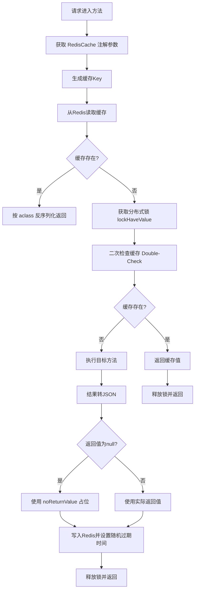

# simple-common-redis Redis 缓存/限流/分布式锁模块

> @author qty
> 版本：1.0.1

## 1. 模块介绍

`simple-common-redis` 是 simple-common 框架的 Redis 基础设施模块，基于 Redisson + Spring Data Redis 提供三大核心能力：

- **声明式缓存**：`@RedisCache` 注解一行实现方法级缓存，内置防缓存雪崩随机过期、分布式锁防缓存击穿、空值缓存防缓存穿透
- **接口限流**：`@CurrentLimiting` 注解基于 Redisson RateLimiter 实现分布式限流，支持按 URL / 用户ID / IP 三个维度
- **高级分布式锁**：`RedissonLockService` 提供可重入锁、公平锁、闭锁（CountDownLatch）、信号量（Semaphore）四种锁模型

该模块依赖 `simple-common-core`，继承其 `LockService` 接口体系并扩展闭锁与信号量能力。

## 2. Maven 依赖

```xml
<dependency>
    <groupId>com.simple.common</groupId>
    <artifactId>simple-common-redis</artifactId>
    <version>1.0.1</version>
</dependency>
```

该模块会自动传递引入以下依赖：

- `simple-common-core`：框架核心基础模块
- `redisson`：Redisson 分布式锁/限流客户端
- `spring-boot-starter-data-redis`：Spring Data Redis（提供 `StringRedisTemplate`）

## 3. 核心功能

| 类名 | 功能描述 | 关键特性 |
|------|---------|---------|
| [`@RedisCache`](simple-common-redis/src/main/java/com/simple/common/redis/annotation/RedisCache.java:16) | 声明式缓存注解 | 方法级缓存、防雪崩随机过期、分布式锁防击穿、空值缓存防穿透 |
| [`@CurrentLimiting`](simple-common-redis/src/main/java/com/simple/common/redis/annotation/CurrentLimiting.java:15) | 接口限流注解 | 按 URL/用户ID/IP 维度、令牌桶算法、等待超时机制 |
| [`RedissonLockService`](simple-common-redis/src/main/java/com/simple/common/redis/common/service/RedissonLockService.java:43) | 分布式锁抽象类 | 继承 `AbsLockService`，扩展闭锁与信号量 |
| [`DefaultRedissonLockService`](simple-common-redis/src/main/java/com/simple/common/redis/service/DefaultRedissonLockService.java:27) | 分布式锁默认实现 | 可重入锁、公平锁、闭锁、信号量，自动续期 |
| [`RedisCacheAspect`](simple-common-redis/src/main/java/com/simple/common/redis/annotation/aspect/RedisCacheAspect.java:32) | 缓存切面 | `@Around` 环绕通知，缓存读取/写入/加锁全流程 |
| [`CurrentLimitingAspect`](simple-common-redis/src/main/java/com/simple/common/redis/annotation/aspect/CurrentLimitingAspect.java:27) | 限流切面 | `@Before` 前置通知，限流拦截 |
| [`RedisCacheAspectManager`](simple-common-redis/src/main/java/com/simple/common/redis/common/manager/RedisCacheAspectManager.java:16) | 缓存Key生成接口 | 可自定义缓存Key策略和过期时间策略 |
| [`DefaultRedisCacheAspectManager`](simple-common-redis/src/main/java/com/simple/common/redis/manager/DefaultRedisCacheAspectManager.java:23) | 缓存Key默认实现 | 基于请求URL + 参数MD5哈希生成Key |
| [`CurrentLimitingManager`](simple-common-redis/src/main/java/com/simple/common/redis/common/manager/CurrentLimitingManager.java:15) | 限流管理器接口 | 可自定义限流算法实现 |
| [`RedissonCurrentLimitingManager`](simple-common-redis/src/main/java/com/simple/common/redis/manager/RedissonCurrentLimitingManager.java:29) | 限流管理器默认实现 | 基于 Redisson RRateLimiter 令牌桶算法 |
| [`RedissonConfig`](simple-common-redis/src/main/java/com/simple/common/redis/common/config/RedissonConfig.java:22) | Redisson 配置类 | 单机模式自动配置、组件扫描 |
| [`RedisCacheProperties`](simple-common-redis/src/main/java/com/simple/common/redis/common/properties/RedisCacheProperties.java:18) | 缓存配置属性 | 缓存包前缀、空值占位、无参Key默认值 |

## 4. 配置说明

### 4.1 Redis 连接配置

Redisson 配置类 [`RedissonConfig`](simple-common-redis/src/main/java/com/simple/common/redis/common/config/RedissonConfig.java:22) 从 Spring Data Redis 的标准配置中读取连接参数，无需额外配置：

| 配置键 | 类型 | 默认值 | 说明 |
|--------|------|--------|------|
| `spring.data.redis.host` | `String` | `localhost` | Redis 主机地址 |
| `spring.data.redis.port` | `int` | `6379` | Redis 端口 |
| `spring.data.redis.database` | `int` | `0` | Redis 数据库索引 |
| `spring.data.redis.password` | `String` | 空 | Redis 密码（为空则不设置） |
| `spring.data.redis.timeout` | `int` | `3000` | 连接超时时间（毫秒） |
| `redisson.connection-min-idle-size` | `int` | `10` | Redisson 最小空闲连接数 |
| `redisson.open` | `String` | `true`（matchIfMissing） | 是否开启 Redisson 自动配置 |

**配置示例**：

```yaml
spring:
  data:
    redis:
      host: 127.0.0.1              # Redis 服务器地址 [必填]，默认 localhost
      port: 6379                    # Redis 服务器端口，默认 6379
      database: 0                   # Redis 数据库索引，默认 0
      password: yourpassword        # Redis 密码，默认空（不设置密码）
      timeout: 3000                 # 连接超时时间（毫秒），默认 3000

redisson:
  open: true                        # 是否开启 Redisson 自动配置，默认 true
  connection-min-idle-size: 10      # Redisson 最小空闲连接数，默认 10
```

> **条件装配**：`RedissonConfig` 和 `DefaultRedissonLockService` 均使用 `@ConditionalOnProperty(prefix = "redisson", name = "open", havingValue = "true", matchIfMissing = true)`，默认开启。如需关闭 Redisson，设置 `redisson.open=false`。

### 4.2 缓存配置（`simple.cache.redis`）

配置类：[`RedisCacheProperties`](simple-common-redis/src/main/java/com/simple/common/redis/common/properties/RedisCacheProperties.java:18)

| 属性 | 配置键 | 类型 | 默认值 | 说明 |
|------|--------|------|--------|------|
| `bag` | `simple.cache.redis.bag` | `boolean` | `true` | 是否为缓存Key添加包前缀 |
| `defaultBag` | `simple.cache.redis.default-bag` | `String` | `"default-cache"` | 缓存Key默认包前缀名称 |
| `noReturnValue` | `simple.cache.redis.no-return-value` | `String` | `"null"` | 方法返回空值时的缓存占位值 |
| `noParametersKey` | `simple.cache.redis.no-parameters-key` | `String` | `"key"` | 方法无参数时的默认Key后缀 |

**配置示例**：

```yaml
simple:
  cache:
    redis:
      bag: true                  # 是否为缓存Key添加包前缀，默认 true
      default-bag: my-app-cache  # 缓存Key默认包前缀名称，默认 "default-cache"
      no-return-value: null      # 方法返回空值时的缓存占位值，默认 "null"
      no-parameters-key: key     # 方法无参数时的默认Key后缀，默认 "key"
```

### 4.3 锁配置（`simple.lock`）

配置类：[`LockProperties`](simple-common-core/src/main/java/com/simple/common/core/common/properties/LockProperties.java:18)（来自 `simple-common-core`）

| 属性 | 配置键 | 类型 | 默认值 | 说明 |
|------|--------|------|--------|------|
| `bag` | `simple.lock.bag` | `boolean` | `true` | 是否为锁Key添加包前缀 |
| `defaultBag` | `simple.lock.default-bag` | `String` | `"lock"` | 锁Key默认包前缀名称 |

> 锁Key格式：`defaultBag:methodName + key`（由 [`AbsLockService.getKey()`](simple-common-core/src/main/java/com/simple/common/core/common/service/lock/AbsLockService.java:21) 生成）

### 4.4 自动配置

模块通过 `META-INF/spring/org.springframework.boot.autoconfigure.AutoConfiguration.imports` 自动注册 [`RedissonConfig`](simple-common-redis/src/main/java/com/simple/common/redis/common/config/RedissonConfig.java:22)，提供以下功能：

- `@ComponentScan(basePackages = {"com.simple.common.redis"})`：自动扫描 redis 模块所有组件（切面、管理器、服务实现等）
- `@Bean Redisson redisson()`：创建 Redisson 客户端 Bean（单机模式），`destroyMethod = "shutdown"` 优雅关闭

## 5. 核心类与接口详细说明

### 5.1 @RedisCache 声明式缓存注解

**类路径**：`com.simple.common.redis.annotation.RedisCache`

**作用目标**：`ElementType.METHOD`（方法级别）

**注解属性**：

| 属性 | 类型 | 默认值 | 说明 |
|------|------|--------|------|
| `head()` | `String` | `RedisCacheConstant.REQ_URL`（`"req_url"`） | 缓存Key标识。默认值 `"req_url"` 表示使用请求URL作为Key前缀；设置为其他值则使用该值作为Key前缀 |
| `cacheTime()` | `int` | `10` | 缓存基础时长（秒） |
| `appendRandomDuration()` | `int` | `5` | 随机追加时长范围（秒）。实际过期时间 = `cacheTime + RandomUtil.randomInt(0, appendRandomDuration)`。设为 `0` 则不追加随机时长 |
| `aclass()` | `Class<?>` | `R.class` | 缓存返回值的反序列化目标类型。默认按 `R<T>` 统一响应格式反序列化 |

**切面处理逻辑**（[`RedisCacheAspect`](simple-common-redis/src/main/java/com/simple/common/redis/annotation/aspect/RedisCacheAspect.java:32)）：



**缓存Key生成规则**（[`DefaultRedisCacheAspectManager.getCacheKey()`](simple-common-redis/src/main/java/com/simple/common/redis/manager/DefaultRedisCacheAspectManager.java:29)）：

1. 如果 `head()` 为 `"req_url"`，取当前请求的 `requestURI` 作为前缀
2. 否则取 `head()` 自定义值作为前缀
3. 如果方法无参数，追加 `&` + `noParametersKey`（默认 `"key"`）
4. 如果方法有参数，追加 `&` + 参数数组的 MD5 哈希值

最终Key格式（`bag=true` 时）：`defaultBag:前缀&参数哈希`

**防缓存雪崩**：实际过期时间 = `cacheTime + RandomUtil.randomInt(0, appendRandomDuration)`，通过随机追加过期时间避免大量缓存同时失效。

**防缓存击穿**：缓存未命中时，通过 `RedissonLockService.lockHaveValue()` 获取分布式锁，只有第一个线程执行数据库查询，其他线程自旋等待后通过 Double-Check 读取缓存。

**防缓存穿透**：方法返回 `null` 时，使用 `noReturnValue`（默认 `"null"` 字符串）作为占位值缓存，避免频繁查询不存在的数据。

### 5.2 @CurrentLimiting 接口限流注解

**类路径**：`com.simple.common.redis.annotation.CurrentLimiting`

**作用目标**：`ElementType.METHOD`（方法级别）

**注解属性**：

| 属性 | 类型 | 默认值 | 说明 |
|------|------|--------|------|
| `key()` | `CurrentLimitingRulesEnum` | `URL` | 限流维度。`URL`：按请求路由限流；`USER_ID`：按当前登录用户ID限流；`IP`：按客户端IP+路由限流 |
| `time()` | `int` | `10` | 单位时长（秒），限流统计的时间窗口 |
| `sum()` | `int` | `2` | 单位时长内允许的请求次数 |
| `waitingTime()` | `int` | `5` | 无令牌时最大等待时间（秒）。在等待时间内尝试获取令牌，超时则拒绝 |
| `waitingTimeErrorStr()` | `String` | `""` | 超时后抛出的异常消息。为空时使用默认异常 `CurrentLimitingErrorEnum.ERROR`（"网络繁忙，请稍后再试"） |

**限流维度枚举** [`CurrentLimitingRulesEnum`](simple-common-redis/src/main/java/com/simple/common/redis/common/enums/CurrentLimitingRulesEnum.java:14)：

| 枚举值 | 说明 | Key生成规则 |
|--------|------|------------|
| `URL` | 根据路由限流 | `request.getRequestURI()` |
| `USER_ID` | 根据当前登录用户限流 | `CoreLoginUserService.getUserId()`（未实现则降级为 `"anonymous"`） |
| `IP` | 根据IP地址限流 | `IPUtils.getIpAddr() + ":" + request.getRequestURI()` |

> **USER_ID 维度依赖**：需要项目中实现 [`CoreLoginUserService`](simple-common-core/src/main/java/com/simple/common/core/common/service/jwt/CoreLoginUserService.java) 接口的 `getUserId()` 方法。未实现时记录错误日志并降级为 `"anonymous"`。

**限流算法**：基于 Redisson `RRateLimiter` 令牌桶算法（[`CurrentLimitingTypeEnum.BARREL`](simple-common-redis/src/main/java/com/simple/common/redis/common/enums/CurrentLimitingTypeEnum.java:14)）。

**切面处理逻辑**（[`CurrentLimitingAspect`](simple-common-redis/src/main/java/com/simple/common/redis/annotation/aspect/CurrentLimitingAspect.java:27)）：

1. `@Before` 前置通知拦截标注 `@CurrentLimiting` 的方法
2. 调用 `CurrentLimitingManager.execute(currentLimiting)` 执行限流检查
3. 返回 `false` 表示被限流：
   - 如果 `waitingTimeErrorStr` 非空，通过 `AssertUtils.error(str)` 抛出自定义异常消息
   - 否则通过 `AssertUtils.error(CurrentLimitingErrorEnum.ERROR)` 抛出默认异常（code="500"，message="网络繁忙，请稍后再试"）

**限流器初始化**（[`RedissonCurrentLimitingManager.getRateLimiter()`](simple-common-redis/src/main/java/com/simple/common/redis/manager/RedissonCurrentLimitingManager.java:74)）：

1. 快速路径：限流器已存在则直接返回
2. 不存在时使用分布式锁（`key + ":init"`，5秒超时）初始化，防止并发重复创建
3. 通过 `trySetRate(RateType.OVERALL, sum, time, RateIntervalUnit.SECONDS)` 设置令牌桶速率

**限流Key格式**（`bag=true` 时）：`lockProperties.defaultBag:限流Key`（默认前缀为 `"lock"`）

### 5.3 RedissonLockService 分布式锁抽象类

**类路径**：`com.simple.common.redis.common.service.RedissonLockService`

**继承关系**：`RedissonLockService` extends [`AbsLockService`](simple-common-core/src/main/java/com/simple/common/core/common/service/lock/AbsLockService.java:11) implements [`LockService`](simple-common-core/src/main/java/com/simple/common/core/common/service/lock/LockService.java:21)

**继承自 `LockService` 的方法**（由 `DefaultRedissonLockService` 实现）：

| 方法签名 | 返回值 | 说明 |
|---------|--------|------|
| `lock(String key, DefaultFunction function)` | `void` | 可重入锁（无返回值）。同一线程可多次获取同一把锁，自动续期（30秒刷新一次） |
| `lockHaveValue(String key, ReturnValueFunction function)` | `Object` | 可重入锁（有返回值）。执行业务函数并返回结果 |
| `fairLock(String key, DefaultFunction function)` | `void` | 公平锁（FIFO）。按请求到达顺序排队执行，适用于抢票/秒杀场景 |

**`RedissonLockService` 扩展的抽象方法**（闭锁与信号量）：

| 方法签名 | 返回值 | 说明 |
|---------|--------|------|
| `countDownLatch(String key, Integer lockSum)` | `void` | 闭锁-上锁。初始化计数器为 `lockSum`，阻塞等待计数器归零 |
| `decreaseCountDownLatch(String key)` | `void` | 闭锁-条件触发。计数器减1，归零时唤醒等待线程 |
| `semaphoreLock(String key, Integer lockSum)` | `void` | 信号量-初始化。设置最大许可数量为 `lockSum` |
| `decreaseSemaphoreLock(String key, Integer lockNum)` | `void` | 信号量-获取许可。获取 `lockNum` 个许可（阻塞等待），许可不足时阻塞 |
| `increaseSemaphoreLock(String key, Integer lockNum)` | `void` | 信号量-释放许可。释放 `lockNum` 个许可 |

**函数式接口**（来自 `simple-common-core`）：

| 接口 | 方法 | 说明 |
|------|------|------|
| [`DefaultFunction`](simple-common-core/src/main/java/com/simple/common/core/function/DefaultFunction.java:10) | `void handler() throws Throwable` | 无参数无返回值 |
| [`ReturnValueFunction`](simple-common-core/src/main/java/com/simple/common/core/function/ReturnValueFunction.java:10) | `Object handler() throws Throwable` | 无参数有返回值 |

### 5.4 DefaultRedissonLockService 默认实现

**类路径**：`com.simple.common.redis.service.DefaultRedissonLockService`

**注解**：`@Component` + `@Primary` + `@ConditionalOnProperty(prefix = "redisson", name = "open", havingValue = "true", matchIfMissing = true)`

**实现特性**：

| 锁类型 | Redisson API | 续期策略 | 释放策略 |
|--------|-------------|---------|---------|
| 可重入锁 `lock` | `redisson.getLock(key)` | `lock.lock()` 自动续期（30秒刷新） | `finally` 中检查 `isLocked()` + `isHeldByCurrentThread()` 后 `unlock()` |
| 可重入锁 `lockHaveValue` | `redisson.getLock(key)` | 同上 | 同上 |
| 公平锁 `fairLock` | `redisson.getFairLock(key)` | 同上 | 同上 |
| 闭锁 `countDownLatch` | `redisson.getCountDownLatch(key)` | — | `trySetCount(lockSum)` + `await()` 阻塞等待 |
| 闭锁 `decreaseCountDownLatch` | `redisson.getCountDownLatch(key)` | — | `countDown()` 计数减1 |
| 信号量 `semaphoreLock` | `redisson.getSemaphore(key)` | — | `trySetPermits(lockSum)` 设置许可数 |
| 信号量 `decreaseSemaphoreLock` | `redisson.getSemaphore(key)` | — | `acquire(lockNum)` 获取许可（阻塞） |
| 信号量 `increaseSemaphoreLock` | `redisson.getSemaphore(key)` | — | `release(lockNum)` 释放许可 |

**锁Key格式**：`defaultBag:methodName + key`（由 [`AbsLockService.getKey()`](simple-common-core/src/main/java/com/simple/common/core/common/service/lock/AbsLockService.java:21) 生成，`methodName` 为调用类型标识如 `"lock"`、`"lockHaveValue"`、`"fairLock"`、`"downLatchLock"`、`"semaphoreLock"`）

**异常处理**：所有方法使用 `@SneakyThrows` 注解，将 `handler()` 抛出的 `Throwable` 转换为非受检异常向上传播。

### 5.5 RedisCacheAspectManager 缓存Key生成接口

**类路径**：`com.simple.common.redis.common.manager.RedisCacheAspectManager`

| 方法签名 | 返回值 | 说明 |
|---------|--------|------|
| `getCacheKey(RedisCache redisCache, ProceedingJoinPoint joinPoint)` | `String` | 生成缓存Key，同时用作分布式锁的Key |
| `getCacheTime(Integer cacheTime, Integer appendRandomDuration)` | `Integer` | 计算实际缓存过期时间（防雪崩随机过期） |

**默认实现** [`DefaultRedisCacheAspectManager`](simple-common-redis/src/main/java/com/simple/common/redis/manager/DefaultRedisCacheAspectManager.java:23)：

- `getCacheKey`：`head="req_url"` 时取 `requestURI`，否则取 `head()` 值；无参数追加 `noParametersKey`，有参数追加参数MD5哈希
- `getCacheTime`：`cacheTime + RandomUtil.randomInt(0, appendRandomDuration)`

### 5.6 CurrentLimitingManager 限流管理器接口

**类路径**：`com.simple.common.redis.common.manager.CurrentLimitingManager`

| 方法签名 | 返回值 | 说明 |
|---------|--------|------|
| `execute(CurrentLimiting currentLimiting)` | `Boolean` | 执行限流检查。`true`-请求通过；`false`-请求被限流拦截 |

**默认实现** [`RedissonCurrentLimitingManager`](simple-common-redis/src/main/java/com/simple/common/redis/manager/RedissonCurrentLimitingManager.java:29)：

- 基于 Redisson `RRateLimiter` 令牌桶算法
- `getKey()`：根据 `CurrentLimitingRulesEnum` 生成限流Key（URL/USER_ID/IP）
- `getRateLimiter()`：双重检查 + 分布式锁初始化限流器，防止并发重复创建
- `execute()`：`rateLimiter.tryAcquire(waitingTime, TimeUnit.SECONDS)`，在等待时间内尝试获取令牌

### 5.7 枚举类

#### CurrentLimitingRulesEnum 限流规则枚举

**类路径**：`com.simple.common.redis.common.enums.CurrentLimitingRulesEnum`

| 枚举值 | name | 说明 |
|--------|------|------|
| `URL` | `"根据路由限流"` | 按请求URL限流 |
| `USER_ID` | `"当前登录用户"` | 按当前登录用户ID限流 |
| `IP` | `"IP地址"` | 按客户端IP+URL限流 |

#### CurrentLimitingErrorEnum 限流异常枚举

**类路径**：`com.simple.common.redis.common.enums.CurrentLimitingErrorEnum`

实现 [`AbstractException`](simple-common-core/src/main/java/com/simple/common/core/exception/AbstractException.java) 接口：

| 枚举值 | code | message |
|--------|------|---------|
| `ERROR` | `"500"` | `"网络繁忙，请稍后再试"` |

#### CurrentLimitingTypeEnum 限流算法类型枚举

**类路径**：`com.simple.common.redis.common.enums.CurrentLimitingTypeEnum`

| 枚举值 | name | 说明 |
|--------|------|------|
| `BARREL` | `"令牌桶算法"` | 令牌桶限流算法 |

### 5.8 RedisCacheConstant 缓存常量

**类路径**：`com.simple.common.redis.common.constant.RedisCacheConstant`

| 常量 | 值 | 说明 |
|------|-----|------|
| `REQ_URL` | `"req_url"` | `@RedisCache.head()` 默认值，表示使用请求URL作为缓存Key前缀 |

## 6. 使用示例

### 6.1 @RedisCache 声明式缓存

> 示例来源：[`RedisCacheController`](simple-common-test/src/main/java/com/simple/common/test/controller/RedisCacheController.java:25)

```java
@Slf4j
@RequestMapping("redis")
@Tag(name = "分布式缓存")
@RestController
public class RedisCacheController {

    @Operation(summary = "分布式缓存")
    @PostMapping("cache")
    @RedisCache
    @SneakyThrows
    public R<List<String>> list() {
        List<String> list = new ArrayList<>();
        for (int i = 0; i < 100; i++) {
            list.add("测试数据：" + i);
            Thread.sleep(10);
        }
        return R.ok(list);
    }
}
```

**自定义缓存参数示例**：

```java
// 缓存300秒，随机追加0-60秒防雪崩，返回类型为自定义DTO
@RedisCache(cacheTime = 300, appendRandomDuration = 60, aclass = MyResponse.class)
@PostMapping("query")
public R<List<MyData>> query(String param) {
    return R.ok(myService.query(param));
}

// 使用自定义Key前缀（非请求URL）
@RedisCache(head = "user:detail")
@GetMapping("detail/{id}")
public R<UserDTO> detail(@PathVariable String id) {
    return R.ok(userService.findById(id));
}
```

### 6.2 @CurrentLimiting 接口限流

> 示例来源：[`CurrentLimitingController`](simple-common-test/src/main/java/com/simple/common/test/controller/CurrentLimitingController.java:27)

```java
@Slf4j
@RequestMapping("limiting")
@Tag(name = "分布式限流")
@RestController
public class CurrentLimitingController {

    @Operation(summary = "限流")
    @GetMapping
    @CurrentLimiting(time = 5, waitingTime = 2)
    public R<Object> CurrentLimiting() {
        return R.ok();
    }
}
```

上述配置：每5秒允许2次请求（`sum` 默认值），无令牌时最多等待2秒，超时抛出默认异常"网络繁忙，请稍后再试"。

**自定义限流维度示例**：

```java
// 按用户ID限流：每10秒最多5次请求，最多等待5秒
@CurrentLimiting(key = CurrentLimitingRulesEnum.USER_ID, time = 10, sum = 5, waitingTime = 5)
@PostMapping("/submit")
public R<?> submit(@RequestBody SubmitRequest req) {
    return R.ok(service.submit(req));
}

// 按IP限流：每60秒最多3次请求，超时返回自定义消息
@CurrentLimiting(key = CurrentLimitingRulesEnum.IP, time = 60, sum = 3, waitingTime = 0,
                 waitingTimeErrorStr = "请求过于频繁，请稍后再试")
@PostMapping("/sms/send")
public R<?> sendSms(String phone) {
    return R.ok(smsService.send(phone));
}
```

### 6.3 RedissonLockService 分布式锁

> 示例来源：[`RedissonLockController`](simple-common-test/src/main/java/com/simple/common/test/controller/RedissonLockController.java:23)

#### 可重入锁 - 扣库存

```java
@Autowired
private RedissonLockService lockService;

@Autowired
private StringRedisTemplate stringRedisTemplate;

@Operation(summary = "可重入锁-扣库存")
@PostMapping("/send1")
public R<Object> sendSms1(String key) {

    DefaultFunction function = () -> {
        String str = stringRedisTemplate.opsForValue().get("stock");
        AssertUtils.notEmpty(str, "库存不存在");
        int stock = Integer.parseInt(str);
        if (stock > 0) {
            int realStock = stock - 1;
            stringRedisTemplate.opsForValue().set("stock", realStock + "");
            log.info("扣减库存成功！，剩余库存：{}", realStock);
        } else {
            log.info("扣减失败！库存不足！");
        }
    };
    lockService.lock(key, function);

    return R.ok();
}
```

#### 闭锁（CountDownLatch）

```java
// 闭锁-上锁：初始化计数器为2，阻塞等待计数器归零
@Operation(summary = "闭锁-上锁")
@GetMapping("/lockdoor")
public R<Object> lockdoor() {
    lockService.countDownLatch("123", 2);
    return R.ok();
}

// 闭锁-解锁条件触发：计数器减1
@Operation(summary = "闭锁-解锁条件触发")
@GetMapping("/leave")
public R<Object> leave() {
    lockService.decreaseCountDownLatch("123");
    return R.ok();
}
```

#### 信号量（Semaphore）

```java
// 信号量-初始化：设置3个许可
@Operation(summary = "信号量")
@GetMapping("/semaphoreLock")
public R<Object> semaphoreLock() {
    lockService.semaphoreLock("123", 3);
    return R.ok();
}

// 信号量-增加（释放许可）
@Operation(summary = "信号量-增加")
@GetMapping("/increaseSemaphoreLock")
public R<Object> increaseSemaphoreLock() {
    lockService.increaseSemaphoreLock("123", 1);
    return R.ok();
}

// 信号量-扣除（获取许可，阻塞等待）
@Operation(summary = "信号量-扣除")
@GetMapping("/decreaseSemaphoreLock")
public R<Object> decreaseSemaphoreLock() {
    lockService.decreaseSemaphoreLock("123", 1);
    return R.ok();
}
```

#### 可重入锁（有返回值）

```java
// 可重入锁（有返回值）：查询并扣减库存后返回剩余库存
Integer newStock = (Integer) lockService.lockHaveValue("stock:" + productId, () -> {
    String str = stringRedisTemplate.opsForValue().get("stock");
    int stock = Integer.parseInt(str);
    int realStock = stock - 1;
    stringRedisTemplate.opsForValue().set("stock", realStock + "");
    return realStock;
});
```

#### 公平锁（FIFO）

```java
// 公平锁：抢票/秒杀场景，按请求到达顺序排队执行
lockService.fairLock("ticket:" + ticketId, () -> {
    if (ticketService.hasRemaining(ticketId)) {
        ticketService.issue(userId, ticketId);
    }
});
```

## 7. 扩展点与自定义方式

### 7.1 自定义缓存Key生成策略

实现 [`RedisCacheAspectManager`](simple-common-redis/src/main/java/com/simple/common/redis/common/manager/RedisCacheAspectManager.java:16) 接口并注册为 Spring Bean，覆盖默认实现：

```java
@Service
public class CustomRedisCacheAspectManager implements RedisCacheAspectManager {

    @Autowired
    private RedisCacheProperties redisCacheProperties;

    @Override
    public String getCacheKey(RedisCache redisCache, ProceedingJoinPoint joinPoint) {
        // 自定义Key生成逻辑
        // 例如：使用方法名 + 参数值拼接
        MethodSignature signature = (MethodSignature) joinPoint.getSignature();
        String methodName = signature.getMethod().getName();
        String argsHash = Arrays.toString(joinPoint.getArgs());
        return methodName + ":" + argsHash;
    }

    @Override
    public Integer getCacheTime(Integer cacheTime, Integer appendRandomDuration) {
        // 自定义过期时间策略
        // 例如：固定不追加随机时间
        return cacheTime;
    }
}
```

### 7.2 自定义限流管理器

实现 [`CurrentLimitingManager`](simple-common-redis/src/main/java/com/simple/common/redis/common/manager/CurrentLimitingManager.java:15) 接口并注册为 Spring Bean，覆盖默认的 Redisson 令牌桶实现：

```java
@Service
public class CustomCurrentLimitingManager implements CurrentLimitingManager {

    @Autowired
    private StringRedisTemplate redisTemplate;

    @Override
    public Boolean execute(CurrentLimiting currentLimiting) {
        // 自定义限流算法
        // 例如：基于 Redis INCR + EXPIRE 的滑动窗口限流
        String key = "rate_limit:" + currentLimiting.key();
        Long count = redisTemplate.opsForValue().increment(key);
        if (count != null && count == 1) {
            redisTemplate.expire(key, currentLimiting.time(), TimeUnit.SECONDS);
        }
        return count != null && count <= currentLimiting.sum();
    }
}
```

### 7.3 自定义分布式锁实现

继承 [`RedissonLockService`](simple-common-redis/src/main/java/com/simple/common/redis/common/service/RedissonLockService.java:43) 并实现所有抽象方法，注册为 `@Component` + `@Primary` 覆盖默认实现：

```java
@Service
@Primary
public class CustomRedissonLockService extends RedissonLockService {

    @Autowired
    private RedissonClient redissonClient;

    @Override
    public void countDownLatch(String key, Integer lockSum) {
        key = getKey("downLatchLock", key);
        RCountDownLatch latch = redissonClient.getCountDownLatch(key);
        latch.trySetCount(lockSum);
        try {
            latch.await();
        } catch (InterruptedException e) {
            Thread.currentThread().interrupt();
        }
    }

    @Override
    public void decreaseCountDownLatch(String key) {
        key = getKey("downLatchLock", key);
        redissonClient.getCountDownLatch(key).countDown();
    }

    @Override
    public void semaphoreLock(String key, Integer lockSum) {
        key = getKey("semaphoreLock", key);
        redissonClient.getSemaphore(key).trySetPermits(lockSum);
    }

    @Override
    public void decreaseSemaphoreLock(String key, Integer lockNum) {
        key = getKey("semaphoreLock", key);
        try {
            redissonClient.getSemaphore(key).acquire(lockNum);
        } catch (InterruptedException e) {
            Thread.currentThread().interrupt();
        }
    }

    @Override
    public void increaseSemaphoreLock(String key, Integer lockNum) {
        key = getKey("semaphoreLock", key);
        redissonClient.getSemaphore(key).release(lockNum);
    }
}
```

### 7.4 自定义限流异常消息

通过 `@CurrentLimiting` 的 `waitingTimeErrorStr` 属性自定义超时异常消息：

```java
@CurrentLimiting(time = 10, sum = 3, waitingTime = 3,
                 waitingTimeErrorStr = "操作过于频繁，请3秒后再试")
@PostMapping("/action")
public R<?> action() {
    return R.ok();
}
```

### 7.5 关闭 Redisson 自动配置

如需使用其他 Redis 客户端（如 Jedis）或手动配置 Redisson，可关闭自动配置：

```yaml
redisson:
  open: false
```

关闭后 `RedissonConfig` 和 `DefaultRedissonLockService` 不会自动注册，需手动提供 `RedissonClient` Bean 和 `RedissonLockService` 实现。

## 8. 注意事项

### 8.1 线程安全

- **`RedisCacheAspect`**：使用 `StringRedisTemplate`（线程安全）和 `RedissonLockService`（基于 Redisson 分布式锁，线程安全）。切面本身无共享可变状态。
- **`RedissonCurrentLimitingManager`**：限流器初始化使用分布式锁（`key + ":init"`）防止并发重复创建，`RRateLimiter` 本身为线程安全。
- **`DefaultRedissonLockService`**：所有锁操作基于 Redisson API，分布式锁本身保证跨进程线程安全。`@SneakyThrows` 将受检异常转为非受检异常，不影响线程安全。
- **锁释放安全**：`finally` 块中先检查 `isLocked()` 再检查 `isHeldByCurrentThread()`，确保只有持锁线程释放锁，避免 `IllegalMonitorStateException`。

### 8.2 性能建议

- **缓存Key长度**：`DefaultRedisCacheAspectManager` 对方法参数使用 MD5 哈希，避免参数过多导致 Key 过长影响 Redis 性能。
- **缓存过期时间**：`appendRandomDuration` 默认为5秒，建议根据业务场景调整。高并发场景适当增大随机范围以增强防雪崩效果。
- **限流器初始化**：首次请求会触发限流器创建（含分布式锁），后续请求走快速路径（`isExists()` 检查），性能开销极小。
- **锁自动续期**：`lock.lock()` 使用 Redisson 默认的看门狗机制（每30秒自动续期），无需手动设置过期时间，避免业务执行时间超过锁过期时间导致的问题。
- **公平锁性能**：公平锁（`fairLock`）维护 FIFO 等待队列，性能略低于非公平锁，仅在需要保证请求顺序时使用。

### 8.3 使用注意

1. **`@RedisCache` 返回类型**：`aclass` 默认为 `R.class`，要求被缓存方法返回 `R<T>` 格式。如需缓存非 `R` 格式的返回值，需设置 `aclass` 为实际返回类型。

2. **`@RedisCache` 空值缓存**：方法返回 `null` 时会缓存 `noReturnValue`（默认 `"null"` 字符串）。这意味着后续请求会命中缓存返回 `null`，直到缓存过期。如不希望缓存空值，需在业务层处理。

3. **`@CurrentLimiting` USER_ID 维度**：需要项目中实现 `CoreLoginUserService` 接口。未实现时会记录错误日志并降级为 `"anonymous"`，此时所有未登录请求共享同一限流桶。

4. **`@CurrentLimiting` 与 `@RedisCache` 组合**：`CurrentLimitingAspect` 使用 `@Before`，`RedisCacheAspect` 使用 `@Around`（`@Order(2)`）。两者可同时使用，限流先于缓存生效。

5. **闭锁使用模式**：`countDownLatch(key, lockSum)` 会阻塞当前线程直到计数器归零。典型用法是一个线程调用 `countDownLatch` 等待，其他线程调用 `decreaseCountDownLatch` 减计数。

6. **信号量使用模式**：`semaphoreLock` 初始化许可数，`decreaseSemaphoreLock` 获取许可（阻塞），`increaseSemaphoreLock` 释放许可。注意方法命名：`decrease` 是获取（减少可用许可），`increase` 是释放（增加可用许可）。

7. **Redisson 单机模式**：`RedissonConfig` 配置为单机模式（`useSingleServer`）。如需集群/哨兵模式，需自定义 `RedissonConfig` 或手动提供 `RedissonClient` Bean。

8. **锁Key前缀**：所有锁Key通过 `AbsLockService.getKey()` 统一添加 `defaultBag:methodName` 前缀，避免不同业务场景的锁Key冲突。可通过 `simple.lock.default-bag` 配置修改前缀。
