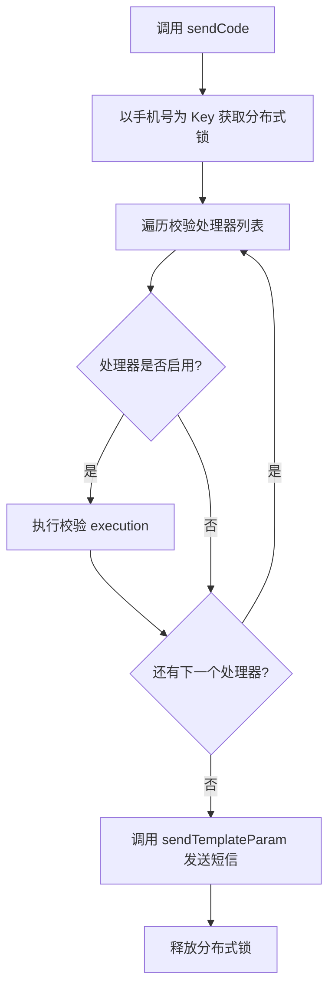
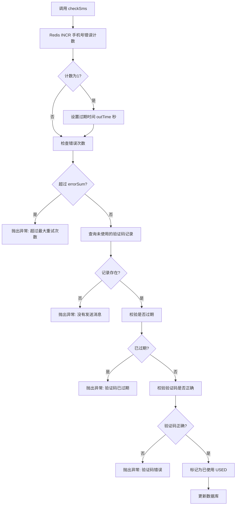

# simple-common-sms 短信服务模块

> @author qty
> 版本：1.0.1

## 1. 模块介绍

`simple-common-sms` 是 simple-common 框架的短信服务模块，默认对接阿里云短信（Dysmsapi），提供三大核心能力：

- **验证码发送**：`SmsService.sendCode()` 发送短信验证码，发送前自动执行责任链校验（时间间隔 / IP 次数 / 手机号次数），并通过分布式锁防止并发重复发送
- **模板短信发送**：`SmsService.sendTemplateParam()` 发送任意模板参数短信，支持自动获取或手动指定客户端 IP，发送结果（成功/失败/异常）全量落库审计
- **验证码校验**：`SmsService.checkSms()` 校验验证码正确性与有效期，内置 Redis 错误次数计数防暴力破解，校验通过后自动标记已使用

该模块依赖 `simple-common-core`（分布式锁、断言工具、IP 工具）、`simple-common-mp`（MyBatis-Plus 数据访问）、`simple-common-redis`（Redis 计数器），以及阿里云短信 SDK（`dysmsapi20170525`）。

## 2. Maven 依赖

```xml
<dependency>
    <groupId>com.simple.common</groupId>
    <artifactId>simple-common-sms</artifactId>
    <version>1.0.1</version>
</dependency>
```

该模块会自动传递引入以下依赖：

| 依赖 | 说明 |
|------|------|
| `simple-common-core` | 框架核心基础模块（LockService、AssertUtils、IPUtils、AlibabaProperties） |
| `aliyun-java-sdk-core` | 阿里云 SDK 核心 |
| `dysmsapi20170525` | 阿里云短信服务 SDK |
| `tea` | 阿里云 Tea SDK 基础库 |

> **provided 依赖**：`simple-common-mp` 和 `simple-common-redis` 为 `provided` 作用域，需由使用方项目自行引入。

## 3. 核心功能

| 类名 | 功能描述 | 关键特性 |
|------|---------|---------|
| [`SmsService`](simple-common-sms/src/main/java/com/simple/common/sms/common/service/SmsService.java:10) | 短信服务接口 | 发送验证码、发送模板短信、校验验证码 |
| [`AbsSmsService`](simple-common-sms/src/main/java/com/simple/common/sms/service/AbsSmsService.java:48) | 短信服务抽象基类 | 责任链校验编排、分布式锁防并发、Redis 错误次数计数 |
| [`AliSmsService`](simple-common-sms/src/main/java/com/simple/common/sms/service/AliSmsService.java:32) | 阿里云短信实现 | AK/SK 认证、模板查询、发送结果审计落库 |
| [`CheckSmsProcess`](simple-common-sms/src/main/java/com/simple/common/sms/common/process/CheckSmsProcess.java:37) | 发送前校验责任链接口 | 继承 `BasProcessService`，枚举控制执行顺序与开关 |
| [`BeforeSmsKindProcess`](simple-common-sms/src/main/java/com/simple/common/sms/common/enums/BeforeSmsKindProcess.java:14) | 校验处理器类型枚举 | 定义三种校验类型及执行顺序 |
| [`TimeIntervalBeforeSmsProcess`](simple-common-sms/src/main/java/com/simple/common/sms/process/TimeIntervalBeforeSmsProcess.java:26) | 时间间隔校验处理器 | 防频繁发送，默认 60 秒间隔 |
| [`IpBeforeSmsProcess`](simple-common-sms/src/main/java/com/simple/common/sms/process/IpBeforeSmsProcess.java:25) | IP 发送次数校验处理器 | 防同一 IP 批量刷短信，默认每日 20 次 |
| [`PhoneBeforeSmsProcess`](simple-common-sms/src/main/java/com/simple/common/sms/process/PhoneBeforeSmsProcess.java:24) | 手机号发送次数校验处理器 | 防同一手机号刷短信，默认每日 5 次 |
| [`SmsProperties`](simple-common-sms/src/main/java/com/simple/common/sms/common/properties/SmsProperties.java:19) | 短信配置属性 | IP 限制、手机号限制、时间间隔、验证码超时、错误次数 |
| [`SmsConfig`](simple-common-sms/src/main/java/com/simple/common/sms/common/config/SmsConfig.java:15) | 自动配置类 | 组件扫描 + MapperScan |
| [`SysSmsCode`](simple-common-sms/src/main/java/com/simple/common/sms/common/entity/sysSmsCode/SysSmsCode.java:33) | 短信验证码实体 | 发送记录、请求状态、使用状态、逻辑删除 |
| [`SysSmsTemplate`](simple-common-sms/src/main/java/com/simple/common/sms/common/entity/sysSmsTemplate/SysSmsTemplate.java:32) | 短信模板实体 | 短信类型、签名、模板 code |

## 4. 配置说明

### 4.1 短信配置（`simple.ali.sms`）

配置类：[`SmsProperties`](simple-common-sms/src/main/java/com/simple/common/sms/common/properties/SmsProperties.java:19)

| 属性 | 配置键 | 类型 | 默认值 | 说明 |
|------|--------|------|--------|------|
| `ipSendMax` | `simple.ali.sms.ip-send-max` | `int` | `20` | 一天同一 IP 发送短信最大次数 |
| `phoneSendMax` | `simple.ali.sms.phone-send-max` | `int` | `5` | 一天同一手机号发送短信最大次数 |
| `timeInter` | `simple.ali.sms.time-inter` | `int` | `60` | 发送最低时间间隔（秒） |
| `outTime` | `simple.ali.sms.out-time` | `int` | `300` | 验证码超时时间（秒），同时用于 Redis 错误计数器的过期时间 |
| `errorSum` | `simple.ali.sms.error-sum` | `int` | `3` | 每次短信验证码允许的错误验证次数 |
| `endpoint` | `simple.ali.sms.endpoint` | `String` | `dysmsapi.aliyuncs.com` | 阿里云短信服务地址 |

### 4.2 阿里云 AK/SK 配置（`simple.ali`）

配置类：[`AlibabaProperties`](simple-common-core/src/main/java/com/simple/common/core/common/properties/AlibabaProperties.java:18)（来自 `simple-common-core`）

| 属性 | 配置键 | 类型 | 说明 |
|------|--------|------|------|
| `accessKeyId` | `simple.ali.access-key-id` | `String` | 阿里云 AccessKey ID |
| `accessKeySecret` | `simple.ali.access-key-secret` | `String` | 阿里云 AccessKey Secret |

**配置示例**：

```yaml
simple:
  ali:
    access-key-id: your-access-key-id
    access-key-secret: your-access-key-secret
    sms:
      ip-send-max: 20
      phone-send-max: 5
      time-inter: 60
      out-time: 300
      error-sum: 3
      endpoint: dysmsapi.aliyuncs.com
```

### 4.3 自动配置

模块通过 `META-INF/spring/org.springframework.boot.autoconfigure.AutoConfiguration.imports` 自动注册 [`SmsConfig`](simple-common-sms/src/main/java/com/simple/common/sms/common/config/SmsConfig.java:15)，提供以下功能：

- `@ComponentScan(basePackages = {"com.simple.common.sms"})`：自动扫描 sms 模块所有组件（服务实现、校验处理器、视图实现等）
- `@MapperScan(basePackages = {"com.simple.common.sms.view"})`：自动扫描 Mapper 接口

## 5. 核心类与接口详细说明

### 5.1 SmsService 短信服务接口

**类路径**：`com.simple.common.sms.common.service.SmsService`

| 方法签名 | 返回值 | 说明 |
|---------|--------|------|
| `sendCode(String mobile, String code, String sendType)` | `void` | 发送短信验证码。先执行责任链校验，再调用 `sendTemplateParam` 发送 |
| `sendTemplateParam(String mobile, String sendType, String templateParam, String ip)` | `void` | 发送模板短信（指定 IP）。由具体平台实现 |
| `sendTemplateParam(String mobile, String sendType, String templateParam)` | `void` | 发送模板短信（自动获取 IP）。`default` 方法，内部调用 `IPUtils.getIpAddr()` 获取客户端 IP |
| `checkSms(String mobile, String code, String sendType)` | `void` | 校验短信验证码。校验失败直接抛出异常 |

> **IP 自动获取**：`sendTemplateParam` 的 `default` 方法通过 [`IPUtils.getIpAddr()`](simple-common-core/src/main/java/com/simple/common/core/utils/IPUtils.java) 获取当前请求的客户端 IP，用于防刷校验和发送记录审计。

### 5.2 AbsSmsService 短信服务抽象基类

**类路径**：`com.simple.common.sms.service.AbsSmsService`

**继承关系**：`AbsSmsService` implements [`SmsService`](simple-common-sms/src/main/java/com/simple/common/sms/common/service/SmsService.java:10)

**自动注入的依赖**：

| 依赖 | 说明 |
|------|------|
| `List<CheckSmsProcess> checkSmsProcessList` | 所有校验处理器列表，Spring 自动按 `Ordered` 排序 |
| `LockService lockService` | 分布式锁服务（来自 `simple-common-core`） |
| `StringRedisTemplate redisTemplate` | Redis 操作模板（用于验证码错误计数） |
| `SmsProperties smsProperties` | 短信配置属性（`protected`，子类可访问） |
| `SysSmsCodeView sysSmsCodeView` | 短信验证码数据库视图 |

#### 5.2.1 sendCode 发送验证码流程



**关键实现**（[`AbsSmsService.sendCode()`](simple-common-sms/src/main/java/com/simple/common/sms/service/AbsSmsService.java:69)）：

1. 以 `mobile`（手机号）为 Key 通过 `lockService.lock()` 获取分布式锁，防止同一手机号并发发送
2. 遍历 `checkSmsProcessList`，对每个处理器检查 `getProcess().isExecute()` 是否为 `true`
3. 启用的处理器调用 `execution(mobile, code)` 执行校验，校验失败抛出异常中断流程
4. 所有校验通过后，调用 `sendTemplateParam(mobile, sendType, "{'code':'" + code + "'}")` 发送验证码
5. 分布式锁在 `lockService.lock()` 内部自动释放

#### 5.2.2 checkSms 校验验证码流程



**关键实现**（[`AbsSmsService.checkSms()`](simple-common-sms/src/main/java/com/simple/common/sms/service/AbsSmsService.java:82)）：

1. **错误次数计数**：通过 `redisTemplate.opsForValue().increment(mobile)` 对手机号进行自增计数
2. **首次设置过期**：计数为 1 时设置过期时间为 `smsProperties.getOutTime()`（默认 300 秒）
3. **防暴力破解**：计数超过 `smsProperties.getErrorSum()`（默认 3 次）时抛出异常"超过最大重试次数，请重新获取验证码"
4. **查询验证码记录**：通过 `sysSmsCodeView.findByTimeAndPhoneAndState()` 查询状态为 `NOT_USED` 的记录
5. **过期校验**：计算记录创建时间与当前时间差，超过 `outTime` 秒则抛出"验证码已过期"
6. **正确性校验**：比对验证码是否一致，不一致抛出"验证码错误"
7. **标记已使用**：校验通过后将状态设置为 `Status.USED` 并更新数据库

### 5.3 AliSmsService 阿里云短信实现

**类路径**：`com.simple.common.sms.service.AliSmsService`

**继承关系**：`AliSmsService` extends [`AbsSmsService`](simple-common-sms/src/main/java/com/simple/common/sms/service/AbsSmsService.java:48)

**注解**：`@Service("aliSmsService")` + `@Slf4j`

**自动注入的依赖**：

| 依赖 | 说明 |
|------|------|
| `SmsProperties smsProperties` | 短信配置（获取 endpoint） |
| `AlibabaProperties alibabaProperties` | 阿里云 AK/SK 配置 |
| `SysSmsCodeView sysSmsCodeView` | 短信验证码数据库视图 |
| `SysSmsTemplateView sysSmsTemplateView` | 短信模板数据库视图 |

#### 5.3.1 sendTemplateParam 发送流程

**关键实现**（[`AliSmsService.sendTemplateParam()`](simple-common-sms/src/main/java/com/simple/common/sms/service/AliSmsService.java:47)）：

1. **查询模板配置**：通过 `sysSmsTemplateView.findByType(sendType)` 根据 `sendType` 查询 `sys_sms_template` 表获取签名和模板 code
2. **构建客户端**：调用 `createClient()` 使用 AK/SK 和 endpoint 创建阿里云短信客户端
3. **构建请求**：设置 `phoneNumbers`（手机号）、`signName`（签名）、`templateCode`（模板 code）、`templateParam`（模板参数 JSON）
4. **初始化记录**：创建 `SysSmsCode` 对象记录发送信息（日期、类型、参数、手机号、IP）
5. **发送短信**：调用 `client.sendSmsWithOptions()` 发送
6. **异常处理**：发送异常时捕获 `Exception`，包装为 `TeaException` 记录日志，将记录状态设为 `ERROR` 保存后抛出"短信发送失败"
7. **结果审计**：响应 code 为 `"OK"` 时记录状态设为 `OK`，否则设为 `ERROR`，完整响应 JSON 存入 `reqResults` 字段
8. **落库**：无论成功或失败，发送记录均通过 `sysSmsCodeView.save()` 保存到 `sys_sms_code` 表

#### 5.3.2 createClient 客户端创建

**关键实现**（[`AliSmsService.createClient()`](simple-common-sms/src/main/java/com/simple/common/sms/service/AliSmsService.java:98)）：

```java
Config config = new Config()
    .setAccessKeyId(alibabaProperties.getAccessKeyId())
    .setAccessKeySecret(alibabaProperties.getAccessKeySecret());
config.endpoint = smsProperties.getEndpoint();
return new Client(config);
```

> **注意**：每次发送短信都会创建新的 `Client` 实例。阿里云 SDK 的 `Client` 是轻量级对象，线程安全，可重复使用。

### 5.4 发送前校验责任链

#### 5.4.1 CheckSmsProcess 校验处理器接口

**类路径**：`com.simple.common.sms.common.process.CheckSmsProcess`

**继承关系**：`CheckSmsProcess` extends [`BasProcessService`](simple-common-core/src/main/java/com/simple/common/core/common/service/process/BasProcessService.java:30)（来自 `simple-common-core`）

| 方法签名 | 返回值 | 说明 |
|---------|--------|------|
| `getProcess()` | `DefaultKindProcess` | 返回对应的 [`BeforeSmsKindProcess`](simple-common-sms/src/main/java/com/simple/common/sms/common/enums/BeforeSmsKindProcess.java:14) 枚举值，控制执行顺序与是否启用 |
| `execution(String phone, String code)` | `void` | 执行校验逻辑，校验失败抛出 `DefaultException` |

> **责任链排序机制**：`BasProcessService` 继承 `Ordered`，`getOrder()` 默认返回 `getProcess().getOrdered()`。Spring 自动按 `Ordered` 值从小到大排序注入 `List<CheckSmsProcess>`。

#### 5.4.2 BeforeSmsKindProcess 校验类型枚举

**类路径**：`com.simple.common.sms.common.enums.BeforeSmsKindProcess`

实现 [`DefaultKindProcess`](simple-common-core/src/main/java/com/simple/common/core/common/enums/process/DefaultKindProcess.java:32) 接口：

| 枚举值 | label | execute | order | 说明 |
|--------|-------|---------|-------|------|
| `TIME_INTERVAL_PROCESS` | 校验发送时间间隔 | `true` | `1` | 第一执行，校验两次发送的最小时间间隔 |
| `IP_PROCESS` | 根据 IP 校验发送次数 | `true` | `2` | 第二执行，校验同一 IP 每日发送次数 |
| `PHONE_PROCESS` | 根据手机号校验发送次数 | `true` | `3` | 第三执行，校验同一手机号每日发送次数 |

> **关闭校验**：将枚举的 `execute` 设为 `false` 可跳过对应校验。`AbsSmsService.sendCode()` 中通过 `process.getProcess().isExecute()` 判断是否执行。

#### 5.4.3 TimeIntervalBeforeSmsProcess 时间间隔校验

**类路径**：`com.simple.common.sms.process.TimeIntervalBeforeSmsProcess`

**注解**：`@Service`

**校验逻辑**（[`TimeIntervalBeforeSmsProcess.execution()`](simple-common-sms/src/main/java/com/simple/common/sms/process/TimeIntervalBeforeSmsProcess.java:40)）：

1. 查询当天该手机号的所有发送记录（`list()` 方法无排序，返回自然顺序）
2. 如果列表非空，取第一条记录的创建时间
3. 计算与当前时间的毫秒差
4. 如果差值 ≤ `smsProperties.getTimeInter()`（默认 60 秒），抛出异常"验证码发送频繁，请{}秒后再试"

#### 5.4.4 IpBeforeSmsProcess IP 发送次数校验

**类路径**：`com.simple.common.sms.process.IpBeforeSmsProcess`

**注解**：`@Service`

**校验逻辑**（[`IpBeforeSmsProcess.execution()`](simple-common-sms/src/main/java/com/simple/common/sms/process/IpBeforeSmsProcess.java:39)）：

1. 通过 `IPUtils.getIpAddr()` 获取当前客户端 IP
2. 查询当天该 IP 的所有发送记录
3. 如果记录数 > `smsProperties.getIpSendMax()`（默认 20 次），抛出异常"今日验证码发送次数已达上限"

#### 5.4.5 PhoneBeforeSmsProcess 手机号发送次数校验

**类路径**：`com.simple.common.sms.process.PhoneBeforeSmsProcess`

**注解**：`@Service`

**校验逻辑**（[`PhoneBeforeSmsProcess.execution()`](simple-common-sms/src/main/java/com/simple/common/sms/process/PhoneBeforeSmsProcess.java:38)）：

1. 查询当天该手机号的所有发送记录
2. 如果记录数 > `smsProperties.getPhoneSendMax()`（默认 5 次），抛出异常"今日发送验证码次数已达上限，请明日再试"

### 5.5 数据模型

#### 5.5.1 SysSmsCode 短信验证码实体

**类路径**：`com.simple.common.sms.common.entity.sysSmsCode.SysSmsCode`

**表名**：`sys_sms_code`（注：Mapper XML 中批量插入语句使用表名 `sys_code_record`）

| 字段 | 数据库列 | 类型 | 说明 |
|------|---------|------|------|
| `id` | `id` | `String` | 主键，`IdType.ASSIGN_UUID` 自动生成 |
| `date` | `date` | `String` | 日期（用于按天统计发送次数） |
| `sendType` | `send_type` | `String` | 短信类型配置标识 |
| `phone` | `phone` | `String` | 手机号 |
| `code` | `code` | `String` | 验证码 / 模板参数 |
| `ip` | `ip` | `String` | IP 地址 |
| `reqStatus` | `req_status` | `Status` | 请求状态（`OK` / `ERROR`） |
| `reqResults` | `req_results` | `String` | 请求结果（完整响应 JSON 或错误信息） |
| `status` | `status` | `Status` | 使用状态（`NOT_USED` / `USED`） |
| `deleted` | `deleted` | `DeleteState` | 逻辑删除标记（`@TableLogic`） |
| `createTime` | `create_time` | `Date` | 创建时间（`FieldFill.INSERT` 自动填充） |
| `updateTime` | `update_time` | `Date` | 修改时间（`FieldFill.INSERT_UPDATE` 自动填充） |

> **Status 枚举**：来自 `simple-common-mp`，`OK` 表示请求成功，`ERROR` 表示请求失败，`NOT_USED` 表示验证码未使用，`USED` 表示验证码已使用。

#### 5.5.2 SysSmsTemplate 短信模板实体

**类路径**：`com.simple.common.sms.common.entity.sysSmsTemplate.SysSmsTemplate`

**表名**：`sys_sms_template`

| 字段 | 数据库列 | 类型 | 说明 |
|------|---------|------|------|
| `id` | `id` | `String` | 主键，`IdType.ASSIGN_UUID` 自动生成 |
| `sendType` | `send_type` | `String` | 短信类型配置标识（业务唯一键） |
| `signName` | `sign_name` | `String` | 短信签名 |
| `templateCode` | `template_code` | `String` | 阿里云模板 code |
| `deleted` | `deleted` | `DeleteState` | 逻辑删除标记（`@TableLogic`） |
| `createTime` | `create_time` | `Date` | 创建时间（`FieldFill.INSERT` 自动填充） |
| `updateTime` | `update_time` | `Date` | 修改时间（`FieldFill.INSERT_UPDATE` 自动填充） |

### 5.6 数据访问层

#### 5.6.1 SysSmsCodeView / MPSysSmsCodeView

**接口**：[`SysSmsCodeView`](simple-common-sms/src/main/java/com/simple/common/sms/common/view/sysSmsCode/SysSmsCodeView.java:13)

**实现**：[`MPSysSmsCodeView`](simple-common-sms/src/main/java/com/simple/common/sms/view/sysSmsCode/MPSysSmsCodeView.java:20)（`@Component`，包级可见）

| 方法签名 | 返回值 | 说明 |
|---------|--------|------|
| `list(FindAllSysSmsCodeRequest)` | `List<SysSmsCode>` | 条件列表查询，使用 `LambdaQueryWrapper` 条件式链式调用 |
| `findByTimeAndPhoneAndState(FindAllSysSmsCodeRequest)` | `List<SysSmsCode>` | 按手机号 + 状态 + 类型 + 验证码查询，`limit 1` 取 1 条。注意：`orderByDesc` 条件取决于 `createTime` 参数是否非空，`checkSms` 调用时未设置 `createTime`，因此不排序 |
| `save(SysSmsCode)` | `void` | 新增记录 |
| `updateById(SysSmsCode)` | `void` | 按主键更新 |
| `deleteByIds(List<String>)` | `void` | 批量删除 |
| `findById(String)` | `SysSmsCode` | 按主键查询，不存在抛出异常 |

**Repository**：[`SysSmsCodeRepository`](simple-common-sms/src/main/java/com/simple/common/sms/view/sysSmsCode/SysSmsCodeRepository.java:16) extends `BaseMapper<SysSmsCode>`

| 方法 | 说明 |
|------|------|
| `insertBatch(List<SysSmsCode>)` | 批量新增（XML 实现） |
| `insertOrUpdateBatch(List<SysSmsCode>)` | 批量新增或更新（XML 实现，`ON DUPLICATE KEY UPDATE`） |

#### 5.6.2 SysSmsTemplateView / MPSysSmsTemplateView

**接口**：[`SysSmsTemplateView`](simple-common-sms/src/main/java/com/simple/common/sms/common/view/sysSmsTemplate/SysSmsTemplateView.java:14)

**实现**：[`MPSysSmsTemplateView`](simple-common-sms/src/main/java/com/simple/common/sms/view/sysSmsTemplate/MPSysSmsTemplateView.java:21)（`@Component`，包级可见）

| 方法签名 | 返回值 | 说明 |
|---------|--------|------|
| `findAll(FindAllSysSmsTemplateRequest)` | `IPage<SysSmsTemplate>` | 分页查询，使用 `LambdaQueryWrapper` |
| `save(SysSmsTemplate)` | `void` | 新增 |
| `updateById(SysSmsTemplate)` | `void` | 按主键更新 |
| `deleteByIds(List<String>)` | `void` | 批量删除 |
| `findById(String)` | `SysSmsTemplate` | 按主键查询，不存在抛出异常 |
| `findByType(String sendType)` | `SysSmsTemplate` | 按短信类型查询模板，不存在抛出异常 |

**Repository**：[`SysSmsTemplateRepository`](simple-common-sms/src/main/java/com/simple/common/sms/view/sysSmsTemplate/SysSmsTemplateRepository.java:16) extends `BaseMapper<SysSmsTemplate>`

| 方法 | 说明 |
|------|------|
| `insertBatch(List<SysSmsTemplate>)` | 批量新增（XML 实现） |
| `insertOrUpdateBatch(List<SysSmsTemplate>)` | 批量新增或更新（XML 实现） |

### 5.7 DTO 请求参数

#### 5.7.1 FindAllSysSmsCodeRequest

**类路径**：`com.simple.common.sms.common.dto.sysSmsCode.FindAllSysSmsCodeRequest`

继承 [`PageBase`](simple-common-mp/src/main/java/com/simple/common/mp/page/PageBase.java)，支持链式调用（`@Accessors(chain = true)`）。

| 字段 | 类型 | 说明 |
|------|------|------|
| `sendType` | `String` | 短信类型 |
| `date` | `String` | 日期 |
| `phone` | `String` | 手机号 |
| `code` | `String` | 验证码 |
| `ip` | `String` | IP 地址 |
| `reqStatus` | `Status` | 请求状态 |
| `reqResults` | `String` | 请求结果 |
| `status` | `Status` | 使用状态 |
| `deleted` | `DeleteState` | 删除标记 |
| `createTime` | `Date` | 创建时间 |
| `updateTime` | `Date` | 修改时间 |

#### 5.7.2 FindAllSysSmsTemplateRequest

**类路径**：`com.simple.common.sms.common.dto.sysSmsTemplate.FindAllSysSmsTemplateRequest`

继承 [`PageBase`](simple-common-mp/src/main/java/com/simple/common/mp/page/PageBase.java)，支持链式调用。

| 字段 | 类型 | 说明 |
|------|------|------|
| `signName` | `String` | 短信签名 |
| `templateCode` | `String` | 模板 code |
| `deleted` | `DeleteState` | 删除标记 |
| `createTime` | `Date` | 创建时间 |
| `updateTime` | `Date` | 修改时间 |

## 6. 使用示例

### 6.1 发送验证码

```java
@Autowired
private SmsService smsService;

// 发送登录验证码
String code = "123456";
smsService.sendCode("13800138000", code, "LOGIN");
// 参数：mobile=手机号, code=验证码, sendType=短信类型配置标识
```

> **前置条件**：数据库 `sys_sms_template` 表中需存在 `send_type = "LOGIN"` 的模板记录，包含阿里云签名和模板 code。

### 6.2 发送模板短信

```java
// 发送模板短信（自动获取客户端 IP）
smsService.sendTemplateParam("13800138000", "ORDER_NOTIFY", "{\"orderNo\":\"20240101001\"}");

// 发送模板短信（手动指定 IP）
smsService.sendTemplateParam("13800138000", "ORDER_NOTIFY", "{\"orderNo\":\"20240101001\"}", "192.168.1.1");
```

> **注意**：`sendTemplateParam` 不执行责任链校验，直接发送。责任链校验仅在 `sendCode` 中触发。模板参数需为合法 JSON 字符串。

### 6.3 校验验证码

```java
// 校验验证码，校验失败直接抛出异常
smsService.checkSms("13800138000", "123456", "LOGIN");
// 校验通过后，验证码记录状态自动标记为 USED
```

### 6.4 完整业务流程示例

```java
@Service
public class UserLoginService {

    @Autowired
    private SmsService smsService;

    /**
     * 发送登录验证码
     */
    public void sendLoginCode(String phone) {
        // 生成 6 位随机验证码
        String code = String.valueOf((int) ((Math.random() * 9 + 1) * 100000));
        // 发送验证码（内部自动执行责任链校验 + 分布式锁）
        smsService.sendCode(phone, code, "LOGIN");
    }

    /**
     * 校验登录验证码
     */
    public void verifyLoginCode(String phone, String code) {
        // 校验失败会抛出异常，由全局异常处理器统一处理
        smsService.checkSms(phone, code, "LOGIN");
    }
}
```

## 7. 扩展点与自定义方式

### 7.1 对接其他短信平台

继承 [`AbsSmsService`](simple-common-sms/src/main/java/com/simple/common/sms/service/AbsSmsService.java:48) 并实现 `sendTemplateParam` 方法，注册为 Spring Bean 覆盖默认实现：

```java
@Service("smsService")
@Primary
public class TencentSmsService extends AbsSmsService {

    @Override
    public void sendTemplateParam(String mobile, String sendType, String templateParam, String ip) {
        // 1. 查询模板配置（可复用 SysSmsTemplateView）
        // 2. 调用腾讯云短信 API 发送
        // 3. 记录发送结果到 sys_sms_code 表
    }
}
```

> **注意**：`AbsSmsService` 已实现 `sendCode` 和 `checkSms`，子类只需实现 `sendTemplateParam`。如需自定义校验逻辑或验证码校验逻辑，可覆盖对应方法。

### 7.2 新增发送前校验处理器

实现 [`CheckSmsProcess`](simple-common-sms/src/main/java/com/simple/common/sms/common/process/CheckSmsProcess.java:37) 接口，并在 [`BeforeSmsKindProcess`](simple-common-sms/src/main/java/com/simple/common/sms/common/enums/BeforeSmsKindProcess.java:14) 枚举中新增类型：

```java
// 1. 在 BeforeSmsKindProcess 枚举中新增类型
BLACKLIST_PROCESS("手机号黑名单校验", true, 4);

// 2. 实现校验处理器
@Service
public class BlacklistBeforeSmsProcess implements CheckSmsProcess {

    @Autowired
    private BlacklistService blacklistService;

    @Override
    public DefaultKindProcess getProcess() {
        return BeforeSmsKindProcess.BLACKLIST_PROCESS;
    }

    @Override
    public void execution(String phone, String code) {
        AssertUtils.isTrue(!blacklistService.isBlacklisted(phone), "该手机号已被加入黑名单");
    }
}
```

> Spring 会自动将新的 `CheckSmsProcess` 实现注入 `AbsSmsService.checkSmsProcessList`，按 `order` 值排序执行。

### 7.3 关闭特定校验

修改 [`BeforeSmsKindProcess`](simple-common-sms/src/main/java/com/simple/common/sms/common/enums/BeforeSmsKindProcess.java:14) 枚举的 `execute` 字段为 `false`：

```java
// 关闭 IP 发送次数校验
IP_PROCESS("根据ip校验发送次数", false, 2),
```

> `AbsSmsService.sendCode()` 中通过 `process.getProcess().isExecute()` 判断，`false` 时跳过该处理器。

### 7.4 自定义短信配置

通过 `application.yml` 调整防刷策略参数：

```yaml
simple:
  ali:
    sms:
      ip-send-max: 50        # 放宽 IP 限制
      phone-send-max: 10     # 放宽手机号限制
      time-inter: 30         # 缩短时间间隔
      out-time: 600          # 延长验证码有效期
      error-sum: 5           # 增加错误重试次数
```

## 8. 注意事项

### 8.1 线程安全

- **`AbsSmsService.sendCode()`**：通过 `lockService.lock(mobile, function)` 以手机号为 Key 获取分布式锁，保证同一手机号的发送操作串行化，防止并发绕过校验。
- **`AbsSmsService.checkSms()`**：通过 `redisTemplate.opsForValue().increment(mobile)` 原子自增操作实现错误次数计数，Redis INCR 是原子操作，线程安全。
- **`AliSmsService`**：每次发送创建新的 `Client` 实例，无共享可变状态。`SmsProperties` 和 `AlibabaProperties` 为不可变配置对象（Spring 单例注入）。
- **校验处理器**：`@Service` 单例，依赖注入的 `SysSmsCodeView` 和 `SmsProperties` 均为线程安全。处理器内部无共享可变状态。

### 8.2 性能建议

- **分布式锁粒度**：`sendCode` 以手机号为锁 Key，不同手机号可并行发送，不会相互阻塞。
- **校验查询优化**：`list()` 查询当天记录时建议在 `date` + `phone` / `date` + `ip` 上建立联合索引，避免全表扫描。
- **Redis 计数器**：`checkSms` 的错误计数器使用 Redis INCR + EXPIRE，性能极高。过期时间与验证码有效期一致（`outTime`），过期后自动清除。
- **阿里云客户端**：`createClient()` 每次创建新实例，阿里云 SDK `Client` 为轻量级对象。如需优化可缓存复用。

### 8.3 使用注意

1. **模板配置前置**：使用前需在 `sys_sms_template` 表中配置短信模板，`send_type` 为业务标识，`sign_name` 和 `template_code` 需与阿里云控制台一致。

2. **表名差异**：`SysSmsCode` 实体注解为 `@TableName("sys_sms_code")`，但 Mapper XML（[`SysSmsCodeRepository.xml`](simple-common-sms/src/main/resources/mapper/SysSmsCodeRepository.xml:6)）中批量插入语句使用表名 `sys_code_record`。使用批量操作时需注意表名一致性。

3. **`sendCode` 与 `sendTemplateParam` 的校验差异**：`sendCode` 会执行责任链校验（时间间隔 / IP / 手机号次数），而 `sendTemplateParam` 不执行校验直接发送。如需对模板短信也进行防刷校验，需在业务层自行实现。

4. **验证码生成**：模块不提供验证码生成功能，调用方需自行生成验证码字符串后传入 `sendCode`。

5. **Redis 依赖**：`checkSms` 依赖 `StringRedisTemplate` 进行错误次数计数，使用方项目必须引入 `simple-common-redis` 并配置 Redis 连接。

6. **分布式锁依赖**：`sendCode` 依赖 `LockService`（来自 `simple-common-core`），使用方项目需提供 `LockService` 的实现（如 `simple-common-redis` 的 `DefaultRedissonLockService`）。

7. **IP 获取**：`IPUtils.getIpAddr()` 从 HTTP 请求头中获取客户端 IP，支持 `X-Forwarded-For`、`X-Real-IP` 等代理头。如部署在反向代理后，需确保代理正确传递了这些头信息。

8. **验证码记录的 `code` 字段**：`sendCode` 发送验证码时，`code` 字段存储的是模板参数 `{'code':'123456'}` 而非纯验证码。`checkSms` 校验时通过 `findByTimeAndPhoneAndState` 传入 `code` 参数查询匹配记录。
