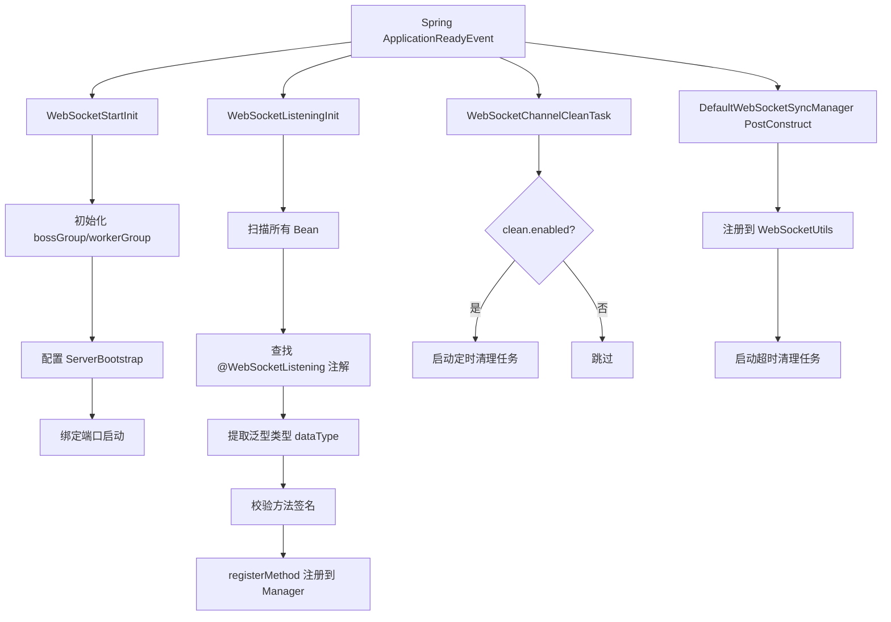
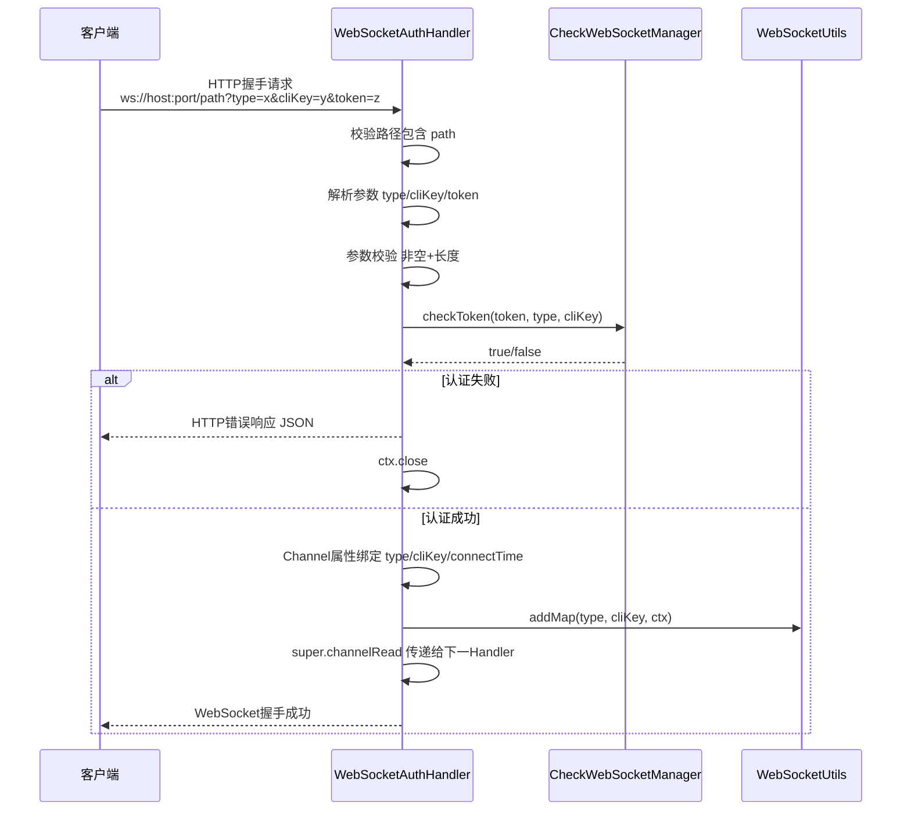
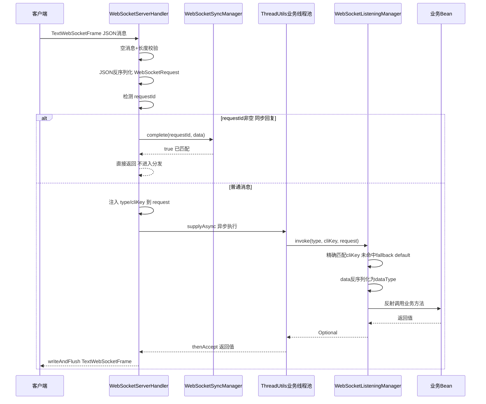
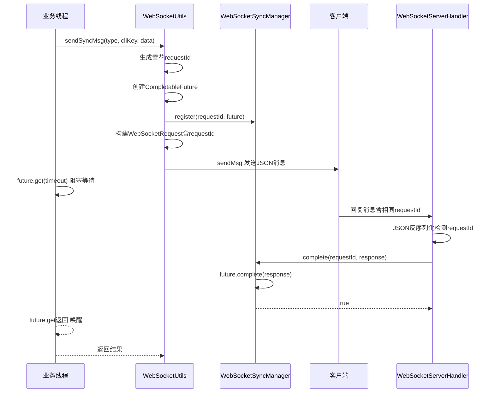
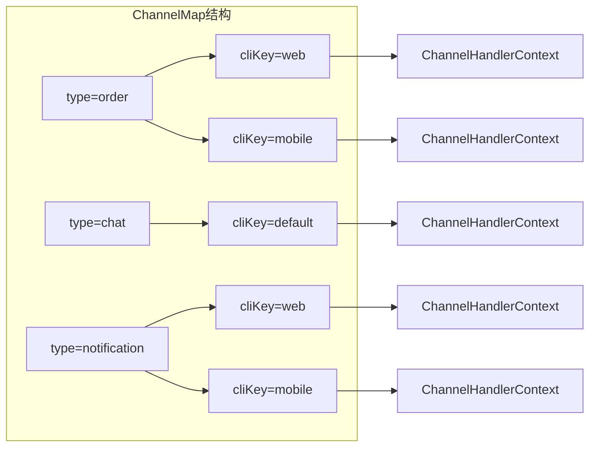

# simple-common-websocket 实时通信模块

> @author qty
> 版本：1.0.1

## 1. 模块介绍

`simple-common-websocket` 是基于 Netty 实现的 WebSocket 实时通信模块，提供高性能、线程安全的双向通信能力。该模块支持多端登录、消息分发、同步请求-响应等核心特性，适用于即时通讯、实时数据推送、服务端主动调用客户端等场景。

该模块提供以下核心能力：

- **Netty 服务启动**：基于 `ServerBootstrap` 的 NIO 服务，可配置线程数、端口、握手路径、缓冲区等参数
- **WebSocket 握手认证**：`WebSocketAuthHandler` 在握手阶段校验 `type`/`cliKey`/`token` 参数，支持自定义鉴权
- **消息分发**：`@WebSocketListening` 注解按 `type` + `cliKey` 路由消息到业务方法，支持 `default` 兜底处理器
- **多级通道存储**：`ChannelMap<K, V, T>` 实现用户→设备→Channel 的多级映射，天然支持多端登录
- **同步请求-响应**：`WebSocketSyncManager` 基于 Correlation ID + `CompletableFuture` 实现服务端阻塞等待客户端回复
- **通道清理**：定时扫描清理已断开但未正确移除的无效通道，防止内存泄漏
- **异步处理**：业务方法在 `ThreadUtils.supplyAsync()` 的业务线程池中执行，不阻塞 Netty EventLoop

## 2. Maven 依赖

```xml
<dependency>
    <groupId>com.simple.common</groupId>
    <artifactId>simple-common-websocket</artifactId>
    <version>1.0.1</version>
</dependency>
```

该模块会自动传递引入以下依赖：

- `simple-common-core`：核心基础模块（`IdUtils`、`JsonUtils`、`ThreadUtils`、`AssertUtils` 等）
- `netty-all`：Netty 网络框架

## 3. 核心功能

| 类名 | 功能描述 | 关键特性 |
|------|---------|---------|
| [`WebSocketProperties`](simple-common-websocket/src/main/java/com/simple/common/websocket/common/properties/WebSocketProperties.java:17) | 配置属性类 | 端口、路径、线程数、缓冲区、空闲超时、清理任务、同步请求配置 |
| [`WebSocketStartInit`](simple-common-websocket/src/main/java/com/simple/common/websocket/init/WebSocketStartInit.java:31) | 服务启动器 | `ApplicationReadyEvent` 触发，初始化 EventLoopGroup 并绑定端口 |
| [`WebSocketChannelInitializer`](simple-common-websocket/src/main/java/com/simple/common/websocket/initializer/WebSocketChannelInitializer.java:23) | Pipeline 初始化器 | 组装 HTTP 编解码、空闲检测、认证、协议升级、消息处理 Handler |
| [`WebSocketAuthHandler`](simple-common-websocket/src/main/java/com/simple/common/websocket/handler/WebSocketAuthHandler.java:31) | 握手认证处理器 | 参数校验、Token 认证、Channel 属性绑定、通道注册 |
| [`WebSocketServerHandler`](simple-common-websocket/src/main/java/com/simple/common/websocket/handler/WebSocketServerHandler.java:30) | 消息处理器 | 文本帧解析、同步回复检测、异步分发到业务线程池 |
| [`WebSocketListening`](simple-common-websocket/src/main/java/com/simple/common/websocket/common/annotation/WebSocketListening.java:16) | 消息监听注解 | 按 `type`/`cliKey` 路由消息到业务方法 |
| [`WebSocketListeningManager`](simple-common-websocket/src/main/java/com/simple/common/websocket/common/manager/WebSocketListeningManager.java:26) | 监听管理器接口 | 注册监听方法、调用监听方法 |
| [`WebSocketSyncManager`](simple-common-websocket/src/main/java/com/simple/common/websocket/common/manager/WebSocketSyncManager.java:24) | 同步请求管理器接口 | 注册/完成/取消同步请求 |
| [`CheckWebSocketManager`](simple-common-websocket/src/main/java/com/simple/common/websocket/common/manager/CheckWebSocketManager.java:47) | 鉴权管理器接口 | 握手时校验 Token |
| [`ChannelMap`](simple-common-websocket/src/main/java/com/simple/common/websocket/common/channel/ChannelMap.java:20) | 多级通道存储 | key-key-value 映射，读写锁保证复合操作原子性 |
| [`WebSocketUtils`](simple-common-websocket/src/main/java/com/simple/common/websocket/utils/WebSocketUtils.java:30) | 通道管理工具类 | 通道增删、消息发送（异步/同步）、清理、在线检测 |
| [`WebSocketRequest`](simple-common-websocket/src/main/java/com/simple/common/websocket/common/entity/WebSocketRequest.java:25) | 统一消息实体 | 双向通信消息格式，含 `data`/`type`/`cliKey`/`requestId` |
| [`WebSocketChannelCleanTask`](simple-common-websocket/src/main/java/com/simple/common/websocket/init/WebSocketChannelCleanTask.java:26) | 通道清理定时任务 | 定期扫描清理无效通道 |
| [`WebSocketListeningInit`](simple-common-websocket/src/main/java/com/simple/common/websocket/init/WebSocketListeningInit.java:24) | 监听器初始化器 | 启动时扫描 `@WebSocketListening` 注解并注册 |

## 4. 配置说明

### 4.1 WebSocket 服务配置（`simple.websocket`）

配置类：[`WebSocketProperties`](simple-common-websocket/src/main/java/com/simple/common/websocket/common/properties/WebSocketProperties.java:17)

#### 基础配置

| 属性 | 配置键 | 类型 | 默认值 | 说明 |
|------|--------|------|--------|------|
| `port` | `simple.websocket.port` | `int` | `5558` | WebSocket 服务端口 |
| `path` | `simple.websocket.path` | `String` | `"/simple"` | WebSocket 握手路径 |
| `bossThreads` | `simple.websocket.boss-threads` | `int` | `1` | 接收连接线程数 |
| `workerThreads` | `simple.websocket.worker-threads` | `int` | `CPU核心数 * 2` | 工作线程数 |
| `soBacklog` | `simple.websocket.so-backlog` | `int` | `1024` | 等待连接队列长度 |
| `writeBufferHigh` | `simple.websocket.write-buffer-high` | `int` | `65536` | 写缓冲区高水位（字节） |
| `writeBufferLow` | `simple.websocket.write-buffer-low` | `int` | `32768` | 写缓冲区低水位（字节） |
| `readerIdleTime` | `simple.websocket.reader-idle-time` | `int` | `120` | 读空闲超时时间（秒），超时关闭连接 |
| `writerIdleTime` | `simple.websocket.writer-idle-time` | `int` | `0` | 写空闲超时时间（秒，0=不检测） |
| `allIdleTime` | `simple.websocket.all-idle-time` | `int` | `0` | 全空闲超时时间（秒，0=不检测） |
| `maxHttpContentLength` | `simple.websocket.max-http-content-length` | `int` | `65536` | HTTP 消息最大长度（字节） |
| `maxWebSocketFrameSize` | `simple.websocket.max-web-socket-frame-size` | `int` | `655360` | WebSocket 帧最大长度（字节） |
| `maxTextMessageLength` | `simple.websocket.max-text-message-length` | `int` | `1048576` | 文本消息最大长度（字节，默认 1MB） |

#### 通道清理配置（`simple.websocket.clean`）

| 属性 | 配置键 | 类型 | 默认值 | 说明 |
|------|--------|------|--------|------|
| `enabled` | `simple.websocket.clean.enabled` | `boolean` | `true` | 是否启用无效通道清理任务 |
| `interval` | `simple.websocket.clean.interval` | `long` | `60` | 清理间隔时间（秒） |
| `initialDelay` | `simple.websocket.clean.initial-delay` | `long` | `30` | 初始延迟时间（秒） |

#### 同步请求配置（`simple.websocket.sync`）

| 属性 | 配置键 | 类型 | 默认值 | 说明 |
|------|--------|------|--------|------|
| `cleanInterval` | `simple.websocket.sync.clean-interval` | `long` | `30` | 同步请求清理间隔时间（秒） |
| `initialDelay` | `simple.websocket.sync.initial-delay` | `long` | `30` | 同步请求清理初始延迟时间（秒） |
| `timeout` | `simple.websocket.sync.timeout` | `long` | `30` | 同步请求默认超时时间（秒） |

**配置示例**：

```yaml
simple:
  websocket:
    port: 5558                            # WebSocket 服务端口 [必填]，默认 5558
    path: /simple                         # WebSocket 握手路径，默认 "/simple"
    boss-threads: 1                       # 接收连接线程数，默认 1
    worker-threads: 16                    # 工作线程数，默认 CPU核心数 × 2
    reader-idle-time: 120                 # 读空闲超时时间（秒），默认 120，超时关闭连接
    max-text-message-length: 1048576      # 文本消息最大长度（字节），默认 1MB
    clean:
      enabled: true                       # 是否启用无效通道清理任务，默认 true
      interval: 60                        # 清理间隔时间（秒），默认 60
      initial-delay: 30                   # 初始延迟时间（秒），默认 30
    sync:
      timeout: 30                         # 同步请求默认超时时间（秒），默认 30
      clean-interval: 30                  # 同步请求清理间隔时间（秒），默认 30
```

### 4.2 自动配置

模块通过 `META-INF/spring/org.springframework.boot.autoconfigure.AutoConfiguration.imports` 自动注册 [`WebSocketConfig`](simple-common-websocket/src/main/java/com/simple/common/websocket/common/config/WebSocketConfig.java:12)，提供以下功能：

- `@ComponentScan(basePackages = {"com.simple.common.websocket"})`：自动扫描 websocket 模块所有组件

### 4.3 常量定义

常量类：[`WebSocketConstant`](simple-common-websocket/src/main/java/com/simple/common/websocket/common/constant/WebSocketConstant.java:8)

| 常量 | 值 | 说明 |
|------|-----|------|
| `TYPE` | `"type"` | 握手参数名：通道类型 |
| `CLI_KEY` | `"cliKey"` | 握手参数名：客户端标识 |
| `TOKEN` | `"token"` | 握手参数名：认证 Token |
| `ATTR_TYPE` | `"ws_type"` | Channel 属性键：类型 |
| `ATTR_CLI_KEY` | `"ws_cli_key"` | Channel 属性键：客户端标识 |
| `ATTR_CONNECT_TIME` | `"ws_connect_time"` | Channel 属性键：连接时间 |

### 4.4 异常枚举

异常枚举：[`WebsocketExceptionEnum`](simple-common-websocket/src/main/java/com/simple/common/websocket/common/constant/WebsocketExceptionEnum.java:14)（实现 `AbstractException`）

| 枚举值 | code | message | 说明 |
|--------|------|---------|------|
| `INVALID_PATH` | `1001` | 握手路径错误 | 握手 URI 不匹配配置路径 |
| `MISSING_PARAM` | `1002` | 缺少必要参数 | 缺少 `type` 或 `cliKey` 参数 |
| `AUTH_FAILED` | `1003` | 认证失败 | Token 校验未通过 |
| `INVALID_MESSAGE` | `2001` | 消息格式错误 | JSON 解析失败 |
| `MESSAGE_TOO_LARGE` | `2002` | 消息过长 | 超过 `maxTextMessageLength` |
| `PROCESS_ERROR` | `2003` | 处理异常 | 业务方法执行异常 |
| `UNSUPPORTED_FRAME` | `2004` | 不支持的消息类型 | 收到二进制帧等不支持的帧类型 |
| `UNAUTHORIZED` | `2005` | 连接未认证 | Channel 属性中无 type/cliKey |
| `EMPTY_MESSAGE` | `2006` | 消息不能为空 | 收到空文本消息 |

## 5. 核心类与接口详细说明

### 5.1 @WebSocketListening 消息监听注解

**类路径**：`com.simple.common.websocket.common.annotation.WebSocketListening`

标记在 Spring Bean 的方法上，声明该方法为 WebSocket 消息处理器。方法参数必须为 `WebSocketRequest<T>` 或其泛型子类型。

| 属性 | 类型 | 默认值 | 说明 |
|------|------|--------|------|
| `type()` | `String` | 必填 | socket 类型，一个类型在同端只能有一个数据通道 |
| `cliKey()` | `String` | `"default"` | 消息路由匹配键；默认值作为该 type 的兜底处理器 |

**路由规则**：消息到达时，框架先按实际 `cliKey` 精确匹配处理器，未命中则 fallback 到 `"default"` 兜底处理器。

### 5.2 WebSocketRequest\<T\> 统一消息实体

**类路径**：`com.simple.common.websocket.common.entity.WebSocketRequest`

服务端与客户端双向通信均使用此格式。

| 字段 | 类型 | 说明 |
|------|------|------|
| `data` | `T` | 请求数据（泛型） |
| `type` | `String` | 通道类型（客户端→服务端时由框架自动填充） |
| `cliKey` | `String` | 客户端标识（客户端→服务端时由框架自动填充） |
| `requestId` | `String` | 同步请求唯一标识（同步请求时非空，普通消息为 null） |

| 方法签名 | 返回值 | 说明 |
|---------|--------|------|
| `reply(String msg)` | `boolean` | 向当前客户端点对点推送消息（基于 type+cliKey 精确匹配，不广播） |
| `getType()` | `String` | 获取当前通道类型 |
| `getCliKey()` | `String` | 获取当前客户端标识 |
| `getData()` | `T` | 获取消息体 |

> **注意**：`reply()` 底层调用 `WebSocketUtils.sendMsg(type, cliKey, msg)`，断言 `type` 和 `cliKey` 非空。业务方法在 `ThreadUtils.supplyAsync()` 业务线程池中异步执行，`reply()` 可从任意线程安全调用（Netty Channel 线程安全）。

### 5.3 ChannelMap\<K, V, T\> 多级通道存储

**类路径**：`com.simple.common.websocket.common.channel.ChannelMap`

**泛型参数**：`K`=主键类型（如 type），`V`=子键类型（如 cliKey），`T`=值类型（如 `ChannelHandlerContext`）

**线程安全实现**：使用 `ConcurrentHashMap` 存储数据 + `ReentrantReadWriteLock` 保护复合操作（add/del）的原子性。

**内部结构**：

- `keyMap`：`Map<K, Set<V>>` — 主键到子键集合的映射
- `valueMap`：`Map<String, T>` — 复合键（`K&&V`）到值的映射

| 方法签名 | 返回值 | 说明 |
|---------|--------|------|
| `add(K key, V key2, T value)` | `void` | 添加通道（写锁保护） |
| `get(K key)` | `List<T>` | 获取主键下所有值（无则返回 null） |
| `get(K key, V key2)` | `T` | 获取指定复合键的值 |
| `del(K key, V key2)` | `void` | 删除指定通道（写锁保护，子键集合空时移除主键） |
| `del(K key)` | `void` | 删除主键下所有通道 |
| `clear()` | `void` | 清空所有通道 |
| `size()` | `int` | 获取通道总数 |
| `keySize()` | `int` | 获取主键数量 |
| `contains(K key, V key2)` | `boolean` | 检查是否包含指定复合键 |
| `entries()` | `List<Map.Entry<String, T>>` | 获取所有条目（用于遍历清理） |
| `parseKey1(String keyStr)` | `K` | 解析复合键获取主键 |
| `parseKey2(String keyStr)` | `V` | 解析复合键获取子键 |

### 5.4 WebSocketUtils 通道管理工具类

**类路径**：`com.simple.common.websocket.utils.WebSocketUtils`

静态工具类，封装通道管理和消息发送的底层能力。内部维护一个 `ChannelMap<String, String, ChannelHandlerContext>` 实例。

#### 通道管理

| 方法签名 | 返回值 | 说明 |
|---------|--------|------|
| `addMap(String type, String cliKey, ChannelHandlerContext chc)` | `void` | 添加通道，若已存在相同键的旧通道则关闭旧通道 |
| `del(String type, String cliKey, ChannelHandlerContext ctx)` | `void` | 移除指定通道（校验 Channel ID 一致才移除） |
| `cleanInactiveChannels()` | `int` | 清理无效通道，返回清理数量 |
| `getConnectionCount()` | `int` | 获取当前连接总数 |
| `isOnline(String type, String cliKey)` | `boolean` | 检查指定客户端是否在线 |
| `clearAll()` | `void` | 清空所有通道 |
| `maskKey(String key)` | `String` | 对敏感键脱敏（保留首尾各2字符） |

#### 异步消息发送

| 方法签名 | 返回值 | 说明 |
|---------|--------|------|
| `sendMsg(String type, String msg)` | `void` | 向指定类型的所有客户端广播消息 |
| `sendMsg(String type, String cliKey, String msg)` | `boolean` | 向指定客户端点对点发送消息 |

#### 同步消息发送

| 方法签名 | 返回值 | 说明 |
|---------|--------|------|
| `sendSyncMsg(String type, String cliKey, Object data)` | `<T> T` | 同步发送消息并等待回复（默认超时 30 秒） |
| `sendSyncMsg(String type, String cliKey, Object data, long timeout, TimeUnit unit)` | `<T> T` | 同步发送消息并等待回复（指定超时时间） |

**同步请求流程**：
1. 生成雪花 `requestId`
2. 创建 `CompletableFuture` 并注册到 `WebSocketSyncManager`
3. 构建 `WebSocketRequest`（含 `requestId` + `data`）序列化为 JSON 发送
4. 阻塞 `future.get(timeout)` 等待客户端回复
5. 客户端回复消息携带相同 `requestId` 时，`WebSocketServerHandler` 检测并调用 `syncManager.complete()` 唤醒等待线程
6. 超时/异常时调用 `syncManager.cancel()` 清理 Future

### 5.5 WebSocketListeningManager 消息监听管理器

**接口路径**：`com.simple.common.websocket.common.manager.WebSocketListeningManager`

**默认实现**：[`DefaultWebSocketListeningManager`](simple-common-websocket/src/main/java/com/simple/common/websocket/manager/DefaultWebSocketListeningManager.java:24)

| 方法签名 | 返回值 | 说明 |
|---------|--------|------|
| `registerMethod(String type, String cliKey, Object bean, Method method, Class<?> dataType)` | `void` | 注册监听方法 |
| `invoke(String type, String cliKey, WebSocketRequest<?> request)` | `Optional<Object>` | 调用监听方法并返回结果 |

**invoke 路由逻辑**：
1. 按 `type` 查找 `cliKey` → `InvocationTarget` 映射
2. 先精确匹配 `cliKey`，未命中则 fallback 到 `"default"`
3. 命中后，根据 `InvocationTarget.dataType()` 将 `data` 反序列化为目标类型
4. 构建新的 `typedRequest`，注入通道上下文（`type`/`cliKey`），反射调用业务方法
5. 返回 `Optional.of(返回值)`，未命中返回 `Optional.empty()`

### 5.6 WebSocketSyncManager 同步请求管理器

**接口路径**：`com.simple.common.websocket.common.manager.WebSocketSyncManager`

**默认实现**：[`DefaultWebSocketSyncManager`](simple-common-websocket/src/main/java/com/simple/common/websocket/manager/DefaultWebSocketSyncManager.java:29)

| 方法签名 | 返回值 | 说明 |
|---------|--------|------|
| `register(String requestId, CompletableFuture<Object> future)` | `void` | 注册待处理的同步请求 |
| `complete(String requestId, Object response)` | `boolean` | 完成同步请求并唤醒等待线程 |
| `cancel(String requestId)` | `void` | 取消同步请求并清理资源 |

**实现特性**：
- 使用 `ConcurrentHashMap<String, CompletableFuture<Object>>` 存储，线程安全
- `@PostConstruct` 时将自身注册到 `WebSocketUtils`（静态注入），并启动超时清理定时任务
- 定时清理任务（`scheduleWithFixedDelaySafe`）遍历移除已完成或已取消的 Future，防止内存泄漏
- `@PreDestroy` 时取消定时任务

### 5.7 CheckWebSocketManager 鉴权管理器

**接口路径**：`com.simple.common.websocket.common.manager.CheckWebSocketManager`

**默认实现**：[`DefaultCheckWebSocketManager`](simple-common-websocket/src/main/java/com/simple/common/websocket/manager/DefaultCheckWebSocketManager.java:18)（默认不做任何校验，打印警告日志）

| 方法签名 | 返回值 | 说明 |
|---------|--------|------|
| `checkToken(String token, String type, String cliKey)` | `boolean` | 握手认证校验，true=通过，false=拒绝连接 |

### 5.8 InvocationTarget 分发目标

**类路径**：`com.simple.common.websocket.common.entity.InvocationTarget`

`record` 类型，存储监听方法的反射调用信息。

| 字段 | 类型 | 说明 |
|------|------|------|
| `bean` | `Object` | 目标 Bean 实例 |
| `method` | `Method` | 目标方法（构造时 `setAccessible(true)`） |
| `dataType` | `Class<?>` | `WebSocketRequest<T>` 的泛型类型 T |

### 5.9 WebSocketAuthHandler 握手认证处理器

**类路径**：`com.simple.common.websocket.handler.WebSocketAuthHandler`

继承 `ChannelInboundHandlerAdapter`，在握手 HTTP 请求阶段执行认证逻辑。

**处理流程**：
1. 检测 `FullHttpRequest`，校验 URI 是否包含配置的 `path`
2. 解析查询参数 `type`/`cliKey`/`token`
3. 参数校验：`type` 和 `cliKey` 必填，长度限制（type ≤ 64，cliKey ≤ 128）
4. 调用 `CheckWebSocketManager.checkToken()` 校验 Token
5. 认证通过：将 `type`/`cliKey`/`connectTime` 存入 Channel 属性，调用 `WebSocketUtils.addMap()` 注册通道
6. 认证失败：返回 HTTP 错误响应（JSON 格式）并关闭连接

**其他回调**：

| 方法 | 说明 |
|------|------|
| `userEventTriggered` | 收到 `IdleStateEvent` 时关闭超时连接 |
| `channelInactive` | 连接断开时从 `WebSocketUtils` 移除通道 |
| `exceptionCaught` | 异常时关闭连接 |

### 5.10 WebSocketServerHandler 消息处理器

**类路径**：`com.simple.common.websocket.handler.WebSocketServerHandler`

继承 `ChannelInboundHandlerAdapter`，处理 WebSocket 数据帧。

**文本帧处理流程**：
1. 空消息校验 → 消息长度校验（`maxTextMessageLength`）
2. JSON 反序列化为 `WebSocketRequest`
3. **同步回复检测**：若 `requestId` 非空，调用 `webSocketSyncManager.complete()`，匹配成功则直接返回（不进入业务分发）
4. 未匹配同步回复的消息：从 Channel 属性获取 `type`/`cliKey`，注入到 `request`
5. 提交到 `ThreadUtils.supplyAsync()` 业务线程池异步执行 `webSocketListeningManager.invoke()`
6. 返回值非空时，通过 `ctx.writeAndFlush()` 发送给当前客户端
7. 异常时发送错误消息

**二进制帧**：当前不支持，返回 `UNSUPPORTED_FRAME` 错误。

### 5.11 WebSocketChannelInitializer Pipeline 初始化器

**类路径**：`com.simple.common.websocket.initializer.WebSocketChannelInitializer`

继承 `ChannelInitializer<SocketChannel>`，组装 Netty Pipeline。

| Pipeline 顺序 | Handler 名称 | 说明 |
|--------------|-------------|------|
| 1 | `http-codec` | `HttpServerCodec` — HTTP 编解码器 |
| 2 | `aggregator` | `HttpObjectAggregator` — HTTP 消息聚合（maxHttpContentLength） |
| 3 | `http-chunked` | `ChunkedWriteHandler` — 分块写入支持 |
| 4 | `idle-handler` | `IdleStateHandler` — 空闲状态检测（readerIdleTime/writerIdleTime/allIdleTime） |
| 5 | `auth-handler` | `WebSocketAuthHandler` — 握手认证 |
| 6 | `ws-protocol-handler` | `WebSocketServerProtocolHandler` — WebSocket 协议升级 + Close/Ping/Pong 自动处理 |
| 7 | `websocketHandler` | `WebSocketServerHandler` — 消息处理（仅处理 Text/Binary 数据帧） |

### 5.12 WebSocketStartInit 服务启动器

**类路径**：`com.simple.common.websocket.init.WebSocketStartInit`

实现 `ApplicationListener<ApplicationReadyEvent>`，在 Spring 应用就绪后启动 Netty 服务。

**启动流程**：
1. 初始化 `bossGroup`（`NioEventLoopGroup`，bossThreads）和 `workerGroup`（workerThreads）
2. 配置 `ServerBootstrap`：`SO_BACKLOG`、`SO_REUSEADDR`、`TCP_NODELAY`、`SO_KEEPALIVE`、写缓冲区水位、`PooledByteBufAllocator`
3. 绑定端口并启动（`bootstrap.bind(port).sync()`）
4. `@PreDestroy` 时优雅关闭两个 EventLoopGroup

### 5.13 WebSocketListeningInit 监听器初始化器

**类路径**：`com.simple.common.websocket.init.WebSocketListeningInit`

实现 `ApplicationListener<ApplicationReadyEvent>`，启动时扫描所有 Spring Bean 的 `@WebSocketListening` 注解方法并注册。

**初始化流程**：
1. 遍历所有 Bean 定义
2. 对每个 Bean 的 `getDeclaredMethods()` 检查 `@WebSocketListening` 注解
3. 提取 `WebSocketRequest<T>` 的泛型类型 T（通过 `ParameterizedType`）
4. 校验方法签名：参数必须为 `WebSocketRequest` 或其泛型子类型
5. 调用 `manager.registerMethod()` 注册

### 5.14 WebSocketChannelCleanTask 通道清理任务

**类路径**：`com.simple.common.websocket.init.WebSocketChannelCleanTask`

实现 `ApplicationListener<ApplicationReadyEvent>`，定时清理无效通道。

| 方法 | 说明 |
|------|------|
| `onApplicationEvent` | 根据 `clean.enabled` 决定是否启动，使用 `scheduleWithFixedDelaySafe` 调度 |
| `shutdown` | `@PreDestroy` 取消定时任务 |
| `cleanInactiveChannels` | 调用 `WebSocketUtils.cleanInactiveChannels()` 执行清理 |

## 6. 架构与流程

### 6.1 服务启动流程



### 6.2 WebSocket 握手认证流程



### 6.3 消息分发流程



### 6.4 同步请求-响应流程



### 6.5 ChannelMap 多级存储与多端登录



**多端登录支持**：同一 `type` 下不同 `cliKey`（如 `web`、`mobile`）各自维护独立 Channel，互不影响。`sendMsg(type, msg)` 广播到该 type 下所有端，`sendMsg(type, cliKey, msg)` 精确发送到指定端。

**重复连接处理**：`WebSocketUtils.addMap()` 检测到相同 `type+cliKey` 的旧通道仍活跃时，先关闭旧通道再注册新通道，保证同端单连接。

## 7. 使用示例

### 7.1 消息监听处理

> 示例来源：[`WebSocketController`](simple-common-test/src/main/java/com/simple/common/test/controller/WebSocketController.java:27)

```java
@Slf4j
@Component
public class ChatWebSocketHandler {

    // 简单模式：直接返回值，框架自动发送给当前客户端
    // cliKey 默认 "default"，作为 "order" 类型下所有消息的兜底处理器
    @WebSocketListening(type = "order")
    public String handleOrder(WebSocketRequest<String> request) {
        log.info("接收到信息：[type={}, cliKey={}, data={}]",
                request.getType(), request.getCliKey(), request.getData());
        return "msg:ok";
    }

    // 进度推送模式：通过 request.reply() 在处理过程中推送中间消息
    @WebSocketListening(type = "chat")
    public void chatHandler(WebSocketRequest<String> request) {
        log.info("chat 收到消息 [cliKey={}]: {}", request.getCliKey(), request.getData());

        // 推送处理进度（点对点，只发给当前客户端）
        request.reply("{\"status\":\"processing\",\"progress\":30}");

        // 模拟耗时处理
        try {
            Thread.sleep(1000);
        } catch (InterruptedException e) {
            Thread.currentThread().interrupt();
        }

        // 推送最终结果
        request.reply("{\"status\":\"done\",\"result\":\"处理完成: " + request.getData() + "\"}");
    }

    // 为特定 cliKey 注册专属处理器（优先级高于 default）
    @WebSocketListening(type = "notification", cliKey = "mobile")
    public String handleMobileNotification(WebSocketRequest<NotificationMessage> request) {
        notificationService.push(request.getData());
        return "ok";
    }
}
```

### 7.2 服务端主动发送消息

> 示例来源：[`WebSocketController`](simple-common-test/src/main/java/com/simple/common/test/controller/WebSocketController.java:27)

```java
@RestController
@RequestMapping("websocket")
public class WebSocketController {

    private static final String type = "order";
    private static final String cli = "default";

    // 点对点发送
    @PostMapping("send")
    public R<Object> send(String msg) {
        WebSocketUtils.sendMsg(type, cli, msg);
        return R.ok();
    }
}
```

### 7.3 广播消息

```java
// 向指定 type 的所有客户端广播
WebSocketUtils.sendMsg("order", "系统维护通知：服务将于今晚 22:00 重启");
```

### 7.4 同步请求-响应

```java
// 向客户端发送命令，同步等待结果（默认超时 30 秒）
String result = WebSocketUtils.sendSyncMsg("agent", "agent-001", commandData);

// 指定超时时间
String result = WebSocketUtils.sendSyncMsg("agent", "agent-001", commandData, 10, TimeUnit.SECONDS);
```

> **客户端协议约定**：服务端发起同步请求时，消息中 `requestId` 字段非空；客户端处理完成后回复消息时需携带相同的 `requestId`，框架据此匹配等待线程并唤醒。

### 7.5 在线检测与连接监控

```java
// 检查客户端是否在线
boolean online = WebSocketUtils.isOnline("order", "web");

// 获取当前连接总数
int count = WebSocketUtils.getConnectionCount();
```

## 8. 扩展点与自定义方式

### 8.1 自定义鉴权

继承 [`DefaultCheckWebSocketManager`](simple-common-websocket/src/main/java/com/simple/common/websocket/manager/DefaultCheckWebSocketManager.java:18) 并重写 `checkToken` 方法，注册为 `@Component`（覆盖默认实现）：

```java
@Component
public class MyCheckWebSocketManager extends DefaultCheckWebSocketManager {

    @Autowired
    private TokenManager tokenManager;

    @Override
    public boolean checkToken(String token, String type, String cliKey) {
        // 验证 Token 有效性
        try {
            Map<String, Object> payload = tokenManager.check(token, false);
            return payload != null && !payload.isEmpty();
        } catch (Exception e) {
            log.error("WebSocket Token验证失败", e);
            return false;
        }
    }
}
```

### 8.2 自定义消息监听管理器

实现 [`WebSocketListeningManager`](simple-common-websocket/src/main/java/com/simple/common/websocket/common/manager/WebSocketListeningManager.java:26) 接口并注册为 `@Service`（覆盖默认实现）：

```java
@Service
public class MyWebSocketListeningManager implements WebSocketListeningManager {

    private final Map<String, Map<String, InvocationTarget>> listenerMap = new ConcurrentHashMap<>();

    @Override
    public void registerMethod(String type, String cliKey, Object bean, Method method, Class<?> dataType) {
        // 自定义注册逻辑
    }

    @Override
    public Optional<Object> invoke(String type, String cliKey, WebSocketRequest<?> request) {
        // 自定义分发逻辑
        return Optional.empty();
    }
}
```

### 8.3 自定义同步请求管理器

实现 [`WebSocketSyncManager`](simple-common-websocket/src/main/java/com/simple/common/websocket/common/manager/WebSocketSyncManager.java:24) 接口并注册为 `@Service`（覆盖默认实现）：

```java
@Service
public class MyWebSocketSyncManager implements WebSocketSyncManager {

    private final ConcurrentHashMap<String, CompletableFuture<Object>> pendingRequests = new ConcurrentHashMap<>();

    @Override
    public void register(String requestId, CompletableFuture<Object> future) {
        pendingRequests.put(requestId, future);
    }

    @Override
    public boolean complete(String requestId, Object response) {
        CompletableFuture<Object> future = pendingRequests.remove(requestId);
        if (future != null) {
            return future.complete(response);
        }
        return false;
    }

    @Override
    public void cancel(String requestId) {
        CompletableFuture<Object> future = pendingRequests.remove(requestId);
        if (future != null) {
            future.cancel(true);
        }
    }
}
```

> **注意**：自定义同步管理器需在 `@PostConstruct` 中调用 `WebSocketUtils.setSyncManager(this)` 和 `WebSocketUtils.setDefaultSyncTimeout()` 完成静态注入，否则 `sendSyncMsg` 将抛出异常。

## 9. 注意事项

### 9.1 线程安全

- **`ChannelMap`**：使用 `ConcurrentHashMap` + `ReentrantReadWriteLock`，复合操作（add/del）在写锁保护下执行，保证原子性。读操作（get/entries）使用读锁，支持并发读。
- **`DefaultWebSocketListeningManager`**：`listenerMap` 使用 `ConcurrentHashMap`，`computeIfAbsent` 保证并发注册安全。
- **`DefaultWebSocketSyncManager`**：`pendingRequests` 使用 `ConcurrentHashMap`，`complete`/`cancel` 使用 `remove` 保证原子性。
- **`WebSocketUtils`**：静态 `ChannelMap` 实例为 `private static final`，线程安全。`addMap` 关闭旧通道时存在 check-then-act 竞态，但 Netty `channel.close()` 幂等，不影响正确性。
- **业务方法异步执行**：`WebSocketServerHandler` 将消息处理提交到 `ThreadUtils.supplyAsync()` 业务线程池，不阻塞 Netty EventLoop。`reply()` 和 `ctx.writeAndFlush()` 可从任意线程安全调用。

### 9.2 性能建议

- **线程数配置**：`workerThreads` 默认为 `CPU核心数 * 2`，I/O 密集型场景可适当增大。业务方法在独立线程池执行，不影响 Netty I/O 线程。
- **消息长度**：`maxTextMessageLength` 默认 1MB，大消息场景需调大此值，否则会被拒绝处理。
- **空闲超时**：`readerIdleTime` 默认 120 秒，客户端需在此时间内发送心跳或消息，否则连接将被关闭。
- **同步请求超时**：默认 30 秒，长耗时操作需通过 `sendSyncMsg` 指定更大的超时时间，避免阻塞业务线程。
- **通道清理**：定时任务默认 60 秒执行一次，清理已断开但未正确移除的通道，防止内存泄漏。

### 9.3 安全注意

- **默认鉴权放行**：`DefaultCheckWebSocketManager` 默认不做任何校验（打印警告日志），生产环境必须自定义实现 `checkToken` 方法。
- **敏感信息日志**：`cliKey` 在日志中使用 `WebSocketUtils.maskKey()` 脱敏（保留首尾各2字符），`token` 不记录到日志。
- **参数长度限制**：`type` 限制 64 字符，`cliKey` 限制 128 字符，防止超长参数攻击。
- **消息长度限制**：超过 `maxTextMessageLength` 的消息将被拒绝处理并返回错误。

### 9.4 常见问题

1. **连接被立即关闭**：检查握手参数 `type`/`cliKey` 是否必填，`path` 是否匹配配置，Token 认证是否通过。

2. **消息处理无响应**：确认 `@WebSocketListening` 的 `type` 与客户端发送的 `type` 一致；若使用了特定 `cliKey`，确认客户端连接时传入了相同的 `cliKey`，或依赖 `default` 兜底处理器。

3. **同步请求超时**：确认客户端在线（`WebSocketUtils.isOnline`），确认客户端回复消息携带了相同的 `requestId`，检查超时时间是否足够。

4. **`WebSocketSyncManager 未初始化` 异常**：`DefaultWebSocketSyncManager` 在 `@PostConstruct` 时注册到 `WebSocketUtils`，若在 Spring 容器初始化完成前调用 `sendSyncMsg` 会抛出此异常。

5. **多端登录冲突**：同一 `type+cliKey` 的重复连接会关闭旧通道。如需支持多端同时在线，客户端需使用不同的 `cliKey`（如 `web`、`mobile`）。

6. **通道泄漏**：正常断开时 `WebSocketAuthHandler.channelInactive` 会自动移除通道。若因网络异常导致未触发 `channelInactive`，通道清理定时任务会定期扫描清理无效通道。

7. **业务方法阻塞 EventLoop**：业务方法已通过 `ThreadUtils.supplyAsync()` 异步执行，不会阻塞 Netty EventLoop。但 `sendSyncMsg` 会阻塞调用线程，避免在 Netty I/O 线程中调用。
