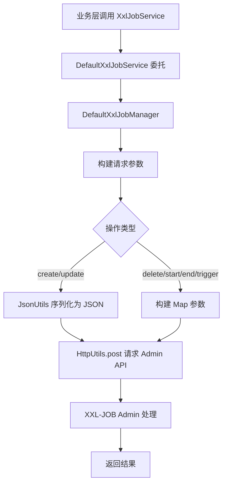

# simple-common-xxljob 分布式任务调度模块

> @author qty
> 版本：1.0.1

## 1. 模块介绍

`simple-common-xxljob` 是 simple-common 框架的 XXL-JOB 分布式任务调度模块，基于 XXL-JOB 官方 SDK（`xxl-job-core`）封装，提供两大核心能力：

- **执行器自动注册**：[`XxlJobConfig`](simple-common-xxljob/src/main/java/com/simple/common/xxljob/config/XxlJobConfig.java:21) 通过 `@ConfigurationProperties` 读取配置，自动创建 [`XxlJobSpringExecutor`](simple-common-xxljob/src/main/java/com/simple/common/xxljob/config/XxlJobConfig.java:48) Bean，完成执行器向 Admin 的注册、心跳维持、日志清理等基础能力
- **任务动态管理**：[`XxlJobManager`](simple-common-xxljob/src/main/java/com/simple/common/xxljob/common/manager/XxlJobManager.java:42) 通过 HTTP API 调用 XXL-JOB Admin 接口，支持代码动态创建任务（Cron / JobHandler / 超时 / 重试）、启动 / 停止 / 立即触发、修改调度配置、删除任务

该模块依赖 `simple-common-core`（[`HttpUtils`](simple-common-core/src/main/java/com/simple/common/core/utils/HttpUtils.java)、[`JsonUtils`](simple-common-core/src/main/java/com/simple/common/core/utils/JsonUtils.java)）和 `xxl-job-core`（执行器核心 SDK）。

## 2. Maven 依赖

```xml
<dependency>
    <groupId>com.simple.common</groupId>
    <artifactId>simple-common-xxljob</artifactId>
    <version>1.0.1</version>
</dependency>
```

该模块会自动传递引入以下依赖：

| 依赖 | 说明 |
|------|------|
| `xxl-job-core` | XXL-JOB 官方核心 SDK，提供执行器、注解调度等基础能力 |
| `simple-common-core` | 框架核心基础模块（HttpUtils、JsonUtils、HttpErrorRecord） |

## 3. 核心功能

| 类名 | 功能描述 | 关键特性 |
|------|---------|---------|
| [`XxlJobConfig`](simple-common-xxljob/src/main/java/com/simple/common/xxljob/config/XxlJobConfig.java:21) | 自动配置类 | 读取 `xxl.job.*` 配置，创建 `XxlJobSpringExecutor` Bean，组件扫描 |
| [`XxlJobManager`](simple-common-xxljob/src/main/java/com/simple/common/xxljob/common/manager/XxlJobManager.java:42) | 任务管理器接口 | 创建、修改、删除、启动、停止、立即触发任务 |
| [`DefaultXxlJobManager`](simple-common-xxljob/src/main/java/com/simple/common/xxljob/manager/DefaultXxlJobManager.java:24) | 任务管理器默认实现 | 基于 HTTP API 调用 XXL-JOB Admin，使用 HttpUtils + JsonUtils |
| [`XxlJobService`](simple-common-xxljob/src/main/java/com/simple/common/xxljob/common/service/XxlJobService.java:43) | 任务管理服务接口 | 与 XxlJobManager 方法签名一致，面向业务层使用 |
| [`DefaultXxlJobService`](simple-common-xxljob/src/main/java/com/simple/common/xxljob/service/DefaultXxlJobService.java:16) | 任务管理服务默认实现 | 委托 `XxlJobManager` 执行，业务层入口 |
| [`XxlJobRequestUrl`](simple-common-xxljob/src/main/java/com/simple/common/xxljob/common/enums/XxlJobRequestUrl.java:15) | Admin API 地址枚举 | 定义 add/update/delete/start/end/trigger 六个接口路径 |
| [`CreateXxlJobTaskRequest`](simple-common-xxljob/src/main/java/com/simple/common/xxljob/common/dto/CreateXxlJobTaskRequest.java:16) | 创建任务请求 DTO | Cron / JobHandler / 超时 / 重试 / 路由策略等全量配置 |
| [`UpdateXxlJobTaskRequest`](simple-common-xxljob/src/main/java/com/simple/common/xxljob/common/dto/UpdateXxlJobTaskRequest.java:15) | 修改任务请求 DTO | 继承 CreateXxlJobTaskRequest，额外增加任务主键 id |

## 4. 配置说明

### 4.1 XXL-JOB 配置（`xxl.job`）

配置类：[`XxlJobConfig`](simple-common-xxljob/src/main/java/com/simple/common/xxljob/config/XxlJobConfig.java:21)

| 属性 | 配置键 | 类型 | 说明 |
|------|--------|------|------|
| `open` | `xxl.job.open` | `String` | 是否开启 xxl-job，设为 `true` 时配置生效（`@ConditionalOnProperty`） |
| `adminAddresses` | `xxl.job.admin-addresses` | `String` | XXL-JOB Admin 地址，如 `http://127.0.0.1:8080/xxl-job-admin` |
| `accessToken` | `xxl.job.access-token` | `String` | 访问令牌，需与 Admin 端配置一致 |
| `executorAppname` | `xxl.job.executor-appname` | `String` | 执行器名称，需与 Admin 端执行器配置一致 |
| `executorPort` | `xxl.job.executor-port` | `int` | 执行器端口，用于 Admin 回调执行任务 |
| `executorLogPath` | `xxl.job.executor-log-path` | `String` | 执行器日志保存地址 |
| `executorLogRetentionDays` | `xxl.job.executor-log-retention-days` | `int` | 日志保存天数 |
| `requestTimeout` | `xxl.job.request-timeout` | `int` | 手动调用 Admin API 的请求超时时间（毫秒） |

**配置示例**：

```yaml
xxl:
  job:
    open: true                                                   # 是否开启 xxl-job [必填]，设为 true 时配置生效
    admin-addresses: http://127.0.0.1:8080/xxl-job-admin         # XXL-JOB Admin 地址 [必填]
    access-token: default_token                                  # 访问令牌 [必填]，需与 Admin 端配置一致
    executor-appname: simple-job-executor                        # 执行器名称 [必填]，需与 Admin 端执行器配置一致
    executor-port: 9999                                          # 执行器端口 [必填]，用于 Admin 回调执行任务
    executor-log-path: /data/applogs/xxl-job/jobhandler          # 执行器日志保存地址 [必填]
    executor-log-retention-days: 30                              # 日志保存天数，默认无（建议设置）
    request-timeout: 5000                                        # 手动调用 Admin API 的请求超时时间（毫秒）
```

### 4.2 自动配置

模块通过 `META-INF/spring/org.springframework.boot.autoconfigure.AutoConfiguration.imports` 自动注册 [`XxlJobConfig`](simple-common-xxljob/src/main/java/com/simple/common/xxljob/config/XxlJobConfig.java:21)，提供以下功能：

- `@ComponentScan(basePackages = {"com.simple.common.xxljob"})`：自动扫描 xxljob 模块所有组件（`DefaultXxlJobManager`、`DefaultXxlJobService`）
- `@ConditionalOnProperty(prefix = "xxl.job", name = "open", havingValue = "true")`：仅当 `xxl.job.open=true` 时配置生效
- `@Bean XxlJobSpringExecutor`：创建执行器 Bean，自动注册到 Admin 并维持心跳

## 5. 核心类与接口详细说明

### 5.1 XxlJobConfig 自动配置类

**类路径**：`com.simple.common.xxljob.config.XxlJobConfig`

**注解**：`@Data` + `@Configuration` + `@ComponentScan` + `@ConfigurationProperties(prefix = "xxl.job")` + `@ConditionalOnProperty`

#### 5.1.1 执行器 Bean 创建

[`XxlJobConfig.xxlJobExecutor()`](simple-common-xxljob/src/main/java/com/simple/common/xxljob/config/XxlJobConfig.java:48) 创建 [`XxlJobSpringExecutor`](simple-common-xxljob/src/main/java/com/simple/common/xxljob/config/XxlJobConfig.java:48) Bean：

1. 设置 `adminAddresses`（Admin 地址）
2. 设置 `appname`（执行器名称）
3. 设置 `port`（执行器端口）
4. 设置 `accessToken`（访问令牌）
5. 设置 `logPath`（日志路径）
6. 设置 `logRetentionDays`（日志保留天数）

> **多网卡/容器部署**：源码注释提示，可借助 `spring-cloud-commons` 的 `InetUtils` 组件定制注册 IP，通过 `spring.cloud.inetutils.preferred-networks` 配置首选网段。

### 5.2 XxlJobManager 任务管理器接口

**类路径**：`com.simple.common.xxljob.common.manager.XxlJobManager`

| 方法签名 | 返回值 | 说明 |
|---------|--------|------|
| [`create(CreateXxlJobTaskRequest)`](simple-common-xxljob/src/main/java/com/simple/common/xxljob/common/manager/XxlJobManager.java:71) | `String` | 创建定时任务，返回任务 ID。创建后默认停止状态，需调用 `start` 启动 |
| [`update(UpdateXxlJobTaskRequest)`](simple-common-xxljob/src/main/java/com/simple/common/xxljob/common/manager/XxlJobManager.java:93) | `void` | 修改任务配置（Cron / 参数 / 描述等），修改后自动重启应用新配置 |
| [`delete(Integer id)`](simple-common-xxljob/src/main/java/com/simple/common/xxljob/common/manager/XxlJobManager.java:114) | `void` | 永久删除任务，删除前建议先停止任务 |
| [`start(Integer id)`](simple-common-xxljob/src/main/java/com/simple/common/xxljob/common/manager/XxlJobManager.java:136) | `void` | 启动任务，已运行则无副作用 |
| [`end(Integer id)`](simple-common-xxljob/src/main/java/com/simple/common/xxljob/common/manager/XxlJobManager.java:157) | `void` | 停止任务，已触发未执行完的任务会继续执行完成 |
| [`trigger(Integer id)`](simple-common-xxljob/src/main/java/com/simple/common/xxljob/common/manager/XxlJobManager.java:179) | `void` | 立即触发一次任务执行，不受 Cron 限制 |

### 5.3 DefaultXxlJobManager 默认实现

**类路径**：`com.simple.common.xxljob.manager.DefaultXxlJobManager`

**注解**：`@Component`

**继承关系**：`DefaultXxlJobManager` implements [`XxlJobManager`](simple-common-xxljob/src/main/java/com/simple/common/xxljob/common/manager/XxlJobManager.java:42)

**自动注入的依赖**：

| 依赖 | 说明 |
|------|------|
| `XxlJobConfig xxlJobConfig` | 配置对象，获取 `adminAddresses` 和 `requestTimeout` |

#### 5.3.1 任务管理流程



#### 5.3.2 各方法实现细节

**create**（[`DefaultXxlJobManager.create()`](simple-common-xxljob/src/main/java/com/simple/common/xxljob/manager/DefaultXxlJobManager.java:30)）：

1. 通过 [`XxlJobRequestUrl.ADD.url(xxlJobConfig)`](simple-common-xxljob/src/main/java/com/simple/common/xxljob/common/enums/XxlJobRequestUrl.java:35) 拼接完整 URL（`adminAddresses + /jobinfo/add`）
2. 通过 [`JsonUtils.toJsonStr(request)`](simple-common-core/src/main/java/com/simple/common/core/utils/JsonUtils.java) 将请求对象序列化为 JSON
3. 调用 [`HttpUtils.post()`](simple-common-core/src/main/java/com/simple/common/core/utils/HttpUtils.java) 发送 POST 请求，传入 `requestTimeout` 超时时间和 `HttpErrorRecord` 错误记录
4. 通过 `post.orElseThrow(record::getException)` 在请求失败时抛出异常
5. 返回任务 ID 字符串

**update**（[`DefaultXxlJobManager.update()`](simple-common-xxljob/src/main/java/com/simple/common/xxljob/manager/DefaultXxlJobManager.java:39)）：

1. 拼接 `/jobinfo/update` URL
2. 序列化 `UpdateXxlJobTaskRequest` 为 JSON
3. 调用 `HttpUtils.post()` 发送请求

**delete / start / end / trigger**（[`DefaultXxlJobManager.delete()`](simple-common-xxljob/src/main/java/com/simple/common/xxljob/manager/DefaultXxlJobManager.java:44) 等）：

1. 构建 `Map<String, Object>` 参数，放入 `id`（`String.valueOf(id)`）
2. 拼接对应 URL（`/jobinfo/remove`、`/jobinfo/start`、`/jobinfo/stop`、`/jobinfo/trigger`）
3. 调用 `HttpUtils.post()` 发送表单参数请求

### 5.4 XxlJobService 任务管理服务

**类路径**：`com.simple.common.xxljob.common.service.XxlJobService`

[`XxlJobService`](simple-common-xxljob/src/main/java/com/simple/common/xxljob/common/service/XxlJobService.java:43) 接口方法签名与 [`XxlJobManager`](simple-common-xxljob/src/main/java/com/simple/common/xxljob/common/manager/XxlJobManager.java:42) 完全一致，面向业务层使用。

**默认实现**：[`DefaultXxlJobService`](simple-common-xxljob/src/main/java/com/simple/common/xxljob/service/DefaultXxlJobService.java:16)（`@Service`），所有方法直接委托给 [`XxlJobManager`](simple-common-xxljob/src/main/java/com/simple/common/xxljob/common/manager/XxlJobManager.java:42) 执行。

> **Manager 与 Service 的区别**：`XxlJobManager` 是底层管理器接口（直接对接 Admin API），`XxlJobService` 是业务服务接口。业务层推荐注入 `XxlJobService`，如需自定义管理逻辑可实现 `XxlJobManager` 接口。

### 5.5 XxlJobRequestUrl Admin API 地址枚举

**类路径**：`com.simple.common.xxljob.common.enums.XxlJobRequestUrl`

| 枚举值 | URL 路径 | label | 说明 |
|--------|---------|-------|------|
| `ADD` | `/jobinfo/add` | 添加 | 创建任务 |
| `UPDATE` | `/jobinfo/update` | 修改 | 修改任务配置 |
| `DELETE` | `/jobinfo/remove` | 删除 | 删除任务 |
| `START` | `/jobinfo/start` | 启动 | 启动任务 |
| `END` | `/jobinfo/stop` | 停止 | 停止任务 |
| `TRIGGER` | `/jobinfo/trigger` | 执行 | 立即触发一次 |

**核心方法**：[`url(XxlJobConfig xxlJobConfig)`](simple-common-xxljob/src/main/java/com/simple/common/xxljob/common/enums/XxlJobRequestUrl.java:35) 返回完整 URL = `adminAddresses + url`。

### 5.6 DTO 请求参数

#### 5.6.1 CreateXxlJobTaskRequest 创建任务请求

**类路径**：`com.simple.common.xxljob.common.dto.CreateXxlJobTaskRequest`

**注解**：`@Data` + `@Accessors(chain = true)` + `@Schema(description = "手动创建xxl-job的请求对象")`

| 字段 | 类型 | 必填 | 默认值 | 说明 |
|------|------|------|--------|------|
| `jobGroup` | `Integer` | ✅ | - | 执行器主键 ID |
| `scheduleConf` | `String` | ✅ | - | 调度配置，值含义取决于调度类型，一般是 Cron 表达式 |
| `executorHandler` | `String` | ✅ | - | JobHandler 名称，需与项目里 `@XxlJob` 注解内容一致 |
| `author` | `String` | ✅ | - | 负责人 |
| `jobDesc` | `String` | ✅ | - | 任务描述 |
| `scheduleType` | `String` | ❌ | `"CRON"` | 调度类型 |
| `glueType` | `String` | ❌ | `"BEAN"` | 运行模式 |
| `executorRouteStrategy` | `String` | ❌ | `"FIRST"` | 执行器路由策略，默认第一个 |
| `misfireStrategy` | `String` | ❌ | `"DO_NOTHING"` | 调度过期策略 |
| `executorBlockStrategy` | `String` | ❌ | `"SERIAL_EXECUTION"` | 阻塞处理策略 |
| `alarmEmail` | `String` | ❌ | - | 报警邮件 |
| `executorParam` | `String` | ❌ | - | 任务参数（JSON 格式） |
| `childJobId` | `String` | ❌ | - | 子任务 ID |
| `executorTimeout` | `int` | ❌ | `30` | 任务执行超时时间（秒） |
| `executorFailRetryCount` | `int` | ❌ | `3` | 失败重试次数 |

> **校验注解**：必填字段使用 `@NotEmpty(message = "xxx不能为空")`，Controller 层配合 `@Validated` 触发校验。

#### 5.6.2 UpdateXxlJobTaskRequest 修改任务请求

**类路径**：`com.simple.common.xxljob.common.dto.UpdateXxlJobTaskRequest`

**继承关系**：`UpdateXxlJobTaskRequest` extends [`CreateXxlJobTaskRequest`](simple-common-xxljob/src/main/java/com/simple/common/xxljob/common/dto/CreateXxlJobTaskRequest.java:16)

**注解**：`@Data` + `@Accessors(chain = true)` + `@Schema(description = "修改任务请求类")`

| 字段 | 类型 | 必填 | 说明 |
|------|------|------|------|
| `id` | `Integer` | ✅ | 任务主键 ID |

> 修改任务时继承父类所有字段，需设置 `id` 指定要修改的任务，其余字段为新的配置值。

## 6. 使用示例

### 6.1 注解方式定义 JobHandler

使用 XXL-JOB 官方 `@XxlJob` 注解定义任务处理器，`value` 需与 `CreateXxlJobTaskRequest.executorHandler` 一致：

```java
import com.xxl.job.core.handler.annotation.XxlJob;
import org.springframework.stereotype.Component;

/**
 * 订单定时任务处理器
 *
 * @author qty
 */
@Component
public class OrderJobHandler {

    /**
     * 订单超时取消
     */
    @XxlJob("orderTimeoutHandler")
    public void orderTimeoutCancel() {
        String param = XxlJobHelper.getJobParam();
        // 业务逻辑：扫描超时订单并取消
    }
}
```

### 6.2 动态创建并启动任务

```java
import com.simple.common.xxljob.common.dto.CreateXxlJobTaskRequest;
import com.simple.common.xxljob.common.manager.XxlJobManager;
import org.springframework.beans.factory.annotation.Autowired;
import org.springframework.stereotype.Service;

/**
 * 订单任务管理服务
 *
 * @author qty
 */
@Service
public class OrderTaskService {

    @Autowired
    private XxlJobManager xxlJobManager;

    /**
     * 创建并启动订单超时取消任务
     */
    public void createOrderTimeoutTask() {
        // 构建创建请求
        CreateXxlJobTaskRequest request = new CreateXxlJobTaskRequest();
        request.setJobGroup(1);
        request.setJobDesc("订单超时取消任务");
        request.setAuthor("system");
        request.setScheduleConf("0 0/5 * * * ?");
        request.setExecutorHandler("orderTimeoutHandler");
        request.setExecutorParam("{\"timeoutMinutes\":30}");
        request.setExecutorTimeout(30);
        request.setExecutorFailRetryCount(3);

        // 创建任务
        String jobId = xxlJobManager.create(request);

        // 启动任务
        xxlJobManager.start(Integer.parseInt(jobId));
    }
}
```

### 6.3 链式调用创建任务

`CreateXxlJobTaskRequest` 支持 `@Accessors(chain = true)` 链式调用：

```java
CreateXxlJobTaskRequest request = new CreateXxlJobTaskRequest()
    .setJobGroup(1)
    .setJobDesc("数据同步任务")
    .setAuthor("system")
    .setScheduleConf("0 0 2 * * ?")
    .setExecutorHandler("dataSyncHandler")
    .setExecutorParam("{\"source\":\"mysql\",\"target\":\"es\"}")
    .setExecutorTimeout(60)
    .setExecutorFailRetryCount(5);

String jobId = xxlJobManager.create(request);
```

### 6.4 修改任务调度配置

```java
import com.simple.common.xxljob.common.dto.UpdateXxlJobTaskRequest;

// 修改任务：改为每 10 分钟执行一次
UpdateXxlJobTaskRequest updateRequest = new UpdateXxlJobTaskRequest();
updateRequest.setId(123);
updateRequest.setScheduleConf("0 0/10 * * * ?");
updateRequest.setJobDesc("订单超时取消任务(已优化)");

xxlJobManager.update(updateRequest);
```

### 6.5 立即触发任务

```java
// 手动触发一次任务执行（测试或紧急执行）
xxlJobManager.trigger(123);
```

### 6.6 停止与删除任务

```java
// 先停止任务
xxlJobManager.end(123);

// 再删除任务
xxlJobManager.delete(123);
```

### 6.7 使用 XxlJobService 业务服务

```java
import com.simple.common.xxljob.common.service.XxlJobService;

@Autowired
private XxlJobService xxlJobService;

// 通过 Service 接口操作（委托给 XxlJobManager）
String jobId = xxlJobService.create(request);
xxlJobService.start(Integer.parseInt(jobId));
xxlJobService.trigger(Integer.parseInt(jobId));
```

## 7. 扩展点与自定义方式

### 7.1 自定义任务管理器

实现 [`XxlJobManager`](simple-common-xxljob/src/main/java/com/simple/common/xxljob/common/manager/XxlJobManager.java:42) 接口，覆盖默认的 HTTP API 调用逻辑：

```java
import com.simple.common.xxljob.common.manager.XxlJobManager;
import com.simple.common.xxljob.common.dto.CreateXxlJobTaskRequest;
import com.simple.common.xxljob.common.dto.UpdateXxlJobTaskRequest;
import org.springframework.stereotype.Component;

/**
 * 自定义任务管理器示例
 *
 * @author qty
 */
@Component
public class CustomXxlJobManager implements XxlJobManager {

    @Override
    public String create(CreateXxlJobTaskRequest request) {
        // 自定义创建逻辑：如增加日志、参数校验、重试机制等
        return "custom-job-id";
    }

    @Override
    public void update(UpdateXxlJobTaskRequest request) {
        // 自定义修改逻辑
    }

    @Override
    public void delete(Integer id) {
        // 自定义删除逻辑
    }

    @Override
    public void start(Integer id) {
        // 自定义启动逻辑
    }

    @Override
    public void end(Integer id) {
        // 自定义停止逻辑
    }

    @Override
    public void trigger(Integer id) {
        // 自定义触发逻辑
    }
}
```

> **注意**：自定义实现注册为 Spring Bean 后，[`DefaultXxlJobService`](simple-common-xxljob/src/main/java/com/simple/common/xxljob/service/DefaultXxlJobService.java:16) 会自动注入新的实现。如需保留默认实现，可使用 `@Primary` 或 `@Qualifier` 区分。

### 7.2 自定义任务管理服务

实现 [`XxlJobService`](simple-common-xxljob/src/main/java/com/simple/common/xxljob/common/service/XxlJobService.java:43) 接口，在业务层增加额外逻辑（如权限校验、操作审计）：

```java
import com.simple.common.xxljob.common.service.XxlJobService;
import org.springframework.stereotype.Service;

/**
 * 带审计日志的任务管理服务
 *
 * @author qty
 */
@Service
public class AuditableXxlJobService implements XxlJobService {

    @Autowired
    private XxlJobManager xxlJobManager;

    @Override
    public String create(CreateXxlJobTaskRequest request) {
        // 记录操作日志
        log.info("创建任务: {}", request.getJobDesc());
        String jobId = xxlJobManager.create(request);
        // 审计落库
        return jobId;
    }

    // 其他方法...
}
```

### 7.3 多网卡 / 容器部署 IP 定制

[`XxlJobConfig`](simple-common-xxljob/src/main/java/com/simple/common/xxljob/config/XxlJobConfig.java:21) 源码注释提供了多网卡场景的解决方案：

1. 引入 `spring-cloud-commons` 依赖
2. 配置 `spring.cloud.inetutils.preferred-networks: 'xxx.xxx.xxx.'`
3. 通过 `InetUtils.findFirstNonLoopbackHostInfo().getIpAddress()` 获取注册 IP

## 8. 注意事项

### 8.1 线程安全

- **[`DefaultXxlJobManager`](simple-common-xxljob/src/main/java/com/simple/common/xxljob/manager/DefaultXxlJobManager.java:24)**：`@Component` 单例，依赖注入的 `XxlJobConfig` 为不可变配置对象（Spring 单例注入）。每次方法调用创建局部 `Map` / JSON 字符串，无共享可变状态，线程安全。
- **[`DefaultXxlJobService`](simple-common-xxljob/src/main/java/com/simple/common/xxljob/service/DefaultXxlJobService.java:16)**：`@Service` 单例，纯委托调用，无共享状态。
- **[`XxlJobConfig`](simple-common-xxljob/src/main/java/com/simple/common/xxljob/config/XxlJobConfig.java:21)**：`@Configuration` 单例，`@ConfigurationProperties` 绑定的配置字段在启动时初始化，运行期不可变。
- **[`XxlJobSpringExecutor`](simple-common-xxljob/src/main/java/com/simple/common/xxljob/config/XxlJobConfig.java:48)**：XXL-JOB 官方执行器，内部线程安全。

### 8.2 性能建议

- **请求超时**：`requestTimeout` 配置建议根据 Admin 响应速度合理设置（默认无值时由 HttpUtils 决定），避免长时间阻塞调用线程。
- **批量操作**：如需批量创建任务，建议在业务层循环调用 `create` 方法，避免一次性发送大量 HTTP 请求导致 Admin 压力过大。
- **任务参数**：`executorParam` 建议使用 JSON 格式，便于 JobHandler 解析和扩展。

### 8.3 使用注意

1. **配置前置**：使用前需在 `application.yml` 中配置 `xxl.job.open=true` 及相关参数，并确保 XXL-JOB Admin 服务已启动且网络可达。

2. **执行器注册**：`executorAppname` 需与 Admin 控制台中配置的执行器名称一致，否则任务无法调度到正确的执行器。

3. **JobHandler 一致性**：`CreateXxlJobTaskRequest.executorHandler` 必须与项目中 `@XxlJob("xxx")` 注解的 `value` 完全一致，否则任务触发时找不到处理器。

4. **任务创建后状态**：通过 `create` 方法创建的任务默认为停止状态，必须调用 `start` 方法才能开始调度执行。

5. **修改任务自动重启**：`update` 方法修改任务后，XXL-JOB Admin 会自动重启任务以应用新配置，无需手动停止再启动。

6. **删除前停止**：删除任务前建议先调用 `end` 停止任务，避免正在执行的任务被中断导致数据不一致。

7. **Admin API 认证**：HTTP API 调用依赖 Admin 的 Cookie 认证（XXL-JOB Admin 默认需登录）。如 Admin 配置了 `accessToken`，需确保 `xxl.job.access-token` 配置一致。

8. **`requestTimeout` 单位**：该值传递给 [`HttpUtils.post()`](simple-common-core/src/main/java/com/simple/common/core/utils/HttpUtils.java)，具体单位以 HttpUtils 实现为准，配置时需注意。

9. **`jobGroup` 获取**：`jobGroup` 为执行器在 Admin 中的主键 ID（非 appname），需通过 Admin 控制台或 API 查询获取。
