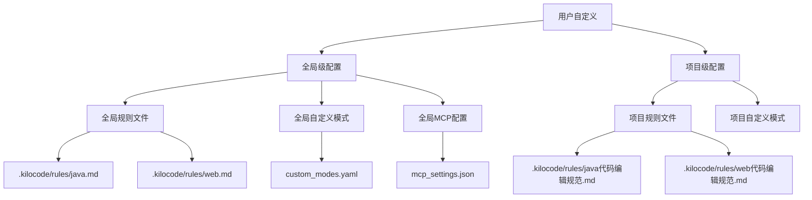

# Kilo Code 智能体（Agent）自定义指南

## 概述

Kilo Code 智能体（即"模式" Mode）的自定义通过两个层面实现：

1. **全局级**：应用于所有项目
2. **项目级**：仅应用于当前工作区

两套配置的优先级为：**项目级 > 全局级**。当同名模式（slug）同时存在于两者时，项目级配置会覆盖全局级配置。

---

## 一、自定义模式（Custom Modes）

### 1.1 配置文件位置

| 级别 | 配置文件路径 | 说明 |
|------|-------------|------|
| **全局级** | `C:\Users\Admin\.kilocode\globalStorage\kilo code.kilo-code\settings\custom_modes.yaml` | 自动创建，所有项目共享 |
| **项目级** | `{项目根目录}\.kilocodemodes` | 仅当前项目有效，需手动创建 |

### 1.2 配置格式（YAML）

```yaml
customModes:
  - slug: designer                    # 必填：唯一标识，小写字母+数字+连字符
    name: Designer                    # 必填：显示名称
    description: UI/UX设计系统专家     # 推荐：简短描述（5个词以内）
    roleDefinition: >-                # 必填：角色定义和能力说明
      你是一个 UI/UX 设计专家，专注于设计系统和前端开发。
      你的专业领域包括：
      - 创建和维护设计系统
      - 实现响应式和可访问的 Web 界面
      - 使用 CSS、HTML 和现代前端框架
      - 确保跨平台一致的用户体验
    whenToUse: >-                     # 推荐：何时使用该模式
      在创建或修改 UI 组件、实现设计系统或
      确保响应式 Web 界面时使用此模式。
    groups:                           # 必填：允许的工具组
      - read                          # 读取文件组
      - edit                          # 编辑文件组
      - browser                       # 浏览器组
      - command                       # 命令执行组
      - mcp                           # MCP 工具组
    customInstructions: >-            # 可选：自定义指令
      请始终使用 Ant Design 5+ 组件库。
```

### 1.3 工具组（groups）详解

| 组名 | 允许的操作 | 说明 |
|------|-----------|------|
| `read` | 读取文件、搜索、列表目录 | 基础信息获取 |
| `edit` | 编辑、创建文件 | 修改代码 |
| `browser` | 浏览器操作 | 前端调试 |
| `command` | 执行 CLI 命令 | 终端操作 |
| `mcp` | MCP 工具调用 | 外部集成 |

**带文件限制的组声明：**

```yaml
groups:
  - read
  - - edit
    - fileRegex: \.md$
      description: 仅允许编辑 Markdown 文件
  - command
```

### 1.4 完整示例

```yaml
customModes:
  - slug: java-reviewer
    name: Java 代码审查专家
    description: Java 代码质量审查
    roleDefinition: >-
      你是 Kilo Code，一个 Java 代码审查专家，专精于企业级 Java 项目。
      你的职责包括：
      - 审查 Java 代码是否符合编码规范
      - 检查线程安全和性能问题
      - 确保 MyBatis SQL 编写规范
      - 验证 DTO 设计和命名规范
    whenToUse: >-
      在需要审查 Java 代码质量、检查编码规范、
      或确保代码符合企业级标准时使用此模式。
    groups:
      - read
      - - edit
        - fileRegex: \.md$
          description: 仅允许编辑 Markdown 文件
      - command
    customInstructions: >-
      审查代码时必须遵循 simple-common 框架规范。
      所有代码必须符合高性能、高可用、线程安全的企业级标准。

  - slug: web-developer
    name: Web 前端开发者
    description: React + TypeScript 前端
    roleDefinition: >-
      你是 Kilo Code，一个 Web 前端开发专家，精通 React 18+、TypeScript 5+、
      Ant Design 5+、TailwindCSS 3+。你擅长：
      - 开发高质量的前端组件和页面
      - 对接 RESTful API 接口
      - 实现响应式用户界面
      - 确保代码类型安全和可维护性
    whenToUse: >-
      在开发前端页面、组件、对接 API 接口时使用此模式。
    groups:
      - read
      - edit
      - browser
      - command
      - mcp
    customInstructions: >-
      必须遵循前端开发规范：使用函数组件+Hooks，
      API 文件命名格式为 {module}Api.ts，
      组件文件命名格式为 {功能}ManagementComponent.tsx。
```

---

## 二、自定义规则（Custom Rules）

### 2.1 规则文件位置

| 级别 | 路径 | 说明 |
|------|------|------|
| **全局级** | `C:\Users\Admin\.kilocode\rules\*.md` | 用户级别，所有项目生效 |
| **项目级** | `{项目根目录}\.kilocode\rules\*.md` | 项目级别，仅当前项目生效 |

### 2.2 规则文件示例

**文件：** [`.kilocode/rules/java代码编辑规范.md`](.kilocode/rules/java代码编辑规范.md)

规则文件使用 Markdown 格式，内容即为对 AI 的指令。当前项目已配置规则：
- [全局] [`java.md`](../../Users/Admin/.kilocode/rules/java.md) — Java 开发规范
- [全局] [`web.md`](../../Users/Admin/.kilocode/rules/web.md) — Web 前端开发规范
- [项目] [`java代码编辑规范.md`](.kilocode/rules/java代码编辑规范.md) — Java 功能开发规范
- [项目] [`web代码编辑规范.md`](.kilocode/rules/web代码编辑规范.md) — Web 代码编辑规范

---

## 三、当前项目已配置的智能体体系



---

## 四、自定义步骤总结

### 步骤 1：定义自定义模式

编辑全局或项目级的模式配置文件：

- **全局模式**：编辑 [`custom_modes.yaml`](../../Users/Admin/.kilocode/globalStorage/kilo%20code.kilo-code/settings/custom_modes.yaml)
- **项目模式**：在项目根目录创建 [`.kilocodemodes`] 文件

### 步骤 2：编写规则文件

在对应级别的 `rules/` 目录下创建 `.md` 文件：

- **项目规则**：放到 [`{项目根目录}/.kilocode/rules/`](.kilocode/rules/)
- **全局规则**：放到 `C:\Users\Admin\.kilocode\rules\`

### 步骤 3：配置 MCP 服务器（可选）

编辑 [`mcp_settings.json`](../../Users/Admin/.kilocode/globalStorage/kilo%20code.kilo-code/settings/mcp_settings.json) 添加外部工具集成。

### 步骤 4：重启 VS Code

配置修改后需要重启 VS Code 以加载新的模式配置。

---

## 五、注意事项

1. **Slug 唯一性**：自定义模式的 `slug` 必须唯一，不能与内置模式重名
2. **文件安全**：项目级 `.kilocode/rules/` 目录下的规则文件受保护，修改需要用户允许
3. **范围控制**：通过 `groups` 的 `fileRegex` 精确控制编辑权限
4. **优先级**：项目级 > 全局级；同名 slug 以项目级为准
5. **YAML 语法**：`custom_modes.yaml` 和 `.kilocodemodes` 必须使用正确的 YAML 格式

---

## 六、快速操作指南

| 需求 | 操作 |
|------|------|
| 添加全局自定义模式 | 编辑 `custom_modes.yaml`，添加 `customModes[]` 条目 |
| 添加项目自定义模式 | 在项目根目录创建 `.kilocodemodes` 文件 |
| 添加全局规则 | 在 `C:\Users\Admin\.kilocode\rules\` 下创建 `.md` 文件 |
| 添加项目规则 | 在项目 `.kilocode/rules/` 下创建 `.md` 文件 |
| 配置 MCP 服务器 | 编辑 `mcp_settings.json` |
| 查看已生效规则 | 检查 VS Code 中 `Kilo Code` 扩展设置 |
